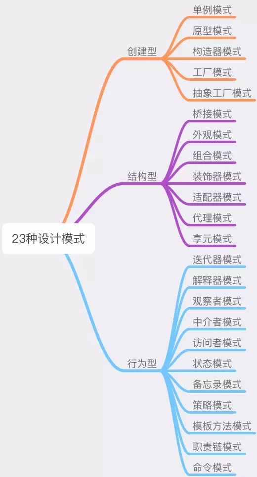

## 参考文献

- 曾探. JavaScript 设计模式与开发实践

## 什么是设计模式

设计模式是：**在面向对象软件设计过程中针对特定问题的简洁而优雅的解决方案**

简单来说，设计模式是在**某种场合**下对**某个问题**的一种**解决方案**，而每一种设计模式，是对这些解决方案的**取名**

为什么要对这些解决方案取名？

- 在计算直角三角形斜边时，可以利用两边平方和的平方根获知，而这个操作叫做”勾股定理“。这样在之后遇到要求直角三角形的斜边时，就可以反射性的想到：”可以使用勾股定理去算“

- 足球场上教练指挥队友：“用速度突破对方边后卫之后，往球门方向踢出高球，中路接应队员抢点头球攻门”，而这样的战术其实叫作“下底传中”。教练只需要指挥一句：”使用下底传中“就可以让队员知道该怎么做

## 为什么要学习设计模式

很多人在了解了设计模式之后，可能会觉得设计模式只是一些理论知识，在开发中不会有太大的应用

在日常需求开发中，我们更多的是按照需求进行代码的编写，从而达到预期的需求效果，似乎确实没有很明显的去特别应用到设计模式

但就像小说家很少从头开始设计剧情，足球教练很少从头开始发明战术，他们总是沿袭一些已经存在的模式。就像教练看到对方后卫速度慢，中后卫身高矮时，自然想到“下底传中”这种模式

软件设计亦是如此，这些模式是经过大量实际项目验证的优秀解决方案，熟悉这些的开发人员，在某些场景下便可以自然的条件反射想到“这个需求可以用 XXX 设计模式来完成”，也就是**在合适的场合，很快找到合适的方案**

例如：

- 我们看到系统中存在大量相似对象，这些对象可能带来较大的内存负担而需要做优化时，很容易想到利用”享元模式“来优化代码

- 系统中原开发人员设计的某个接口结构已经不符合现在的需求，但又不希望去改动，因为系统中可能有非常多的代码用到了它。这时熟悉的人就可以利用“适配器模式”来解决问题

其实我们在日常开发中，可能也有用到设计模式，只是我们不知道这是一种设计模式。当遇到一个问题时，这个问题似曾相识，或者出现的频率很高，或者很快联想到这个需求似乎可以用自己曾经的某次方案来完成，而这个问题的方案或许就是什么设计模式。如果熟悉设计模式，再又一次遇到这个问题时，想到“这好像可以用 XXX 设计模式来解决”，可能比“这以前什么时候好像在哪做过类似的”更为的清晰可靠

## 设计模式的适用性

使用设计模式，是为了**在合适的场合，找到合适的方案**

这意味着并不是任何场景下，我们都要强行去使用某种设计模式来实现需求。这就好比篮球员在球框下无人防守，只需要投篮即可，难道还需要特意使用某种战术，先传给谁再进行什么操作再投球吗？显示是不必要的，更重要的是**场景下的适用性，在合适的地方，用合适的设计模式**

从某些角度看，设计模式确实可能带来代码量的增加，或许会将逻辑封装的更为复杂。但是软件开发的成本并非全在开发阶段，设计模式是让人写出**可复用、可维护性高**的程序

## 设计模式的核心思想

设计模式的核心思想在于**封装变化**

**找出程序中变化的地方，并将变化封装起来，将变与不变分离，确保变化的部分灵活、不变的部分稳定**

一个程序的设计总是可以分为**可变**的部分与**不可变**的部分，当我们找出可变的部分，并把它们封装起来，剩下的就是不变和稳定的部分了，这些不变和稳定的部分就非常容易复用

需求是不断在变更的，为了时刻应对新的需求，**封装变化**可以让我们编写出更**健壮**的代码，经得起变化的考验，而设计模式，就是帮助我们写出这样的代码

## 设计模式的分类

**GOF** 把这种“模式”观点应用于面向对象的软件设计中，总结了 23 种设计模式，录入《设计模式：可复用面向对象软件的基础》一书

23 种设计模式按照**创建型、行为型、结构型**划分：

无论是哪一种类型，这些具体的设计模式都是在用自己的方式去**封装不同类型的变化**：

- 创建型模式封装了创建对象过程的变化，将创建对象的过程抽离

- 结构型模式封装的是对象之间组合方式的变化

- 行为型模式将对象千变万化的行为进行抽离

封装变化，封装了软件中不稳定的因素，为后续的拓展提供了可能性

## 设计原则

每种设计模式，都是为了让代码迎合其中一个或多个原则而出现的

设计原则是设计模式的指导理论，帮助避免不良的软件设计，主要有 6 个原则：

- 单一职责原则（Single Responsibility Principle）

- 开放封闭原则（Opened Closed Principle）

- 里式替换原则（Liskov Substitution Principle）

- 迪米特法则（Law of Demeter）

- 接口隔离原则（Interface Segregation Principle）

- 依赖反转原则（Dependency Inversion Principle）

统称 **SOLID**（2 个 L 算 1 个）

这里挑选适合 JavaScript 开发的设计原则说明

### 单一职责原则

单一职责原则的职责被定义为“引起变化的原因”，如果我们一个方法里同时做了 2 件事，例如一个方法里既设置图片，又负责 loading 图加载，那这个方法就有 2 个职责。一个方法承担了过多的职责，那么在需求变迁中，需要改写这个方法的可能性就越大

此时，这个方法会是一个**不稳定**方法，特别在多个职责**耦合**在一起，一个职责的变化可能会影响到其他职责的实现，造成破坏性的结果

因此，单一职责原则体现为：**一个对象（方法）只做一件事**

#### 单一职责原则在设计模式中的体现

- 代理模式：如预加载图片的场景，把添加 img 标签的职责、预加载图片的职责分开放到 2 个对象中，2 个对象各自都只有一个被修改的动机，在它们发生改变时，也不会影响到另外的对象

- 迭代器模式：如往页面添加 div 的场景，把迭代聚合对象的职责、渲染添加 div 的职责分离开

- 单例模式：创建悬浮窗的场景，把管理单例的职责、创建悬浮窗的职责分别封装在 2 个方法里，使它们独立变化互不影响

- 装饰器模式：为对象动态添加职责，这是分离职责的方式。如一开始方法的职责是打开悬浮框，动态添加新的打印职责

#### 何时应该分离职责

