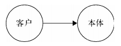
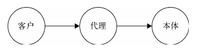

## 代理模式

代理模式：**为一个对象提供一个代用品或占位符，以便控制对它的访问**

生活中也有很多代理模式的场景，如：明星有经纪人作为代理，如果想请明星来办一场商业演出，只能联系他的经纪人，经纪人会把细节等都谈好后，再把合同交给明星

代理模式的关键：**当客户不方便直接访问一个对象或不满足需要时，提供一个替身对象来控制对这个对象的访问，客户实际上访问的是替身对象。替身对象对请求做出一些处理后，再把请求转交给本体对象**

不使用代理模式：

使用代理模式：

### 送花案例

假如 K 先生想与 A 女士表明心意，于是决定送花给 A：

    class Flower {}

    const K = {
        sendFlower(target) {
            const flower = new Flower();
            target.receiveFlower(flower);
        }
    }

    const A = {
        receiveFlower(flower) {
            console.log(flower);
        }
    }

    K.sendFlower(A);

然而 K 可能和 A 不是很熟，K 又认识 A 的挚友 B，所以想请 B 帮忙送花：

    class Flower {}

    const K = {
        sendFlower(target) {
            const flower = new Flower();
            target.receiveFlower(flower);
        }
    }

    const A = {
        receiveFlower(flower) {
            console.log(flower);
        }
    }

    const B = {
        receiveFlower(flower) {
            A.receiveFlower(flower);
        }
    }

    K.sendFlower(B);

至此就完成了最简单的代理模式，这里的 B 就是代理对象

但是我们可能会疑惑，K 自己送花和先给 B 再给 A 没有什么本质区别，甚至引入代理对象似乎将事情变得复杂化

假设现在的场景是：A 的心情孰好孰坏，当 A 心情好时成功率高，心情坏时成功率低，而 K 并不能感知 A 当天的心情，所以想请 A 的挚友 B 帮忙在 A 心情好的时候送花：

    class Flower {}

    const K = {
        sendFlower(target) {
            const flower = new Flower();
            target.receiveFlower(flower);
        }
    }

    const A = {
        receiveFlower(flower) {
            console.log(flower);
        },
        listenGoodMood(fn) {
            setTimeout(() => { // 1 秒后心情变好
                fn();
            }, 1000);
        }
    }

    const B = {
        receiveFlower(flower) {
            A.listenGoodMood(() => {
                A.receiveFlower(flower);
            })
        }
    }

    K.sendFlower(B);

### 保护代理和虚拟代理

代理 B 帮助 A 过滤掉一些请求，如送花的人年龄太大、没有存款，这种请求就可以直接在代理 B 处被拒绝掉，这种代理叫**保护代理**

另外，假设现实中花的价格不菲，new Flower 也是代价昂贵的操作，那么我们可以把 new Flower 的操作交给代理 B 去执行，代理 B 会选择在 A 心情好的时候再执行 new Flower，这是代理模式的另一种形式，叫**虚拟代理**。虚拟代理会把一些开销大的对象，延迟到真正需要它的时候才去创建：

    const B = {
        receiveFlower() {
            A.listenGoodMood(() => {
                const flower = new Flower(); // 延迟创建 flower 对象
                A.receiveFlower(flower);
            })
        }
    }

保护代理用于控制不同权限的对象对目标对象的访问，但在 JavaScript 并不容易实现保护代理，因为我们无法判断谁访问了某个对象

虚拟代理是最常用的一种代理模式，这里主要讨论虚拟代理

### 虚拟代理实现图片预加载

在 Web 开发中，图片预加载是一种常见的技术，如果直接给某个 img 标签设置 src 属性，由于图片过大或网络不佳，往往会导致一段空白期

常见的做法是先用 loading 图站位，异步加载图片，等图片加载好了再填充到 img 节点中，这种场景就很适合虚拟代理

首先创建一个对象，负责创建 img 标签，并提供设置 src 的接口 API：

    const myImage = (function() {
        const imgNode = document.createElement('img');
        document.body.appendChild(imgNode);

        return {
            setSrc(src) {
                imgNode.src = src;
            }
        }
    }());

    myImage.setSrc('https://www.wangsucloud.com/configurable/img/banner/home/1561542975274.png');

接着引入代理对象 proxyImage，通过代理对象，在图片真正被加载好之前，页面中将出现占位 loading 图提示用户图片正在加载中：

    const myImage = (function() {
        const imgNode = document.createElement('img');
        document.body.appendChild(imgNode);

        return {
            setSrc(src) {
                imgNode.src = src;
            }
        }
    }());

    const proxyImage = (function() {
        const img = new Image();
        img.onload = function() {
            myImage.setSrc(this.src);
        }

        return {
            setSrc(src) {
                myImage.setSrc('https://img.lanrentuku.com/img/allimg/1212/5-121204193R0-50.gif');
                img.src = src;
            }
        }
    }());

    proxyImage.setSrc('https://www.wangsucloud.com/configurable/img/banner/home/1561542975274.png');

现在我们通过 proxyImage 间接访问 myImage，proxyImage 控制了客户对 myImage 的访问，并且在此过程中加入了额外的操作（真正图片加载好之前，先使用 loading 图占位）

### 代理的意义

也许我们会疑问，实现一个图片预加载，即使不需要引入代理模式也能办到：

    const myImage = (function() {
        const imgNode = document.createElement('img');
        document.body.appendChild(imgNode);
        const img = new Image();
        img.onload = function () {
            imgNode.src = this.src;
        };
        return {
            setSrc(src) {
                imgNode.src = 'https://img.lanrentuku.com/img/allimg/1212/5-121204193R0-50.gif';
                img.src = src;
            }
        }
    })();

    myImage.setSrc('https://www.wangsucloud.com/configurable/img/banner/home/1561542975274.png');

但是这样的做法，是违背**单一职责原则**的：myImage 拥有 2 个职责：给 img 节点设置 src、预加载图片

这样产生的问题非常明显：

- 不易于复用

- 强耦合，修改预加载职责时会影响设置 src 的职责

并且这同样也违反**开放封闭原则**：假设未来网速飞快，根本不需要预加载操作，这时不得不去 myImage 源码中把预加载部分的代码删除

实际上，我们需要的只是给 img 设置 src，预加载图片只是锦上添花的功能。于是代理的作用就体现出来了，代理负责预加载图片，预加载操作后把请求交给本体。

这样做的好处是我们根本不需要改变 myImage 接口，而是通过代理对象给系统添加新的行为，这是符合开放封闭原则的。未来某一天我们不再需要预加载，那么只需要将请求代理对象改为请求本体即可

### 代理与本体接口一致

上面提到：未来某一天我们不再需要预加载，那么只需要将请求代理对象改为请求本体即可

其中关键在于：代理对象和本体对象都对外提供 setSrc 方法，在用户看来，**代理对象和本体对象是一致的**，用户并不清楚代理和本体的区别

这样的好处在于：

- 用户可以放心请求代理，只关心是否能得到想要的结果

- 任何使用本体的地方都可以替换成使用代理

值得一提的是，如果代理对象和本体对象都为函数（函数在 JavaScript 中也是对象），函数必然都能被执行，那么可以认为它们也具有“一致的接口”：

    const myImage = (function() {
        const imgNode = document.createElement('img');
        document.body.appendChild(imgNode);

        return function() {
            imgNode.src = src;
        }
    }());

    const proxyImage = (function() {
        const img = new Image();
        img.onload = function() {
            myImage(this.src);
        }

        return function() {
            myImage.setSrc('https://img.lanrentuku.com/img/allimg/1212/5-121204193R0-50.gif');
            img.src = src;
        }
    }());

    proxyImage.setSrc('https://www.wangsucloud.com/configurable/img/banner/home/1561542975274.png');

### 虚拟代理合并 HTTP 请求

在 Web 开发中，网络请求是开销很大的，假设我们在做一个文件同步的功能，当选中一个 checkbox 时，对应的文件就会被同步到另一台备用服务器上，结构如下：

    <body> 
        <input type="checkbox" id="1"></input> 
        <input type="checkbox" id="2"></input> 
        <input type="checkbox" id="3"></input> 
        <input type="checkbox" id="4"></input> 
        <input type="checkbox" id="5"></input> 
        <input type="checkbox" id="6"></input> 
        <input type="checkbox" id="7"></input> 
        <input type="checkbox" id="8"></input> 
        <input type="checkbox" id="9"></input> 
    </body>

接着为 checkbox 绑定事件，点击同时往另一台服务器同步文件：

    const synchronousFile = function (id) {
        console.log('开始同步文件，id 为: ' + id);
    };

    const checkbox = document.getElementsByTagName('input');
    for (let i = 0, c; c = checkbox[i++];) {
        c.onclick = function () {
            if (this.checked === true) {
                synchronousFile(this.id);
            }
        }
    };

当我们选中 3 个 checkbox 时，会依次往服务器发送 3 次同步文件的请求，如果有全选选项，可以预见频繁的网络请求将会带来巨大的开销

**解决方案：引入代理控制请求**

我们可以引入 proxySynchronousFile 代理函数收集一段时间内的请求，一次性发送给服务器。比如等待 2 秒再将这 2 秒内需要同步的文件 id 打包发给服务器，这样做可以减轻服务器的压力

    const synchronousFile = function(id) {
        console.log('开始同步文件，id 为: ' + id);
    };

    const proxySynchronousFile = (function() {
        const cache = [], // 保存一段时间内需要同步的 ID 
                timer; // 定时器
        return function(id) {
            cache.push(id);
            if (timer) return;

            timer = setTimeout(function() {
                synchronousFile(cache.join(',')); // 2 秒后向本体发送需要同步的 ID 集合
                clearTimeout(timer); // 清空定时器
                timer = null;
                cache.length = 0; // 清空 ID 集合
            }, 2000);
        }
    })();

    const checkbox = document.getElementsByTagName('input');
    for (let i = 0, c; c = checkbox[i++];) {
        c.onclick = function() {
            if (this.checked === true) {
                proxySynchronousFile(this.id);
            }
        }
    };

### 虚拟代理实现惰性加载

假设有一个 js 插件 minConsole.js，可以帮助开发人员在 IE 浏览器及移动端浏览器上进行一些简单的调试工作，引入后会在全局和 jQuery 一样存在一个 minConsole 对象，调用方式如下：

    minConsole.log(1);

接着会在页面中创建一个 div，并把 log 显示在 div 中

如果 minConsole 是个很大的 JS 文件，我们一开始并不希望加载它。更好的方式是需要时再去加载，比如用户按下 F2 主动唤出控制台

这种场景就可以虚拟代理来实现**惰性加载**

在 minConsole 加载之前，为了能让用户正常的使用 API，可以创建一个占位的 minConsole 代理对象提前给用户使用，这个代理对象提供给用户的接口跟真正的 minConsole 是一样的

在 minConsole 加载完成之前，用户调用 minConsole 的 API 操作，都被缓存起来，当用户点击 F2 唤出控制台，真正去加载 了minConsole.js 的时候，再去将缓存中的代码取出执行

实现代码如下：

    // 代理 miniConsole，在真正的 miniConsole 加载进来前由代理负责接收用户调用
    const miniConsole = (function() {
        const cache = [];
        const handler = function(ev) {
            if (ev.keyCode === 113) {
                const script = document.createElement('script');
                script.onload = function() {
                    for (let i = 0, fn; fn = cache[i++];) {
                        fn();
                    }
                };
                script.src = 'miniConsole.js';
                document.getElementsByTagName('head')[0].appendChild(script);
                document.body.removeEventListener('keydown', handler);// 只加载一次 miniConsole.js 
            }
        };
        document.body.addEventListener('keydown', handler, false);

        return {
            log(...args) {
                cache.push(function() {
                    return miniConsole.log.apply(miniConsole, args);
                });
            }
        }
    })();

    miniConsole.log(1);

    // 真正的 miniConsole.js 代码
    const miniConsole = {
        log() {
            // ...
        }
    }

### 缓存代理

缓存代理可以为一些开销大的运算结果提供暂时的存储，在下次运算时，如果参数与之前一致，直接返回之前存储的结果

1. 计算乘积

我们示例用缓存代理乘积运算（假设运算开销很大），先创建乘积函数：

    const mult = function(...args) {
        return args.reduce((sum, item) => sum * item);
    }

    mult(1, 2, 3);

加入缓存代理代理：

    const mult = function(...args) {
        return args.reduce((sum, item) => sum * item);
    }

    const proxyMult = (function() {
        const cache = {};

        return function(...args) {
            const key = args.join(',');
            if(key in cache) return cache[key];

            return cache[key] = mult.apply(this, args);
        }
    }());

    proxyMult(1, 2, 3);
    proxyMult(1, 2, 3);

当第二次调用 proxyMult(1, 2, 3) 时，mult 本体没有再次计算，proxyMult 直接返回了之前缓存的值

通过缓存代理，mult 函数可以继续专注自身的职责，缓存功能由代理对象实现

2. ajax 请求

我们常常在项目中遇到分页的需求，同一页的数据理论上只需要去后台拉取一次，已拉取的数据就可以被缓存起来，下次请求同一页数据时，直接取缓存数据

    

