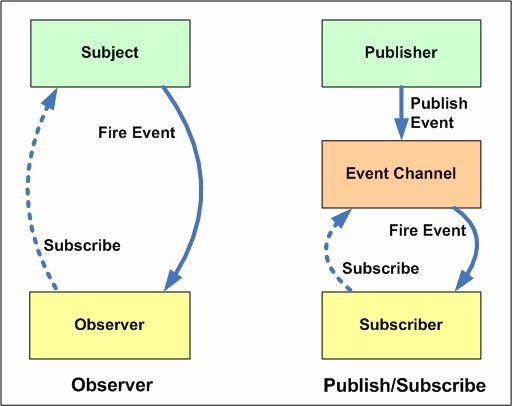

## 观察者模式

观察者模式：**定义对象间的一种一对多依赖关系，当一个对象状态发生改变时，所有依赖它的对象都将得到通知**

这里面存在 2 个重要的角色：

- 被观察者（Observable）或主题（Subject）

- 观察者（Observer）

生活中，也有很多观察者模式的实际场景：

A 希望购买某楼盘的房子，而现在该楼盘的房子早已售罄，于是 A 每隔一段时间 A 都要去售楼处询问是否有房源，如果购房者不止 A 一个，可能还有 B、C、D、E、F，那很明显，售房处会被问的厌倦

于是，正确的场景应该是：

A 等人将自己的联系方式给了售房处，等有了房源时由售房处主动通知购房者 A、B、C、D、E、F ，这种发布通知的方式就是观察者模式，而售房处即**被观察者**、购房者为**观察者**

下面为了方便解释，我们将被观察者（主题）称为**发布者**，观察者称为**订阅者**

### 观察者模式的作用

可以发现，观察者模式的优点在于：

- 由订阅者不需要不断的去调用发布者的接口，只需要由发布者通知这些消息订阅者

- 发布者与订阅者不再强耦合，而是处于一对多的关系（一个发布者，多个订阅者），订阅者只需要提供给发布者统一的信息（如购房者统一提供联系方式），发布者不需要去知道订阅者是谁（是男人、女人、什么身份等），只需要发布消息给对方即可

第一个优点可以广泛的应用于**异步编程**，这是一种替代传递回调函数的方案（回调函数一般只是作为一个参数，即一对一的关系，观察者模式可以一对多，在我们需要的事件发生点进行订阅）。如 ajax 请求的 success、error 事件等

第二个优点可以取代对象之间硬编码的通知机制（一个对象不再显示去调用另一个对象的接口，如 a 对象直接调用 b.say()，与 b 强耦合），观察者模式让两个对象之间**松耦合**，虽然**不清楚彼此的细节，但不影响它们通讯**。当新的订阅者加入时也不需要修改发布者的代码（强耦合的话，如果加入了 c，就需要又去加一行 c.say()），同样发布者需要修改时，也不会影响到之前的订阅者，只要**约定的事件名**没有变化，就可以自由改变它们

### DOM 事件

实际上，我们在平时开发中经常使用过观察者模式：

```js
document.body.addEventListener('click', function() {
    console.log(1);
}, false);
document.body.click(); // 发布通知
```

在这里我们监控用户点击 document.body 的动作，但是我们并不能预知将在什么时候点击。于是我们订阅了 document.body 的 click 事件，当被点击时，body 节点就会向订阅者发布这个消息。这就很像购房例子，购房者不知房子什么时候开售，于是订阅消息后等售房处发布消息

此外我们还可以随意**新增或删除订阅者**，增加任何订阅者都不会影响发布者代码的编写：

```js
document.body.addEventListener('click', function() {
    console.log(1);
}, false);

document.body.addEventListener('click', function() {
    console.log(2);
}, false);

document.body.addEventListener('click', function() {
    console.log(3);
}, false);

document.body.addEventListener('click', function() {
    console.log(4);
}, false);

document.body.click();
```

### 购房示例

这里来看看观察者模式在购房示例的应用，首先确定流程：

- 售楼处是发布者

- 发布者需要一个**缓存**，存放回调函数以通知订阅者

- 发布消息时，发布者遍历缓存列表，依次触发存放订阅者的回调

```js
const salesOffices = {}; // 定义售楼处
salesOffices.observers = []; // 缓存列表，存放订阅者的回调函数
salesOffices.addObserver = function(fn) { // 增加订阅者
    this.observers.push(fn); // 订阅的消息添加进缓存列表
};
salesOffices.notify = function(...args) { // 发布消息
    this.observers.forEach(fn => fn(...args));
};

// 测试
salesOffices.addObserver(function(price, squareMeter) { // A 订阅消息
    console.log('A: 价格= ' + price);
    console.log('A: 平方米= ' + squareMeter);
});

salesOffices.addObserver(function(price, squareMeter) { // B 订阅消息
    console.log('B: 价格= ' + price);
    console.log('B: 平方米= ' + squareMeter);
});

salesOffices.notify(2000000, 88);
// 输出: 
// A: 价格= 2000000 A: 平方米= 88s
// B: 价格= 2000000 B: 平方米= 88s
```

至此，我们实现了一个简单的观察者模式，但是还存在一些问题：

- 现在只要有房，发布者就会推送给所有订阅者。那么如果 A 只想要 88 平方米的房子，发布者会把 110 平方米的信息也推送给 A

解决方法：使用 key 标识，让订阅者只订阅自己感兴趣的内容

```js
const salesOffices = {}; // 定义售楼处
salesOffices.observers = {}; // 缓存列表，存放订阅者的回调函数
salesOffices.addObserver = function(key, fn) { // 增加订阅者
    if(!this.observers[key]) this.observers[key] = [];
    this.observers[key].push(fn); // 订阅的消息添加进缓存列表
};
salesOffices.notify = function(key, ...args) { // 发布消息
    const fns = this.observers[key];
    if(!fns || !fns.length) return false;

    fns.forEach(fn => fn(...args));
};

// 测试
salesOffices.addObserver('squareMeter88', function(price) { // A 订阅消息
    console.log('A: 价格= ' + price);
});

salesOffices.addObserver('squareMeter110', function(price) { // B 订阅消息
    console.log('B: 价格= ' + price);
});

salesOffices.notify('squareMeter88', 2000000);
// 输出: A: 价格= 2000000
salesOffices.notify('squareMeter110', 3000000);
// 输出: B: 价格= 3000000
```

### 观察者模式通用实现

假设另一个售楼处也是这样的模式，那么这段代码是否又需要在另一个售楼处重写一次呢？

显示是不需要的：

- 发布-订阅的形式是**不变**的，都是订阅者订阅后，发布者将相应的信息推送出去，流程是固定的

- 什么对象应用了这种模式，应用对象是**变化**的

所以我们可以将这种发布-订阅的流程抽离出来：

```js
const event = {
    observers: [],
    addObserver(key, fn) {
        if (!this.observers[key]) this.observers[key] = [];

        this.observers[key].push(fn); // 订阅的消息添加进缓存列表
    },
    notify(key, ...args) {
        const fns = this.observers[key];
        if (!fns || fns.length === 0) return false;

        fns.forEach(fn => fn(...args));
    }
};

// 定义安装函数，让对象动态安装观察者功能
const installEvent = function(obj) {
    for (let key in event) {
        obj[key] = event[key];
    }
};
```

接着应用于售楼示例：

```js
const salesOffices = {};
installEvent(salesOffices);

salesOffices.addObserver('squareMeter88', function(price) { // A 订阅消息
    console.log('A: 价格= ' + price);
});

salesOffices.addObserver('squareMeter110', function(price) { // B 订阅消息
    console.log('B: 价格= ' + price);
});

salesOffices.notify('squareMeter88', 2000000);
salesOffices.notify('squareMeter110', 3000000);
```

### 取消订阅

除了订阅，同样也会需要取消订阅的功能，如果 A 忽然不想购房了，那就需要将 A 的名单从售楼处移除

所以我们需要给添加 removeObserver 方法：

```js
const event = {
    observers: [],
    addObserver(key, fn) {
        if (!this.observers[key]) this.observers[key] = [];

        this.observers[key].push(fn); // 订阅的消息添加进缓存列表
    },
    notify(key, ...args) {
        const fns = this.observers[key];
        if (!fns || fns.length === 0) return false;

        fns.forEach(fn => fn(...args));
    },
    removeObserver(key, fn) {
        const fns = this.observers[key];
        if(!fns || fns.length === 0) return false;
        
        if(!fn) {
            fns && (fns.length = 0); // 如果没有传具体回调，取消 key 对应的所有订阅
        } else {
            for(let l = fns.length - 1; l >=0; l--) {
                const _fn = fns[l];
                if(_fn === fn) fns.splice(l, 1);
            }
        }
    }
};

// 定义安装函数，让对象动态安装观察者功能
const installEvent = function(obj) {
    for (let key in event) {
        obj[key] = event[key];
    }
};

// 售楼示例
const salesOffices = {};
installEvent(salesOffices);

const fn_a = function(price) {
    console.log('A: 价格= ' + price);
}
salesOffices.addObserver('squareMeter88', fn_a);
salesOffices.notify('squareMeter88', 2000000); // 输出: A: 价格= 2000000

salesOffices.removeObserver('squareMeter88', fn_a);
salesOffices.notify('squareMeter88', 2000000); // 取消了订阅，无输出
```

### 网站登录示例

假如现在在开发一个商城网站，网站包括如下模块：

- header 头部

- nav 导航

- 消息列表

- 购物车

而这些模块的渲染有一个共同的前提：**页面初始化时需要先 ajax 获取用户的登录信息**。这是很正常的流程，如 header 里需要用户的 name 和头像，这 2 个字段都来自请求返回的数据

而 ajax 请求什么时候成功返回是无法确定的，这样的场景很像售楼示例，消息的获取时机是未知的

但是这并不足以可以说服我们使用观察者模式，使用回调也可以实现它

对于这样的场景，我们可能会使用回调这样去编写：

```js
login.succ(function(data) { 
    header.setAvatar(data.avatar); // 设置 header 模块的头像
    nav.setAvatar(data.avatar); // 设置导航模块的头像
    message.refresh(); // 刷新消息列表
    cart.refresh(); // 刷新购物车列表
});
```

这样的程序是存在很明显的问题的：

- 强耦合，login 模块显式调用 header、nav、message、cart 的方法

- login 模块必须知道 header 的方法叫做 setAvatar，message 的方法叫 refresh 等

- 如 header 的方法只能叫 setAvatar 不能更改，否则 login 每次都要跟着改

- 如 header 模块名称只能叫 header，不能改为 header1、header2，否则 login 模块也需要改为如 header1.setAvatar

- 一旦新的模块加入，如新增一个收获地址模块 address，又需要在 succ 回调里加入（特别在模块多人分工的场景下，A 负责登录模块，B 的模块需要用到请求数据，就需要让 A 去帮忙加行代码，同样 C、D、E 等等如果也有这样的需求，A 就要一个个的操作，后果可想而知）：

```js
login.succ(function(data) { 
    header.setAvatar(data.avatar);
    nav.setAvatar(data.avatar);
    message.refresh();
    cart.refresh();
    address.refresh(); // 增加这行代码
});
```

我们用观察者模式来重构代码，对用户信息感兴趣的模块自行订阅登录成功的消息事件，登录模块只需要发布登录成功的消息，业务模块接收消息后，就进行各自的业务,登录模块不关心其他业务模块要做什么

```js
// 登录模块
$.ajax( 'http:// xxx.com?login', function(data) {
    login.notify('loginSucc', data); // 发布登录成功的消息
});

// 其他模块监听消息
const header = (function() { // header 模块
    login.addObserver('loginSucc', function(data) {
        header.setAvatar(data.avatar);
    });
    return {
        setAvatar: function(data) {
            console.log('设置 header 模块的头像');
        }
    }
})();
const nav = (function() { // nav 模块
    login.addObserver('loginSucc', function(data) {
        nav.setAvatar(data.avatar);
    });
    return {
        setAvatar: function(avatar) {
            console.log('设置 nav 模块的头像');
        }
    }
})();
```

可以看到，使用观察者模式实现的效果，可以解决之前的一列问题：

- 不再强耦合，login 模块不需要显示调用其他模块的方法

- login 模块不需要知道 header 的方法叫 setAvatar 等

- header 的方法可以自行改变，不需要一定叫 setAvatar 给 login 调用

- header 的模块名可以自由调整

- 一旦加入新的模块，如加入 address，只需要加入：

```js
const address = (function() { // address 模块
    login.addObserver('loginSucc', function(obj) {
        address.refresh(obj);
    });
    return {
        refresh: function(avatar) {
            console.log('刷新收货地址列表');
        }
    }
})();

```

### 发布-订阅模式

回想一下我们的观察者模式，其实还存在这一些问题：

- 每个发布者对象都有监听发布方法，还有缓存列表，这其实也是一种资源浪费

- 发布者和订阅者还是存在一定的耦合性，只是从强耦合变为了松耦合

其实对应观察者模式，还有一种**发布-订阅模式**，它们之间并不是划等号的：

- 观察者模式是发布者与订阅者有联系的，由发布者直接发布消息给订阅者

- 发布-订阅模式存在一个中介负责管理订阅与发布，发布者和订阅者是**完全解耦**的



可以发现，将购房示例应用于发布-订阅模式，则是存在一个中介公司，负责管理购房者与售楼处的关系，购房者告诉中介公司自己的需求，售楼处发布消息给中介公司，由中介公司通知购房者，从而达到购房者与售楼处的解耦

下面我们使用发布-订阅模式实现售楼示例：

```js
const Event = (function() {
    const subscribers = {};

    const subscribe = function(key, fn) {
        if (!subscribers[key]) subscribers[key] = [];

        subscribers[key].push(fn);
    };
    const publish = function(key, ...args) {
        const fns = subscribers[key];
        if (!fns || fns.length === 0) return false;

        fns.forEach(fn => fn(...args));
    };
    const unsubscribe = function(key, fn) {
        const fns = subscribers[key];
        if (!fns || fns.length === 0) return false;

        if (!fn) {
            fns && (fns.length = 0);
        } else {
            for (let l = fns.length - 1; l >= 0; l--) {
                const _fn = fns[l];
                if (_fn === fn) fns.splice(l, 1);
            }
        }
    };
    return {
        subscribe,
        publish,
        unsubscribe,
    }
})();

// 售楼处
const salesOffices = (function() {
    // 2 秒后有了房，发布消息
    setTimeout(() => {
        Event.publish('squareMeter88', 2000000);
    }, 2000);
}());

// 购房者 A
const clientA = (function() {
    Event.subscribe('squareMeter88', function(price) { // A 订阅消息
        console.log('价格= ' + price);
    });
}());
```

当时发布-订阅模式同样会存在缺点：

- 模块之间的联系隐藏在了背后，完全解耦，同样导致无法得知消息是哪来的

所以，**使用观察者模式还是发布-订阅模式，应该在于在合适的场合使用合适的模式**

### 小结

观察者模式在应用开发中非常有用，我们在一些 JavaScript 库经常可以见到观察者模式的影子：RxJS、Vue EventBus

观察者模式的优势很明显：

- 时间上解耦

- 对象之间解耦

它既可以用在异步编程中，也可以帮助我们完成更松耦合的代码

当然，观察者模式也不是没有缺点：

- 创建被观察者本身要消耗时间和内存，也许订阅了一个消息，此消息最终都没有发生，但是内存始终存在

- 松耦合了对象之间的联系，如果过度使用，对象之间的必要联系也将深埋背后，难以跟踪维护

观察者模式对变化的封装在于：我们对消息派发与接收的行为是**不变**的，而消息派发与接收这层关系的对象是**变化**的。并且很直观的可以看到，当新的接收者也需要接收新的消息时，只需要添加进观察队列，不需要改动被观察者和其他观察者的代码，显然是**符合开放-封闭原则**的