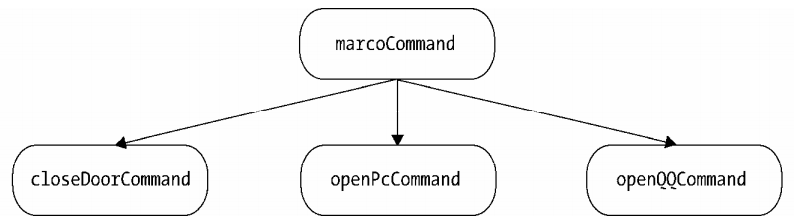
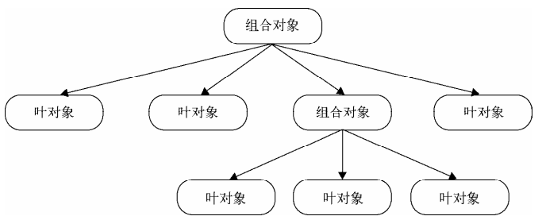

## 组合模式

我们知道地球和一些其他行星围着太阳转，也知道在一个原子中，有许多电子围绕着原子核旋转

这便是一种组合

组合模式：**用小的子对象来构建更大的对象，而这些小的子对象本身也许是由更小的孙子对象构成**

回顾命令模式中的宏命令，宏命令对象包含了一组具体的子命令，不管是宏命令对象还是子命令对象，都有一个 execute 方法负责执行命令，并且组成了一个树形结构

其中 macroCommand 被称为组合对象，closeDoorCommand、openPcCommand、openQQCommand 都是叶对象。在 macroCommand 的execute 方法，并不是执行真正的操作，而是遍历叶对象，把真正的 execute 请求委托给这些叶对象

### 组合模式的用途

组合模式的作用在于：

- 将对象组合成树结构，以表示“部分-整体”的层次结构。这种遍历属性结构的方案，通过调用组合对象的 execute，递归调用组合对象下叶对象的 execute，所以我们只需要一次操作，就可以完成关门、开电脑、登 QQ 几件事情

- 使用户对单个对象和组合对象的使用具有**一致性**。不论是组合对象还是单个对象，都是提供 execute 方法，在组合模式中，用户将统一使用所有对象，不需要关心它是组合对象还是单个对象

这在实际开发中会带来相当大的便利：当我们添加一个命令时，并不关心它是宏命令还是普通子命令，只要是个命令，且拥有 execute 方法就可以被添加

宏命令和子命令接收到执行 execute 请求时，都会做它们该做的事，这种差异是隐藏在用户背后的，这种透明性可以让我们自由的去扩展

### 更强大的宏命令

在前面的示例中，宏命令和子命令组成的树过于简单，如果只是简单遍历一组子节点，迭代器也能解决问题

更深层的树结构应该是：

目前我们的遥控器可以：

- 关门

- 开电脑

- 登 QQ

现在需要一个超级遥控器，它可以：

- 打开空调

- 打开电视和音响

- 关门、开电脑、登 QQ

实现代码如下：

    <body>
        <button id="button">超级遥控</button>
    </body>

    

可以看到，基本对象可以组合成更复杂的组合对象，组合对象又可以被组合，不断递归，树结构支持任意多的复杂度。

让树运转也非常简单，只需要调用最上层的 execute，创建组合对象的开发人员并不关心这些内在细节，往树里添加新节点对象非常容易

### 透明性带来的安全问题

组合模式的透明性使得发起请求的用户不用去顾忌组合对象和叶对象的区别，但是本质上是有区别的：**组合对象可以拥有子节点，叶对象下没有子节点**

这就会导致一些误操作，比如试图往叶对象添加子节点

解决方法：给叶对象也添加 add 方法，调用时抛出错误提醒

    const openTvCommand = {
        execute() {
            console.log('打开电视');
        },
        add() {
            throw new Error( '叶对象不能添加子节点' );
        }
    };

### 扫描文件夹示例

文件夹和文件之间的关系，非常适合用组合模式来描述。文件夹里既可以包含文件，又可以包含其他文件夹，最终组成一棵树

组合模式在文件夹的应用有以下好处：

- 我们想把某个盘下一些电子书和资料拷贝到 F 盘学习资料的文件夹下，在复制这些电子书和资料时，不需要考虑这批文件的类型，不管它是单独的文件还是文件夹，都可以统一操作

- 杀毒软件扫描文件夹时，不关心里面有多少文件和子文件夹，只需要做最外层的文件夹扫描

下面实现代码，先定义文件夹 Folder 和文件 File 2 个类：

    class Folder {
        constructor(name) {
            this.name = name;
            this.files = [];
        }
        add(file) {
            this.files.push(file);
        }
        scan() {
            console.log(`开始扫描文件夹：${this.name}`);
            this.files.forEach(file => file.scan());
        }
    }

    class File {
        constructor(name) {
            this.name = name;
        }
        add() {
            throw new Error('文件下不能添加文件');
        }
        scan() {
            console.log(`开始扫描文件：${this.name}`);
        }
    }

接着创建 F 盘文件目录结构，里面有“学习资料”文件夹为之后复制的目的地：

    const folder = new Folder('学习资料');
    const folder1 = new Folder('JavaScript');
    const folder2 = new Folder('Vue');

    const file1 = new File('JavaScript 设计模式与开发实践');
    const file2 = new File('Vue 入门到精通');
    const file3 = new File('算法与数据结构');

    folder1.add(file1);
    folder2.add(file2);

    folder.add(folder1);
    folder.add(folder2);
    folder.add(file3);

现在的需求是将某个盘下的电子书和资料复制到这里，假设我们已经得到了这些文件：

    // 要拷贝过去的文件、文件夹
    const folder3 = new Folder('NodeJs');
    const file4 = new File('深入浅出 Node.js');
    folder3.add(file4);

    const file5 = new File('JavaScript的编程实践');

接着拷贝到目标“学习资料”文件夹下：

    folder.add(folder3);
    folder.add(file5);

最后扫描时，只需要扫描最顶层对象即可：

    folder.scan();

    // 输出：
    开始扫描文件夹：学习资料
    开始扫描文件夹：JavaScript
    开始扫描文件：JavaScript 设计模式与开发实践
    开始扫描文件夹：Vue
    开始扫描文件：Vue 入门到精通
    开始扫描文件：算法与数据结构
    开始扫描文件夹：NodeJs
    开始扫描文件：深入浅出 Node.js
    开始扫描文件：JavaScript的编程实践

通过这个例子，可以清晰了解到用户如何同等对待组合对象和叶对象，添加一批文件的操作中，不用分辨它们是文件还是文件夹，添加后的文件和文件夹也能很容易的融合到树结构中一起工作

我们改变树结构，新增数据，不用修改原有的代码，这是符合**开放-封闭原则**的

同样，只需要操作顶端对象，扫描也是轻而易举

### 组合模式的注意点

- 组合模式不是父子关系

组合模式的树结构，但并不代表组合对象和叶对象是父子关系。组合模式是**聚合**关系，Leaf 不是 Composite 的子类，它们能合作的关键在于**拥有相同的接口**（execute）

- 对叶对象操作的一致性

组合模式除了要求组合对象和叶对象拥有相同的接口，还有必要条件：对一组叶对象的操作具有一致性

例如公司要给全体员工发过节费 1000，这种场景就适合组合模式，所有人都是同样要获得 1000 元

但是公司要给今天过生日的员工邮寄祝福邮寄，组合模式就不再适用，因为有的员工并不满足，不该执行 execute 方法，除非是把过生日的员工先选出来。

只有用一致的方式对待列表里的每个叶对象，才适合组合模式

- 双向映射关系

发放过节费通知是从公司到各个部门，再到各个小组，最后到每个员工邮箱，这确实是符合组合模式。但是需要注意的是，也许某些员工是多个组织架构，比如 A 又属于开发组，又属于架构组，对象之间关系并不是严格意义上的层次结构，这种场景就不适合组合模式，因为 A 会收到 2 份过节费

这种场景必须给父子节点建立双向映射关系，简单的方法是给小组和员工都增加集合保存对方的引用，但是这种相互引用相当复杂，还会产生过多的耦合，修改删除都显得困难，此时要引入中介者模式来管理这些对象

- 用职责链模式提高组合模式性能

在组合模式中，如果树结构复杂，节点数量多，遍历整棵树也许性能并不理想，我们可以借助职责链模式避免遍历整棵树。职责链模式一般需要手动设置链条，但是组合模式中父子对象之间形成天然的职责链，让请求顺着链条从父对象往子对象传递，或子对象往父对象传递，直到遇到可以处理该请求的对象为止，这也是职责链模式的经典运用场景之一

### 引用父对象

在前面文件夹示例中，组合对象保存了子节点的引用，树结构是自上而下的，但是有时可能需要子节点也保存父节点的引用

例如在组合模式中使用职责链，需要让请求从子节点往父节点冒泡传递

还有在文件夹示例中，当我们删除某个文件时，实际是从这个文件所在文件夹中删除该文件

现在实现删除文件的需求，首先为 Folder 和 File 添加 parent 属性，在 add 方法中正确设置父节点：

    class Folder {
        constructor(name) {
            this.name = name;
            this.parent = null;
            this.files = [];
        }
        add(file) {
            file.parent = this;
            this.files.push(file);
        }
        scan() {
            console.log(`开始扫描文件夹：${this.name}`);
            this.files.forEach(file => file.scan());
        }
        remove() {
            if(!this.parent) return;

            const files = this.parent.files;
            for(let l = files.length - 1; l >= 0; l--) {
                const file = files[l];
                if(file === this) files.splice(l, 1);
            }
        }
    }

    class File {
        constructor(name) {
            this.name = name;
            this.parent = null;
        }
        add() {
            throw new Error('文件下不能添加文件');
        }
        scan() {
            console.log(`开始扫描文件：${this.name}`);
        }
        remove() {
            if(!this.parent) return;

            const files = this.parent.files;
            for(let l = files.length - 1; l >= 0; l--) {
                const file = files[l];
                if(file === this) files.splice(l, 1);
            }
        }
    }

下面进行测试：

    const folder = new Folder('学习资料');
    const folder1 = new Folder('JavaScript');
    const folder2 = new Folder('Vue');

    const file1 = new File('JavaScript 设计模式与开发实践');
    const file2 = new File('Vue 入门到精通');
    const file3 = new File('算法与数据结构');

    folder1.add(file1);
    folder2.add(file2);

    folder.add(folder1);
    folder.add(folder2);
    folder.add(file3);

    // 删除 JavaScript 文件夹
    folder1.remove();

    folder.scan();

    // 输出：
    开始扫描文件夹：学习资料
    开始扫描文件夹：Vue
    开始扫描文件：Vue 入门到精通
    开始扫描文件：算法与数据结构