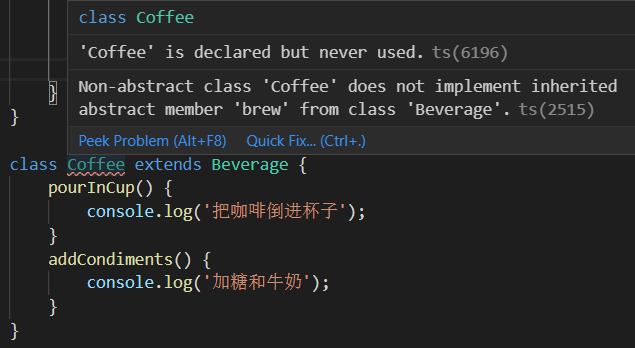

## 模板方法模式

模板方法模式：**封装一个算法的步骤，并允许子类为一个或多个步骤提供其实践方式，让子类在不改变算法架构的情况下重新定义算法中的某些步骤**

我们可以理解为：**封装了一个固定流程，该流程由几个步骤组成，具体步骤可以由子类进行不同的实现，从而让固定的流程产生不同的结果**

模板方法模式是**基于继承**的，它由 2 部分组成：

- 抽象父类

- 具体的实现子类

通常在抽象父类封装子类的算法框架，包括实现一些**公共方法**及封装子类中所有方法的**执行顺序**。子类通过继承抽象类，也就**继承了整个算法结构**，还可以选择**重写父类方法**

假设有一些平行的子类，它们都有一些相同的行为和不同的行为，如果这些相同的行为都在各个子类中实现，那显然是非常重复多余的。而模板方法模式就是将这些共性提取在模板类中，减少冗余。此外不同的行为还可以各自在子类中实现，达到泛化的效果

### 咖啡与茶的示例

我们先泡一杯咖啡，步骤如下：

- 把水煮沸

- 用沸水冲泡咖啡

- 把咖啡倒进杯子

- 加糖和牛奶

通过下面的代码，就可以得到这样的一杯咖啡：

    class Coffee {
        boilWater() {
            console.log('把水煮沸');
        }
        brewCoffeeGriends() {
            console.log('用沸水冲泡咖啡');
        }
        pourInCup() {
            console.log('把咖啡倒进杯子');
        }
        addSugarAndMilk() {
            console.log('加糖和牛奶');
        }
        init() {
            this.boilWater();
            this.brewCoffeeGriends();
            this.pourInCup();
            this.addSugarAndMilk();
        }
    }
    const coffee = new Coffee();
    coffee.init();

接着再泡一壶茶，步骤如下：

- 把水煮沸

- 用沸水浸泡茶叶

- 把茶水倒进杯子

- 加柠檬

同样用一段代码实现：

    class Tea {
        boilWater() {
            console.log('把水煮沸');
        }
        steepTeaBag() {
            console.log('用沸水浸泡茶叶');
        }
        pourInCup() {
            console.log('把茶水倒进杯子');
        }
        addLemon() {
            console.log('加柠檬');
        }
        init() {
            this.boilWater();
            this.steepTeaBag();
            this.pourInCup();
            this.addLemon();
        }
    }
    const tea = new Tea();
    tea.init();

很容易发现，泡咖啡和泡茶的过程是大同小异的

| 泡咖啡 | 泡茶 |
| ------ | ------ |
| 把水煮沸 | 把水煮沸 |
| 用沸水冲泡咖啡 | 用沸水浸泡茶叶 |
| 把咖啡倒进杯子 | 把茶水倒进杯子 |
| 加糖和牛奶 | 加柠檬 |

不同点：

- 原料不同，一个是茶一个是咖啡，但是可以把它们都抽象为**饮料**

- 泡的方式不同，咖啡是冲泡，茶叶是浸泡，但是可以把它们都抽象为**泡**

- 加入的调理不同，一个是糖和牛奶一个是柠檬，但是可以把它们都抽象为**调料**

经过抽象，不管是咖啡还是茶，都可以整理为：

- 把水煮沸（boilWater）

- 用沸水冲泡饮料（brew）

- 把饮料倒进杯子（pourInCup）

- 加调料（addCondiments）


现在我们可以创建一个抽象父类来表示泡一杯饮料的过程：

    class Beverage {
        boilWater() {
            console.log('把水煮沸');
        }
        brew() {} // 空方法，由子类重写
        pourInCup() {} // 空方法，由子类重写
        addCondiments() {} // 空方法，由子类重写
        init() {
            this.boilWater();
            this.brew();
            this.pourInCup();
            this.addCondiments();
        }
    }

有了抽象父类饮料还是不够的，创建一个 Beverage 并没有意义，需要做的是用它以继承的方式创建咖啡类和茶类

我们先实现咖啡类：

    class Coffee extends Beverage {
        brew() {
            console.log('用沸水冲泡咖啡');
        }
        pourInCup() {
            console.log('把咖啡倒进杯子');
        }
        addCondiments() {
            console.log('加糖和牛奶');
        }
    }

    const coffee = new Coffee();
    coffee.init();

当调用 coffee 对象的 init 方法时，由于 coffee 对象本身和其原型上没有 init，所以该请求会顺着原型链，委托给父类 Beverage 原型中的 init，而 Beverage 原型的 init 已经定义好了泡饮料的顺序，所以可以成功泡出一杯咖啡

茶类同理：

    class Tea extends Beverage {
        brew() {
            console.log('用沸水浸泡茶叶');
        }
        pourInCup() {
            console.log('把茶倒进杯子');
        }
        addCondiments() {
            console.log('加柠檬');
        }
    }

    const tea = new Tea();
    tea.init();

那么我们讨论的模板方法模式，在这个例子中，谁是**模板方法**？这里是 Beverage.prototype.init

因为 Beverage.prototype.init **封装了子类的算法框架，作为一个算法的模板，指导子类以何种顺序去执行哪些方法**

可以看到，Beverage.prototype.init 中，算法内每一个步骤都清楚的展示了出来

### 抽象类

模板方法模式是一种**严重依赖抽象类**的设计模式，但是在 JavaScript 里并没有对抽象类的支持，我们也很难模拟抽象类的实现

抽象类有什么作用呢？

**具体类是可以被实例化的，抽象类不能实例化**

为什么抽象类不能被实例化？试想我们在便利店与店员表示：我要一瓶饮料，那么店员肯定只能回答：需要什么饮料。饮料是一个抽象名词，只有真正明确了饮料的类型，如表示要一杯咖啡，才能得到一杯饮料

> 静态类型语言：编译时就检查数据类型，如 Java 里 int i = 0，要是又赋值为字符串 '1'，那么在开发期间编译器就报错了

在静态类型语言中：

- 抽象类可以用于向上转型，把对象真正的类型隐藏在抽象类之后，这些对象可以被互相替换

- 抽象类可以表示一种契约，继承抽象类的所有子类都将拥有跟抽象类一致的接口方法，这样就可以为子类定义公共接口（抽象方法），我们在子类删除某一个方法将不能通过编译。例如 Coffee 中没有实现 addCondiments 方法，编译器将会报错

除了抽象方法让子类继承实现，我们还可以把公共方法如饮料中的 boilWater 放在抽象类中，达到共有复用

下面我们用 JavaScript 的超类 **TypeSript** 来实现拥有真正抽象类的模板方法模式：

    abstract class Beverage {
        boilWater(): void {
            console.log('把水煮沸');
        }
        abstract brew(): void;
        abstract pourInCup(): void;
        abstract addCondiments(): void;

        init() {
            this.boilWater();
            this.brew();
            this.pourInCup();
            this.addCondiments();
        }
    }

    class Coffee extends Beverage {
        brew() {
            console.log('用沸水冲泡咖啡');
        }
        pourInCup() {
            console.log('把咖啡倒进杯子');
        }
        addCondiments() {
            console.log('加糖和牛奶');
        }
    }

当 Coffee 中没有实现抽象方法如 brew 时就会报错



可以看到，抽象类在静态类型语言中会让子类必须实现抽象方法，这很好的让我们在开发时避免了错误

### JavaScript 中没有抽象类的解决方案

JavaScript 在模板方法模式的不足：

- JavaScript 从语法层面没有提供对抽象类的支持，它是一门“类型模糊”的语言

- JavaScript 是用原型继承来模拟传统的继承，没有编译器帮助我们进行任何检查，没办法保证子类会重写父类中的“抽象方法”，即子类继承饮料类后，没有重写 brew，我们在运行报错或出错前也很难发现

下面提供变通的解决方案：

- 用[鸭子类型](https://www.kancloud.cn/cyyspring/more/1293019)来模拟接口检查，以便确保子类重写父类的方法。但是这样模拟检查会带来复杂性，而且被迫在业务中加入无关代码

- 父类在需要重写的方法上直接抛出错误：

``````````
class Beverage {
    brew() {
        throw new Error( '子类必须重写 brew 方法' );
    }
    ...
}
``````````

第二种方案的优点在于实现简单，缺点是得到错误信息的时间点太靠后

### 模板方法模式的应用场景

模板方法模式常用架构师用于搭建项目的架构，架构师定义好框架的架构，开发人员继承框架结构后负责往里填空

如 Java 开发人员用 HttpServlet 来开发项目，一个基于 HttpServlet 程序包含 7 个生命周期：

- doGet

- doHead

- doPost

- doPut

- doDelete

- doOption

- doTrace

HttpServlet 还有一个 service 方法，它规定了这些 do 方法的执行顺序，而 do 方法具体实现需要子类提供

除此之外，在 Web 开发中也有很多适用场景

如构建一系列 UI 组件，构建过程：

- 初始化一个 div 容器

- ajax 请求拉取相应数据

- 数据渲染到 div

- 通知用户

任何组件的构建都遵循这 4 步，其中第 1、4 步是相同的，第 2、3 步不同的在于请求和渲染数据的方式

所以我们可以将 4 个步骤抽象到父级的模板方法里，并在父级提供 1、4 的具体实现，由子类重写 2、3

### 钩子方法

通过模板方法模式，我们在父类封装了子类的**通用算法框架**

大多数情况下，这个算法框架是适用于大部分子类的

如我们封装在饮料 Beverage 的算法是：

- 把水煮沸

- 用沸水冲泡饮料

- 把饮料倒进杯子

- 加调料

但是可能存在一些**特例子类**，可能有一些客人是**不加调料**的，但是我们父类却规定了必须执行加调料的步骤，有什么办法可以让子类更加灵活，开放出来不受这个约束呢？

钩子方法（hook）可以用来解决这个问题，这是**隔离变化**的一种手段

我们在父类**容易发生变化**的地方放置钩子，钩子返回的结果决定了模板方法的执行步骤走向

如下我们放置挂钩 customerWantsCondiments，实现一个可以手动决定是否需要加调料的咖啡：

    class Beverage {
        boilWater() {
            console.log('把水煮沸');
        }
        brew() {
            throw new Error('子类必须重写 brew 方法');
        } // 空方法，由子类重写
        pourInCup() {
            throw new Error('子类必须重写 pourInCup 方法');
        } // 空方法，由子类重写
        addCondiments() {
            throw new Error('子类必须重写 addCondiments 方法');
        } // 空方法，由子类重写
        customerWantsCondiments() {
            return true; // 默认加调料
        }
        init() {
            this.boilWater();
            this.brew();
            this.pourInCup();
            this.customerWantsCondiments() && this.addCondiments();
        }
    }

    class Coffee extends Beverage {
        brew() {
            console.log('用沸水冲泡咖啡');
        }
        pourInCup() {
            console.log('把咖啡倒进杯子');
        }
        addCondiments() {
            console.log('加糖和牛奶');
        }
        customerWantsCondiments() {
            return window.confirm('请问需要调料吗？');
        }
    }

    const coffee = new Coffee();
    coffee.init();

### 好莱坞原则

了解了模板方法模式后，可以要引入一个新的设计原则：**好莱坞原则**

新人演员在好莱坞把简历递给演艺公司后只有回家等电话，有时演员等的不耐烦给演艺公司打电话询问，对方往往回答：**不要给我们打电话，我们会给你打电话(don‘t call us, we‘ll call you)**

在设计中，这种规则叫好莱坞原则，我们允许底层组件将自己挂到高层组件，高层组件决定什么时候，以什么方式去使用底层组件，高层组件对待底层组件就如演艺公司对待新人演员一样

模板方法模式是好莱坞原则的一个典型场景，当我们用模板方法模式编写程序员，意味着**子类放弃了对自己的控制权，而是改为父类通知子类，子类只负责提供设计上的细节**

除了模板方法模式，好莱坞原则还用在：

- 观察者模式：由被观察者主动通知观察者，反过来不行

- 回调函数：回调函数的主动权交给了另一个函数，回调何时执行取决于对方的控制

### 非继承方式的模板方法模式

模板方法模式是为数不多**基于继承**的设计模式，但 JavaScript 实际上没有提供真正意义上类继承，继承是对象于对象之间的委托实现的

在 JavaScript 这般灵活的语言里，即使不用继承，也可以实现模板方法模式：

    const Beverage = function(param) {
        const boilWater = function() {
            console.log('把水煮沸');
        }
        const brew = param.brew || function() {
            throw new Error('必须传递 brew 方法');
        };
        const pourInCup = param.pourInCup || function() {
            throw new Error('必须传递 pourInCup 方法');
        };
        const addCondiments = param.addCondiments || function() {
            throw new Error('必须传递 addCondiments 方法');
        };
        const F = function() { };
        F.prototype.init = function() {
            boilWater();
            brew();
            pourInCup();
            addCondiments();
        };
        return F;
    }

    const Coffee = Beverage({
        brew: function() {
            console.log('用沸水冲泡咖啡');
        },
        pourInCup: function() {
            console.log('把咖啡倒进杯子');
        },
        addCondiments: function() {
            console.log('加糖和牛奶');
        }
    });

    const coffee = new Coffee();
    coffee.init();

### 小结

模板方法模式是典型的通过**封装变化**提高系统扩展性

- 子类的方法种类和执行顺序是**不变**的，我们把这部分逻辑抽象到父类模板方法中

- 子类具体怎么实现是**可变**的，我们把这部分变化的逻辑封装到子类中

通过**增加子类**，就可以**增加新的功能**，不需要改动抽象父类及其他子类，符合开放-封闭原则