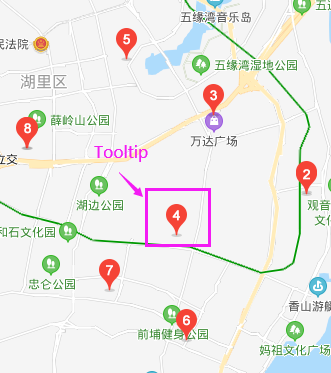

## 享元模式

享元模式：**运用共享的技术来有效支持大量细粒度的对象**

系统中创建大量的对象会占用过高内存，而一些对象往往可能是相似的，那么享元模式就非常有用，特别是移动端浏览器分配的内存并不算多，如何节省内存就变成一件非常有意义的事

### 模特示例

有一个工厂推出了 50 款男士上衣和 50 款 女士上衣，为了推销，工厂用塑料模特穿上衣服来展示效果拍成广告

正常情况下，需要 50 个男模特与 50 个女模特让它们分别穿上一种款式来拍照：

    class Model {
        constructor(sex, clothes) {
            this.sex = sex;
            this.clothes = clothes;
        }
        takePhoto() {
            console.log(`sex=${this.sex} clothes=${this.clothes}`);
        }
    }

    // 男士
    for(let i = 0; i < 50; i++) {
        const maleModel = new Model('male', `clothes${i + 1}`);
        maleModel.takePhoto();
    }

    // 女士
    for(let i = 0; i < 50; i++) {
        const femaleModel = new Model('female', `clothes${i + 1}`);
        femaleModel.takePhoto();
    }

如上可见，一共会产生 100 个对象，如果将来有 1000 种款式，这个程序可能会因为占用过多的内存而崩溃

很显然，其实不需要 50 个男模特和 50 个女模式，男女模特只需要各一个就可以实现需求，它们可以分别更换不同的款式来拍照：

    class Model {
        constructor(sex) {
            this.sex = sex;
            this.clothes = null;
        }
        takePhoto() {
            console.log(`sex=${this.sex} clothes=${this.clothes}`);
        }
    }

    const maleModel = new Model('male');
    const femaleModel = new Model('female');

    // 男士
    for(let i = 0; i < 50; i++) {
        maleModel.clothes = `clothes${i + 1}`;
        maleModel.takePhoto();
    }

    // 女士
    for(let i = 0; i < 50; i++) {
        femaleModel.clothes = `clothes${i + 1}`;
        femaleModel.takePhoto(`clothes${i + 1}`);
    }

这个例子便是享元模式的雏形，它的目标在于尽量减少共享对象的数量

### 内部状态与外部状态

享元模式要求将对象的属性划分为**内部状态和外部状态**

划分方式：

- 内部状态存储于对象内部

- 内部状态可以被一些对象共享

- 内部状态独立于具体的场景，通常不会改变

- 外部状态取决于具体的场景，根据场景而改变，不能被共享

在上面的例子中：**性别是内部对象，衣服是外部对象**

我们可以**把所有内部状态相同的对象指定为同一个共享的对象，外部状态从对象身上剥离出来存储在外部**

而**剥离了外部状态的对象就成为共享对象，外部状态在必要时被传入共享对象来组装成完整的对象**，也就是说在传入外部状态前，这个对象并不完整

虽然组装外部对象的过程需要花费一定时间，但是大大减少了系统中对象的数量，这是一种**时间换空间的优化**

通常来说，**内部对象的组合决定了最多存在多少种对象**。这个例子中，因为性别只有 2 种，所有最多只需要 2 个对象

使用享元模式关键在于如何区分内部状态和外部状态：

- 可以被对象共享的属性划分为内部对象，如各种款式的衣服只要是男衣，都可以穿在男模特身上，男模特被各种样式的衣服共享

- 不能被一些共享对象的属性划分为外部对象，如同一件衣服，只能既让男模特穿又让女模特穿（除非无性别区分）

但是对于这个例子而言，还不是一个完整的享元模式，它存在一些问题：

- 我们显示 new 出 2 个 model 对象，但也许并不是一开始就需要所有共享对象

- 我们给 model 手动设置 clothes，这并不是最好的方式，外部状态可能会相当复杂

对于第一个问题，我们可以通过一个对象工厂，在真正需求时创建来解决。而第二个问题，可以用一个管理器来记录对象相关的外部状态，使这些外部状态通过某个钩子和共享对象联系起来

### 文件上传示例

文件上传功能在批量选择时，可以选择非常多的文件进行上传，当同时选择了 2000 个文件时，就会同时 new 2000 个对象，结果可想而知

假设我们的程序是这样的：有 2 种上传方式（插件上传、Flash 上传），当选择文件之后，就会调用 startUpload 方法：

    let id = 0;
    const startUpload = function(uploadType, files) { // uploadType 区分是控件还是 flash 
        for (let i = 0, file; file = files[i++];) {
            const uploadObj = new Upload(uploadType, file.fileName, file.fileSize);
            uploadObj.init(id++); // 给 upload 对象设置一个唯一的 id 
        }
    };

startUpload 将遍历 files 创建 Upload 对象，Upload 对象如下，它有一个 init 初始化方法，用于创建元素信息节点和删除节点，其中删除 3000 KB 以上的文件时会有提示：

    class Upload {
        constructor(uploadType, fileName, fileSize) {
            this.uploadType = uploadType;
            this.fileName = fileName;
            this.fileSize = fileSize;
            this.dom = null;
            this.id = null;
        }
        init(id) {
            this.id = id;
            this.dom = document.createElement('div');
            this.dom.innerHTML = `
                文件名：${this.fileName} 文件大小：${this.fileSize}
                <button class="delFile">删除</button>
            `;
            this.dom.querySelector('.delFile').onclick = () => {
                this.delFile();
            }
            document.body.append(this.dom);
        }
        delFile() {
            if (this.fileSize < 3000)
                return this.dom.parentNode.removeChild(this.dom);
                
            if (window.confirm('确定要删除该文件吗? ' + this.fileName)) 
                return this.dom.parentNode.removeChild(this.dom);
            
        }
    }

最后分别创建 3 个插件上传对象和 3 个 Flash 上传对象：

    const pluginFiles = [
        {
            fileName: '1.txt',
            fileSize: 1000
        },
        {
            fileName: '2.html',
            fileSize: 3000
        },
        {
            fileName: '3.txt',
            fileSize: 5000
        }
    ];

    const flashFiles = [
        {
            fileName: '4.txt',
            fileSize: 1000
        },
        {
            fileName: '5.html',
            fileSize: 3000
        },
        {
            fileName: '6.txt',
            fileSize: 5000
        }
    ]

    startUpload('plugin', pluginFiles);
    startUpload('flash', flashFiles);

### 享元模式重构文件上传

在上一节示例中，有多少需要上传的文件，就会有多少个 Upload 对象

接着我们用享元模式重构它，首先确定谁是**内部状态**，前面说过：

- 内部状态存储于对象内部

- 内部状态可以被一些对象共享

- 内部状态独立于具体的场景，通常不会改变

- 外部状态取决于具体的场景，根据场景而改变，不能被共享

可以想到，内部状态应该是 uploadType，对于同样是 Flash 上传的对象，都可以使用 uploadType 为 flash 的共享对象

而 fileName、fileSize 是根据场景变化的，每个文件的 fileName、fileSize 都是不同的，无法共享，划分为**外部状态**

所以，我们需要**将外部对象剥离**，只保留内部状态 uploadType：

    class Upload {
        constructor(uploadType) {
            this.uploadType = uploadType;
        }
        delFile() {
            // 这里先放空
        }
    }

接着定义工厂方法来创建 Upload 实例，**同一内部状态返回同一实例**：

    const UploadFactory = (function() {
        const store = {};
        return {
            create(uploadType) {
                if(store[uploadType]) {
                    return store[uploadType];
                }
                return store[uploadType] = new Upload(uploadType);
            },
        }
    }());

在这里，我们使用一个 uploadManager 来管理外部状态，在 uploadManager 中，add 方法用于根据 id 将外部状态植入存储区进行管理，而 setExternalState 方法为 upload 实例绑定当前的外部状态，实现 upload 动态改变外部状态从而达到复用：

    const uploadManager = (function() {
        const uploadDatabase = {}; // 存储外部状态

        return {
            add(id, uploadType, fileName, fileSize) {
                const uploadObj = UploadFactory.create(uploadType);

                const dom = document.createElement('div');
                dom.innerHTML = `
                    文件名：${fileName} 文件大小：${fileSize}
                    <button class="delFile">删除</button>
                `;
                dom.querySelector('.delFile').onclick = () => {
                    uploadObj.delFile(id);
                }
                document.body.append(dom);
                uploadDatabase[id] = {
                    fileName,
                    fileSize,
                    dom,
                }
                return uploadObj;
            },
            setExternalState(id, upload) {
                const uploadData = uploadDatabase[id]; // 根据 id 从存储区取出外部状态
                for(let externalStatus in uploadData) {
                    upload[externalStatus] = uploadData[externalStatus];
                }
            }
        }
    }());

有了 uploadManager，就可以补充 Upload 的 delFile 方法：

    class Upload {
        constructor(uploadType) {
            this.uploadType = uploadType;
        }
        delFile(id) {
            uploadManager.setExternalState(id, this);
            
            if (this.fileSize < 3000)
                return this.dom.parentNode.removeChild(this.dom);

            if (window.confirm('确定要删除该文件吗? ' + this.fileName))
                return this.dom.parentNode.removeChild(this.dom);

        }
    }

最后修改 startUpload 即可：

    let id = 0;
    const startUpload = function (uploadType, files) { // uploadType 区分是控件还是 flash 
        for (let i = 0, file; file = files[i++];) {
            const uploadObj = uploadManager.add(id++, uploadType, file.fileName, file.fileSize);
        }
    };

通用运行如下代码：

    const pluginFiles = [
        {
            fileName: '1.txt',
            fileSize: 1000
        },
        {
            fileName: '2.html',
            fileSize: 3000
        },
        {
            fileName: '3.txt',
            fileSize: 5000
        }
    ];

    const flashFiles = [
        {
            fileName: '4.txt',
            fileSize: 1000
        },
        {
            fileName: '5.html',
            fileSize: 3000
        },
        {
            fileName: '6.txt',
            fileSize: 5000
        }
    ]

    startUpload('plugin', pluginFiles);
    startUpload('flash', flashFiles);

在重构之前，上方代码执行后将会创建 6 个 Upload 对象，而通过享元模式重构后，对象的数量变为了 2，并且在未来，即使同时上传 2000 个文件，需要创建的 upload 对象依旧是 2 个

### 享元模式的适用性

享元模式是一种性能优化方案，但也会带来复杂性问题

可以看到，我们需要多维护一个 factory 和一个 manager 对象，所以应该在合适的场景去应用它

享元模式带来的好处取决于如何使用及何时使用：

- 使用大量相似对象

- 大量对象造成很大内存开销

- 对象大多数状态都可以变为外部状态

- 剥离外部状态后，可以用较少的共享对象取代大量对象

而文件上传示例就符合这些点

### 没有内部状态的享元模式

在上面的例子中，我们有插件和 Flash 两种上传类型，但是实际应用中，我们往往只会使用一种上传方式，例如网盘中，可能只是使用插件上传一种方式

继续使用享元模式，这时 Upload 就变成了无参形态：

    class Upload {
        constructor() {
        }
    }

其他属性如 fileName、fileSize、dom 依旧可以作为外部状态保存在共享对象外部

现在没有了内部对象，意味着只需要**唯一**的共享对象

现在改写工厂方法：

    const UploadFactory = (function() {
        let upload;
        return {
            create() {
                if(upload) {
                    return upload;
                }
                return upload = new Upload();
            },
        }
    }());

管理器代码不变，还是用于剥离和组装外部状态

可以看到当没有内部状态时，生产工厂变成了一个**单例**工厂

虽然没有了内部状态区分，但还是剥离了外部状态，**依然属于享元模式**

### 对象池

在下面这段 Java 代码中：

    String a1 = new String("a").intern(); 
    String a2 = new String("a").intern(); 
    System.out.println(a1 == a2); // true

new 了 2 个对象 a1、a2，intern 是对象池技术，new String("a").intern() 表示：

- 如果值为 a 字符串的对象已经存在对象池，则返回引用

- 反之将 a 字符串的对象添加进对象池，并返回引用

这种对象池技术与享元模式不同，享元模式关键在于区分内部状态与外部状态，过程在于剥离外部状态，并把外部状态保存在其他地方，在合适的时刻组装进共享对象。而**对象池并没有剥离外部状态的过程**，a1 和 a2 是完全相同的对象，这是一种共享技术，但**并不是享元模式**

然而，不可否认，对象池也是一种优秀的共享技术，下面我们来分享这种共享技术：

对象池维护一个装载空闲对象的池子，需要对象时：

- 从对象池里获取

- 对象池里没有空闲对象，则创建一个对象

- 获取出的对象完成它的职责后，再进入对象池等待下次被获取

对象池技术做到的效果是**节约**，在 Web 开发中，更多的应用场景与 DOM 有关，我们都知道对 DOM 的操作是是否消耗性能的，而对象池就可以帮助我们避免频繁的创建和删除 DOM 节点

#### Tooltip 示例

我们在开发例如地图应用时，经常搜索一些地名或店名时，地图上会出现小气泡 Tooltip

假如我们搜索 COCO 奶茶，页面出现了 2 个气泡，再搜索 KOI 奶茶时，页面出现了 6 个气泡。按对象池的思想，应该这样实现：

- 第一个搜索创建 2 个气泡，之后并不会把这 2 个气泡删除，而是放到对象池中

- 第二次搜索只需要创建 4 个气泡，再从对象池取出 2 个，而不是创建 6 个新气泡

我们来实现这个需求，先定义获取气泡的工厂，对外暴露 create 和 recover 方法，表示创建和回收气泡：

    const tooltipFactory = (function() {
        const tooltipPool = []; // 对象池

        return {
            create() {
                if(tooltipPool.length === 0) { // 对象池空，创建对象
                    const div = document.createElement('div');
                    document.body.appendChild(div);
                    return div;
                } else {
                    return tooltipPool.shift(); // 从对象池取出一个
                }
            },
            recover(tooltip) {
                return tooltipPool.push(tooltip);
            },
        }
    }());

第一次搜索：

    const arr = [];

    for(let i = 0, str; str = ['1', '2'][i++];) {
        const tooltip = tooltipFactory.create();
        tooltip.innerHTML = str;
        arr.push(tooltip);
    }

接下来进行第二次搜索，搜索前先将原本的节点回收至对象池：

    for(let i = 0, tooltip; tooltip = arr[i++];) {
        tooltipFactory.recover(tooltip);
    }

第二次搜索：

    for(let i = 0, str; str = ['1', '2', '3', '4', '5', '6'][i++];) {
        const tooltip = tooltipFactory.create();
        tooltip.innerHTML = str;
        arr.push(tooltip);
    }

经过测试，可以知道上一次创建的节点被共享给了下一次操作

对象池和享元模式的思想相似，虽然 innerHTML 的值也可以看成外部状态，但这里我们并没有主动分离内部状态和外部状态的过程

#### 通用对象池

我们可以将对象池工厂创建对象的过程封装起来：

    const poolFactory = function(createFn) {
        const pool = [];

        return {
            create(...args) {
                const obj = pool.length ? pool.shift() : createFn.apply(this, ...args);
            },
            recover(obj) {
                pool.push(obj);
            }
        }
    }

改造 Tooltip 示例：

    const tooltipFactory = poolFactory(function() {
        const div = document.createElement('div');
        document.body.appendChild(div);
        return div;
    });

    ... // 下面代码不变

### 小结

享元模式是为解决性能问题而生的模式，在存在大量相似对象的系统中，享元模式可能很好的解决内存大量占用的性能问题

享元模式中的封装变化，很容易看出即是内部状态与外部状态的变化，在同一个内部状态的对象下，内部状态是**不变**的，而与场景密切相关的外部状态是**变化的**。对于同一内部状态的对象下，当新的需求到来，例如新增了一种款式的男衣，我们只需要去**组装相应的外部变量**，不需要修改类源码，**符合开放-封闭原则**

此外，我们还讲到了对象池这种共享技术，对模特示例而言，对象池的场景应该是：小组 1 号现在需要男模特来试穿款式一的衣服拍照，于是购买了一个男模特模型来工作，与之同时，另一个小组 2 号也需要用男模特来试穿款式二的衣服，但是现在刚买的男模特模型正在被小组 1 号使用，只能再去购买一个。接着小组 3 也有了相同的需求，而此时小组 1 已使用完毕，小组 3 就不需要再去购买新的模特模型，只需直接使用小组 1 用完的即可，达到节约复用

可以理解为：

- 享元模式的场景是这个对象可以被轮流使用，即**同一时刻，轮流出现**（先试穿款式一、再换下后试穿款式二）

- 对象池的场景是在**同一时刻，同时出现**（既要现在穿款式一、又要穿款式二）

所以为什么模特示例，是使用享元模式（这些衣服可以一件件**轮流**穿在模特上）

又为什么 Tooltip 示例，是使用享元模式（这些 Tooltip 需要**同时出现**，不可能先让一个 Tooltip 显示在位置 A，接着让它跑去位置 B）

