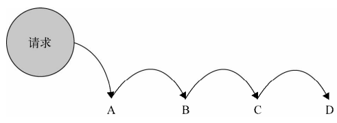

## 职责链模式

职责链模式：**使多个对象都有机会处理请求，从而避免请求的发送者和接收者之间的耦合关系，将这些对象连成一条链，并沿着这条链传递该请求，直到有一个对象处理它为止**

我们通常将职责链种的对象称为**节点**，请求在节点**依次传递**，直到遇到可以处理的节点：



在现实生活中，也有很多职责链模式的影子：

- 下班高峰时，公交车经常出现挤不上，司机让乘客从后门上车的场景。这时乘客就会向前传递 E 通卡或零钱，一直传递到司机那为止

- 考试时，第一排的同学在纸条上写下不懂的题目时向后传递，第二排同学如果也不懂，就继续向后传，知道传到会的或最后排的同学为止

职责链模式最大的优点在于：**请求者只知道链中第一个节点，从而弱化了请求者和一组接收者的强联系**

如果不使用职责链模式：

- 公交上需要先知道谁是司机

- 考场上需要先知道哪个同学懂

### 手机售卖示例

假如我们负责一个售卖手机的网站，售卖有 2 个流程：

- 预定流程，交纳 500 定金、交纳 200 定金、不交定金

- 正式购买流程，之前交纳 500 定金，可获得 100 优惠券；交纳 200 定金，可获得 50 优惠券；无定金，无优惠券，且库存有限情况下不一定能购买成功

这时我们会这样设计：

- orderType：订单类型，1 为 500 定金，2 为 200 定金，3 为无定金普通模式

- pay：用户是否支付定金（定了 500 定金订单的用户，可能虽然下单，但最后并未支付）

- stock：普通购买模式的手机库存数

代码实现：

```js
const order = function (orderType, pay, stock) {
    if (orderType === 1) {
        if (pay) {
            console.log('500 元定金预购, 得到 100 优惠券');
        } else {
            if (stock > 0) {
                console.log('普通购买, 无优惠券');
            } else {
                console.log('手机库存不足');
            }
        }
    } else if (orderType === 2) {
        if (pay) {
            console.log('200 元定金预购, 得到 50 优惠券');
        } else {
            if (stock > 0) {
                console.log('普通购买, 无优惠券');
            } else {
                console.log('手机库存不足');
            }
        }
    } else if (orderType === 3) {
        if (stock > 0) {
            console.log('普通购买, 无优惠券');
        } else {
            console.log('手机库存不足');
        }
    }
}

order(1, true, 500); // 输出：500 元定金预购, 得到 100 优惠券
```

虽然实现了效果，但这样的代码问题非常明显：

- 可读性差

- 难以维护

- 新增需求需要改动源码，不符合开放-封闭原则

### 策略模式在手机售卖示例的适用性

在这个例子中，我们可能会思考：根据 orderType 的不同，会有不同的输出结果，这不是应该使用策略模式吗？

如果使用策略模式，代码将会是：

```js
const strategies = {
    '1': function(pay, stock) {
        if (pay) {
            return '500 元定金预购, 得到 100 优惠券';
        } else {
            if (stock > 0) {
                return '普通购买, 无优惠券';
            } else {
                return '手机库存不足';
            }
        }
    },
    '2': function(pay, stock) {
        if (pay) {
            return '200 元定金预购, 得到 50 优惠券';
        } else {
            if (stock > 0) {
                return '普通购买, 无优惠券';
            } else {
                return '手机库存不足';
            }
        }
    },
    '3': function(pay, stock) {
        if (stock > 0) {
            return '普通购买, 无优惠券';
        } else {
            return '手机库存不足';
        }
    },
};
const order = function (orderType, pay, stock) {
    const message = strategies[orderType](pay, stock);
    console.log(message);
}

order(1, true, 500); // 输出：500 元定金预购, 得到 100 优惠券
```

确实如此，如果使用策略模式，在代码的实现上有了很大的优化

但是策略模式主要是：**定义一系列算法并封装起来**

我们在策略模式的中：

- 奖金示例：策略的关键在于绩效等级（S、A 等），而相应的算法在于使用工资计算出相应的奖金

- 运动框架：策略的关键在于运动方式（linear 匀速等），而相应的算法在于根据用户起始位置，时间等计算相应的当前位置

- 表单校验：策略的关键在于校验类型（isEmpty、minLength 等），而相应的算法在于根据接受的 value 和 错误提示信息来返回相应的校验结果

可以看到，在策略模式中：

- 算法内部是一种**明确的执行过程**，而不是像上面代码，还是嵌套这诸多的 if else

- 算法之间**权重平衡**，而手机售卖示例，可能存在着先后关系：500 定金 => 200 定金 => 无定金，这更像是一种链式关系

所以这个示例使用策略模式的结果是：**可以，但不那么合适**

### 职责链模式实现手机售卖示例

现在我们用职责链模式重构代码

先将 500 元订单、200 元订单和普通订单分为 3 个函数：

```js
const order500 = function(orderType, pay, stock) {
    ...
}

const order200 = function(orderType, pay, stock) {
    ...
}

const orderNormal = function(orderType, pay, stock) {
    ...
}
```

接着我们需要的流程是：先将 orderType, pay, stock 传递给 order500 函数，如果不符合条件则传递给 order200，最后传递给 orderNormal，代码实现如下：

```js
const order500 = function(orderType, pay, stock) {
    if (orderType === 1 && pay) {
        console.log('500 元定金预购, 得到 100 优惠券');
    } else {
        order200(orderType, pay, stock); // 将请求传递给 200 元订单
    }
}

const order200 = function(orderType, pay, stock) {
    if (orderType === 2 && pay) {
        console.log('200 元定金预购, 得到 50 优惠券');
    } else {
        orderNormal(orderType, pay, stock); // 将请求传递给普通订单
    }
}

const orderNormal = function(orderType, pay, stock) {
    if (stock > 0) {
        console.log('普通购买, 无优惠券');
    } else {
        console.log('手机库存不足');
    }
}

order500(1, true, 500); // 输出：500 元定金预购, 得到 100 优惠券
order500(1, false, 500); // 输出：普通购买, 无优惠券
order500(2, true, 500); // 输出：200 元定金预购, 得到 500 优惠券
order500(3, false, 500); // 输出：普通购买, 无优惠券
order500(3, false, 0); // 输出：手机库存不足
```

可以看到，现在代码结构清晰了许多，我们把大函数拆分为 3 个小函数，去掉了许多条件分支语句

目前有了不小的进步，但是还存在一些问题：

-  3 个函数传递的顺序非常**僵硬**，固定 order500 => order200 => orderNormal

- 传递请求的代码在业务函数之中**强耦合**

- **违反开放-封闭原则**，未来需求要增加 order300 或去除 order200，我们不得不去修改 order500 的代码

### 灵活可拆分的职责链节点

我们希望改进代码，让节点之间更灵活的拆分和重组

首先改写 3 个 order 节点函数，我们定个约定：如果某个节点不能处理请求，则返回特定字符串 'nextSuccessor' 表示请求继续往后传递：

```js
const order500 = function(orderType, pay, stock) {
    if (orderType === 1 && pay) {
        console.log('500 元定金预购, 得到 100 优惠券');
    } else {
        return 'nextSuccessor';
    }
}

const order200 = function(orderType, pay, stock) {
    if (orderType === 2 && pay) {
        console.log('200 元定金预购, 得到 50 优惠券');
    } else {
        return 'nextSuccessor';
    }
}

const orderNormal = function(orderType, pay, stock) {
    if (stock > 0) {
        console.log('普通购买, 无优惠券');
    } else {
        console.log('手机库存不足');
    }
}
```

接着创建一个构造函数 Chain 用来将订单函数包装为职责链节点，并连接下一个节点，Chain 有如下方法：

- setNextSuccessor：设置该节点的下一个节点**并返回**（链式操作的关键）

- passRequest：执行该节点的程序员，并将请求传递给下一个节点

```js
class Chain {
    constructor(fn) {
        this.fn = fn;
        this.successor = null; // 下一个节点
    }
    setNextSuccessor(successor) {
        return this.successor = successor;
    }
    passRequest(...args) {
        const ret = this.fn(...args);
        if(ret === 'nextSuccessor') {
            return this.successor && this.successor.passRequest(...args);
        }
        return ret;
    }
}
```

现在把 3 个订单函数分别包装成职责链节点，并设置连接关系：

```js
const chainOrder500 = new Chain(order500);
const chainOrder200 = new Chain(order200);
const chainOrderNormal = new Chain(orderNormal);

chainOrder500
    .setNextSuccessor(chainOrder200)
    .setNextSuccessor(chainOrderNormal);
```

最后进行请求测验：

```js
chainOrder500.passRequest(1, true, 500); // 输出：500 元定金预购，得到 100 优惠券
chainOrder500.passRequest(2, true, 500); // 输出：200 元定金预购，得到 50 优惠券
chainOrder500.passRequest(3, true, 500); // 输出：普通购买，无优惠券
chainOrder500.passRequest(1, false, 0); // 输出：手机库存不足
```

经过这样改造，我们**可以自由灵活的增加、移除和修改链中节点顺序**

当未来有新的 300 订单需求时，只需要：

```js
const order300 = function(orderType, pay, stock) {
    ...
}

chainOrder300 = new Chain(order300);
chainOrder500
    .setNextSuccessor(chainOrder300)
    .setNextSuccessor(chainOrder200)
    .setNextSuccessor(chainOrderNormal);
```

### 异步的职责链

实际开发中，我们在节点函数里经常会做一些异步操作，如 ajax 请求

那么我们同步返回 'nextSuccessor' 字符串在这种场景就没有了意义

为了解决这个问题，我们给 Chain 增加 next 方法，手动传递请求给下一个节点：

```js
class Chain {
    constructor(fn) {
        this.fn = fn;
        this.successor = null; // 下一个节点
    }
    setNextSuccessor(successor) {
        return this.successor = successor;
    }
    next(...args) {
        return this.successor && this.successor.passRequest(...args);
    }
    passRequest(...args) {
        return this.fn(...args, this.next.bind(this));
    }
}
```

我们进行异步测试：

```js
const fn1 = function (num, next) {
    console.log(`fn: 1; num: ${num}`);
    next(num * 2);
}

const fn2 = function (num, next) {
    console.log(`fn: 2; num: ${num}`);
    setTimeout(() => {
        next(num * 2);
    }, 2000);
}

const fn3 = function (num) {
    console.log(`fn: 3; num: ${num}`);
}

const chain1 = new Chain(fn1);
const chain2 = new Chain(fn2);
const chain3 = new Chain(fn3);

chain1
    .setNextSuccessor(chain2)
    .setNextSuccessor(chain3);

chain1.passRequest(100);
// 输出：
// fn: 1; num: 100
// fn: 2; num: 200
// 2s 后输出 fn: 3; num: 400
```

这种接收 next 函数实现职责链的异步场景，在实际开发种也有不少例子，如 Vue 的路由钩子：

```js
router.beforeEach((to, from, next) => {
    // ...
    next(); // 要调用 next 才能成功路由跳转
})
```

### AOP 实现职责链模式

除了用 Chain 构造函数将普通函数封装为职责链节点，还可以使用 AOP 的方式来创建职责链

下面我们来创建 Function.prototype.after，让它可以实现职责链的效果，实现方案还是和之前一样分为 2 种，同步 nextSuccessor 标识、异步 next（原文《JavaScript 设计模式与开发实践》未实现，此处补充）

```js
// 想要达到的效果
const chain = fn1.after(fn2).after(fn2);
chain(100);
```

- 同步 nextSuccessor：

```js
Function.prototype.after = function(fn) {
    const _this = this;
    return function(...args) {
        const ret = _this.apply(this, args);
        if (ret === 'nextSuccessor') {
            return fn.apply(this, args);
        }
        return ret;
    }
}

const order500 = function(orderType, pay, stock) {
    if (orderType === 1 && pay) {
        console.log('500 元定金预购, 得到 100 优惠券');
    } else {
        return 'nextSuccessor';
    }
}

const order200 = function(orderType, pay, stock) {
    if (orderType === 2 && pay) {
        console.log('200 元定金预购, 得到 50 优惠券');
    } else {
        return 'nextSuccessor';
    }
}

const orderNormal = function(orderType, pay, stock) {
    if (stock > 0) {
        console.log('普通购买, 无优惠券');
    } else {
        console.log('手机库存不足');
    }
}

const order = order500.after(order200).after(orderNormal);
order(1, true, 500); // 输出：500 元定金预购，得到 100 优惠券
order(2, true, 500); // 输出：200 元定金预购，得到 50 优惠券
order(1, false, 500); // 输出：普通购买，无优惠券
```

- 异步 next：

```js
Function.prototype.after = (function() {
    const symbol = Symbol(); // 闭包做唯一标识
    return function(fn) {
        const chainNode = (...args) => {
            // 说明：
            // 第一次接收的参数是用户手动传递：order(100) 的100
            // 第二次开始接收的参数是递归传递的
            // 递归传递时手动在尾部加入 symbol 标识，表示不是第一次进入
            // 做标识是因为递归传递时，args 会多接收一个 next 函数
            // 标识代表现在 args 内含 next 函数
            const arguments = [...args];
            const mark = args.pop();
            if(mark === symbol) {
                // 含有标识，取出 next 函数
                const next = args.pop();
                // this 上没有 symbol，代表是链头 fn1，不需要传递 symbol
                if(!this[symbol]) {
                    return this(...args, (...rest) => {
                        fn(...rest, next);
                    });
                }
                return this(...args, (...rest) => {
                    fn(...rest, next);
                }, symbol);
            } else {
                // 不含标识，args 尾部没有 next 函数
                // 表示是第一次用户调用传进来的参数
                return this(...arguments, (...rest) => {
                    fn(...rest);
                }, symbol);
            }
        };
        chainNode[symbol] = symbol;
        return chainNode;
    }
}());

const fn1 = function(num, next) {
    console.log(`fn: 1; num: ${num}`);
    next(num * 2);
}

const fn2 = function(num, next, s) {
    console.log(`fn: 2; num: ${num}`);
    setTimeout(() => {
        next(num * 2);
    }, 2000);
}

const fn3 = function(num, next) {
    console.log(`fn: 3; num: ${num}`);
    next(num * 2, 'add');
}

const fn4 = function(num, type) {
    console.log(`fn: 4; num: ${num}; type: ${type}`);
}

const fn = fn1.after(fn2).after(fn3).after(fn4);
fn(100);

// 输出：
// fn: 1; num: 100
// fn: 2; num: 200
// 2s 后
// fn: 3; num: 400
// fn: 4; num: 800; type: add
```

使用 AOP 实现职责链简单又巧妙，但是叠加了作用域，链条太长也会对性能有较大影响

### 获取文件上传对象示例

在迭代器模式章节，我们用迭代器获取文件上传对象：

```js
const iteratorUploadObj = function(...args) {
    for (let i = 0, fn; fn = args[i++];) {
        const uploadObj = fn();
        if (uploadObj !== false) {
            return uploadObj;
        }
    }
};

iteratorUploadObj(getActiveUploadObj, getFlashUploadObj, getFormUpladObj);
```

其实这个需求使用职责链模式更加简单方便：

```js
const getActiveUploadObj = function() {
    try {
        return new ActiveXObject("TXFTNActiveX.FTNUpload"); // IE 上传控件
    } catch (e) {
        return false;
    }
};

const getFlashUploadObj = function() {
    if (supportFlash()) { // supportFlash 函数未提供
        const str = '<object type="application/x-shockwave-flash"></object>';
        return $(str).appendTo($('body'));
    }
    return false;
};

const getFormUpladObj = function() {
    const str = '<input name="file" type="file" class="ui-file"/>'; // 表单上传
    return $(str).appendTo($('body'));
};

const getUploadObj = getActiveUploadObj.after(getFlashUploadObj).after(getFormUpladObj);

getUploadObj();
```

### 职责链模式的优缺点

职责链的优点在上面的例子中都很好的体现了：

- **解耦**了请求者与 N 个接收者之间的复杂关系，只需要把请求传递给第一个节点即可，**每个节点之间互不影响**。在实际开发中可以在各个节点做不同的各样操作，如弹框、渲染 UI 节点、发送请求等

- 链中节点可以**灵活拆分与组合**，我们可以随意组合节点，如搭配订单顺序为 order500 => order200 => orderNormal

- **符合开放-封闭原则**，增加或删除一个节点都是轻而易举的（如增加 order300 订单），而**不需要改动到其他函数中的代码**

- **可手动指定起始节点**，请求并不是一定要从第一个节点传递，例如已经确定没有 500 订单了，可以直接从 order200 发起请求，减少在链中的传递次数

但是职责链并非没有缺点：

- 不能保证请求一定会被链中某个节点处理，例如考试纸条往后传到最后都没有同学会，那请求将得不到答复。这种情况，可以在链尾增加一个**保底接收者**来处理即将离开的请求

- 职责链模式让程序中多了一些节点对象，可能在一次传递中大部分节点都没有起到实质性作用，仅仅是让请求向后传递，从性能方面，要避免过长的职责链带来的损耗

### 小结

职责链模式是最容易被忽略的模式之一，实际上只要运用得当，职责链模式**可以很好的帮助我们管理代码，降低请求者和处理者的耦合**

职责链模式对变化的封装，在于**对链式行为的封装**，节点之间这种传递的行为是**不变**的，**变化**的在于节点的数量与千变万化的组合顺序

对于新需要的变更，需要做的仅仅是新增或删除一个节点，而不需要改变职责链的链式代码和其他节点，**符合开放-封闭原则**

