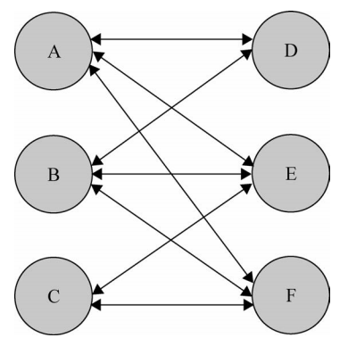
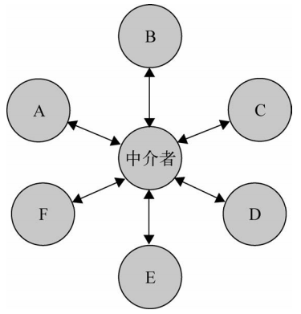
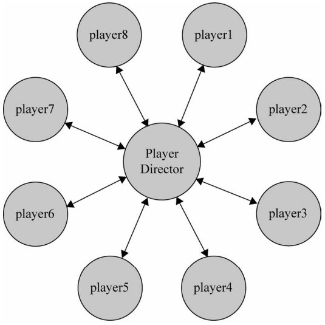
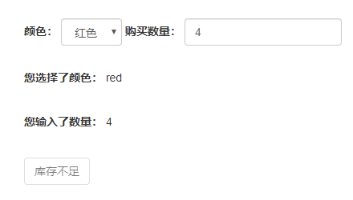
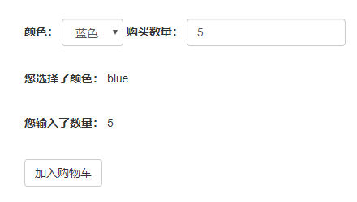
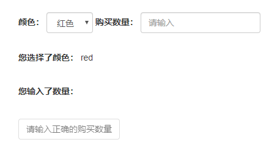
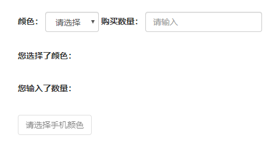

## 中介者模式

中介者模式：**解除对象与对象之间的紧耦合关系，增加一个中介者对象，所有相关对象都通过中介者通信，而不是互相引用**

在程序中，一个对象可能会和其他 10 个对象打交道，它会保持 10 个对象的引用，当规模增加时，对象也会越来越多，它们之间的关系也会更为复杂。当我们改变或删除其中一个对象时，很可能需要通知所有引用到它的对象，这样即使一点小修改都要小心翼翼，这种关系结构可能如下图所示：



由于这些对象之间联系激增，同样也降低了它们的可复用性

中介者模式使各对象之间耦合松散，可以独立的改变它们之间的交互，中介者模式使网状的多对多关系变成相对简单的一对多关系：



在第一张图中，对象 A 发生变化，需要通过通知引用关系的 D、E、F。而在第二张图中引入了中介者，A 的变化只需要通知这个中介者对象即可

现实中也有需要中介者模式的影子：

- 如果没有机场的指挥塔，每一架飞机要和方圆 100 公里内的所有飞机通信才能确定航线及飞行状况，后果不可想象。而由于指挥塔的存在，每架飞机都只需和指挥塔通信，指挥塔作为调停者，知道每一架飞机的状况，所以它可以安排所有飞机的起降时间并在一些情况下即使做出调整

- 世界杯期间购买足球彩票，没有博彩公司作为中介的话，上千万人要一起计算赔率和输赢是不可能的，有了博彩公司，每个人只需和博彩公司发生关联，所有的投注情况和赔率计算都由这个中介完成

### 泡泡堂示例

#### 双人模式

现在我们来构思一个简易版泡泡堂，游戏之初只支持 2 个玩家

首先定义一个玩家类 Player，拥有 3 个方法：win、lose、die：

由于玩家数量是 2，那么只需要在其中一人死亡时结束游戏并通知对方胜利即可

```js
class Player {
    constructor(name) {
        this.name = name;
        this.enemy = null; // 敌人
    }
    win() {
        console.log(`${this.name} won`);
    }
    lose() {
        console.log(`${this.name} lost`);
    }
    die() {
        this.lose();
        this.enemy.win();
    }
}

const player1 = new Player('蓝妹妹');
const player2 = new Player('小乖');

player1.enemy = player2;
player2.enemy = player1;

player1.die(); 
// 输出：
// 蓝妹妹 lost 小乖 won
```

#### 8 人组队模式

现在改进一次，将人数变成 8 人，并分为红蓝两队

因为数量变多，用原来这种方式设置队友和敌人显然是低效的：

```js
player1.partners= [player1,player2,player3,player4]; 
player1.enemies = [player5,player6,player7,player8]; 
Player5.partners= [player5,player6,player7,player8]; 
Player5.enemies = [player1,player2,player3,player4];
```

所以这里采用定义数组 players 保存所有玩家，玩家创建后循环 players 给每个玩家设置队友和敌人

此外还可以定义一个工厂函数来创建 player：

```js
const players = [];

class Player {
    constructor(name, teamColor) {
        this.name = name;
        this.partners = []; // 队友
        this.enemies = []; // 敌人
        this.state = 'alive';
        this.teamColor = teamColor;
    }
    win() {
        console.log(`${this.name} won`);
    }
    lose() {
        console.log(`${this.name} lost`);
    }
    die() {
        this.state = 'dead';
        const all_dead = this.partners.every(partner => partner.state === 'dead');
        if (all_dead) {
            this.lose();
            this.partners.forEach(partner => partner.lose());
            this.enemies.forEach(ememy => ememy.win());
        }
    }
}
const playerFactory = function(name, teamColor) {
    const newPlayer = new Player(name, teamColor);
    players.forEach(player => {
        if (player.teamColor === newPlayer.teamColor) {
            player.partners.push(newPlayer);
            newPlayer.partners.push(player);
        } else {
            player.enemies.push(newPlayer);
            newPlayer.enemies.push(player);
        }
    });
    players.push(newPlayer);
    return newPlayer;
}
```

创建 8 名玩家，组成 2 队：

```js
// 红队
const player1 = playerFactory('皮蛋', 'red'),
    player2 = playerFactory('小乖', 'red'),
    player3 = playerFactory('宝宝', 'red'),
    player4 = playerFactory('小强', 'red');

// 蓝队
const player5 = playerFactory('黑妞', 'blue'),
    player6 = playerFactory('葱头', 'blue'),
    player7 = playerFactory('胖墩', 'blue'),
    player8 = playerFactory('海盗', 'blue');

player1.die();
player2.die();
player3.die();
player4.die();
// 输出：
// 小强 lost
// 皮蛋 lost
// 小乖 lost
// 宝宝 lost
// 黑妞 won
// 葱头 won
// 胖墩 won
// 海盗 won
```

#### 玩家增加带来的困扰

可以看到，现在每个玩家和其他玩家都是**紧耦合**的

partners 和 enemies 保存着其他对象的引用，当一个对象的状态改变时，需要**显示**通知其他对象

如果是在一个大型游戏里有着成百上千的玩家，几十支队伍，当其中一名玩家掉线时，需要从所有的队友和敌人列表移除，甚至有的游戏还有切换队伍的功能，让玩家从红队变为蓝队，那这就不仅仅是循环能解决的了，可见我们上面实现的代码是不健壮

#### 中介者模式改造



中介者对象命名为 playerDirector，它向外抛出了 reciveMessage 方法，让 Player 可以通知它进行相应的行为操作

首先需要重构 Player，Player 不再负责具体执行逻辑，而是将这些操作交给中介者，同时我们为 Player 新增 remove 和 changeTeam 方法，方便玩家移除列表和切换队伍

```js
class Player {
    constructor(name, teamColor) {
        this.name = name;
        this.state = 'alive';
        this.teamColor = teamColor;
    }
    win() {
        console.log(`${this.name} won`);
    }
    lose() {
        console.log(`${this.name} lost`);
    }
    die() {
        this.state = 'dead';
        // 给中介者发送消息，该玩家死亡
        playerDirector.reciveMessage('playerDead', this);
    }
    remove() {
        // 给中介者发送消息，移除该玩家
        playerDirector.reciveMessage('removePlayer', this);
    }
    changeTeam(color) {
        // 给中介者发送消息，该玩家换队
        playerDirector.reciveMessage('changeTeam', this, color);
    }
}
```
接着同样改写 playerFactory，由工厂创建 player 后向中介者发送新增玩家的消息：

```js
const playerFactory = function(name, teamColor) {
    const newPlayer = new Player(name, teamColor);
    playerDirector.reciveMessage('addPlayer', newPlayer);
    return newPlayer;
}
```

最后实现中介者 playerDirector，一般有以下 2 种方式：

- 使用发布-订阅模式，playerDirector 作为订阅方，各 player 作为发布方，player 状态改变时推送消息给 playerDirector，playerDirector 处理后将反馈发送给其他 player

- playerDirector 开放一些接收消息的接口，player 可以直接调用接口发送消息，player 只需传递一个标识行为的参数，playerDirector 处理消息后将反馈发送给其他 player

从上面的代码可以看到，这里我们使用第二种方式，对外暴露 reciveMessage 接口：

```js
const playerDirector = (function() {
    const players = {}; // 所有玩家，key 为 teamColor
    const operations = {}; // 中介者可以执行的操作
    
    // 新增玩家
    operations.addPlayer = function(player) {
        const teamColor = player.teamColor;
        // 还未成立队伍则立即创建
        players[teamColor] = players[teamColor] || [];
        players[teamColor].push(player);
    }

    // 移除玩家
    operations.removePlayer = function(player) {
        const teamColor = player.teamColor;
        const teamPlayers = players[teamColor] || []; // 对应队伍
        teamPlayers.splice(teamPlayers.indexOf(player), 1);
    }

    // 玩家换队
    operations.changeTeam = function(player, teamColor) {
        operations.removePlayer(player);
        player.teamColor = teamColor;
        operations.addPlayer(player);
    }

    // 玩家死亡
    operations.playerDead = function(player) {
        const teamColor = player.teamColor,
            teamPlayers = players[teamColor];
        
        const all_dead = teamPlayers.every(player => player.state === 'dead');
        if(all_dead) {
            // 本队玩家全部 lose
            teamPlayers.forEach(player => player.lose());
            
            // 其他队伍全部玩家 win
            for(let color in players) {
                if(color !== teamColor) {
                    const teamPlayers = players[color];
                    teamPlayers.forEach(player => player.win());
                }
            }
        }
    }

    const reciveMessage = function(message, ...args) {
        operations[message].apply(this, args);
    }
    return {
        reciveMessage,
    }
}());
```

现在创建 8 名玩家，测试队伍全家全部死亡：

```js
// 红队
const player1 = playerFactory('皮蛋', 'red'),
    player2 = playerFactory('小乖', 'red'),
    player3 = playerFactory('宝宝', 'red'),
    player4 = playerFactory('小强', 'red');

// 蓝队
const player5 = playerFactory('黑妞', 'blue'),
    player6 = playerFactory('葱头', 'blue'),
    player7 = playerFactory('胖墩', 'blue'),
    player8 = playerFactory('海盗', 'blue');

player1.die(); 
player2.die(); 
player3.die(); 
player4.die();
// 输出：
// 皮蛋 lost
// 小乖 lost
// 宝宝 lost
// 小强 lost
// 黑妞 won
// 葱头 won
// 胖墩 won
// 海盗 won
```

测试掉线：
```js
player1.remove(); 
player2.remove(); 
player3.die(); 
player4.die();
// 输出：
// 宝宝 lost
// 小强 lost
// 黑妞 won
// 葱头 won
// 胖墩 won
// 海盗 won
```

测试换队：
```js
player1.changeTeam('blue'); 
player2.die(); 
player3.die(); 
player4.die();
// 输出：
// 小乖 lost
// 宝宝 lost
// 小强 lost
 // 黑妞 won
 // 葱头 won
 // 胖墩 won
 // 海盗 won
 // 皮蛋 won
```
使用中介者模式重构了代码后，我们不管是实现原来的队伍输赢通知，还是新增的移除、换队都非常的简单

### 手机购买示例

假如现在在开发一个手机购买页面，这个需求有如下场景

库存不足：



库存充足，可加入购物车：



没有输入数量：



没有选择手机颜色：



根据图中场景可以了解到，这个页面需要 5 个节点：

- 颜色下拉选择框 colorSelect

- 购买数量输入框 numberInput

- 选择的颜色信息 colorInfo

- 选择的购买数量信息 numberInfo

- 操作按钮 nextBtn

页面 HTML 结构：

```html
<body>
    <div class="wrap">
        <form class="form-inline">
            <div class="form-group">
                <label>颜色：</label>
                <select id="colorSelect" class="form-control">
                    <option value="">请选择</option>
                    <option value="blue">蓝色</option>
                    <option value="red">红色</option>
                </select>
            </div>
            <div class="form-group">
                <label>购买数量：</label>
                <input id="numberInput" class="form-control" placeholder="请输入">
            </div>
        </form>
        <form class="form-inline mt-3">
            <div class="form-group">
                <label>您选择了颜色：</label>
                <span id="colorInfo">blue</span>
            </div>
        </form>
        <form class="form-inline mt-3">
            <div class="form-group">
                <label>您输入了数量：</label>
                <span id="numberInfo"></span>
            </div>
        </form>
        <button type="button" id="nextBtn" class="btn btn-default mt-3" disabled="disabled">请选择手机颜色</button>
    </div>
</body>
```

现在开始编写业务逻辑

首先考虑选择 colorSelect 颜色下拉选择框时可能需要做哪些事：

- 获取选中的颜色，并让 colorInfo 显示当前选中色

- 判断颜色是否选择确定值

- 获取购买数量输入值，对用户输入做合法判断（因为可能按钮 nextBtn 原本显示 “请选择手机颜色”，当选择了正确的颜色后，发现数量输入框填写未正确，需要将 nextBtn 的按钮内容更改为 “请输入正确的购买数量”）

- 获取库存数量进行判断库存是否充足

根据这些考虑，我们编写如下代码：

```js
const colorSelect = document.getElementById('colorSelect'),
        numberInput = document.getElementById('numberInput'),
        colorInfo = document.getElementById('colorInfo'),
        numberInfo = document.getElementById('numberInfo'),
        nextBtn = document.getElementById('nextBtn');

const goods = { // 手机库存
    red: 3,
    blue: 6
};

colorSelect.onchange = function () {
    const color = this.value, // 颜色
        number = numberInput.value, // 数量
        stock = goods[color]; // 当前库存

    colorInfo.innerHTML = color; // 颜色信息

    // 是否选择颜色
    if (!color) {
        nextBtn.disabled = 'disabled';
        nextBtn.innerHTML = '请选择手机颜色';
        return;
    }

    // 是否输入正确的数字
    if(number === '' || !Number.isInteger(+number) || +number <= 0) {
        nextBtn.disabled = true;
        nextBtn.innerHTML = '请输入正确的购买数量';
        return;
    }

    // 库存是否充足
    if (+number > stock) {
        nextBtn.disabled = 'disabled';
        nextBtn.innerHTML = '库存不足';
        return;
    }
    nextBtn.disabled = false;
    nextBtn.innerHTML = '放入购物车';
}
```
除此之外，还要考虑填写 numberInput 输入框的场景，同样也是需要做如下操作：

- 获取填写的数量，并让 numberInfo 显示当前输入数量

- 判断颜色是否选择确定值

- 获取购买数量输入值，对用户输入做合法判断

- 获取库存数量进行判断库存是否充足

```js
numberInput.oninput = function () {
    const color = colorSelect.value, // 颜色
        number = this.value, // 数量
        stock = goods[color]; // 当前库存

    numberInfo.innerHTML = number;

    // 是否选择颜色
    if (!color) {
        nextBtn.disabled = 'disabled';
        nextBtn.innerHTML = '请选择手机颜色';
        return;
    }

    // 是否输入正确的数字
    if (number === '' || !Number.isInteger(+number) || +number <= 0) {
        nextBtn.disabled = true;
        nextBtn.innerHTML = '请输入正确的购买数量';
        return;
    }

    // 库存是否充足
    if (number > stock) {
        nextBtn.disabled = 'disabled';
        nextBtn.innerHTML = '库存不足';
        return;
    }
    nextBtn.disabled = false;
    nextBtn.innerHTML = '放入购物车';
}
```

至此就完成了需求逻辑

#### 存在的问题

- 对象耦合，如果要去掉 colorInfo 展示区，需要同时去改动 colorSelect.onchange 和 numberInput.oninput

- 逻辑冗余，可以看到，其实对象之间很多逻辑操作都是相似的

- 新增节点副作用大，如果页面节点达到了 10 多个，它们之间的联系可能错综复杂，这会导致每一次改动都可能需要动到其他代码。假设现在仅仅增加了一个需求：新增内存选项，这意味着我们可能需要创建内存下拉框 memorySelect，内存信息展示 memoryInfo，那么我们就不得不去 colorSelect.onchange 和 numberInput.oninput 新增内存判断的逻辑，甚至因为新加入的内存需求，我们还需要改动到 goods 库存对象的结构，这也间接又影响了 colorSelect.onchange 和 numberInput.oninput

很显然这种做法是不可取的，节点之间的耦合，让我们改变或新增一个节点对象，都需要通知与之相关的对象，这也同样**违背开放-封闭原则**

#### 使用中介者模式重构

现在我们引入中介者对象，所有节点只与中介者通信

不论是 cololrSelect、numberInput、memorySelect 变化时，它们要做的仅仅只有一件事：**通知中介者它们被改变了**，剩下的事由中介者统一处理，这样无论是修改还是新增节点，都只需要改动中介者对象里的代码

```js
const colorSelect = document.getElementById('colorSelect'),
        memorySelect = document.getElementById('memorySelect'),
        numberInput = document.getElementById('numberInput'),
        colorInfo = document.getElementById('colorInfo'),
        memoryInfo = document.getElementById('memoryInfo'),
        numberInfo = document.getElementById('numberInfo'),
        nextBtn = document.getElementById('nextBtn');

const goods = { // 手机库存
    'red|32G': 3,
    'red|16G': 0,
    'blue|32G': 1,
    'blue|16G': 6
};

const mediator = {
    changed(obj) {
        const color = colorSelect.value, // 颜色
            memory = memorySelect.value,// 内存
            number = numberInput.value, // 数量
            stock = goods[color + '|' + memory];

        if (obj === colorSelect) {
            colorInfo.innerHTML = color;
        } else if (obj === memorySelect) {
            memoryInfo.innerHTML = memory;
        } else if (obj === numberInput) {
            numberInfo.innerHTML = number;
        }

        // 是否选择颜色
        if (!color) {
            nextBtn.disabled = 'disabled';
            nextBtn.innerHTML = '请选择手机颜色';
            return;
        }

        // 是否选择内存
        if (!memory) {
            nextBtn.disabled = 'disabled';
            nextBtn.innerHTML = '请选择内存大小';
            return;
        }
        // 是否输入正确的数字
        if (number === '' || !Number.isInteger(+number) || +number <= 0) {
            nextBtn.disabled = 'disabled';
            nextBtn.innerHTML = '请输入正确的购买数量';
            return;
        }
        // 库存是否充足
        if (number > stock) {
            nextBtn.disabled = 'disabled';
            nextBtn.innerHTML = '库存不足';
            return;
        }
        nextBtn.disabled = false;
        nextBtn.innerHTML = '放入购物车';
    },
};
colorSelect.onchange = function() {
    mediator.changed(this);
}

memorySelect.onchange = function() {
    mediator.changed(this);
};

numberInput.oninput = function() {
    mediator.changed(this);
}
```

可以想象，未来如果新增了需求，如新增 CPU 型号，那么我们只需要改动 mediator 对象，不需要去改动其他节点，成功的将节点之间的关联进行了解耦

### 小结

中介者模式是迎合**迪米特法则（最少知识原则）**的一种实现

这也是中介者模式的优点体现：

- 让一个对象尽可能少的了解其他对象，这样就可以**避免对象之间的高度耦合带来需求上的连锁改动**

- 让**对象之间几乎不知道彼此的存在**，各个对象**只关注自身**功能的实现，对象之间的关系交给中介者进行调度

当然，中介者模式也是存在一些缺点的：

- 新增一个中介者对象，对象之间的交互复杂性，转化为了中介者对象自身的复杂性

- 中介者对象往往会变得庞大，根据需求的新增可能会让中介者对象无限膨胀，难以维护

中介者模式对于变化的封装，在于**对节点之间交互行为的封装**，节点之间需要交互的行为是**不变**的（如 colorSelect、memorySelect、numberInput 改变后，都有通用的行为：进行交互），**变化**的在于节点本身，是什么节点，需要进行什么交互

同样，中介者模式将复杂对象之间的耦合关系解除，新增对象不需要改动原有代码，**符合开放-封闭原则**