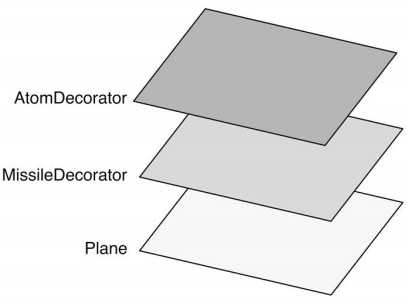

## 装饰器模式

装饰器模式：**为一个现有对象动态增加新的职责，同时又不改变其结构的的方式**

在传统面向对象语言中，对对象添加功能通常使用**继承**的方式

但是继承并不灵活，还存在一些问题：

- 超类和子类强耦合，超类改变影响子类随之改变

- 白箱复用，超类的内部细节对子类可见，破坏了封装性

- 子类数量爆炸式增长，假设现在有 4 种自行车，我们为每一种自行车定义单独的类，现在要添加前灯、尾灯、铃铛 3 种配置，继承的实现将会创建 12 种子类

而装饰器模式在于**动态增加职责**，它能够在不改变对象自身的基础上，给对象动态添加功能，而不是一开始就有这个功能

生活中也要很多装饰器的场景：

- 游戏中角色升级后进行技能加点，人物角色往往不是一开始就具有那些技能的，而是通过技能加点，按需装上这些功能

- 天冷了，我们就多穿一件衣服，而不是一开始我们本身就穿着这件衣服

- 哆啦A梦要飞行功能，就在头上安装一个竹蜻蜓

可以体会到，装饰器与继承相比，是一种**更轻便灵活**的做法

### 模拟传统面向对象语言的装饰器模式

假设现在正在实现一个飞机游戏的需求，一开始飞机只能发射普通子弹，随着升级过程，飞机进化为可以发射导弹，再升级便可以发射原子弹

在传统面向对象语言是如何使用装饰器模式实现这个需求的？

排除静态类型检测、抽象类、接口等，主要的做法用 JavaScript 实现效果如下：

```js
class Plane {
    fire() {
        console.log('发射普通子弹');
    }
}

// 导弹装饰器类
class MissileDecorator {
    constructor(plane) {
        this.plane = plane;
    }
    fire() {
        this.plane.fire();
        console.log('发射导弹');
    }
}

// 原子弹装饰器类
class AtomDecorator {
    constructor(plane) {
        this.plane = plane;
    }
    fire() {
        this.plane.fire();
        console.log('发射原子弹');
    }
}

let plane = new Plane();
plane = new MissileDecorator(plane);
plane = new AtomDecorator(plane);
plane.fire();

// 输出：发射普通子弹 发射导弹 发射原子弹
```

可以看到，实现思路在于：**将对象放入另一个对象之中，这些对象以一条链的方式进行引用，形成一个聚合对象**

这种给对象动态增加职责的方式，并没有真正改动对象自身

这些对象都拥有相同的接口（如这里 fire），当请求达到链中某个对象时，这个对象会执行自身操作，随后把请求转发给链中下一个对象

因为装饰器对象和所修饰的对象拥有一致接口，所以对用户而言是透明的，被装饰的对象也不需要了解它被装饰过，这种透明性使得我们可以递归嵌套任意多个装饰器对象

**装饰器（decorator）也是包装器（wrapper）**，从结构上看，装饰器模式将一个对象嵌入另一个对象，相当于这个对象被包装了起来，形成一条包装链



### JavaScript 的装饰器

在 JavaScript 中动态修改对象相对容易，我们可以直接**改写对象或对象的某个方法**，并不需要使用类来实现装饰器模式：

```js
const plane = {
    fire() {
        console.log('发射普通子弹');
    },
}

const missileDecorator = function() {
    console.log('发射导弹');
}

const atomDecorator = function() {
    console.log('发射原子弹');
}

const fire_1 = plane.fire;
plane.fire = function() {
    fire_1();
    missileDecorator();
}

const fire_2 = plane.fire;
plane.fire = function() {
    fire_2();
    atomDecorator();
}

plane.fire();

// 输出：发射普通子弹 发射导弹 发射原子弹
```

### 装饰函数

在 JavaScript 中，我们可以很方便的某个对象扩展属性和方法

如为对象扩展 say 方法：

```js
const obj = {};
obj.say = function() {
    ...
}
```

我们很容易做到**在不改变对象源码的情况下扩展属性**

但是在 JavaScript 有一个特殊对象：**函数**。函数在 JavaScript 中作为一等对象，在开发中大部分时间也都在与函数打交道

相比对象，**在不改动某个函数源码的情况下，给函数添加新功能是相对困难的**

最简单的做法就是直接改写函数：

```js
function fn() {
    console.log(1);
}

// 为函数 fn 扩展打印 2 的功能
function fn() {
    console.log(1);
    console.log(2);
}
```

这样的做法存在很明显的缺陷：

- 违背开放封闭原则

- 在获取不到源码的情况下无法实现

我们更需要的是在不修改源码的情况下扩展函数功能

其实在上一节我们已经这么做了：**通过保存原函数的引用来改写函数**（上一节 fire_1 保存了原 plane.fire 的引用）

这是实际开发中一种很常见的做法，比如我们需要为 window.onload 新增功能，但是不确定这个事件是否已经在项目某处被绑定过，为了避免覆盖之前的行为，可能会这样做：

```js
window.onload = function() {
    console.log(1);
}

const _onload = window.onload || function() {}

window.onload = function() {
    _onload();
    console.log(2);
}
```

这样的代码是**符合开放-封闭原则**的，但是其实还是存在一些问题：

- 必须维护 _onload 中间变量，如果函数装饰链较长，中间变量也会越来越多

- this 指向问题，当我们装饰的函数内需要 this 指向时可能导致运行报错，需要手动绑定 this，不方便

```js
const _getElementById = document.getElementById;
document.getElementById = function(id) {
    console.log(1);
    return _getElementById(id);
}
const button = document.getElementById('button'); // 报错

// 解决
const _getElementById = document.getElementById;
document.getElementById = function(id) {
    console.log(1);
    return _getElementById.call(document, id);;
}
const button = document.getElementById('button');
```
### AOP 装饰函数

除了保存引用的方式装饰函数，还可以使用 AOP 对函数进行装饰

```js
Function.prototype.before = function(beforeFn) {
    const _self = this; // 保存原函数引用
    return function(...args) {
        beforeFn.apply(this, args);
        return _self.apply(this, args);
    }
}

Function.prototype.after = function(afterFn) {
    const _self = this; // 保存原函数引用
    return function(...args) {
        const ret = _self.apply(this, args);
        afterFn.apply(this, args);
        return ret
    }
}
```

改写 window.onload 示例：

```js
window.onload = function() {
    console.log(1);
}

window.onload = (window.onload || function() {}).after(function() {
                    console.log(2);
                }).after(function() {
                    console.log(3);
                }).after(function() {
                    console.log(4);
                });
```

改写 document.getElementById 示例：

```js
document.getElementById = document.getElementById.before(function() {
    console.log(1);
});
const button = document.getElementById('button');
```

可以看到装饰函数非常方便，如果我们不想污染原型的做法，可以单独创建函数 before、after：

```js
const before = function(fn, beforeFn) {
    return function(...args) {
        beforeFn.apply(this, args);
        return fn.apply(this, args);
    } 
}

const after = function(fn, afterFn) {
    return function(...args) {
        const ret = fn.apply(this, args);
        afterFn.apply(this, args);
        return ret;
    } 
}

document.getElementById = before(document.getElementById, function() {
    console.log(1);
});
```

在实际开发中，不论是业务代码，还是框架层面，我们都可以**把行为根据职责分割为粒度更细的函数**，随后将他们装饰在一起，这对编写一个松耦合高复用性的代码有很大帮助

#### 数据统计上报示例

有不少公司都会有埋点数据统计的需求，网站希望知道用户对什么信息更感兴趣（服务器、负载均衡），这就需要前端进行数据采集，而后台系统中根据采集的数据生成图表，这样公司就可以对用户需求进行分析，更好的规划自己的产品

常见的实现思路是：**点击按钮后将 button 上的标识利用 img 发送给后端**

这是因为：

- 埋点不关心请求结果，只做发送

- img 可以跨域

- 无需 ajax 只能达到请求效果

- 原生实现兼容性良好

假设页面上有一个登录 button，点击会弹出登录框，代码如下：

```js
<body>
    <button tag="login" id="login">登录</button>
</body>
<script>
    function showLogin() {
        console.log('打开登录窗口');
    }
    document.getElementById('login').onclick = showLogin;
</script>
```

现在要实现埋点数据统计的功能，修改代码如下：

```js
<body>
    <button tag="login" id="login">登录</button>
</body>
<script>
    function showLogin() {
        console.log('打开登录窗口');
        log(this.getAttribute('tag'));
    }
    function log(tag) {
        console.log('上报的 tag: ' + tag);
        // (new Image).src = 'http://XXX.com/report?tag=' + tag;
    }
    document.getElementById('login').onclick = showLogin;
</script>
```

可以看到，为了实现这个需求，我们改动了原来的代码，这**违背了-开放封闭原则**，并且 showLogin 也**不符合单一职责原则**，既要负责打开弹框，又要负责数据上传，这是毫不相关的 2 个功能，却被耦合在了一个函数中

使用 AOP 装饰函数的方式，就可以很方便的解决上述问题，代码调整如下：

```js
Function.prototype.after = function(afterFn) {
    const _self = this; // 保存原函数引用
    return function(...args) {
        const ret = _self.apply(this, args);
        afterFn.apply(this, args);
        return ret
    }
}
function showLogin() {
    console.log('打开登录窗口');
}
function log() {
    console.log('上报的 tag: ' + this.getAttribute('tag'));
    // (new Image).src = 'http://XXX.com/report?tag=' + tag;
}

showLogin = showLogin.after(log);
document.getElementById('login').onclick = showLogin.after(log);
```

#### 动态改变函数参数示例

现在项目中封装了一个 axios 函数用于 axios 请求：

```js
function axios(type, url, params) {
    console.log(params);
    // 请求相关操作...
}
axios('get', '/query', { key: 'k' });
```

这个函数一直以来都运转良好，直到有一天网站遭受了 CSRF 攻击

为了解决这个安全问题，我们希望在请求时带上 token 参数：

```js
function getToken() {
    return 'Token';
}
function axios(type, url, params = {}) {
    params.token = getToken();
    console.log(params);
    // 请求相关操作...
}
axios('get', '/query', { key: 'k' });
```

虽然问题已经解决，但是存在一些问题：

- axios 显得僵硬，每个请求都带上了 token

- 可复用性差，如果之后有的项目需要 axios 函数，或者需要发布到 npm 上做一个工具库，那这个 token 显然是多余的

使用 AOP 装饰函数的方式解决这些问题：

```js
Function.prototype.before = function(beforeFn) {
    const _self = this; // 保存原函数引用
    return function(...args) {
        beforeFn.apply(this, args);
        return _self.apply(this, args);
    }
}

function getToken() {
    return 'Token';
}
function axios(type, url, params = {}) {
    console.log(params);
    // 请求相关操作...
}
axios = axios.before(function(type, url, params = {}) {
    params.token = getToken();
})
axios('get', '/query', { key: 'k' });
```

可以看到 AOP 装饰函数的方式为 axios 动态装饰了 token 参数，保证了 axios 依旧是相对纯净的函数，提高了可复用性

#### 表单校验示例

在 Web 开发中表单校验是非常常见的场景，如在提交前判断用户名和密码是否为空

```html
<body>
    用户名：<input id="username" type="text" />
    密码： <input id="password" type="password" />
    <input id="submitBtn" type="button" value="提交">
</body>
<script>
    const username = document.getElementById('username'),
        password = document.getElementById('password'),
        submitBtn = document.getElementById('submitBtn');

    function axios(type, url, params = {}) {
        console.log(params);
        // 请求相关操作...
    }
    function formSubmit() {
        if (username.value === '') {
            console.log('用户名不能为空');
            return;
        }
        if (password.value === '') {
            console.log('密码不能为空');
            return;
        }
        const params = {
            username: username.value,
            password: password.value,
        };
        axios('post', 'http:// xxx.com/login', params);
    }

    submitBtn.onclick = formSubmit;
</script>
```

此时 formSubmit 用于也是存在很明显的问题：**违背单一职责原则**，同时做了表单校验，又做了提交请求

为了分离校验和请求提交，我们可能会做如下调整：

```js
function validate() {
    if (username.value === '') {
        console.log('用户名不能为空');
        return false;
    }
    if (password.value === '') {
        console.log('密码不能为空');
        return false;
    }
    return true;
}

function formSubmit() {
    if(!validate()) return;
    
    const params = {
        username: username.value,
        password: password.value,
    };
    axios('post', 'http:// xxx.com/login', params);
}
```

现在代码确实有了改进，但是 formSubmit 内部还是需要计算 validate 的返回值，因为返回结果表明了校验是否通过

我们更希望可以改进的更为彻底，将 validate 与 formSubmit 完全分离

使用 AOP 装饰函数就可以实现这样的效果，最终改进代码如下：

```js
Function.prototype.before = function(beforeFn) {
    const _self = this;
    return function(...args) {
        // 如果校验未通过，不执行原函数
        if(!beforeFn.apply(this, args)) return;

        return _self.apply(this, args);
    }
}

function validate() {
    if (username.value === '') {
        console.log('用户名不能为空');
        return false;
    }
    if (password.value === '') {
        console.log('密码不能为空');
        return false;
    }
    return true;
}

function formSubmit() {
    const params = {
        username: username.value,
        password: password.value,
    };
    axios('post', 'http:// xxx.com/login', params);
}

formSubmit = formSubmit.before(validate);
submitBtn.onclick = formSubmit;
```

### ES7 的装饰器

ES2016 增加了装饰器这个新特性，装饰器是一个函数，用来修改类的行为

```js
function decorator(target) {
  target.mark = true;
}

@decorator
class A {}

console.log(A.mark); // 输出 true
```

以上代码等同于：

```js
function decorator(target) {
  target.mark = true;
}

class A {}
A = decorator(A) || A;
```

关于装饰器的用法这里不再说明，可以参考 [TypeScript 装饰器](https://github.com/karmiy/learn/blob/master/TypeScript/13%E3%80%81%E8%A3%85%E9%A5%B0%E5%99%A8.md)

### 装饰器模式与代理模式的区别

代理模式与装饰器模式都属于结构型设计模式，它们两者之间非常相似,都描述了如何为对象提供一定程度的间接引用

代理模式与装饰器模式主要的区别在于**意图与设计目的**：

- 代理模式的目的在于，当直接访问本体不方便或不符合时，为本体提供代替者。装饰器模式是为对象动态加入行为

- 代理模式强调一种**关系**（Proxy 和本体之间的关系），这种关系**一开始就可以被确定**。装饰器模式一开始并不像代理模式一样确立关系，而与之相反，**一开始并不能确定对象的全部功能**

- 代理模式只有一层**代理-本体关系**，而装饰器模式并不是这种代理-本体关系，而经常会形成一条长长的**装饰链**

- 代理模式最终**调用的是代理对象，是对本体某一功能的把控和辅助**（如 myImage 代理对象 proxyImage，最终会调用 proxyImage，proxyImage 是对本体 setSrc 进一步的把控操作），而装饰器模式**在本质上还是调用本体，注重加强本体功能，装饰后还是对象本身**（如 formSubmit = formSubmit.before(validate)，最终调用的还是 formSubmit）

总的来说：

- 代理模式重心是为了借用对象某个功能完成某一流程，而非对象功能如何。**如何调用对象的某一功能是思考重点，而不需要兼顾对象的所有功能**

- 装饰器模式不关心外界如何调用，只关注对对象功能的增强，装饰后还是对象本身。**如何扩展对象的某一个功能是思考重点，同时需要兼顾对象的其他功能，因为再怎么装饰也是对象本身**

例如在虚拟代理实现图片预加载的例子，本体负责设置 img.src，代理则提供了预加载功能，这看起来也是一种“加入行为”的方式，但是这种加入行为的方式和装饰器模式的侧重点不同，这更像是**如何借用 myImage 的 setSrc 实现预加载功能**，用户同样是也希望依旧以 XXX.setSrc 的方式来达到效果，所以这更侧重于**如何调用对象的某一功能**

而像埋点数据统计的例子，在原本 showLogin 的功能在于弹出登录框，而 log 埋点统计是一个与弹框无关的功能，它不需要像代理模式那样，在代理对象中去调用本体的 setSrc，控制 setSrc 的访问，而更像是对 showLogin 功能的增强，**更侧重于如何扩展 showLogin 的功能，而非如何调用 showLogin 达到效果**

### 小结

装饰器模式在实际开发中非常有用，特别像我们使用了如 ES7 Decorate 的语法糖扩展功能时，这种做法是简洁而优雅的

当我们希望框架里的函数提供的是一些稳定而方便移植的功能时，那些个性化功能可以在框架之外动态装饰，这可以避免为了拥有更多功能，而使用 if else 预测用户的实际需要

装饰器模式对于变化的封装，在于对象与功能组合的封装，功能的职责与数量是**变化**的（穿T恤、毛衣、外套），而对象本身的结构是**不变**的（不管穿什么衣服，都是个人类，不会因为穿了件羊毛衣就转换物种），装饰器模式在于为对象本身在需要的场景动态扩展适当的功能职责

很容易看出，在新的需求到来时，只需要扩展新的功能并装饰在对象之上，不需要修改对象的源码和其他功能代码，**符合-开放封闭原则**


