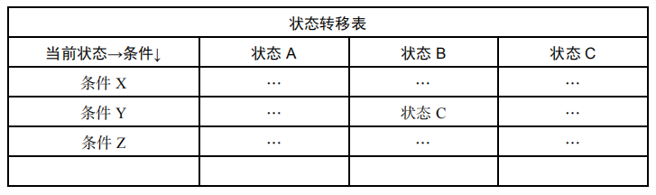

## 状态模式

状态模式：**允许一个对象在其内部状态改变时改变它的行为，对象看起来似乎修改了它的类**

状态模式的关键是**区分事物内部的状态**，事物内部状态的改变往往会带来事物的**行为改变**

### 电灯开关示例

想象现在有一个场景：家里的电灯有一个开关，当电灯是开启状态时，按下开关将切换到关闭状态，再按一次开关将切换回开启状态。这是最普通的电灯开关场景，同一个开关按钮，**在不同状态下，表现出来的行为是不同的**


下面先编写这个例子：

```js
class Light {
    constructor() {
        this.state = 'off';
        this.button = null;
    }
    init() {
        const button = document.createElement('button');
        button.innerHTML = '开关';
        this.button = document.body.appendChild(button);

        this.button.onclick = () => this.buttonWasPressed();
    }
    buttonWasPressed() {
        if (this.state === 'off') {
            console.log('开灯');
            this.state = 'on';
        } else if (this.state === 'on') {
            console.log('关灯');
            this.state = 'off';
        }
    }
}

const light = new Light();
light.init();
```

可以看到，我们成功编写了一个电灯的状态机，这个状态机逻辑既简单又缜密

实际上这种代码我们在平时开发中编写过无数次，如点击 button 后切换元素的 class

但是遗憾的是，电灯并不一定像我们切换 class 一样只有开关 2 种状态，可能有一种电灯的状态切换是：弱光 => 强光 => 关闭

现在必须改造上面的 buttonWasPressed 方法：

```js
buttonWasPressed() {
    if (this.state === 'off') {
        console.log('弱光');
        this.state = 'weakLight';
    } else if (this.state === 'weakLight') {
        console.log('强光');
        this.state = 'strongLight';
    } else if (this.state === 'strongLight') {
        console.log('关灯');
        this.state = 'off';
    }
}
```
上述代码存在的问题是显而易见的：

- buttonWasPressed 违背开放-封闭原则，每次新增或修改状态，都需要改动 buttonWasPressed 代码，buttonWasPressed 成了一个不稳定方法

- 与状态相关的行为，都封装在了 buttonWasPressed 中，未来需求新增了更多的状态：超强光、紫外线光等，那么 buttonWasPressed 将无限膨胀，并且实际开发中每种状态执行的逻辑更为复杂，不只是像现在这样 console.log 打印而已，这样 buttonWasPressed 会非常庞大

- 状态切换不明显，仅仅是使用如 this.state = 'weakLight' 变量赋值，在实际开发中很容易不小心漏掉，也没有办法一目了然明白点灯有多少种状态。并且当状态非常多时，某一次切换过程就需要去庞大的 buttonWasPressed 中去寻找

#### 状态模式重构点灯代码

通常谈起封装，一般会是封装对象的行为，如上述代码在正常封装下，可能是这样：

```js
const behaviour = {
    off: light => {
        console.log('弱光');
        light.state = 'weakLight';
    },
    weakLight: light => {
        console.log('强光');
        light.state = 'strongLight';
    },
    strongLight: light => {
        console.log('关灯');
        light.state = 'off';
    },
}

buttonWasPressed() {
    behaviour[this.state](this);
}
```

但是状态模式相反，状态模式是把**事物的每种状态封装成单独的类，跟此状态有关的行为都被封装在这个类的内部**

在按下 button 时，只需要在上下文中，把请求委托给当前状态对象，该状态对象负责渲染自身的行为


同时，我们也可以把状态切换规则分布在状态类中，从而消除原本大量的 if else 分支


下面重构代码，先定义 3 个状态类：

```js
class OffLightState {
    constructor(light) {
        this.light = light;
    }
    buttonWasPressed() {
        console.log('弱光');
        this.light.setState(this.light.weakLightState);
    }
}

class WeakLightState {
    constructor(light) {
        this.light = light;
    }
    buttonWasPressed() {
        console.log('强光');
        this.light.setState(this.light.strongLightState);
    }
}

class StrongLightState {
    constructor(light) {
        this.light = light;
    }
    buttonWasPressed() {
        console.log('关灯');
        this.light.setState(this.light.offLightState);
    }
}
```

接着重构 Light，类内部保存着所有状态，并且在 button 点击后不再做任何实质性操作，而是将请求委托给当前的状态对象去执行：

```js
class Light {
    constructor() {
        this.offLightState = new OffLightState(this);
        this.weakLightState = new WeakLightState(this);
        this.strongLightState = new StrongLightState(this);
        this.button = null;
    }
    init() {
        const button = document.createElement('button');
        button.innerHTML = '开关';
        this.button = document.body.appendChild(button);

        this.currState = this.offLightState; // 设置当前状态
        this.button.onclick = () => this.currState.buttonWasPressed();
    }
    setState(state) {
        this.currState = state;
    }
}
const light = new Light();
light.init();
```

通过状态模式重构后的好处很明显：

- 每一种状态和对应的行为之间的关系局部化

- 行为封装在各自对应的状态类，便于阅读和管理

- 新增状态只需要添加新状态类，再稍改现有代码即可

如现在需要状态切换过程为：弱光 => 强光 => 超强光 => 关闭：

```js
// 定义超强光类
class SuperStrongLightState {
    constructor(light) {
        this.light = light;
    }
    buttonWasPressed() {
        console.log('关灯');
        this.light.setState(this.light.offLightState);
    }
}

// 调整强光类
class StrongLightState {
    constructor(light) {
        this.light = light;
    }
    buttonWasPressed() {
        console.log('超强光');
        this.light.setState(this.light.superStrongLightState);
    }
}

// 补充 constructor
class Light {
    constructor() {
        this.offLightState = new OffLightState(this);
        this.weakLightState = new WeakLightState(this);
        this.strongLightState = new StrongLightState(this);
        this.superStrongLightState = new SuperStrongLightState(this); // 新增
        this.button = null;
    }
    ...
}
```
### 抽象类与缺少抽象类的变通

可以看到，在状态类中将会定义一些共同的行为方法，在这个例子中 ，无论定义多少状态类，都必须实现 buttonWasPressed 这个方法

通常在静态类型语言中，所有状态类都会继承自一个抽象类，这样就可以保证子状态类实现了必须实现的方法，下面我们用 typescript 来简单模拟：

```js
abstract class State {
    light: Light;
    constructor(light) {
        this.light = light;
    }
    abstract buttonWasPressed(): void;
}

class OffLightState extends State {
    buttonWasPressed() {
        console.log('弱光');
        this.light.setState(this.light.weakLightState);
    }
}

class WeakLightState extends State {
    buttonWasPressed() {
        console.log('强光');
        this.light.setState(this.light.strongLightState);
    }
}

class StrongLightState extends State {
    buttonWasPressed() {
        console.log('关灯');
        this.light.setState(this.light.offLightState);
    }
}

class Light {
    offLightState: OffLightState;
    weakLightState: WeakLightState;
    strongLightState: StrongLightState;
    button: HTMLButtonElement = null;
    currState: State = null;
    constructor() {
        this.offLightState = new OffLightState(this);
        this.weakLightState = new WeakLightState(this);
        this.strongLightState = new StrongLightState(this);
    }
    init() {
        const button = document.createElement('button');
        button.innerHTML = '开关';
        this.button = document.body.appendChild(button);

        this.currState = this.offLightState; // 设置当前状态
        this.button.onclick = () => this.currState.buttonWasPressed();
    }
    setState(state: State) {
        this.currState = state;
    }
}
```

遗憾的是，在 JavaScript 并没有抽象类也没有接口，在这其他章节也有提起过

解决方案是同“模板方法模式”的做法，模拟一个抽象父类，为未实现具体方法的子类在使用时直接抛出错误：

```js
class State {
    constructor(light) {
        this.light = light;
    }
    buttonWasPressed() {
        throw new Error('父类的 buttonWasPressed 方法必须被重写');
    }
}
class OffLightState extends State {
    // 子类没有实现 buttonWasPressed，调用时将抛出错误
    buttonWasPressed() {
        console.log('弱光');
        this.light.setState(this.light.weakLightState);
    }
}
```

### 文件上传示例

电灯示例是相对简单的例子，状态总是 A => B => C => A 这样循环，即使不用状态模式，常规的逻辑编写也不至于代码结构缭乱，因为状态总是有规律的

实际上在项目开发中往往是比较复杂的，例如文件上传的场景，可能充斥着有扫描、正在上传、暂停、上传成功、上传失败等等的状态，在上传中和暂停状态下的行为表现也是不同的

下面以文件上传为例


如图所示，控制文件上传一共 2 个按钮，第一个按钮用于暂停和恢复上传，第二个按钮用于删除文件

按钮与状态息息相关，状态有：扫描、正在上传、暂停、上传完成、上传失败

在不同的状态下，点击这 2 个按钮会有不同的行为：

- 扫描状态，2 个按钮都是禁用状态（不能暂停也不能删除），只能等待扫描结束。扫描完成后判断文件是否已在服务器，是则切换为“上传完成”状态，若文件大小超额或文件损坏，则切换为“上传失败”，其余切换为“上传中”

- 上传中可以点击第一个按钮暂停和恢复上传

- 只有“暂停”、“上传完成”、“上传失败” 才能点击第二个按钮删除文件

#### 准备工作

在实现代码前，先模拟一个上传插件，这里只做打印操作

假设全局环境下有一个上传的插件对象 plugin：

```js
const plugin = {
    sign() {
        console.log('开始文件扫描');
    },
    pause() {
        console.log('暂停文件上传');
    },
    uploading() {
        console.log('开始文件上传');
    },
    del() {
        console.log('删除文件上传');
    },
    done() {
        console.log('文件上传完成');
    },
}
```

#### 开始实现

首先定义 Upload 类型：

```js
class Upload {
    constructor(fileName) {
        this.plugin = plugin;
        this.fileName = fileName;
        this.dom = null;
        this.button_1 = null;
        this.button_2 = null;
        this.state = 'sign'; // 初始状态
    }
}

```

Upload 有一个初始化 init 方法，负责挂载节点，绑定事件：

```js
class Upload {
    ...
    init() {
        this.dom = document.createElement('div');
        this.dom.innerHTML =
            `<span>文件名称: ${this.fileName}</span>
            <button>扫描中</button>
            <button>删除</button>`;
        document.body.appendChild(this.dom);
        const buttons = this.dom.querySelectorAll('button');
        this.button_1 = buttons[0];
        this.button_2 = buttons[1];

        this.bindEvent();
    }
    ...
}
```

bindEvent 给按钮绑定点击事件，点击时根据状态做不同的变通：

```js
class Upload {
    ...
    bindEvent() {
        this.button_1.onclick = () => {
            if (this.state === 'sign') { // 扫描中，操作无效
                console.log('扫描中，点击无效...');
            } else if (this.state === 'uploading') { // 上传中 => 暂停
                this.pause();
            } else if (this.state === 'pause') { // 暂停 => 上传中
                this.uploading();
            } else if (this.state === 'done') { // 上传完成，操作无效
                console.log('文件已完成上传, 点击无效');
            } else if (this.state === 'error') { // 上传失败，操作无效
                console.log('文件上传失败, 点击无效');
            }
        }
        this.button_2.onclick = () => {
            if (this.state === 'done' || this.state === 'error' || this.state === 'pause') {
                // 上传完成、上传失败和暂停状态下可以删除
                this.del();
            } else if (this.state === 'sign') { // 扫描中，删除无效
                console.log('文件正在扫描中，不能删除');
            } else if (this.state === 'uploading') { // 上传中，删除无效
                console.log('文件正在上传中，不能删除');
            }
        };
    }
    ...
}
```

sign、uploading、pause、done、error、del 负责切换状态之后的具体行为实现，如改变按钮文本，调用插件做相应操作：

```js
class Upload {
    ...
    sign() {
        this.plugin.sign();
        this.button_1.innerHTML = '扫描中，任何操作无效';
        this.state = 'sign';
    }
    uploading() {
        this.plugin.uploading();
        this.button_1.innerHTML = '正在上传，点击暂停';
        this.state = 'uploading';
    }
    pause() {
        this.plugin.pause();
        this.button_1.innerHTML = '已暂停，点击继续上传';
        this.state = 'pause';
    }
    done() {
        this.plugin.done();
        this.button_1.innerHTML = '上传完成';
        this.state = 'done';
    }
    error() {
        this.button_1.innerHTML = '上传失败';
        this.state = 'error';
    }
    del() {
        this.plugin.del();
        this.dom.parentNode.removeChild(this.dom);
        console.log('删除完成');
    }
    ...
}
```

最后进行简单测试：

```js
const uploadObj = new Upload('JavaScript 从入门到精通');
uploadObj.init();

setTimeout(() => { // 假设 3s 后扫描完成，开始上传
    uploadObj.changeState('uploading');
}, 3000);

setTimeout(() => { // 假设 6s 后上传完成
    uploadObj.changeState('done');
}, 6000);
```

显而易见的是，这段代码与电灯示例相同，bindEvent 中充斥着大量的 if else 分支，状态和行为都耦合在一个巨大的方法中，我们很难修改和扩展这个状态机，尤其在这个更为复杂的示例，问题也显得更为严重

#### 状态模式重构文件上传

首先 plugin 部分没有改变：

```js
const plugin = {
    sign() {
        console.log('开始文件扫描');
    },
    pause() {
        console.log('暂停文件上传');
    },
    uploading() {
        console.log('开始文件上传');
    },
    del() {
        console.log('删除文件上传');
    },
    done() {
        console.log('文件上传完成');
    },
};
```

接着我们模仿电灯示例，为每一种状态与其对应的行为，定义一个单独的类：

```js
class State {
    constructor(uploadObj) {
        this.uploadObj = uploadObj;
    }
    clickHandler_1() {
        throw new Error('子类必须重写父类的 clickHandler_1 方法');
    }
    clickHandler_2() {
        throw new Error('子类必须重写父类的 clickHandler_2 方法');
    }
}
// 扫描状态
class SignState extends State {
    clickHandler_1() {
        console.log('扫描中，点击无效...');
    }
    clickHandler_2() {
        console.log('文件正在上传中，不能删除');
    }
}
// 上传中状态
class UploadingState extends State {
    clickHandler_1() {
        this.uploadObj.pause();
    }
    clickHandler_2() {
        console.log('文件正在上传中，不能删除');
    }
}
// 暂停状态
class PauseState extends State {
    clickHandler_1() {
        this.uploadObj.uploading();
    }
    clickHandler_2() {
        this.uploadObj.del();
    }
}

// 完成状态
class DoneState extends State {
    clickHandler_1() {
        console.log('文件已完成上传, 点击无效');
    }
    clickHandler_2() {
        this.uploadObj.del();
    }
}

// 错误状态
class ErrorState extends State {
    clickHandler_1() {
        console.log('文件上传失败, 点击无效');
    }
    clickHandler_2() {
        this.uploadObj.del();
    }
}
```
有了单独的状态类，我们就需要调整 Upload 的 constructor，在 constructor 中为每一种状态都创建一个实例对象：

```js
class Upload {
    constructor(fileName) {
        this.plugin = plugin;
        this.fileName = fileName;
        this.dom = null;
        this.button_1 = null;
        this.button_2 = null;
        this.signState = new SignState(this);
        this.uploadingState = new UploadingState(this);
        this.pauseState = new PauseState(this);
        this.doneState = new DoneState(this);
        this.errorState = new ErrorState(this);
        this.currState = this.signState; // 设置当前状态为扫描中
    }
}
```

当然，init 初始化内容并不需要改变，依旧是负责挂载节点，绑定事件：

```js
class Upload {
    ...
    init() {
        this.dom = document.createElement('div');
        this.dom.innerHTML =
            `<span>文件名称: ${this.fileName}</span>
            <button>扫描中</button>
            <button>删除</button>`;
        document.body.appendChild(this.dom);
        const buttons = this.dom.querySelectorAll('button');
        this.button_1 = buttons[0];
        this.button_2 = buttons[1];

        this.bindEvent();
    }
    ...
}
```

现在 bindEvent 不再负责管理庞大的状态逻辑，而是将请求委托给当前状态对象来操作：

```js
class Upload {
    ...
    bindEvent() {
        this.button_1.onclick = () => this.currState.clickHandler_1();
        this.button_2.onclick = () => this.currState.clickHandler_2();
    }
    ...
}
```

最后调整 sign、uploading、pause、done、error、del 中的当前状态：

```js
class Upload {
    ...
    sign() {
        this.plugin.sign();
        this.button_1.innerHTML = '扫描中，任何操作无效';
        this.currState = this.signState;
    }
    uploading() {
        this.plugin.uploading();
        this.button_1.innerHTML = '正在上传，点击暂停';
        this.currState = this.uploadingState;
    }
    pause() {
        this.plugin.pause();
        this.button_1.innerHTML = '已暂停，点击继续上传';
        this.currState = this.pauseState;
    }
    done() {
        this.plugin.done();
        this.button_1.innerHTML = '上传完成';
        this.currState = this.doneState;
    }
    error() {
        this.button_1.innerHTML = '上传失败';
        this.currState = this.errorState;
    }
    del() {
        this.plugin.del();
        this.dom.parentNode.removeChild(this.dom);
        console.log('删除完成');
    }
    ...
}

const uploadObj = new Upload('JavaScript 从入门到精通');
uploadObj.init();

setTimeout(() => { // 假设 3s 后扫描完成，开始上传
    uploadObj.uploading();
}, 3000);

setTimeout(() => { // 假设 6s 后上传完成
    uploadObj.done();
}, 6000);
```

可以看到，经过重构，bindEvent 内显得非常简洁，它只负责一件事：请求委托给当前状态，状态与之对应的行为都在单独的状态类中进行解耦

### 状态模式的优缺点

通过前面的例子，可以知道状态模式的优点在于：

- 状态模式定义了状态与行为的关系，并将它们封装在一个类中，通过增加新的状态类来实现状态的新增和转换

- 状态切换的逻辑被分布在状态类中，避免 Context（示例中 Light、Upload） 过多的条件分支无限膨胀

- 对象代替字符串记录当前状态，状态的切换更为直观

- Context 请求动作和状态类中封装行为可以独立变化互不影响

状态模式的缺点其实也很明显：

- 会在程序中定义很多状态类

- 由于逻辑分散在各个状态类，无法在一个地方就看出整个状态机的逻辑

### 状态模式的优化点

- 对 state 的管理有 2 种方式：在 state 需要时才创建并随后销毁、一开始就创建好所有 state 并始终不销毁。这 2 种方式主要在于使用的场景：如果 state 比较庞大，第一种方式可以节省内存，避免创建不会用到的对象并及时回收，但是如果 state 变化频繁，几乎都会用到它们，那就可以像我们示例一样，一开始就创建好，不需要销毁

- 每个 Context 对象都会创建一组 state 对象（如上传文件，每一个都是 Upload 对象，它们都有各自的一组 state 对象），实际上这些 state 对象是可以共享的，各个 Context 共享 state，这也是享元模式的应用场景

### 状态模式与策略模式的区别

状态模式与策略模式很相似，它们都**封装了一系列算法或行为**，但是意图上是截然不同的

相同点在于：

- 都是单独的策略类或状态类，由 Context 把请求委托给它们去完成

不同点在于：

- 策略模式中各个策略之间是**平等又平行**的（如都是为了根据绩效等级和工资计算出奖金），它们之间没有任何联系，用户需要熟知这些策略的作用，主动切换算法

- 状态模式中状态和对应行为是早封装好的，**状态之间切换也是规定好的**，改变行为这件事发生在状态模式内部，用户不需要了解这些细节

### JavaScript 的状态机

JavaScript 中并非一定要用类来创建状态对象，另外，委托也不一定要想让一个对象持有另一个对象，可以使用 call 方法来做到请求委托

下面改写电灯示例：

```js
const FSM = {
    off: {
        buttonWasPressed() {
            console.log('关灯');
            this.currState = FSM.on;
        },
    },
    on: {
        buttonWasPressed() {
            console.log('开灯');
            this.currState = FSM.off;
        }
    },
};
class Light {
    constructor() {
        this.currState = FSM.off; // 初始状态
        this.button = null;
    }
    init() {
        const button = document.createElement('button');
        button.innerHTML = '开关';
        this.button = document.body.appendChild(button);

        this.button.onclick = () => this.currState.buttonWasPressed.call(this);
    }
}

const light = new Light();
light.init();
```

除此之外，如果我们不希望这样直接 this.currState = FSM.off，想更相近的模拟单独的状态对象，可以利用闭包来代替面向对象设计：

```js
const delegate = function(client, delegation) {
    return {
        buttonWasPressed(...args) { // 将客户的操作委托给 delegation 对象
            return delegation.buttonWasPressed.apply(client, args);
        }
    }
};
const FSM = {
    off: {
        buttonWasPressed() {
            console.log('关灯');
            this.currState = this.onState;
        },
    },
    on: {
        buttonWasPressed() {
            console.log('开灯');
            this.currState = this.offState;
        }
    },
};
class Light {
    constructor() {
        this.offState = delegate(this, FSM.off);
        this.onState = delegate(this, FSM.on);
        this.currState = this.offState;
        this.button = null;
    }
    init() {
        const button = document.createElement('button');
        button.innerHTML = '开关';
        this.button = document.body.appendChild(button);

        this.button.onclick = () => this.currState.buttonWasPressed();
    }
}

const light = new Light();
light.init();
```
### 表驱动的有限状态机

还有一种实现状态机的方法，这种方法的核心在于基于表驱动



在表中可以清晰的看到下一个状态是由当前状态和行为共同决定的

在 GitHub 上有一个对应的库实现，通过这个库可以方便的创建 FSM：

```html
<!-- 在 GitHub dist 文件夹下获取该库文件 -->
<script src="./state-machine.min.js.js"></script>
```

```js
const FSM = new StateMachine({
    init: 'off',
    transitions: [
        { name: 'buttonWasPressed', from: 'off', to: 'on' },
        { name: 'buttonWasPressed', from: 'on', to: 'off' }
    ],
    methods: {
        onButtonWasPressed({ fsm }) {
            fsm.state === 'on' ? fsm.on() : fsm.off();
        },
        off() {
            console.log('关灯');
        },
        on() {
            console.log('开灯');
        },
    }
});
class Light {
    constructor() {
        this.currState = FSM.state; // 初始状态
        this.button = null;
    }
    init() {
        const button = document.createElement('button');
        button.innerHTML = '开关';
        this.button = document.body.appendChild(button);

        this.button.onclick = () => FSM.buttonWasPressed();
    }
}

const light = new Light();
light.init();
```
### 状态机的其他场景

在实际开发中，还有很多场景可以用状态机模拟：

- 下拉菜单在 hover 时有显示、隐藏状态

- TCP 请求有建立连接、监听、关闭状态

- 游戏人物有走动、攻击、防御、跳跃、跌倒等状态

尤其在游戏开发中有着广泛应用，试想游戏人物有走动、攻击、防御、跳跃、跌倒状态，这些状态之间**既相互联系又有约束**，当在走动状态下受到攻击时，就会切换为跌倒状态，在跌倒状态时不能切换时攻击和防御状态，在跳跃状态时也不能切换到防御状态，这种场景就很适合状态机来描述

### 小结

状态模式是容易被低估的一种模式

实际上，状态模式将状态和对应行为抽离成了单独的个体，可以将庞大的状态管理逻辑解耦成一个个状态对象，由它们自己做出相应的行为，避免了 Context 的无限膨胀，杂乱无章的代码变得更为的清晰

状态模式对变化的封装，就是一直提到的对**状态与之行为变化**的封装，每一种状态和该状态下的行为是**可变**的，用户本身的操作方式是**不变的**（不管新增强光，超强光状态，对用户而言都是在点击按钮）。同样，每次状态的新增，都不需要改动源码，**基本符合开放封闭原则**（由于状态之间有时存在关联，如原本点击后从强光变为关闭，新增超强光后，需要将原本强光状态的代码调整为下一个状态变为超强光，会略微改动其他状态源码，但是改动副作用不大，完全符合开放-封闭是比较困难的）