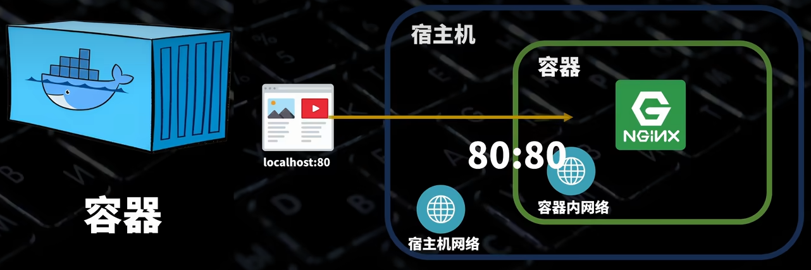
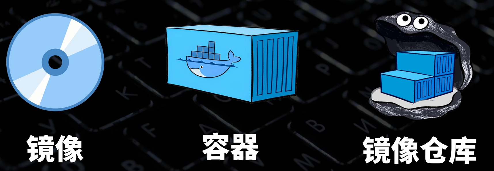

# Overview

简单来说就是用**容器化技术**，给应用程序封装独立的运行环境

## 核心概念

### 宿主机
运行容器的计算机

### Docker 容器与虚拟机区别
- **Docker 容器**：容器之间共用一个系统内核
- **虚拟机**：每个虚拟机都包含一个操作系统的完整内核

### 镜像
容器的模版，可以把镜像当做是软件安装包，安装出来的软件即容器。

**镜像与容器的关系**：可以视为现实中的模具和糕点
- 一个模具可以做出很多糕点
- 模具也可以分享（上传到 Docker 镜像仓库）给其他人使用

## 相关资源

**官方镜像仓库**：[Docker Hub](https://hub.docker.com/)

## 架构图

