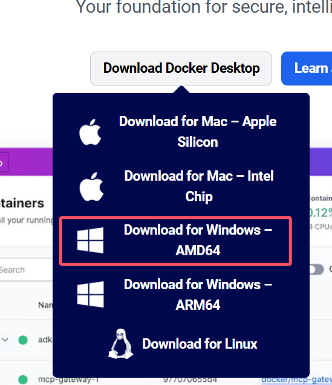

# Install

## Linux

### 方法一：官方一键安装

官方安装脚本地址：https://get.docker.com/

```bash
curl -fsSL https://get.docker.com -o install-docker.sh
sudo sh install-docker.sh
```

### 方法二：使用国内镜像源

如果访问不了官方安装脚本，可以根据自己服务器的情况使用国内镜像源，以阿里云服务器为例：

```bash
# 1. 安装必要工具
sudo yum install -y yum-utils device-mapper-persistent-data lvm2

# 2. 添加 Docker 阿里云镜像源
sudo yum-config-manager --add-repo https://mirrors.aliyun.com/docker-ce/linux/centos/docker-ce.repo

# 3. 更新缓存
sudo yum makecache fast

# 4. 安装 Docker
sudo yum install -y docker-ce docker-ce-cli containerd.io

# 5. 启动 Docker 服务
sudo systemctl start docker
sudo systemctl enable docker

# 6. 验证安装
docker --version
```

## Windows/Mac

访问 Docker 官网下载 Docker Desktop：https://www.docker.com/

下载对应平台的安装包并按照向导完成安装。

