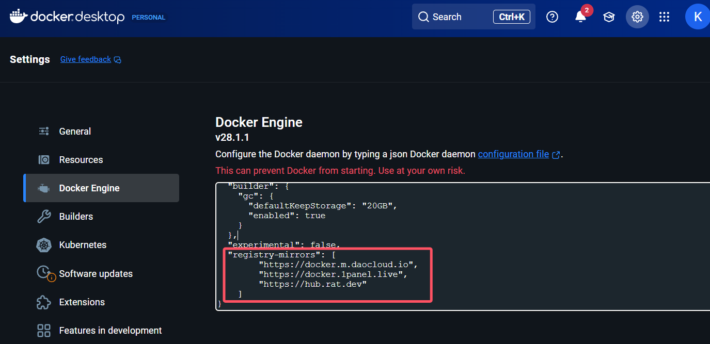

# Docker 镜像管理

## 下载镜像

### 查找镜像

可以到 Docker Hub 官方仓库查找所需的镜像：https://hub.docker.com/

### 下载命令

```bash
docker pull docker.io/library/nginx:latest
docker pull docker.n8n.io/n8nio/n8n
```

**镜像地址格式说明：**
- `docker.io`: 仓库地址（registry），这里 `docker.io` 是官方仓库可以省略，`docker.n8n.io` 是 n8n 私有仓库
- `library`: 命名空间（作者名），因为各个仓库每个人都可以上传同名镜像，需要命名空间区分
- `nginx:latest`: 标签（tag），表示版本号

### 配置国内镜像加速

国内环境建议先配置镜像站以提高下载速度：

#### Linux 环境配置

```bash
# 编辑 Docker 配置文件
sudo vi /etc/docker/daemon.json

# 添加以下内容：
{
    "registry-mirrors": [
        "https://docker.m.daocloud.io",
        "https://docker.1panel.live",
        "https://hub.rat.dev"
    ]
}

# 保存后重启 Docker 服务
sudo service docker restart

# 现在可以正常拉取镜像了
sudo docker pull nginx
```

#### Windows/Mac Docker Desktop 配置



## 镜像管理命令

### 查看本地镜像

```bash
# 查看所有本地镜像
sudo docker images
```

### 删除镜像

```bash
# 删除指定镜像
sudo docker rmi [image_id]
```

### 跨平台镜像拉取

```bash
# 拉取特定 CPU 架构的镜像
# 支持架构：linux/amd64、linux/arm64 等
# 通常不需要指定，Docker 会自动选择适合宿主机的架构
sudo docker pull --platform=xxxx nginx
```
