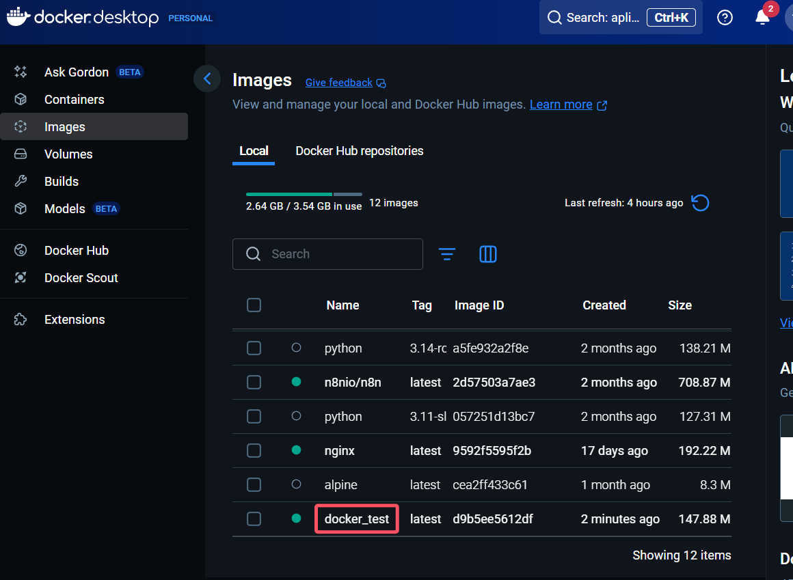
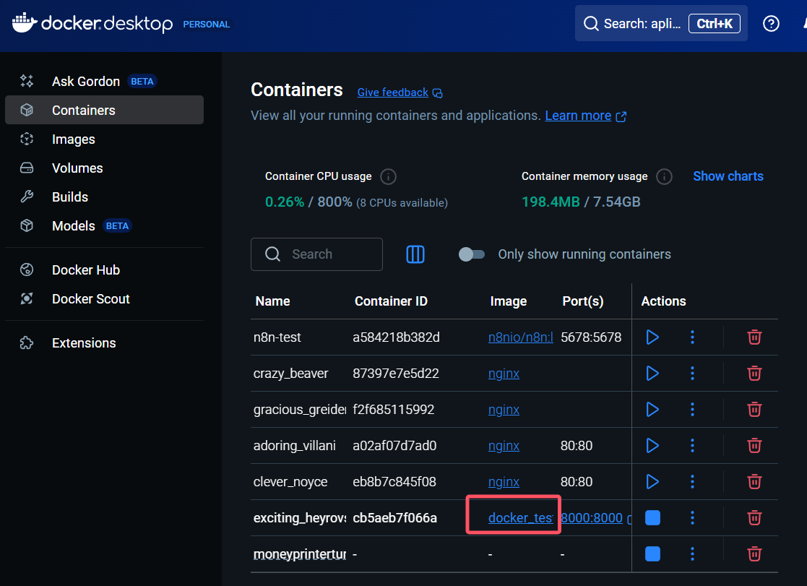
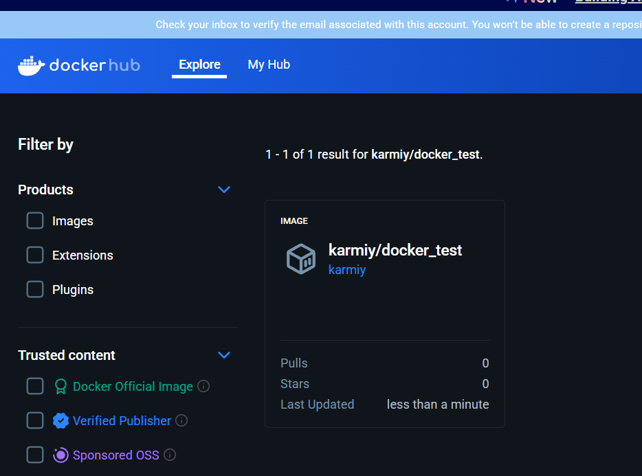

# Dockerfile

容器是糕点，镜像是模具，而 Dockerfile 可以理解为制作模具的图纸，里面详细列表镜像是如何制作的

---

## 创建 Dockerfile

创建一个运行在本地 8000 端口的接口，代码见 [Demo](../demo/main.py)

### 构建步骤

构建过程分为几个步骤：

1. **安装 python 环境**
2. **安装依赖** `pip install -r requirement.txt`
3. **启动项目** `python ./main.py`

### Dockerfile 编写

根据这个流程创建 Dockerfile 文件：

```dockerfile
# 固定 FROM 开头，选择一个基础镜像，即我们的镜像从哪个镜像的基础构建而来
# https://hub.docker.com/_/python 找个 tag，这里找 3.13-slim，里面内置 python 3.13
FROM python:3.13-slim

# WORKDIR 类似 cd，切换到镜像内的一个目录，作为工作目录
WORKDIR /app

# 把代码文件拷贝到镜像内的工作目录
# 第一个 . 表示我这台电脑的当前目录
# 第二个 . 表示镜像内的当前工作目录
COPY . .

RUN pip install -r requirements.txt

# 镜像提供服务的端口
# EXPOSE 不是强制的，主要是给使用镜像的人一个提示
EXPOSE 8000

# CMD 是容器运行时的默认启动命令
# 一个 Dockerfile 只能有一个 CMD
# 还有一个类似的命令是 ENTRYPOINT，优先级更好不容易被覆盖
CMD ["python3", "main.py"]
```

---

## 构建

在当前项目目录执行构建命令：

```bash
# 在当前项目目录执行，如这里在 demo 目录
# -t 是 -tag，指定名称和标签
sudo docker build -t docker_test .

# 名称后也可以加 :version，没写默认 latest
sudo docker build -t docker_test:1.0.0 .
```

### 网络问题解决

要是因为网络问题拉不到基础镜像构建失败，可以参考 [第二节](./02-env-question.md) 配置 `registry-mirrors`：

```json
{
    "registry-mirrors": [
        "https://docker.m.daocloud.io",
        "https://docker.1panel.live",
        "https://hub.rat.dev"
    ]
}
```

### 启动容器

构建后启动即可访问 http://localhost:8000/

```bash
sudo docker run -d -p 8000:8000 docker_test
```

### 验证结果

在 Docker Desktop 里可以看到构建的镜像和启动的容器：




---

## 发布 Docker Hub

### 登录 Docker Hub

```bash
# 没登录会弹出验证码和网站，登录后会提示 Login Succeeded
sudo docker login
```

### 构建带用户名的镜像

```bash
# 重新打个带用户名的镜像
sudo docker build -t karmiy/docker_test .
```

### 发布镜像

```bash
# 发布
sudo docker push karmiy/docker_test
```

### 验证发布

发布后就可以在 Docker Hub 上找到自己的镜像：

