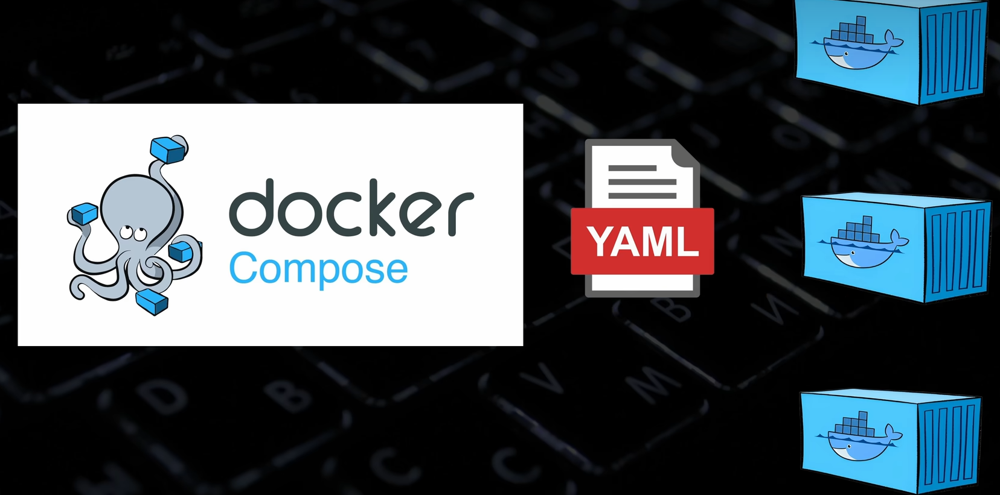

# Docker Compose

一个完整的应用可能是很多部分组成的，如前端、后端、DB 数据库

---

## 问题分析

### 单容器架构的问题

如果把这些模块都打包在一起构建成一个容器，就会存在依赖，如：

- **后端出现故障**，可能会导致整个容器出问题
- **可伸缩性差**，想给系统扩容，只能把整个大容器复制一份，做不到某个模块的精准扩容


### 多容器架构的优势

最佳实现是把每个模块打包成独立的容器


### 多容器架构的挑战

但这样增加了很多成本：

- **创建多个容器要执行很多 `docker run`**
- **得把它们之前的网络配好**

---

## Docker Compose 简介

这时就需要 **Docker Compose**，使用 `docker-compose.yaml` 管理多个容器之间的关系

> **注意：** Docker Compose 是个轻量级的容器编排技术，适合个人使用，对于企业级的服务器集群，大规模的容器编排需求，就需要用 K8s（Kubernetes）



---

## 核心能力

### 网络管理
- Docker 会为每一个 compose 文件都自动创建一个子网（这个在 [B 站爬爬虾视频 Docker 网络小节](https://www.bilibili.com/video/BV1THKyzBER6/?spm_id_from=333.1365.list.card_archive.click&vd_source=6c7c44de964f9f9c09280dc875cab53d) 有提到）
- **同一个 compose 定义的容器都会自动加入同一个子网**

### 依赖管理
- 自定义容器启动顺序，在配置文件中指定某些文件配置 `depends_on` 字段
- 表示依赖其他哪些容器，那么这些容器会提前启动

---

## 使用方法

### 创建配置文件

先把想做的事告诉 AI，让 AI 帮你生成 `docker-compose.yaml` 文件，示例：

```yaml
version: '3'
services:
  web:
    build: .
    ports:
      - "8000:8000"
  db:
    image: mongo
    ports:
      - "27017:27017"
```

### 常用命令

#### 启动服务

```bash
# 读取启动当前目录下 yaml 配置文件
sudo docker compose up -d

# 如果定义的不是 docker-compose.yaml 这个标准文件名，需要 -f 指定
sudo docker compose -f test.yaml up -d 
```

#### 停止服务

```bash
# 停止
sudo docker compose stop

# 启动
sudo docker compose start

# 停止并删除容器
sudo docker compose down
```

