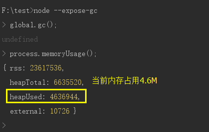
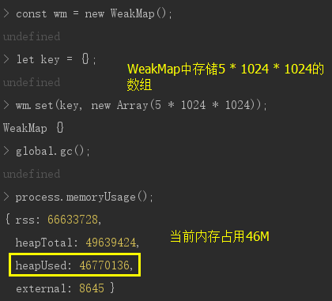
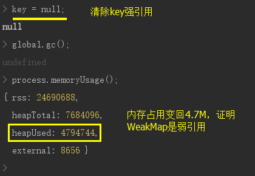

## Symbol

ES6新增的第6种基本数据类型

ES5基础数据类型： undefined、number、string、boolean、null

ES6引入Symbol作为一种新的原始数据类型，表示**独一无二**的值，主要是为了防止属性名冲突

    // 示例一
    const a = Symbol();
    const b = Symbol();
    console.log(a === b); // false，是独立无二的
    
    // 示例二
    console.log(Symbol()); // Symbol()，打印不出来细致内容
    
    // 示例三（typeof）
    console.log(typeof Symbol()); // 'symbol'
    
    // 示例四
    const a = Symbol('karmiy'); // 给Symbol数据加描述
    console.log(a); // Symbol(karmiy)
    
    // 示例五
    const a = Symbol('karmiy');
    a.toString(); // 'Symbol(karmiy)'
    Boolean(a); // true，Symbol在if判断也是true
    Number(a); // 报错：TypeError: Cannot convert a Symbol value to a number
    
    // 示例六
    const a = Symbol('karmiy');
    const obj = {
        [a]: 'Symbol数据',
    }
    console.log(obj); // {Symbol(karmiy): "Symbol数据"}
    console.log(obj[Symbol('karmiy')]); // undefined，Symbol是独一无二的
    console.log(obj[a]); // 'Symbol数据'
    console.log(Object.keys(obj)); // []，Symbol键无法被枚举出来
    
        注：Symbol无法被for...in、for...of、Object.keys()、Object.getOwnPropertyNames()、JSON.stringify()获取
        
    // 示例七（getOwnPropertySymbols）
    const a = Symbol('karmiy');
    const obj = {
        [a]: 'Symbol数据',
    }
    const symbols = Object.getOwnPropertySymbols(obj); // [Symbol(karmiy)]
    console.log(symbols[0] === a); // true
    
    // 示例八（Symbol.for: 用于重复使用一个Symbol值）
    const a = Symbol.for('karmiy');
    const b = Symbol.for('karmiy');
    const c = Symbol('karmiy');
    console.log(a === b); // true，会先去找有没有叫'karmiy'的Symbol，有则取无则建
    console.log(a === c); // false
    
    // 示例九（Symbol.keyFor）
    const a = Symbol.for('karmiy');
    console.log(Symbol.keyFor(a)); // 'karmiy'
    
    const b = Symbol('karmiy');
    console.log(Symbol.keyFor(b)); // undefined
    
    // 其他
    Symbol提供了11种内置对象：
    Symbol.hasInstance
    Symbol.isConcatSpreadable
    Symbol.species
    Symbol.match
    Symbol.replace
    Symbol.search
    Symbol.split
    Symbol.iterator
    Symbol.toPrimitive
    Symbol.toStringTag
    Symbol.unscopables
    
    此处不多做介绍，用的不是很多
    
## Set、Map

ES6新增数据结构

### Set

    // 示例一
    const set = new Set([1, 2, 3, 4]);
    console.log(set); // Set(4) {1, 2, 3, 4}
    console.log(typeof set); // 'object'
    
    // 示例二（不会有重复的值）
    const set = new Set([1, 2, 3, 3, 4, 4]);
    console.log([...set]); // [1, 2, 3, 4]
    
        注：常用于数组去重，JavaScript章的Array常用API有提到，是性能最好的方式之一
        
    // 示例三（size获取长度）
    const set = new Set([1, 2, 3, 3, 4, 4]);
    console.log(set.size); // 4
    
    // 示例四（add、delete、has、clear）
    const arr = [1]
    const set = new Set()
    set.add(1);
    set.add(1);
    set.add(2);
    set.add(NaN);
    set.add(NaN);
    console.log([...set]); // [1, 2, NaN]，也可以检测NaN
    
    set.delete(1);
    set.delete(NaN);
    console.log([...set]); // [NaN]
    
    set.has(2); // true
    
    set.clear();
    console.log([...set]); // []
    
    cosnole.log(arr); // [1]，Set操作不影响原数组
    
    // 示例五（keys、values、entries、forEach）
    keys、values、entries返回都是Iterator对象
    
    const set = new Set(['a', 'b', 'c']);
    for(let item of set.keys()) {
        console.log(item); // 依次输出'a'、'b'、'c'
    }
    for(let item of set.values()) {
        console.log(item); // 依次输出'a'、'b'、'c'
    }
    for(let item of set.entries()) {
        console.log(item); // 依次输出['a', 'a']、['b', 'b']、['c', 'c']
    }
    set.forEach((item, key) => {
        console.log(item, key); // 依次输出'a' 'a'、 'b' 'b'、 'c' 'c'
    })
    
    // 示例六（解构赋值）
    const set = new Set(['a', 'b', 'c', 'd']);
    const [x, y, ...z] = set;
    console.log(x); // 'a'
    console.log(y); // 'c'
    console.log(z); // ['c', 'd']
    
    // 示例七（Interator的next取值）
    const set = new Set(['a', 'b', 'c', 'd']);
    const keys = set.keys();
    keys.next(); // {value: "a", done: false}
    keys.next(); // {value: "b", done: false}
    keys.next(); // {value: "c", done: false}
    keys.next(); // {value: "d", done: false}
    keys.next(); // {value: undefined, done: true}
    
### Map

    // 示例一
    const o = {id: 1};
    const map = new Map([[o, 100], ['name', 'karmiy']]); // 以二维数组为参数，可以以对象作为键
    console.log(map); // Map(2) {{id: 1} => 100, "name" => "karmiy"}
    
        注：键值对形式、键值唯一、任何数据类型都能作为键值
        
    // 示例二（set、get、size、has、delete、clear）
    const map = new Map();
    map.set('id', 100);
    map.set('name', 'karmiy');
    console.log(map.get('id')); // 100
    console.log(map.size); // 1
    
    console.log(map.has('name')); // true
    
    map.delete('name');
    console.log([...map]); // [['id', 100], ['name', 'karmiy']]
    
    map.clear();
    console.log([...map]); // []
    
    // 示例三（keys、values、entries、forEach）
    keys、values、entries返回都是Iterator对象
    const map = new Map([['id', 100], ['name', 'karmiy']]);
    for(let item of map.keys()) {
        console.log(item); // 依次输出'id'、'name'
    }
    for(let item of map.values()) {
        console.log(item); // 依次输出100、'karmiy'
    }
    for(let item of map.entries()) {
        console.log(item); // 依次输出['id', 100]、['name', 'karmiy']
    }
    map.forEach((value, key) => {
        console.log(value, key); // 依次输出100 'id'、'karmiy' 'name'
    })
    
    // 示例四（Map转对象）
    function MapToObj(map) {
        const obj = Object.create(null);
        for(let [k, v] of map) {
            obj[k] = v;
        }
        return obj;
    }
    
    // 示例五（Interator的next取值）
    const map = new Map([['id', 100], ['name', 'karmiy']]);
    const keys = map.keys();
    keys.next(); // {value: "id", done: false}
    keys.next(); // {value: "name", done: false}
    keys.next(); // {value: undefined, done: true}
    
    
## WeakMap、WeakSet

ES6新增WeakMap、WeakSet来专门存储弱引用键

可以当做是特殊的Map和Set

这里我们只以WeakMap为例，因为WeakSet机制类似

### 特性

**WeakMap有以下特性：**

- 只接受对象作为键名

``````
    // 示例
    const wm = new WeakMap();
    wm.set({id: 1}, 1); // ok
    wm.set('some', 2); // 报错，只能以对象作为键
``````

- 键所引用的对象是弱引用
``````
    // 说明
    我们平时创建的对象，一般都是强引用
    强引用指的是，JavaScript垃圾回收机制不会直接回收，需要我们赋值为null
    
    let key = [1, 2];
    const arr = [key, 3];
    
    当前对[1, 2]的强引用有2个
    这时我们操作:
    key = null，则会去掉key对这个对象的强引用
    但是arr对这个对象的强引用还在，只有当arr[0] = null时，[1, 2]才会被回收
    
    而WeakMap是弱引用
    let key = [1, 2];
    const wm = new WeakMap();
    wm.set(key, 1);
    
    当前对[1, 2]的强引用只有1个
    这时我们操作:
    key = null，则会去掉key对这个对象的强引用
    因为WeakMap对key是弱引用，当只剩下弱引用时，下次垃圾回收机制执行时，该引用对象就会被回收
    
    // 注
    例如上述WeakMap的操作，我们操作key = null时，该对象的引用之后会被回收，且WeakMap里对应的键值也会自动消失，不用手动删除
    不过我们在浏览器控制台测试，在引用被回收后，重新打印wm，可能还是会显示应该已经消失的键值，有时又会成功自动清除，这可能与浏览器有关，不再深究，了解会自动清除即可
    想要真实的测试是否真的自动清除了，可以在node环境中执行测试:
    
    node --expose-gc // 1、表示允许手动执行垃圾回收机制
    
    global.gc(); // 2、手动执行一次垃圾回收
    process.memoryUsage(); // 3、查看内存占用的初始状态，输出的heapUsed是内存占用
    
    const wm = new WeakMap();
    let key = {};
    wm.set(key, new Array(5 * 1024 * 1024)); // 4、在WeakMap中存储一个5 * 1024 * 1024的数组
    global.gc();
    process.memoryUsage();
    
    key = null; // 5、去除key强引用
    global.gc();
    process.memoryUsage();
    
    
``````







### 方法

WeakMap没有清除clear方法，只提供了:

- get

- set

- has

- delete

这4种方法，与Map用法相同，此处不示例

### 应用场景

    // 1、保存DOM对象数据
    <div class='d1'>...</div>
    
    const wm = new WeakMap();
    const el = document.querySelector(".d1");
    wm.set(el, "d1");
    
    el.parentNode.removeChild(el);
    el = null; // 这样下次垃圾回收机制执行时，对div.d1的引用就会被回收，且不需要去wm中手动delete，会自动清除
    
    // 2、实现ES6 Class的私有变量
    const F = (function() {
        const privateMap = new WeakMap();
        return class {
            constructor(id) {
                // 做到无法直接实例.id和.code获取变量，私有化
                privateMap.set(this, {id, code: '999'});
            }
            getId() {
                return privateMap.get(this).id;
            }
        }
    }());
    const f1 = new F('70');
    const f2 = new F('80');
    f1.getId(); // '70'
    f2.getId(); // '80'
    
        // 好处
        1、较好的实现了私有变量
        2、实例销毁时，由于WeakMap弱引用的特性，也会自动清除

