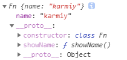
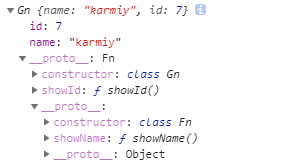

## fetch

Fetch的诞生，主要用来替代传统的Ajax（XMLHttpRequest）

Fetch API是基于Promise设计的，旧版浏览器不支持Promise，需要使用polyfill [es6-promise](https://github.com/stefanpenner/es6-promise)

Fetch当前的兼容性、局限性问题较大，此节只稍作介绍
    
```js
// 基本用法
fetch(url)
.then(response => response.json()) // 返回的response对象有json方法转json对象
.then(data => console.log(data))
.catch(err => console.log(err));

// 参数2
fetch(url, {
    method: 'POST',
    headers: {
        'Accept': 'application/json',
        'Content-Type': 'application/json',
    },
    body: JSON.stringify({
        name: 'karmiy',
        id: 7,
    })
})
```
    
兼容性问题：

```js
原生兼容性不高，但是可以引入这些polyfill支持到IE8+：
1、引入ES5的polyfill: es5-shim、es5-sham
2、引入Promise的polyfill：es6-promise
3、引入fetch探测库：fetch-detector
4、引入fetch的polyfill：fetch-ie8
5、可选：如果使用jsonp，引入fetch-jsonp
6、可选：开启Babel的runtime模式，使用async/await
```
    
其他问题：

Fetch没有自带的超时中断、取消、拦截器等功能，需要自主封装

可参考：[也许你对 Fetch 了解得不是那么多](https://juejin.im/post/5c2c36626fb9a049b506eb94)

## Class

ES6 引入了class（类），只是个语法糖，让JavaScript的面向对象编程变得更加简单和易于理解

**注：内部默认是严格模式**

### ES5的类定义

```js
function Fn(name) {
    this.name = name;
}
Fn.prototype.showName = function() {
    console.log(this.name);
}

存在的问题：
类的定义利用的函数的function，不直观
类和原型拆开写，不像一个整体
```
    
### Class类定义
    
#### constructor构造函数

ES6 class的constructor构造函数与ES5函数内部this.XX相同，创建示例上的属性值

```js
// 基本用法
class Fn {
    constructor(name) {
        this.name = name;
    }
}
const f = new Fn('karmiy');
console.log(f.name); // 'karmiy'

    注：如果不写constructor，默认自动添加为
        class Fn {
            constructor(name) {}
        }

// 关于constructor返回的对象（默认return this）
class Fn {
    constructor(name) {
        this.name = name;
        return Object.create(null); // 可以改变生成实例，但是一般不这样做
    }
}
const f = new Fn('karmiy');
console.log(f); // {}
console.log(f instanceof Fn); // false
```
    
#### 原型

ES6 class里，除了constructor，其他定义的方法，都会被挂载到prototype原型上

```js
// 基本用法
class Fn {
    constructor(name) {
        this.name = name;
    }
    showName() {
        console.log(this.name);
    }
}
const f = new Fn('karmiy');
f.showName(); // 'karmiy'
console.log(f.showName === Fn.prototype.showName); // true

// 方法名可以使用表达式
const property = 'showName';
class Fn {
    constructor(name) {
        this.name = name;
    }
    [property]() {
        console.log(this.name);
    }
}
const f = new Fn('karmiy');
f.showName(); // 'karmiy'

注：
    ES6类所有方法都是定义在原型prototype上的，即：
    class Fn {
        constructor() {...}
        showName() {...}
        showId() {...}
    }
    相当于
    Fn.prototype = {
        constructor() {...},
        showName() {...},
        showId() {...},
    }
```
 
#### 变量提升、name
    
```js
// class类不存在变量提升
new Fn(); // 报错
class Fn{}

// class类的name属性
class Fn {}
console.log(Fn.name); // 'Fn'
```
    


可以看到：表现形式与ES5相同

### 枚举性

```js
// ES5 function类
function Fn(name) {
    this.name = name;
}
Fn.prototype.showName = function() {
    console.log(this.name);
}
const f = new Fn('karmiy');
for(let key in f) {
    console.log(key); // 输出'name'、'showName'
}
会输出原型上的属性
如果不想输出原型上的属性，需要过滤：
for(let key in f) {
    f.hasOwnProperty(key) && console.log(key); // 输出'name'
}

// ES6 class类
class Fn {
    constructor(name) {
        this.name = name;
    }
    showName() {
        console.log(this.name);
    }
}
const f = new Fn('karmiy');
for(let key in f) {
    console.log(key); // 输出'name'，不会输出原型上的属性
}
console.log(Object.keys(f)); // ['name']
console.log(Object.entries(f)); // [['name', 'karmiy']]

注：for in、Object.keys、Object.entries都不能遍历出原型上的属性
```
    
### Class表达式

```js
// 定义方式
class Fn {
    ...
}

const Fn = class {
    ...
}

// 自执行（当一个类只用一次时可以自执行）
const f = new class {
    constructor() {
        this.name = 'k';
    }
    showName() {
        console.log(this.name);
    }
}();
console.log(f.name); // 'k'
```
    
### 关于原型上的非函数式属性
    
```js
// 原型上错误的属性定义方式
class Fn {
    code: 20;
}
const f = new Fn(); // 报错

// ES6 class希望原型上的属性都是函数式操作:
class Fn {
    code() {
        return 20;
    }
}
const f = new Fn();
console.log(f.code()); // 20

// 倘若就是希望原型上可以定义非函数属性，可以利用prototype
class Fn {
}
Fn.prototype.code = 20;
const f = new Fn();
console.log(f.code); // 20
```
    
### class静态方法
    
```js
// static关键字
class Fn {
    static code() { // static关键字代表静态方法，只有Fn类本身可以调用Fn.code()，实例this.code()无法调用
        return 20;
    }
    constructor(name) {
        this.name = name;
    }
    show() {
        return {
            code: Fn.code(), // Fn类本身才可以调用
            name: this.name,
        }
    }
}
const f = new Fn('karmiy');
console.log(f.show()); // {code: 20, name: 'karmiy'}

// 静态方法的this指向
class Fn {
    static code() {
        console.log(this);
    }
}
Fn.code(); // 输出class Fn，static方法的this指向类本身

// 静态属性（static只能是静态方法），只能通过类名.去定义
class Fn {}
Fn.x = 1;
```
    
### class的getter、setter
    
```js
// get、set关键词相当于Object.defineProperty的get、set监听器，在属性名被获取或赋值时触发
class Fn {
    constructor() {
        this.store = [1, 2, 3];
    }
    get _store() {
        return this.store;
    }
    set _store(value) {
        this.store.push(value);
    }
}
const f = new Fn();
console.log(f._store); // [1, 2, 3]
f._store = 4;
console.log(f._store); // [1, 2, 3, 4]
```
    
### class类的继承
    
```js
// class使用extends/super来实现类的继承
class Fn {
    constructor(name) {
        this.name = name;
    }
    showName() {
        console.log(this.name);
    }
}
class Gn extends Fn {
    constructor(id, name) {
        super(name); // 相当于Fn.prototype.constructor.call(this, name);
        this.id = id;
    }
    showId() {
        console.log(this.id);
    }
}
const g = new Gn(7, 'karmiy');
console.log(g.id); // 7
console.log(g.name); // 'karmiy'
g.showId(); // 7
g.showName(); // 'karmiy'
```
    


```js
// 关于super的位置
class Fn {
    constructor(name) {
        this.name = name;
    }
    getCode() {
        return 20;
    }
}
class Gn extends Fn {
    constructor(name) {
        this.id = this.getCode() + 80;
        super(name);
    }
}
const g = new Gn('karmiy'); // 报错，提示调用this前需要先调用super
console.log(g.id); 

    注：this的使用一定要在super之后
    
    
// 当遇到属性同名
class Fn {
    constructor() {
        this.x = 20;
    }
    getCode() {
        return 20;
    }
}
class Gn extends Fn {
    constructor() {
        super();
        this.x = 30;
    }
    getCode() {
        return 30;
    }
}
const g = new Gn();
console.log(g.x); // 30，同名属性取自身
console.log(g.getCode()); // 30，同名方法取自身


// 获取父类的方法
class Fn {
    constructor() {
        this.name = 'karmiy';
    }
    x() {
        return 30;
    }
}
class Gn extends Fn {
    constructor() {
        super();
        this._x = super.x(); // 通过super调用父类方法
        this._name = super.name;
    }
}
const g = new Gn();
console.log(g._x); // 30
console.log(g._name); // undefine

    为什么无法根据super.name取到Fn的name？
        可以将super假想成Fn.prototype原型（其实没那么简单，只是可以这样理解），
        而name属性是在Fn的实例上，而不是在Fn的原型上，所以Fn的constructor上的
        name属性是拿不到的，只能拿到原型上的x()
        
    注：super这个关键字不支持console打印
    
// 关于static静态方法的继承
class Fn {
    static code() {
        return 20;
    }
    getCodePlus() {
        return 30;
    }
}
class Gn extends Fn{
    constructor() {
        super();
    }
    static num() {
        return super.code() + 10; // 可以在子类的static方法里通过super调用父类的静态方法
    }
}
const g = new Gn();
console.log(Gn.code()); // 20，可以继承父类的static方法
console.log(Gn.num()); // 30;

注：
    1、父类的static方法，可以在子类的static方法里通过super调用，但是无法在子类的constructor、原型方法里调用，即：
        class Fn {
            static code() {
                return 20;
            }
        }
        class Gn extends Fn{
            constructor() {
                super();
                console.log(super.code()); // 错误
            }
            static Num() {
                console.log(super.code()); // 正确
            }
            show() {
                console.log(super.code()); // 错误
            }
        }
    2、父类原型的方法，可以在子类的constructor、原型方法上通过super调用，但是无法在子类的static方法里调用，即：
        
        class Fn {
            code() {
                return 20;
            }
        }
        class Gn extends Fn{
            constructor() {
                super();
                console.log(super.code()); // 正确
            }
            static Num() {
                console.log(super.code()); // 错误
            }
            show() {
                console.log(super.code()); // 正确
            }
        }
```
            
### 关于私有属性

```js
// ES5类的私有属性
function Fn(name) {
    this.name = name;
    const code = 20;
    this.getCode = () => code;
}
const f = new Fn('karmiy');
console.log(f.code); // undefined，私有属性，示例获取不到
console.log(f.getCode()); // 20，可以利用实例的方法提供途径获取


// ES6 class类的私有属性
class Fn {
    constructor(name) {
        this.name = name;
        const code = 20;
    }
    getCode() {
        // 这里拿不到code
    }
}

解决：没有非常优雅的解决方法，如果开发环境是ES模块，可以使用Symbol来解决
const a = Symbol('a');
export default class Fn {
    // 私有方法
    [a]() {
        return 20;
    }
    // 共有方法
    getCode() {
        return this[a]();
    }
}

注：个人感觉私有变量的实现还是WeakMap的做法更优雅
```
    
## BigInt

ES10新增第7种基本数据类型BigInt

String、Number、Boolean、Null、Undefined、Symbol、BigInt
    
```js
// JavaScript的Number，超过16位会出现精度问题
const k = 12345678901234567;
console.log(k); // 12345678901234568，出现精度问题 

// BigInt表示任意精度整数

const num = 12345678901234567890n;
console.log(typeof num); // 'bigint'
console.log(num); // 12345678901234567890n
```
