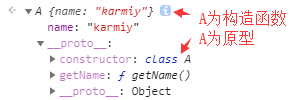
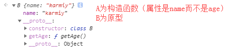

## 属性获取方法区分

获取属性的方法有很多：

for in、Object.keys、Object.getOwnPropertyNames、Object.getOwnPropertySymbols、Reflect.ownKeys、in操作符、JSON.stringify

这里我们将对这些方法进行区分
    
```js
// 测试源数据
const symbol = Symbol();
const obj = Object.defineProperties({}, {
    id: {
        enumerable: true,
        value: 7.
    },
    level: {
        enumerable: false, // 不可枚举
        value: 30,
    },
    [symbol]: {
        enumerable: true,
        value: 0,
    }
})
obj.__proto__ = {
    code: '20',
    show() {}
}

// 1、for ... in
for(let key in obj) {
    console.log(key);
}
// 输出'id'、'code'、'show'

// 2、Object.keys
Object.keys(obj); // ['id']

// 3、Object.getOwnPropertyNames
Object.getOwnPropertyNames(obj); // ['id', 'level']

// 4、Object.getOwnPropertySymbols
Object.getOwnPropertySymbols(obj); // [Symbol()]

// 5、Reflect.ownKeys
Reflect.ownKeys(obj); // ['id', 'level', Symbol()]

// 6、in操作符
console.log('id' in obj); // true
console.log('level' in obj); // true
console.log('Symbol()' in obj); // true
console.log('code' in obj); // true
console.log('show' in obj); // true

// 7、JSON.stringify
JSON.stringify(obj); // '{"id": 7}'
```
    
总结：

| 方法名 | 对象本身属性 | 原型属性 | 不可枚举 | Symbol |
| ------ | ------ | ------ | ------ | ------ |
| for ... in | yes | yes | no | no |
| Object.keys | yes | no | no | no |
| Object.getOwnPropertyNames | yes | no | yes | no |
| Object.getOwnPropertySymbols | no | no | no | yes |
| Reflect.ownKeys | yes | no | yes | yes |
| in | yes | yes | yes | yes |
| JSON.stringify | yes | no | no | no |


## Reflect

ES6新增Reflect全局对象

Reflect对象上有13个方法，基本都是从Object上搬过来的

为什么要添加这样的一个全局对象？

- 一些方法如apply，并不是专属为Object设计，却绑在了Object上，会产生违和感。提供新的Reflect对象来挂载这些方法，看起来更合适

- 用单一的全局对象去存储这些方法，不污染全局

- 将一些命令式操作如delete、in等使用函数替代，代码更好维护，更容易向下兼容，避免出现更多的保留字

```js
// 1、Reflect.apply(target, thisArgument, argumentsList)
说明：等同于Function.prototype.apply.call
参数：目标函数、this指向、apply的数组参数

const arr = [1, 2, 3, 4];

Reflect.apply(Math.max, null, arr); // 4


// 2、Reflect.construct(target, argumentsList[, newTarget])
说明：等同于new target(...)，提供不使用new来调用构造函数的方式
参数：构造函数、构造函数参数(伪)数组、原型的构造函数。
        
class A {
    constructor(name) {
        this.name = name;
    }
    getName() {
        console.log(this.name);
    }
}
class B {
    constructor(age) {
        this.age = age || 18;
    }
    getAge() {
        console.log(this.age);
    }
}
const a = Reflect.construct(A, ['karmiy']);
const b = Reflect.construct(A, ['karmiy'], B);
    
```





```js
// 3、Reflect.defineProperty(target, propertyKey, attributes)
说明：等同于Object.defineProperty，不过差别在于，Object的这个方法，
        如果定义失败，会报错，而这个返回值是个boolean，false表示定义失败
参数：要定义的对象（非对象会报错）、定义或修改的属性名、属性的配置

const obj = {};
const r1 = Reflect.defineProperty(obj, 'name', {
    configurable: false, // 不可修改
    value: 'karmiy'
});
console.log(obj); // {name: 'karmiy'}
console.log(r1); // true

const r2 = Reflect.defineProperty(obj, 'name', {
    value: 'karloy'
});
console.log(obj); // {name: 'karmiy'}
console.log(r2); // false，因为configurable设置了不可修改


// 4、Reflect.deleteProperty(target, propertyKey)
说明：等同于delete操作符，删除成功true，否则false
参数：操作的属性（非对象会报错）、删除的属性名

const obj = {};
Reflect.defineProperty(obj, 'name', {
    configurable: false, // 不可修改
    value: 'karmiy'
});

Reflect.deleteProperty(obj, 'name'); // false


// 5、Reflect.get(target, propertyKey[, receiver])
说明：用来读取一个对象的属性，相当于target[propertyKey]
参数：目标对象（非对象会报错）、属性名、该属性getter函数里的this指向

const obj = {
    get name() {
        console.log(this);
        return 'karmiy';
    }
}
Reflect.get(obj, 'name'); // get中输出{}，返回'karmiy'
Reflect.get(obj, 'name', {id: 1}); // get中输出{id: 1}，返回'karmiy'


// 6、Reflect.getOwnPropertyDescriptor(target, propertyKey)
说明：等同于Object.getOwnPropertyDescriptor，如果这个属性存在描述符则返回，否则返回undefined
参数：目标对象（非对象会报错）、属性名

const obj = {};
Reflect.defineProperty(obj, 'name', {
    configurable: true,
    enumerable: true,
    writable: true,
    value: 'karmiy'
});

const descriptor = Reflect.getOwnPropertyDescriptor(obj, 'name');
console.log(descriptor);
// { configurable: true, enumerable: true, value: "karmiy", writable: true }


7、Reflect.getPrototypeOf(target)
说明：等同于Object.getPrototypeOf
参数：目标对象（非对象会报错）

class A {}
const a = new A();
Reflect.getPrototypeOf(a); // {constructor: class A, __proto__: Object}


8、Reflect.has(target, propertyKey)
说明：等同于in操作符，检查对象上是否函数特定属性
参数：目标对象（非对象会报错）、属性名

class A {
    constructor() {
        this.x = 1;
    }
    y() {}
}
const a = new A();
console.log(Reflect.has(a, 'x')); // true 
console.log(Reflect.has(a, 'y')); // true


9、Reflect.isExtensible(target)
说明：等同于Object.isExtensible方法，判断对象是否是可扩展的，返回boolean
参数：目标对象（非对象会报错）

console.log(Reflect.isExtensible({})); // true
console.log(Reflect.isExtensible(Object.freeze({}))); // false


10、Reflect.ownKeys(target)
说明：等同于Object.getOwnPropertyNames(target) + Object.getOwnPropertySymbols(target)
参数：目标对象（非对象会报错）

const obj = {
    x: 1,
    [Symbol()]: 2,
}
Reflect.defineProperty(obj, 'name', {
    value: 'k',
    enumerable: false,
    configurable: false,
});
Reflect.ownKeys(obj); // ['x', 'name', Symbol()]


11、Reflect.preventExtensions(target)
说明：等同于Object.preventExtensions，阻止新属性添加到对象中
参数：目标对象（非对象会报错）

const obj = {
    x: 1,
}
Reflect.preventExtensions(obj);
obj.y = 2;
console.log(obj); // {x: 1}，y添加失败
console.log(Reflect.isExtensible(obj)); // false

12、Reflect.set(target, propertyKey, value[, receiver])
说明：用来设置一个对象的属性，返回boolean表示是否设置成功
参数：目标对象（非对象会报错）、属性名、属性值、该属性setter函数里的this指向

const obj = {
    fullName: 'karmiy',
    set name(value) {
        console.log(this);
        this.fullName = value;
    }
}

const r = Reflect.set(obj, 'name', 'karloy'); // set中输出{fullName: 'karmiy'}
console.log(r); // true，设置成功
console.log(obj); // {fullName: 'karloy'}
Reflect.set(obj, 'name', 'karloy', {id: 1}); // set中输出{id: 1}


13、Reflect.setPrototypeOf(target, prototype)
说明：等同于Object.setPrototypeOf，设置成功返回true，失败返回false
参数：目标对象（非对象会报错）、原型

const r1 = Reflect.setPrototypeOf({}, {id: 1});
console.log(r1); // true
const r2 = Reflect.setPrototypeOf(Object.freeze({}), {id: 1});
console.log(r2); // false
    
```