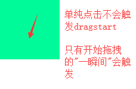
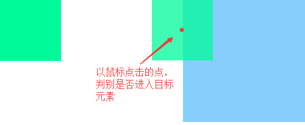
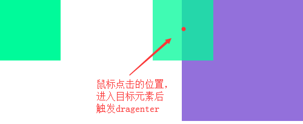
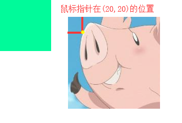
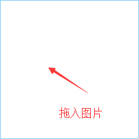
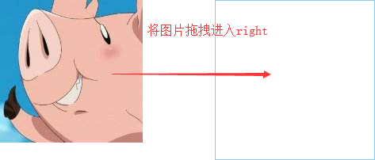
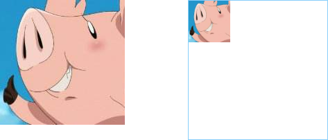

## 怎么理解H5

H5是一个统称，不等于HTML5。。

HTML5新标签、CSS3、跨平台、本地存储、音频视频、地理位置、canvas等等这些都属于H5

H5非常适合开发移动端：

- 离线缓存Storage API为H5开发移动端提供基础

- 自由嵌入音频视频，多媒体形式灵活

- 随时随地分享地理定位

- Canvas、SVG平台绘图能力

- 移动平台定制的表单元素（如input type=email）

- Drag、Drop拖拽等更好的交互

- 更低开发维护成本

- CSS3的视觉辅助

- 实时通讯

- 跨平台，兼容性强，支持多平台

## H5拖拽

在H5中，图片自带拖拽功能，而其他DOM元素可以设置draggable属性来实现拖拽

    

    
### JS的拖拽实现

    box.onmousedown = function(e) {
        e = e || event;
        const rect = this.getBoundingClientRect();
        const x = e.clientX - rect.left;
        const y = e.clientY - rect.top;
        document.onmousemove = function(e) {
            e = e || event;
            box.style.cssText = `left: ${e.clientX - x}px; top: ${e.clientY - y}px`;
        }
        document.onmouseup = function() {
            document.onmousedown = document.onmouseup = null;
        }
    }

### H5的拖拽实现

#### H5拖拽事件

> 拖拽元素的事件

| 事件名 | 描述 |
|----------|:-------------:|
| ondragstart |  拖拽的一瞬间触发 |
| ondrag |  拖拽前、拖拽结束之间，连续触发 |
| ondragend |  拖拽结束时触发 |

> 目标元素（拖拽元素被拖至的地方）的事件

| 事件名 | 描述 |
|----------|:-------------:|
| ondragenter |  进入目标元素时触发 |
| ondragover | 进入目标、离开目标之间，连续触发 |
| ondragleave |  离开目标元素时触发 |
| ondrop |  在目标元素上释放鼠标时触发 |

**注：**
默认状态下，一个元素不能放另一个元素上面，需要在ondragover事件里阻止默认事件

#### ondragstart
    
    // css
    #left {
        float: left;
        width: 100px;
        height: 100px;
        background-color: mediumspringgreen;
    }
    
    // dom
    

    
    // js
    const left = document.getElementById('left');
    left.ondragstart = function() {
        this.style.backgroundColor = 'blueviolet';
    }

#### ondrag

    left.ondrag = function() {
        // 拖拽中连续触发
        ...
    }
    

#### ondragend 
    
    // 在拖拽放开的瞬间触发
    left.ondragstart = function() {
        this.style.backgroundColor = 'pink';
    }
    
#### ondragenter

    // css
    #left {
        float: left;
        width: 100px;
        height: 100px;
        background-color: mediumspringgreen;
    }
    #right {
        float: right;
        width: 200px;
        height: 200px;
        background-color: lightskyblue;
    }
    
    // dom
    

    

    
    // js
    const right = document.getElementById('right');
    right.ondragenter = function() {
        this.style.backgroundColor = 'mediumpurple';
    }
    

（注：每次进入都会触发，即出来再进入依旧会触发）

#### ondragover

    right.ondragover = function() {
        // 在目标元素内连续触发
        ...
    }
    同drag，即使在目标元素内不动，也会连续触发
    
#### ondragleave

    right.ondragleave = function() {
        // 离开目标元素时触发
        ...
    }
    与dragenter类似，以鼠标位置为基准判别离开，且再次进入又离开也会触发
    
#### ondrop

    right.ondragover = function(e) {
        e = e || event;
        e.preventDefault();
        e.stopPropagation();
      ...
    }
    right.ondrop = function(e) {
        // 在目标元素上释放鼠标时触发
        e = e || event;
        e.preventDefault();
        e.stopPropagation();
        ...
    }
    
    注：
    1、需要阻止dragover的默认事件，否则drop无法触发，因为默认是无法将数据、元素放到其他元素上的
    2、需要阻止drop的默认事件，否则，比如当我们将图片拖拽放入目标元素并释放时，浏览器会自动打开这张图片

### 兼容火狐下的拖拽

火狐浏览器下需要设置**dataTransfer**对象才可以拖拽图片外的其他标签

**注：**
并不是指dataTransfer只有火狐才有这个对象，其他浏览器也适用，IE需要>=10

> dataTransfer对象

| 属性名 | 描述 |
|----------|:-------------:|
| setData |  设置数据key和value(需要是string类型)，设置了setData才可以拖拽 |
| getData | 根据key获取对应value值 |
| setDragImage |  设置拖拽图标，三个参数(指定的元素、坐标X、坐标Y) |
| files |  外部拖拽的文件，返回FileList列表 |

#### dataTransfer.setData
    
     // 设置了setData，火狐下就可以实现拖拽
     // IE下是setData('text', '0');
    left.ondragstart = function(e) {
        e = e || event;
        e.dataTransfer.setData('key', '0'); // 不一定键值要叫'key'，也可以叫别的，IE下需要是'text'
    }
    
    注：IE只定义了'text'、'url'两种有效的数据类型
    
#### dataTransfer.setDragImage
    
    
    
    // 可以通过setDragImage设置拖拽图标，谷歌下不使用
    const img = document.querySelector('img');
    left.ondragstart = function(e) {
        e = e || event;
        e.dataTransfer.setData('key', '0');
        e.dataTransfer.setDragImage(img, 20 ,20);
    }
    
    注：
        其他浏览器效果似乎与火狐不同
        火狐下给图片设置opacity、display none、宽高等样式，都不影响拖拽图标
        而其他浏览器会受影响，如设置display none，在其他浏览器拖拽图标显示不出来
        IE不支持
        

#### dataTransfer.getData

    const left = document.getElementById('left');
    const right = document.getElementById('right');
    left.ondragstart = function(e) {
        e = e || event;
        e.dataTransfer.setData('key', '0');
    }
    right.ondragover = function(e) {
        e = e || event;
        e.stopPropagation();
        e.preventDefault();
    }
    right.ondrop = function(e) {
        // IE下是getData('text');
        console.log(e.dataTransfer.getData('key')); // 输出 '0'
    }

#### dataTransfer.files实现拖拽插入图片

    const right = document.getElementById('right');
    right.ondragover = function(e) {
        e = e || event;
        e.stopPropagation();
        e.preventDefault();
    }
    right.ondrop = function(e) {
        e.stopPropagation();
        e.preventDefault();
        if(!e.dataTransfer.files.length) return;
        const file = e.dataTransfer.files[0]; // 获取第1个文件
        if(!/image/.test(file.type)) return;
        const reader = new FileReader();
        reader.readAsDataURL(file); // 读取文件流，转为url
        reader.onload = function() {
            const img = new Image();
            img.src = this.result;
            img.width = 150;
            img.onload = function() {
                right.appendChild(this);
            }
        }
    }

#### dataTransfer.getData('url')实现拖拽图片
    
    // dom
    
    

    
    // js
    const right = document.getElementById('right');
    right.ondragover = function(e) {
        e = e || event;
        e.stopPropagation();
        e.preventDefault();
    }
    right.ondrop = function(e) {
        e.stopPropagation();
        e.preventDefault();
        // 拖拽图片时，浏览器会自动setData('url')
        const url = e.dataTransfer.getData('url') || e.dataTransfer.getData('text/uri-list');
        this.innerHTML = ``;
    }

#### dataTransfer.files实现拖拽插入音频

    const right = document.getElementById('right');
    // 1、获取音频环境
    const AudioCxt = new AudioContext();
    right.ondragover = function(e) {
        e = e || event;
        e.stopPropagation();
        e.preventDefault();
    }
    right.ondrop = function(e) {
        e.stopPropagation();
        e.preventDefault();
        if(!e.dataTransfer.files.length) return;
        const file = e.dataTransfer.files[0];
        if(!/audio/.test(file.type)) return;
        const reader = new FileReader();
        // 2、文件流转ArrayBuffer
        reader.readAsArrayBuffer(file);
        reader.onload = function() {
            // 3、解析音频数据
            AudioCxt.decodeAudioData(this.result, function(buffer) {
                // 4、读取数据流并播放
                playBuffer(buffer);
            })
        }
    }
    function playBuffer(buffer) {
        const sourceNode = AudioCxt.createBufferSource();
        sourceNode.buffer = buffer;
        sourceNode.connect(AudioCxt.destination);
        sourceNode.start(0);
    }
