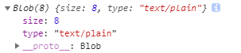

## 元数据处理

随着WebSocket、WebAudio、Ajax等广泛应用，前端在处理大数据或提高数据处理性能时，少不了操纵ArrayBuffer对象

H5的诞生，对技术的革新起了很大的作用，了解如何处理二进制数据显得尤为重要

结合ArrayBuffer、Typed Array，我们可以利用JS去操作二进制数据，如获取或处理音频数据、XHR2等行为

### ArrayBuffer

ArrayBuffer表示**二进制数据的原始缓冲区**，该缓冲区用于存储各种类型化数组的数组，是最基础的原始数据容器，**无法直接读取或写入**

可以将ArrayBuffer传入类型化数组Typed Array或DataView对象来解析原始缓冲区

### Typed Array类型化数组

有以下种类：

| 名称 | 描述 |
|----------|:-------------:|
| Int8Array |  8位有符号整数 |
| Uint8Array | 8位无符号整数 |
| Uint8ClampedArray |  同上，像素操作 |
| Int16Array |  ... |
| Uint16Array |  ... |
| Int32Array |  ... |
| Uint32Array |  ... |
| Float32Array |  ... |
| Float64Array |  ... |

Typed Array类型化数组，表示**可编制索引和操纵**的**ArrayBuffer对象**的**各种视图**

因为ArrayBuffer是无法直接访问的，因此需要借助Typed Array

Typed Array的背后是一个ArrayBuffer，即数据依旧是存在ArrayBuffer中的，而Typed Array**充当一个读写接口，它只是一个操作视图**

Typed Array的数字，表示数组中**一项是几位（如Int8Array是一项8位，即1个字节）**

### ArrayBuffer与Typed Array

    1、我们可以通过new ArrayBuffer来创建数据缓冲区，参数是字节数
    new ArrayBuffer(16); // 16字节
    

    注：1个字节是8位，无符号可以表示0~255的数
    即：Uint8Array，一个项8位，可以是0~255的数
        Uint16Array，一个项16位，可以是0~65535的数
        Uint32Array，一个项16位，可以是0~4294967295的数
    
    2、我们可以通过Typed Array创建视图
    const buffer = new ArrayBuffer(16); // 生成一个16字节的数据缓冲区
    const int8View = new Int8Array(buffer); // 创建视图，将缓冲区的数据看成是8位（1个字节）有符号整数数组
    const int32View = new Int32Array(buffer); // 创建视图，将缓冲区的数据看成是32位（4个字节）有符号整数数组
    

（一个项是8位，即1个字节，16项共16个字节）

（一个项是32位，即4个字节，4项共16个字节）

### File、Blob

在H5的表单file控件中，可以通过this.files获取一个FileList对象（是个类数组），里面每一项都是File对象

也可以通过H5的拖拽drop事件捕获到File或Blob对象

**File继承Blob**，并提供name、lastModifiedDate、size、type等基础元数据

Blob与ArrayBuffer区别除了原始字节外，它还提供了**mine type**作为元数据

它们都可以借助**FileReader**读取为更实用的数据类型去使用
    
    // 1、file控件
    <input id='fileInput' type='file'>
    
    fileInput.onchange = function() {
        console.log(this.files);
    }
    
    // 2、drop拖拽
    fileInput.ondrop = function(e) {
        e = e || event;
        e.stopPropagation();
        e.preventDefault();
        const files = e.dataTransfer.files;
        console.log(files);
    }
    
### FileReader对象

FileReader API用来读取文件，即把文件内容读入内存，是一种异步文件读取机制

参数是**File、Blob**对象，对于不同类型的文件，FileReader提供不同的方法读取文件

    // 创建FileReader
    const reader = new FileReader();
    
    // 1、reader.readAsDataURL(Blob|File)
    读取文件并将文件以数据URI的形式保存在 result 中，返回一个基于 Base64 编码的data-uri对象
    
    // 2、reader.readAsText(Blob|File, opt_encoding)
    返回文本字符串。默认情况下，文本编码格式是 UTF-8，可以通过可选的格式参数，指定其他编码
    格式的文本以纯文本形式读取文件，将读取到的文件保存在 result 属性中，第二个参数用于指定
    编码类型，是可选的
    
    // 3、reader.readAsBinaryString（已废弃，使用readAsArrayBuffer替代）
    
    // 4、reader.readAsArrayBuffer(Blob|File)
    读取文件并将一个包含文件内容的 ArrayBuffer 保存在 result 属性中
    
#### readAsText读取.txt文本内容

    right.ondragover = function(e) {
        e = e || event;
        e.stopPropagation();
        e.preventDefault();
    }
    right.ondrop = function(e) {
        e.stopPropagation();
        e.preventDefault();
        if(!e.dataTransfer.files.length) return;
        const file = e.dataTransfer.files[0];
        if(!/text/.test(file.type)) return;
        const reader = new FileReader();
        reader.readAsText(file); // 解析.txt内的文本内容
        reader.onload = function() {
            right.innerText = this.result;
        }
    }
    注：文本内有中文时，需要将文件另存为，将编码改为UTF-8，这样才可以和<meta charset='UTF-8'>统一
    

### window.URL

URL对象也被称为blob URL，指的是**引用保存在File或Blob中数据的URL**

用window.URL.createObjectURL(Blob|File)方法，对二进制数据生成一个临时URL（开辟一个内存存储数据，生成指向内存的这个临时URL）

可以调用window.URL.revokeObjectURL(url)使其失效

    function createObjectURL(blob) {
        if(window.URL) {
            return window.URL.createObjectURL(blob);
        }else if(window.webkitURL) {
            return window.webkitURL.createObjectURL(blob);
        }else {
            return null;
        }
    }
    
#### createObjectURL对比base64

    right.ondragover = function(e) {
        e = e || event;
        e.stopPropagation();
        e.preventDefault();
    }
    right.ondrop = function(e) {
        e.stopPropagation();
        e.preventDefault();
        if(!e.dataTransfer.files.length) return;
        const file = e.dataTransfer.files[0];
        if(!/image/.test(file.type)) return;
        const img = new Image();
        img.src = window.URL.createObjectURL(file); // 创建临时内存URL
        img.width = 150;
        img.onload = function() {
            right.appendChild(img);
        }
    }
    

### 实现选中获取与复制选中文字

    document.onclick = function() {
        // 获取选中
        if(window.getSelection) {
            console.log(window.getSelection().toString());
        }else if(document.selection) {
            console.log(document.selection.createRange().toString());
        }
        // 复制选中
        document.execCommand('Copy');
    }

### Blob对象与类型转换

Blob对象代表**一段二进制数据**，是File的父类型，提供了一系列操作接口

生成Blob对象有2种方式：

- 使用Blob构造函数

- 对现有的Blob对象使用slice方法切割获取(slice一般用于分片上传)

Blob构造函数，接收2个参数（都不是必需）：

- 第一个参数是一个包含实际数据的数组

- 第二个参数是数据的类型（MIME类型）

Blob对象有2个只读属性：

- size：二进制数据的大小，单位字节

- type：二进制数据的MIME类型，全部为小写，如果类型文字，为空字符串

#### 字符串 => Blob

    const arr = ['karmiy' , 'is'];
    const blob = new Blob(arr, {type: 'text/plain'});
    console.log(blob);
    

#### String => Typed Array

    // String => Typed Array
    const str = 'karmiy';
    const arr = [];
    [...str].forEach((_, index) => arr.push(str.charCodeAt(index))); // 字符转Unicode码，返回0~65535的数
    const uint8View = new Uint8Array(arr); // Uint8是0~255，会将超出的数转为0~255之间
    console.log(uint8View);
    
    注：这一节转换如果带中文，转换出来的view再转Blob解析text会有中文问题，暂未知解决方式，所以一般不这样做，直接new Blob([str])
    
#### String => Blob => String

    const str = '什么...';
    const blob = new Blob([str], {type: 'text/plain'});
    const reader = new FileReader();
    reader.readAsText(blob, 'utf-8');
    reader.onload = function() {
        console.log(this.result); // '什么...'
    }

#### String => Typed Array => Blob => String
    
    // String => Typed Array
    const str = 'karmiy';
    const arr = [];
    [...str].forEach((_, index) => arr.push(str.charCodeAt(index)));
    const uint8View = new Uint8Array(arr);
    
    // Typed Array => Blob
    const blob = new Blob([uint8View], {type: 'text/plain'}); // 需要[]括起uint8View，接收的是数组
    console.log(blob);
    
    // Blob => String
    const reader = new FileReader();
    reader.readAsText(blob, 'utf-8');
    reader.onload = function() {
        console.log(this.result); // 'karmiy'
    }

#### String => Blob => String => 生成并下载.txt文件

    // String => Blob
    const blob = new Blob(['代号K'], {type: 'text/plain'});
    
    // Blob => String => 生成并下载.txt文件
    const reader = new FileReader();  
    reader.readAsText(blob, 'utf-8');
    reader.onload = function() {
        const data = this.result;
        const blob = new Blob([data]);
        const link = document.createElement('a');
        link.href = window.URL.createObjectURL(blob);
        link.download = 'k.txt';
        link.click();
    }

#### String => Blob => String => 生成并下载excel文件

    // String => Blob
    const blob = new Blob(['<table><tr><td>karmiy</td></tr></table'], {type: 'text/plain'});
    
    // Blob => String => 生成并下载.txt文件
    const reader = new FileReader();  
    reader.readAsText(blob, 'utf-8');
    reader.onload = function() {
        const data = this.result;
        const blob = new Blob([data], {type: 'application/vnd.ms-excel'});
        const link = document.createElement('a');
        link.href = window.URL.createObjectURL(blob);
        link.download = 'k.xls';
        link.click();
    }
    
#### Typed Array => Array

    const view = new Uint8Array([1, 2, 3]);
    const arr = Array.from(view);
    
#### ArrayBuffer => Blob

    const buffer = new ArrayBuffer(12);
    const blob = new Blob([buffer], {type: 'text/plain'});
    
#### ArrayBuffer => Typed Array

    const buffer = new ArrayBuffer(12);
    const view = new Iint8Array(buffer);
    
#### Blob => ArrayBuffer => Typed Array => Blob => String
    
    // Blob => ArrayBuffer
    const blob = new Blob(['代号K'], {type: 'text/plain'});
    const reader = new FileReader();
    reader.readAsArrayBuffer(blob);
    reader.onload = function() {
        // ArrayBuffer => Typed Array
        const uint8View = new Uint8Array(this.result);
        // Typed Array => Blob
        const blob = new Blob([uint8View]);
        reader.readAsText(blob, 'utf-8');
        reader.onload = function() {
            console.log(this.result);
        }
    } 
    
#### Canvas => Blob => Img

    const canvas = document.createElement('canvas');
    canvas.style.boder = '1px solid green';
    const cxt = canvas.getContext('2d');
    cxt.fillStyle = 'purple';
    cxt.fillRect(0, 0, 300, 150);
    
    canvas.toBlob(blob => {
        const img = new Image();
        img.src = window.URL.createObjectURL(blob);
        img.onload = () => {
            document.body.appendChild(img);
        }
    })