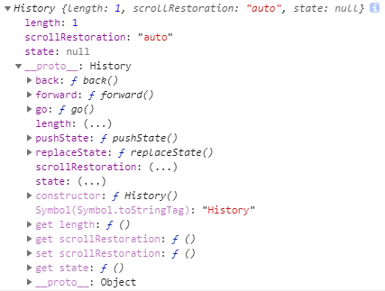
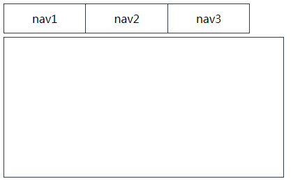
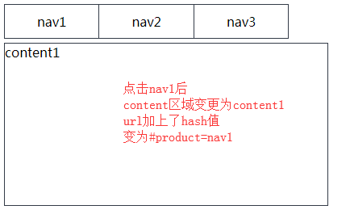
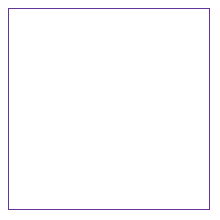
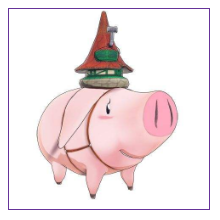
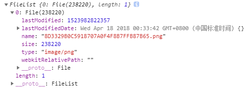
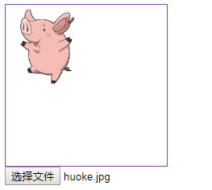

## 历史管理History

### 常用API

- pushState 将数据写入历史记录，并改变hash，有3个参数（数据、随意、hash值）

- onpopstate事件 监听浏览器前进后退按钮

- onhashchange事件 监听hash值变化（pushState不会触发onhashchange）

- back 相当于浏览器后退按钮

- go 后退-1、刷新0、前进+1

- forward 相当于浏览器前进按钮

### 应用示例

    // dom
    <ul class="nav"></ul>
    

    
    // css
    .nav {
        margin: 5px;
    }
    .nav li{
        display: inline-block;
        padding: 10px 40px;
        border: 1px solid #343c48;
        cursor: pointer;
    }
    .nav li:not(:last-child) {
        border-right: none;
    }
    .content {
        width: 400px;
        height: 200px;
        margin: 5px;
        border: 1px solid #343c48;
    }
    
    // js
    const nav_ul = document.querySelector('ul');
    const data = {
        'nav1': 'content1',
        'nav2': 'content2',
        'nav3': 'content3',
    }
    // 添加导航栏
    const navs = Object.keys(data).reduce((str, key) => str + `<li data-name="${key}">${key}</li>`, '');
    nav_ul.innerHTML = navs;
    

#### pushState写入历史记录，改变hash

    // 给li绑定点击事件
    const nav_lis = document.querySelectorAll('li');
    const content = document.querySelector('.content');
    [...nav_lis].forEach(li => {
        li.onclick = function() {
            // 点击后将该导航页的内容填充到内容区
            const name = this.dataset.name
            content.innerHTML = data[name];
            // 通过window.history.pushState将数据写入历史记录，参数（数据、随意、hash值）
            history && history.pushState && history.pushState(name, null, `#product=${name}`);
        }
    })
    

#### onpopstate监听前进后退（或back、go、forward）

    // 监听浏览器前进后退按钮
    window.onpopstate = function(e) {
        // e.state获取之前pushState存的值
        console.log(e.state);
        // 将hash值对应的内容替换到content区域
        e.state && (content.innerHTML = data[e.state]);
    }
    
    我们将nav导航点击如下顺序：
    nav1 -> nav2 -> nav3 -> nav2 -> nav1
    
    连续点击浏览器后退按钮，onpopstate依次输出：
    nav2、nav3、nav2、nav1、null
    
    再连续点击前进按钮，onpopstate依次输出：
    nav1、nav2、nav3、nav2、nav1
    
#### onhashchange监听hash变化

    // 监听hash变化（注意：监听不了pushState导致的hash变化）
    window.onhashchange = function() {
        console.log(window.location.hash);
    }
    
#### 简单的实现单页应用

    const nav_ul = document.querySelector('ul');
    const data = {
        'nav1': 'content1',
        'nav2': 'content2',
        'nav3': 'content3',
    }
    // 添加导航栏
    const navs = Object.keys(data).reduce((str, key) => str + `<li data-name="${key}">${key}</li>`, '');
    nav_ul.innerHTML = navs;

    // 给li绑定点击事件
    const nav_lis = document.querySelectorAll('li');
    const content = document.querySelector('.content');
    [...nav_lis].forEach(li => {
        li.onclick = function() {
            // 点击改变hash值
            window.location.hash = `product=${this.dataset.name}`;
        }
    })
    // 监听hash变化，改变对应内容
    window.onhashchange = function() {
        content.innerHTML = data[window.location.hash.split('=')[1]];
    }

## Ajax2

老版本的XMLHttpRequest对象有以下缺点：

- 只支持文本数据的传送，无法读取和上传二进制文件

- 传送和接收数据时，没有进度信息，只能提示是否完成

- 受到"同域限制"，只能向同一个域名的服务器请求数据

新版的XMLHttpRequest对象，做出了大幅改进：

- 可以设置HTTP请求时限

- 可以使用FormData对象管理表单数据

- 可以上传文件

- 可以跨域请求

- 可以获取服务端的二进制数据

- 可以获取数据传输进度信息

### 超时设定

    const formData = new FormData(document.forms[0]);
    xhr.open('post', '/XXX/XX', true);
    xhr.timeout = 5000; // 设置超时时间5s
    xhr.ontimeout = function() { // 超时事件
        ...
    }
    xhr.send(formData);
    
### 下载文件

#### 下载.txt

    // ajax2.txt
    这是ajax2下载的.txt
    
    // js
    const xhr = new XMLHttpRequest();
    xhr.onload = function() { // H5推荐使用onload方法
        if(xhr.readyState === 4 && xhr.status === 200) {
            console.log(xhr.response);
        }
    }
    xhr.open('get', './ajax2.txt', true); // 请求方式 URL 是否同步
    xhr.send();
    
    // 输出
    '这是ajax2下载的.txt'
    
#### 下载.js

    // ajax2.js
    const obj ={
        name: 'karmiy',
        id: '7',
    }
    
    // js
    const xhr = new XMLHttpRequest();
    xhr.onload = function() {
        if(xhr.readyState === 4 && xhr.status === 200) {
            console.log(xhr.response);
        }
    }
    xhr.open('get', './ajax2.txt', true);
    xhr.send();
    
    // 输出
    `const obj ={
         name: 'karmiy',
         id: '7',
     }`
     
### 设置响应类型，接收二进制数据

    // dom
    

    
    // css
    #wrap {
        width: 200px;
        height: 200px;
        border: 1px solid rebeccapurple;
    }
    #wrap img {
        max-width: 100%;
    }
    

    const wrap = document.getElementById('wrap');
    const xhr = new XMLHttpRequest();
    xhr.onload = function() {
        if(xhr.readyState === 4 && xhr.status === 200) {
            const img = new Image();
            img.src = window.URL.createObjectURL(xhr.response);
            img.onload = function() {
                wrap.appendChild(this);
            }
        }
    }
    xhr.responseType = 'blob'; // 设置类型为blob
    xhr.open('get', './2.png', true);
    xhr.send();
    

    
### FormData

Ajax2添加了一个新的接口FormData

利用FormData对象，我们可以通过键值对来模拟表单控件，并提交这个"表单"

使用FormData最大的优点在于可以上传二进制数据
    
    // 示例
    const formData = new FormData();
    formData.append('file', file); // 接收input file数据，二进制file对象
    formData.append('id', id);
    xhr.open('POST', 'XXX');
    xhr.send(formData);
    
#### 创建formData

    // 方式1：创建空对象append添加节点
    const formData = new FormData();
    formData.append('id', id);
    ...
    
    // 方式2：使用已有表单初始化
    <form>
        <input type="text" name="username">
        <input type="password" name="password">
        <input type="file" name="file">
        <input type="checkbox" name="level" value="I">I
        <input type="checkbox" name="level" value="II">II
        <input type="checkbox" name="level" value="III">III
    </form>
    
    const form = document.forms[0];
    const formData = new FormData(form);
    此时formData相当于已经append了username、password、file、level
    可以根据需求继续append新键值
    
#### 操作方式

    // 1、get、getAll获取
    formData.get('username'); // 获取username输入框的数据
    formData.get('level'); // 如checkbox勾选I、II，则返回第一个I
    formData.getAll('level'); // 如checkbox勾选I、II，则返回['I', 'II']
    
    // 2、append添加数据
    formData.append('id', 10); // 新增一条id数据
    
    // 3、set修改数据，有对应key则修改否则添加
    formData.set('id', 11);
    formData.get('id'); // '11'
    
    // 4、has判断是否有对应数据
    formData.append('nodeId', null);
    formData.has('id'); // true
    formData.has('nodeId'); // true
    formData.has('kkkkk'); // false
    
    // 5、delete删除数据
    formData.delete('nodeId');
    formData.has('nodeId'); // false
    
    // 6、迭代
    for(let [key] of formData.entries()) {
        console.log(key); // 依次：'username'、'password'、'file'、'id'
    }
    
### 简单封装

#### 封装方法

    const request = (options) => {
        const {
            url,
            method,
            params,
            success = () => {},
            error = () => {},
        } = options;
        const xhr = new XMLHttpRequest();
        xhr.onload = () => {
            if(xhr.readyState === 4 && xhr.status === 200) {
                success(JSON.parse(xhr.response));
            }
        }
        xhr.onerror = (err) => {
            error(err);
        }
        let data = '';
        if(params) {
            for(let key in params) {
                data += `${key}=${params[key]}&`
            }
            data && (data = `?${data.slice(0, -1)}`);
        }
        xhr.open(method, url + data, true);
        xhr.send(params);
    }
    
    // 示例
    request({
        method: 'post',
        url: 'XXX',
        params: {
            keyword: 'XXX',
            searchType: 0,
        },
        success(data){
            console.log(data);
        },
    })
    
#### 封装Promise

    const kealm = (options) => {
        return new Promise((resolve, reject) => {
            const {
                    url,
                    method,
                    params,
                   } = options;
            const xhr = new XMLHttpRequest();
            xhr.onload = () => {
                if(xhr.readyState === 4 && xhr.status === 200) {
                    resolve(JSON.parse(xhr.response));
                }
            }
            xhr.onerror = (err) => {
                reject(err);
            }
            let data = '';
            if(params) {
                for(let key in params) {
                    data += `${key}=${params[key]}&`
                }
                data && (data = `?${data.slice(0, -1)}`);
            }
            xhr.open(method, url + data, true);
            xhr.send(params);
        })
    }

### 请求Audio音频

#### 方式一: AudioContext读取

    const aCxt = new AudioContext();
    const xhr = new XMLHttpRequest();
    xhr.responseType = 'arraybuffer';
    xhr.onload = function() {
        aCxt.decodeAudioData(xhr.response, function(buffer) {
            const sourceNode = aCxt.createBufferSource();
            sourceNode.buffer = buffer;
            sourceNode.connect(aCxt.destination);
            sourceNode.start();
        })
    }
    xhr.open('post', './高尚.mp3', true);
    xhr.send();

#### 方式二: Blot转换

    const xhr = new XMLHttpRequest();
    xhr.responseType = 'arraybuffer';
    xhr.onload = function() {
        const buffer = xhr.response;
        const blob = new Blob([buffer], {type: 'audio/mpeg'});
        const url = window.URL.createObjectURL(blob);
        const audio = document.createElement('audio');
        audio.src = url;
        audio.volume = .5; // 音量0.1 ~ 1
        document.body.appendChild(audio);
        // 谷歌浏览器，默认不允许自动播放视频或音频，需要通过事件触发
        document.onclick = function() {
            audio.play();
        }
    }
    xhr.open('post', './高尚.mp3', true);
    xhr.send();
    
### 上传File
  
    // 1、关于input file的value  
    <input id='file' type='file'>
    
    const fileInput = document.getElementById('file');
    fileInput.onchange = function() {
        console.log(this.value);
    }
        注：
        选择一张图片，点击后输出：C:\fakepath\huoke.jpg
        即不能通过.value获取File对象
        并且多选时.value只输出第一张的name
        
    // 2、正确获取input file的File对象
    <input id='file' type='file'>
    
    const fileInput = document.getElementById('file');
    fileInput.onchange = function() {
        console.log(this.files); // 使用.files获取File
    }
    

    // 3、ajax上传file
    <input id='file' type='file' multiple="multiple">
    
    const fileInput = document.getElementById('file');
    fileInput.onchange = function() {
        if(this.value) {
            const xhr = new XMLHttpRequest();
            xhr.open('post', 'XXX' ,true);
            const formData = new FormData();
            [...this.files].forEach(file => formData.append('file', file));
            xhr.send(formData);
            this.value = '';
        }
    }
    
    // 4、canvas图片预览
    <canvas width="200" height="200"></canvas>
    <input id='file' type='file'>
        
    const fileInput = document.getElementById('file');
    const cxt = document.querySelector('canvas').getContext('2d');
    fileInput.onchange = function() {
        const file = this.files[0];
        const url = window.URL.createObjectURL(file);
        const img = new Image();
        img.src = url;
        img.width = 100;
        img.onload = function() {
            cxt.drawImage(this, 0, 0, 100, 100);
        }
    }

    
    