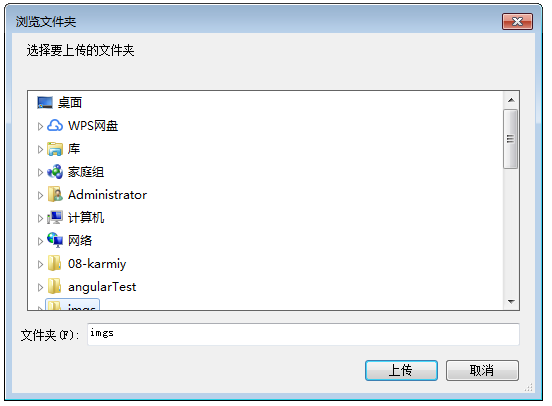
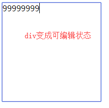
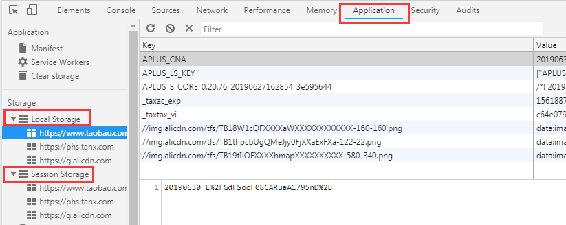
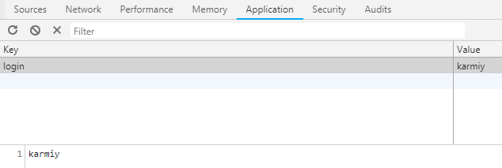

## input file扩展

### accept属性

用来指定浏览器接受的文件类型，打开系统的选择文件弹框的时候，默认界面中呈现的文件类型

accept="image/png"，界面中只限定呈现png图片

accept="image/*"，界面中呈现所有图片，谷歌尽量避免/*，会有卡顿

accept="image/png, image/jpeg"，界面中呈现png和jpg图片

accept="video/*"，界面中呈现视频

accept="audio/*"，界面中呈现音频

accept="text/css"，界面中呈现.css

... (更多MIME 类型列表可网上了解)
    
    // 指定选择.png
    <input id='file' type='file' accept="directory">

    // 指定文件夹
    <input id='file' type='file' webkitdirectory>
    

### capture属性

    适用于移动端开发的：摄像、录音、录像
    
    // 摄像
    <input id='file' type='file' capture="camera">
    
    // 录音
    <input id='file' type='file' capture="microphone">
        
    // 录像
    <input id='file' type='file' capture="camcorder">

## contenteditable可编辑

H5可以对元素添加contenteditable属性使其可编辑
    
    

    

## 本地存储Storage

### localStorage、sessionStorage

(兼容性 >= IE8，localStorage是永久存储，关闭浏览器也在；sessionStorage是临时存储，浏览器关闭后消失)

### 操作方式

    // 1、存值setItem
    window.localStorage.setItem('login', 'karmiy');
    或
    window.localStorage.login = 'karmiy';
    
        注：value需要是字符串
    

    
    // 2、取值getItem
    console.log(window.localStorage.getItem('login'));
    或
    console.log(window.localStorage.login);
    
    // 3、删除removeItem
    window.localStorage.removeItem('login');
    
    // 4、清空clear
    window.localStorage.clear();
    
### Web Storage与Cookie

    // 1、传递
    cookie在浏览器与服务器间来回传递
    storage不会把数据发送服务器，仅本地保存

    // 2、有效期
    cookie在过期时间前一直有效，即使窗口或浏览器关闭
    sessionStorage在存储数据脚本所在的最顶层窗口（即某个iframe中执行存储sessionStorage操作的情况下，它最顶层的窗口关闭则失效）或浏览器标签关闭时失效
    localStorage永久有效
    
    // 3、存储大小
    cookie不能超过4K
    storage也有大小限制，但可以达到5M或更大
    
    // 4、作用域不同
    cookie在所有同源(URL的协议、端口、主机名三者中有一个不同，就属于不同的文档源)窗口共享
    localStorage在所有同源窗口共享
    sessionStorage不仅需要同源，且需要窗口是顶层页面打开的，如www.a/1.html，超链接打开www.a/2.html这样的2.html才能与1.html共享，直接URL打开www.a/2.html
    则无法共享
    
## Web Worker

### 概述

我们知道，JavaScript使用的是单线程，这意味着前面的任务尚未完成，后面的任务唯有等待

随着计算器的发展，多核CPU的出现，单线程带来的很大的不便，无法充分发挥计算机的计算能力

Web Worker为JavaScript**创建多线程环境**，允许主线程创建Woker线程，主线程运行的同时，Worker线程在后台运行**互不干扰**，等Worker线程完成任务，再把结果返回给主线程

Worker较为耗费资源，不应过度使用，**一旦使用完毕就要关闭**

### Worker线程中的限制内容

#### 同源

Worker线程运行的脚本需要与主线程的脚本同源

#### 对象

Worker线程的全局对象与常规主线程不同，无法读取主线程页面的DOM、document、window、parent，可以使用self、navigator、location
    
#### 通讯

Worker线程与主线程需要通过message通讯的形式完成数据交互

#### 脚本

Worker线程不能执行alert、confirm，可以使用XMLHttpRequest发请求

#### 文件

Worker线程不能读取本地文件(file\://XXX)，它加载的脚本需要来自网络

### 基本用法

    
    // web-worker.html的js部分(主线程)
    const worker = new Worker('./work.js'); // 1、新建worker线程
    worker.postMessage({name: "karmiy"}); // 2、postMessage向worker线程发送信息
    worker.onmessage = function(e) { // 3、onmessage监听worker线程发送过来的数据
        console.log(e.data); // 4、e.data接收数据
    }
    
    // work.js(worker线程)
    self.addEventListener('message', function(e) { // 5、worker线程的全局对象是self，onmessage监听主线程发送过来的数据
        console.log(e.data);
        self.postMessage('This is worker thread')
    })
    
    // 输出
    {name: "karmiy"} (work.js)
    'This is worker thread' (web-worker.html)
    
    注：
        1、worker线程的脚本需来自网络，即这个web-worker.html用如webstorm打开是可以的（webstorm会将文件运行在如http://localhost:63342），
           无法在直接打开的file:///C/XXX/web-worker.html使用
        2、self是线程自身，是个全局对象，所以与以下2种写法等价
            this.addEventListener('message', function(e) {
                ...
            })
            addEventListener('message', function(e) {
                ...
            })

### 加载外部脚本

worker线程内部，提供了importScripts方法可以引入外部JS文件，相当于\
        
    </body>
    
        // 输出：
        'This is main thread'
        'This is worker thread'
        
    // 方式二
    <body>
        
    </body>
    
        // 输出：
        'This is main thread'
        'This is worker thread'
        
    // 方式三
    <body>
        
    </body>
    
        // 输出：
        'This is main thread'
        'This is worker thread'
        
### Worker线程实现轮询更新

通常为了用户提现更好，我们可能在一些场景中做缓存数据

例如一些可视化图表，后台数据可能是实时变化的，我们需要隔一段时间重新发起请求，在检查到数据发生改变后替换新数据

这时就可以使用worker线程来做这个轮询更新的操作

    // 创建worker
    function workerFactory(fn) {
        const blob = new Blob([`(${fn.toString()})()`]);
        const url = window.URL.createObjectURL(blob);
        const worker = new Worker(url);
        return worker;
    }
    const worker = workerFactory(function () {
        setInterval(async () => {
            const data = await fetch(...)
            self.postMessage(data);
        }, 1000); // 每10s做一次轮询
    })
    worker.onmessage = function({data}) { // 监听每次轮询结果
        console.log(data);
    }
    
### Worker线程内嵌Worker线程

    