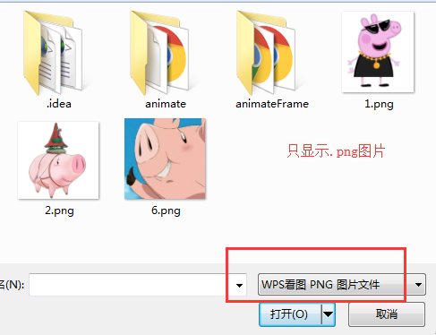
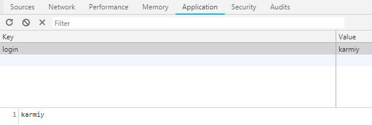
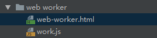
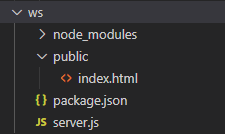
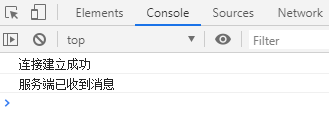
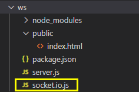

## input file扩展

### accept属性

用来指定浏览器接受的文件类型，打开系统的选择文件弹框的时候，默认界面中呈现的文件类型

accept="image/png"，界面中只限定呈现png图片

accept="image/*"，界面中呈现所有图片，谷歌尽量避免/*，会有卡顿

accept="image/png, image/jpeg"，界面中呈现png和jpg图片

accept="video/*"，界面中呈现视频

accept="audio/*"，界面中呈现音频

accept="text/css"，界面中呈现.css

... (更多MIME 类型列表可网上了解)
    
    // 指定选择.png
    <input id='file' type='file' accept="directory">

    // 指定文件夹
    <input id='file' type='file' webkitdirectory>
    

### capture属性

    适用于移动端开发的：摄像、录音、录像
    
    // 摄像
    <input id='file' type='file' capture="camera">
    
    // 录音
    <input id='file' type='file' capture="microphone">
        
    // 录像
    <input id='file' type='file' capture="camcorder">

## contenteditable可编辑

H5可以对元素添加contenteditable属性使其可编辑
    
    

    

## 本地存储Storage

### localStorage、sessionStorage

(兼容性 >= IE8，localStorage是永久存储，关闭浏览器也在；sessionStorage是临时存储，浏览器关闭后消失)

### 操作方式

    // 1、存值setItem
    window.localStorage.setItem('login', 'karmiy');
    或
    window.localStorage.login = 'karmiy';
    
        注：value需要是字符串
    

    
    // 2、取值getItem
    console.log(window.localStorage.getItem('login'));
    或
    console.log(window.localStorage.login);
    
    // 3、删除removeItem
    window.localStorage.removeItem('login');
    
    // 4、清空clear
    window.localStorage.clear();
    
### Web Storage与Cookie

    // 1、传递
    cookie在浏览器与服务器间来回传递
    storage不会把数据发送服务器，仅本地保存

    // 2、有效期
    cookie在过期时间前一直有效，即使窗口或浏览器关闭
    sessionStorage在存储数据脚本所在的最顶层窗口（即某个iframe中执行存储sessionStorage操作的情况下，它最顶层的窗口关闭则失效）或浏览器标签关闭时失效
    localStorage永久有效
    
    // 3、存储大小
    cookie不能超过4K
    storage也有大小限制，但可以达到5M或更大
    
    // 4、作用域不同
    cookie在所有同源(URL的协议、端口、主机名三者中有一个不同，就属于不同的文档源)窗口共享
    localStorage在所有同源窗口共享
    sessionStorage不仅需要同源，且需要窗口是顶层页面打开的，如www.a/1.html，超链接打开www.a/2.html这样的2.html才能与1.html共享，直接URL打开www.a/2.html
    则无法共享
    
## Web Worker

### 学习来源

整理至阮一峰的网络日志 [Web Worker 使用教程](http://www.ruanyifeng.com/blog/2018/07/web-worker.html)

### 概述

我们知道，JavaScript使用的是单线程，这意味着前面的任务尚未完成，后面的任务唯有等待

随着计算器的发展，多核CPU的出现，单线程带来的很大的不便，无法充分发挥计算机的计算能力

Web Worker为JavaScript**创建多线程环境**，允许主线程创建Woker线程，主线程运行的同时，Worker线程在后台运行**互不干扰**，等Worker线程完成任务，再把结果返回给主线程

Worker较为耗费资源，不应过度使用，**一旦使用完毕就要关闭**

### Worker线程中的限制内容

#### 同源

Worker线程运行的脚本需要与主线程的脚本同源

#### 对象

Worker线程的全局对象与常规主线程不同，无法读取主线程页面的DOM、document、window、parent，可以使用self、navigator、location
    
#### 通讯

Worker线程与主线程需要通过message通讯的形式完成数据交互

#### 脚本

Worker线程不能执行alert、confirm，可以使用XMLHttpRequest发请求

#### 文件

Worker线程不能读取本地文件(file\://XXX)，它加载的脚本需要来自网络

### 基本用法

    
    // web-worker.html的js部分(主线程)
    const worker = new Worker('./work.js'); // 1、新建worker线程
    worker.postMessage({name: "karmiy"}); // 2、postMessage向worker线程发送信息
    worker.onmessage = function(e) { // 3、onmessage监听worker线程发送过来的数据
        console.log(e.data); // 4、e.data接收数据
    }
    
    // work.js(worker线程)
    self.addEventListener('message', function(e) { // 5、worker线程的全局对象是self，onmessage监听主线程发送过来的数据
        console.log(e.data);
        self.postMessage('This is worker thread')
    })
    
    // 输出
    {name: "karmiy"} (work.js)
    'This is worker thread' (web-worker.html)
    
    注：
        1、worker线程的脚本需来自网络，即这个web-worker.html用如webstorm打开是可以的（webstorm会将文件运行在如http://localhost:63342），
           无法在直接打开的file:///C/XXX/web-worker.html使用
        2、self是线程自身，是个全局对象，所以与以下2种写法等价
            this.addEventListener('message', function(e) {
                ...
            })
            addEventListener('message', function(e) {
                ...
            })

### 加载外部脚本

worker线程内部，提供了importScripts方法可以引入外部JS文件，相当于\
        
    </body>
    
        // 输出：
        'This is main thread'
        'This is worker thread'
        
    // 方式二
    <body>
        
    </body>
    
        // 输出：
        'This is main thread'
        'This is worker thread'
        
    // 方式三
    <body>
        
    </body>
    
        // 输出：
        'This is main thread'
        'This is worker thread'
        
### Worker线程实现轮询更新

通常为了用户提现更好，我们可能在一些场景中做缓存数据

例如一些可视化图表，后台数据可能是实时变化的，我们需要隔一段时间重新发起请求，在检查到数据发生改变后替换新数据

这时就可以使用worker线程来做这个轮询更新的操作

    // 创建worker
    function workerFactory(fn) {
        const blob = new Blob([`(${fn.toString()})()`]);
        const url = window.URL.createObjectURL(blob);
        const worker = new Worker(url);
        return worker;
    }
    const worker = workerFactory(function () {
        setInterval(async () => {
            const data = await fetch(...)
            self.postMessage(data);
        }, 1000); // 每10s做一次轮询
    })
    worker.onmessage = function({data}) { // 监听每次轮询结果
        console.log(data);
    }
    
### Worker线程内嵌Worker线程

    // 主线程
    const worker = new Worker('./work.js');
    worker.postMessage('main');
    worker.onmessage = function({data}) {
        console.log(`main.onmessage: ${data}`);
    }
    
    // worker线程(work.js 子线程)
    self.onmessage = function ({data}) {
        console.log(data);
    }
    Array(5).fill('').forEach((_, index) => {
        // 1、worker线程又内嵌worker线程
        const worker = new Worker('./_work.js');
        worker.postMessage({mes: `work.js post: ${index + 1}`, index: index + 1});
        worker.onmessage = function({data}) {
            console.log(data);
        }
    })
    
    // worker线程(_work.js 子子线程)
    self.onmessage = function ({data}) {
        console.log(data.mes);
        self.postMessage(`_work.js post: ${data.index}`);
    }
    
    // 输出(输出'main'，其他顺序不固定)
    'main'
    'work.js post: 1'
    'work.js post: 2'
    'work.js post: 3'
    'work.js post: 4'
    'work.js post: 5'
    '_work.js post: 1'
    '_work.js post: 2'
    '_work.js post: 3'
    '_work.js post: 4'
    '_work.js post: 5'
    
## WebSorker    

### 学习来源
学习至掘金文章 [WebSocket是时候展现你优秀的一面了](https://juejin.im/post/5bc7f6b96fb9a05d3447eef8)

### 概述

HTTP 是客户端/服务器模式中请求响应的协议，浏览器向服务器提交 HTTP 请求，服务器响应请求

而这样的数据流是单向的，只允许客户端向服务端请求后，服务端返回数据，而服务端并不能主动推送数据给客户端

这在例如聊天室，实时流计算等业务时就难以实现，因为我们无法将新的数据从服务器推送回页面中实时更新

为了解决做到双向通讯，我们可能会使用如下方式：

-  轮询：固定间隔不断向服务端发起 ajax 请求，服务器接到后立即响应

- 长轮询：向服务器发送 ajax 请求，服务器接到请求后 hold 住连接，直到有新消息才返回响应，客户端处理完响应后再向服务器发送新请求

- iframe 长连接：页面嵌入隐藏 iframe，src 设为对一个长连接的请求，服务器就能源源不断往客户端输入数据，这样可以做到消息即时到达，不发无用请求

而这些方式的缺点也很明显：

- 轮询：请求多数是无用的，浪费带宽和服务器资源

- 长轮询：服务器 hold 连接消耗资源

- iframe 长连接：服务器维护一个长连接会增加开销

H5 的 WebSocket 就为了解决这些问题而诞生

在 WebSocket 中，浏览器和服务器只需要完成一次握手，就可以建立了一个持久性的连接，进行双方数据传输，不仅浏览器可以发请求给服务器，服务器也可以发消息

WebSocket 的优势：

- 支持双向通讯，实时性强

- 更好二进制支持

- 较少控制开销，连接创建后，客户端和服务端进行数据交互时，协议控制的数据包头部较少

### 使用 WebSocket

这里用一个简单的示例使用 WebSocket 的交互

创建一个文件夹如 demo-websocket

先展示项目结构：

新建 public 文件夹放置静态资源，新建 index.html：

    // public/index.html
    <!DOCTYPE html>
    <html lang="en">
    <head>
        <meta charset="UTF-8">
        <meta name="viewport" content="width=device-width, initial-scale=1.0">
        <title>Document</title>
    </head>
    <body>
        
    </body>
    </html>

这样客户端的部分都就完成了

下面利用 node 搭建简单的后端服务器

初始化 package.json：

    npm init -y

安装 ws：

    npm install ws --save

新建 server.js：

    // server.js
    const express = require('express');
    const app = express();
    const path = require('path');
    // 设置静态文件夹，我们在打开 localhost:3000 时，打开的会是 public 下的 index.html
    app.use(express.static(path.join(__dirname, 'public')));
    // 监听 3000 端口
    app.listen(3000);

    // 创建 websocket 服务
    const Server = require('ws').Server;
    // 服务器 websocket 的端口号
    const ws = new Server({ port: 8080 });

    // 监听服务端和客户端的连接
    ws.on('connection', function(socket) {
        // 监听客户端发来的消息
        socket.on('message', function(msg) {
            // 客户端发来的 msg
            console.log(msg);
            // 发送消息给客户端
            socket.send('服务端已收到消息');
        });
    });

node 执行 server.js 启动服务：

    node server.js

打开 http://localhost:3000/ 这时在控制台可以看到输出了如下信息：

可以看到，WebSocket 的交互效果已经实现了

### socket.io

WebSocket 是 H5 标准的产物，旧版浏览器显然会存在兼容性问题

我们更多的可能是用 [socket.io](http://socket.io/) 这样的库，而不是用原生的 WebSocket

socket.io 的特点：

- 易用性：封装了服务端和客户端，简单方便

- 跨平台：支持跨平台，可以选择在服务端或是客户端开发实时应用

- 自适应：会根据浏览器来决定使用 WebSocket、ajax 轮询还是 iframe 流等方式选择，甚至支持 IE5.5

安装：

    npm install --save socket.io

修改服务端代码：

    // server.js
    const express = require('express');
    const app = express();
    const path = require('path');
    // 设置静态文件夹，我们在打开 localhost:3000 时，打开的会是 public 下的 index.html
    app.use(express.static(path.join(__dirname, 'public')));
    // 通过 node 的 http 模块来创建一个 server 服务
    const server = require('http').createServer(app);
    // 监听3000端口
    server.listen(3000);

    // WebSocket 是依赖 HTTP 协议进行握手的
    const io = require('socket.io')(server);
    // 监听客户端与服务端的连接
    io.on('connection', function(socket) {
        // 监听客户端的消息是否接收成功
        socket.on('message', function(msg) {
            // 客户端发来的 msg
            console.log(msg);
            // 发送消息给客户端
            socket.send('服务端已收到消息' );
        });
    });

修改客户端代码：

    // public/index.html
    <!DOCTYPE html>
    <html lang="en">
    <head>
        <meta charset="UTF-8">
        <meta name="viewport" content="width=device-width, initial-scale=1.0">
        <title>Document</title>
        
    </head>
    <body>
        
    </body>
    </html>

> 注：如果 socket.io.js 服务正在监听你的 HTTP 服务，它会自动创建客户端文件给 http://localhost:XXXX/socket.io/socket.io.js。所以上方 index.html 中我们才可以 script 引入 /socket.io/socket.io.js

node 执行 server.js 启动服务：

    node server.js

打开 http://localhost:3000/ 这时在控制台可以看到输出了如下信息：

除了利用 socket.io.js 服务器自动生成的 http://localhost:XXXX/socket.io/socket.io.js 文件，还可以自己下载 socket.io.js 到本地后引入

如下，本地下载了 socket.io.js：

修改 index.html 的 script 标签为：

    

node 执行 server.js 启动服务：

    node server.js

**注：**，接着直接打开 index.html，而不是打开 http://localhost:3000/

这时也可以在控制台看到：

    