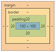
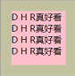
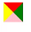
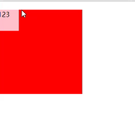
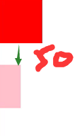
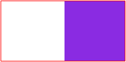

## 通用rest.css重置默认样式

一些元素自带默认样式，可以通用reset.css清除

```css
body { font-family: "Microsoft yahei"; font-size: 14px; }
body, dl, dd, p, h1, h2, h3, h4, h5, h6{ margin: 0; }
ol, ul, li { margin: 0; padding: 0; list-style: none; }
img { border: none; }
a { text-decoration: none; }
```

## 块元素

### padding

内边距，也会受backgroundColor影响（不会影响元素内容本身，即内容不会显示在padding区域，相当于填充物）




- 整体写法：

```js
padding: 20px; // （4个方向都是20px）
padding: 10px 20px; // (上下10px，左右20px)
padding: 10px 20px 30px; // （上10px，左右20px，下30px）
padding: 10px 20px 30px 40px; //（上10px,右20px,下30px,左40px）

```

- 分解写法：

```js
padding-top: 10px;
padding-right: 10px;
padding-bottom: 10px;
padding-left: 10px;

```

### border

- 写法：

```js
// 边框宽度  线类型 颜色(注：border也同padding占宽度，如宽度200px，则宽度为202px)
border: 1px solid #000;  

// 当border未设置颜色时，将会取color作为颜色

border: 1px solid;

color: #000; 
```
    
- 边框样式：

    solid、 dashed、 dotted（其他border-style可以参考 [W3C](http://www.w3school.com.cn/cssref/pr_border-style.asp)）

- 拆分写法：

```js
border-right-width: 20px;
botder-bottom-style: dotted;
border-left-color: #fff;

border-right: 5px solid pink;
border-width: 5px 10px 20px;
border-style: solid；
border-color: red;

```

> &#9733; 贴士 

利用border实现三角形:

- 思路: width height设为0，只设置border

- 不同颜色的4条边

```js
border: 20px solid pink;
border-color: red green pink yellow;
```



- 实现:

```js
border-width: 20px 40px;
border-style: solid;
border-color: transparent transparent transparent pink;
```


### margin

外边距，看不到的间距，不包括背景色

- 整体写法：

```js
margin: 20px; // （4个方向都是20px）
margin: 10px 20px; // (上下10px，左右20px)
margin: 10px 20px 30px; // （上10px，左右20px，下30px）
margin: 10px 20px 30px 40px; // （上10px,右20px,下30px,左40px）
```
- 分解写法:

```js
margin-top: 10px;
margin-right: 10px;
margin-bottom: 10px;
margin-left: 10px;
```

- margin实现左右居中:

```js
margin: 20px auto;
```
    
> &#9733; 贴士 

**如果子元素比父元素还大，这个方法没用，要用定位(position: absolute)**


- **关于margin合并问题**:

1. 父子元素

```html
<div>
    <p>122</p>
</div>
```

```css
div {
    width: 200px;
    height: 200px;
    background-color: red;
}
p {
    width: 50px;
    height: 50px;
    background-color: pink;
    margin-top: 20px;
}
```


原因：

p的margin-top会传递给div（**第一个子元素的margin会传递给父级，需要通过触发BFC解决**）

解决方法： 

div设置overflow: hidden触发BFC

> &#9733; 贴士 

```text
给父元素设置border也可以防止父子元素的垂直外边距合并喔
```

2. 上下元素

```html
<div></div>
<p></p>
```

```css
div {
    width: 100px;
    height: 100px;
    background-color: red;
    margin-bottom: 50px;
}
p {
    width: 50px;
    height: 100px;
    background-color: pink;
    margin-top: 20px;
}
```


原因：

上下相同层级的元素，**上下外边距相遇时，只会取最大的**，需要通过触发BFC解决

解决方法：

```css
.wrap {
    overflow: hidden; //用个div包起来触发BFC
}
p {
    width: 100px;
    height: 100px;
    background-color: red;
    margin-bottom: 50px;
}
```
    
```html
<p> p1 </p>
<div class='wrap'>
    <p> p2 </p>
</div>
```

- *关于margin设置百分比(重要)*：

    margin设置百分比，如50%，不管是margin-top:50%还是margin-left:50%，长度都是**父级**宽度的50%
    
### *关于div宽高问题*

1. 没有内容时，div的width是100%，height：0；

2. 有内容时，height会被内容撑开，是内容的高度（内容可以撑开盒子）；

3. 设置了固定的width和height后，即使是内容超出盒子，内容依旧显示，不会影响div高度（一般情况下需要控制好盒子大小使它包围内容）；

4. 一个父级元素，没有设置height，它的高度由子元素撑起

> &#9733; 贴士 

```css
div {
    display: inline-block;
    vertical-align: middle;
}
.p {
    border: 1px solid red;
}
.a {
    width: 100px;
    height: 100%;
    background-color: aqua;
}
.b{
    width: 100px;
    height: 100px;
    background-color: blueviolet;
}
```

```html
<div class="p">
    <div class="a"></div>
    <div class="b"></div>
</div>
```
    
上例中父级由b撑起高度，a设置100%,值得注意的是：**a的高度会是0**


