## CSS选择器

### id选择器
    
```css
#header {
    ...
}
```

```html
<div id='header'>..</div>
```
    
### 类选择器

```css
.txt {
    ...
}
```

```html
<div class='txt'>..</div>
<p class='txt'>..</p>
```
    
### 复合选择器

```css
span.txt {
    ...
}
```

```html
<span class='txt'>...</span>
```
    
### 后代选择器

```css
p span {
    ...
}

div * {
    ... // div下全部子元素
}
```

```html
<p>
    <span>...</span>
</p>

<div>
    ...
</div>
```
    
### 组合选择器

```css
a, p, span {
    ... // a、p、span3个都满足
}
```
    
### 选中所有元素
    
```css
// 选中所有元素
* {
    ,..
}
```
   
## 选择器优先级

1、 id > class > 标签

2、如果是混合的，找出id的个数，多的权重高，相同则找class，多的权重高，再相同比较标签个数

```css
#main .hh {
    ... // 这里赢了
} 

#gg {
    ..
}
```

```html
<div id='main'>
    <p id='gg' class='hh'>...</p>
</div>
```

3、内联样式（标签上style属性的样式）> id > class > 标签

4、!important（优先级最高）> 内联 > id > class > 标签

总结：一级级比较个数，某一级个数多的优胜，最后都一样，放后面的优胜

## background

### background-color

背景色

```css
#k {
    background-color: red; // 正确做法
}
#k {
    background: red; // 最好不要这样设置颜色，对浏览器而言需要再多去查找background-color
}
```
    
### background-image

```css
#k {
    width: 200px;
    height: 200px;
    background-image: url('./img/ok.png'); // 默认平铺
}
```
    
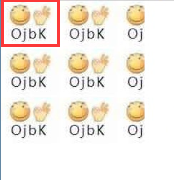

> 注：只有存在元素使用了这个样式，才会去加载图片，如上例，如果没有一个元素有 id='k'，这个 ok.png 的背景图是不会去加载的。此外，如果元素或其父级设置了 display: none 隐藏，也不会去加载（\ 会加载，不论是否 display: none）

### background-repeat

平铺

取值：no-repeat 、repeat--x 、repeat-y、repeat（默认）

以下依次展示no-repeat 、repeat--x 、repeat-y

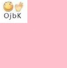
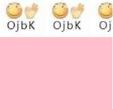
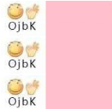

### background-position

定位

1、 数值

```css
div {
    background-position：50px 100px;// 水平50px，垂直100px
}
```

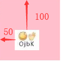

2、left、right、top、bottom、center

```css
div {
    background-position：20px center;// 水平20px，垂直居中
}
```
    
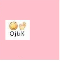

3、百分比

```css
div {
    background-position：100% 0；
}
div {
    background-position：120% 120%；// 可以超出
}

// 效果如下图
```
    
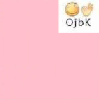
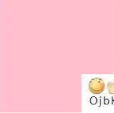
    
4、拆分写法

```css
// 不推荐，一般不这么写，有些浏览器不支持
div {
    background-position-x：100px;
    background-position-y：100px;
}
```
    
### background-size（CSS3属性）

变换大小

取值：

```js
background-size：200px // 宽200高等比例缩放
background-size：200px 20px // 宽200高20
background-size：100% // 背景图宽和元素等宽，高等比例缩放
background-size：100% 100% // 背景图宽高拉伸缩放到和元素相等
background-size：cover; // 保持原有宽高比，放大到把空间填满，多出的部分不显示
background-size：contain; // 保持原有宽高比，放到到其中一边填满，即大的一边填满，另一边会有空余
```
    
### background-attachment

是否跟随浏览器滚动

取值：scroll（默认滚动）、fixed（背景不跟随浏览器滚动）

了解fixed效果：

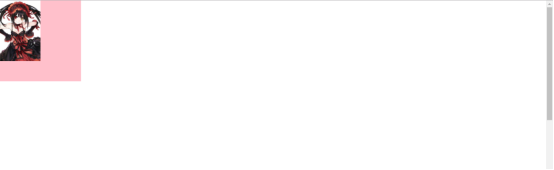

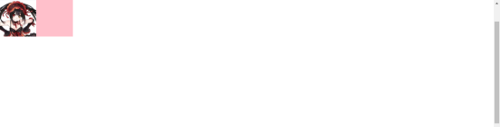

### 复合写法

顺序：

颜色（没有可以不写）、图片、平铺、position、cover、fixed（顺序可以换，但**position和cover要连一起**，而且要用/隔开，因为都可以写数值，避免混淆）

示例：

```js
background: pink no-repeaat url('...') 100% 100% / cover;

background: pink url('...') no-repeaat 100% 100%;  // 没有position不能有size，可以没有size有position

background: pink url('...') no-repeat fixed 100% 100%; 
// 可以有fixed，一般不会把fixed写在复合写法里，不过position需要设置数值如10px 50px，因为如果position设置百分比如100% 100%，是相对于整个显示区窗口而言的
```
    
### CSS3设置多背景图
    
```js
// 逗号隔开
background: url('...') 0 0 no-repeat,
                url('...') 200px 0 no-repeat,
                url('...') 0 400px no-repeat;
                
// 或
background-image: url('...'),  url('...'),  url('...');
background-repeat: no-repeat, no-repeat, no-repeat;
background-position: 0 0, 200px 0, 0 400px;
```
    
### 区分background与img

1、img的图片可以拖动，背景图不行

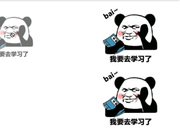

（上img， 下background，鼠标可以单击img拖动，如左侧影像）

2、img要占据文档流，background不需要

```html
<div>
    这是插入img的标签
    
</div>
<div>
    这是背景图片
</div>
```
    
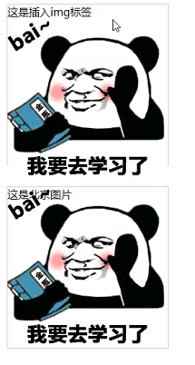 

3、背景图可以侧意**解决如不兼容的颜色问题**

> &#9733; 贴士 

如渐变色在IE8不兼容。可以在谷歌先做出CSS3渐变色，截图1~2px的图片，在IE利用平铺做背景图，平铺性，用背景图造出同样的效果