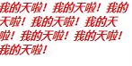
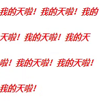
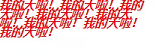
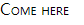
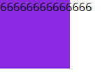
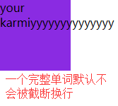
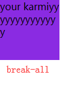

## 字体样式

### font-color

字体颜色

    color: red;
    color: #1394ff;
    color: rgb(0, 0, 0);
    color: rgba(0, 0, 0, 1);
    color: hsl(360,50%,50%); // CSS3 色相 饱和度 亮度
    
### font-size

字体大小

一般设置**偶数**，默认16像素，一般浏览器默认最小12px（可在浏览器设置修改），还可以设置百分比

    font-size: 12px

### font-weight

字体粗细

    font-weight: 700; // 100-700整百数、400/normal(默认)、bold、bolder、lighter
    
    // 技巧
    因为font-family字体的不同，会导致不同字体加粗后粗细程度不同
    有的字体在font-weight: bold后会很粗
    如果只希望略微加粗，可以用 text-shadow: 0 0 0 #fff; 来实现效果
    
### font-family

字体类别

    font-family：'Microsoft yahei';
    font-family：'楷体';
    font-family：'楷体','微软雅黑','宋体'; // 优先前面的字体，没有这个字体用后面的。特殊的字体需要本地电脑安装了这个字体才支持显示
    
### font-style

字体风格

    font-style：italic // 斜体字体
    font-style：oblique // 强制倾斜，注：有的字体没有斜体字，可以用这个强制倾斜

### line-height

行高，一行文本占据的高度
    
    一行占据的高度，数值或百分比（默认21px）
    
    line-height: 21px // 默认
    line-height: 50px; 
    line-height: 1.5; // font-size值 * 1.5
    line-height: 150%; // font-size值 * 150%;

以下分别为默认、50px、12px

> &#9733; 贴士 

一般将line-height设置与height**相同的数值**来实现**垂直居中**

### font-variant

小型大写字母

    font-variant：normal; // 默认
    font-variant：small-caps; // 会让小写字母也变成大写的，大小不变
    
如Come here会变成如下

### 复合写法

font: 斜体 大型小写 粗细 字体大小/行高 字体类型；

字体大小和行高必须用/合在一起；

不需要每一项都写，即使某些省略也不会影响后面；

    font-size: 16px;
    font-weight: 700;
    font-family: '微软雅黑', 'serif';
    font-style: oblique;
    line-height: 20px;
    
    // 合并后
    font：italic normal 700 16px/20px '微软雅黑', '楷体';
    font：700 16px/20px '微软雅黑', '楷体'; //可以这样省略某些项，但行高一定要有字体大小，顺序不能变
    
## 文本样式

### text-align

文本对齐方式，**对文本、行内元素、行内块元素有效，对块级元素无效**

    text-align: left; // 左对齐
    text-align: center; // 居中对齐
    text-align: right; // 右对齐
    
### text-indent

缩进

    text-indent：28px; // 首行缩进28px
    text-indent：2em; // （常用）缩进2个font-size，即首行空2格
    text-indent: 50%; // 缩进父级宽度的50%，如父级200px的width，缩进100px
    
### text-transform

大小写
    
    text-transform: none; // 默认值
    text-transform: uppercase; // 全部转大写
    text-transform: lowercase; // 全部转小写
    text-transform: capitalize; // 首字母大写（常用）
    
### text-decoration

文本线
    
    text-decoration: none; // 没有文本线（常用，一般用来清除a标签默认样式）
    text-decoration: underline; // 下划线
    text-decoration: line-through; // 中划线
    text-decoration: overline; // 上划线
    
    a {
        text-decoration: none;
    }

### letter-spacing

文字间距

    letter-spacing: 10px; 
    
    如：
    巧克力 --->   巧  克  力
    
### word-spacing

词间距（一个空格占据的宽度），一般针对英文文档

    word-spacing: 40px;
    
    如：
    巧克力,you are a  ---> 巧克力,you      are      a
    
### white-space

换行方式

    white-space: normal; // 默认值，正常换行
    white-space: nowrap; // 文本不换行
    
    -------------------
    示例:
    
    p{
      width: 100px;
      height: 100px;
      background-color: blueviolet;
      white-space: nowrap;
    }
    
    
66666666666666

    

### word-break

长单词换行方式，一般针对英文
    
    word-break: normal; // 默认值
    word-break: break-all; // 允许单词内换行
    word-break: keep-all; // 只能在半角空格或连字符出换行
    

 

### text-overflow

溢出显示方式

    text-overflow: clip; // 默认，裁剪文本
    text-overflow: ellipsis; // 超出显示 ...省略号
    
    整体代码：
    overflow: hidden;
    white-space: nowrap;
    text-overflow: ellipsis; // 超出显示...需要3个属性支撑
    
    超出3行显示...（使用webkit内核）：
    overflow: hidden;
    text-overflow: ellipsis;
    -webkit-box-orient: vertical;
    -webkit-line-clamp: 3;
    

## 关于样式继承

当标签没有设置某些样式时，它会继承它父级的样式

1、**几乎常用的所有文字、文本样式都会被继承**，text-overflow、white-space不会；

2、list-style、cursor等这种属性会被继承；

3、有些元素本来就有自己独特的样式，这些属性不会去使用继承的，如a标签的font-color、h1等标题标签的font-size、font-weight等；

4、不可以继承的属性，可以给它设置inherit值，使之可以继承父级，如：p { height: inherit; }，但IE不支持这个属性；

    