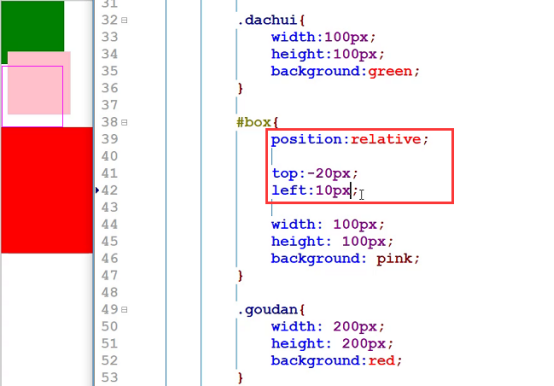
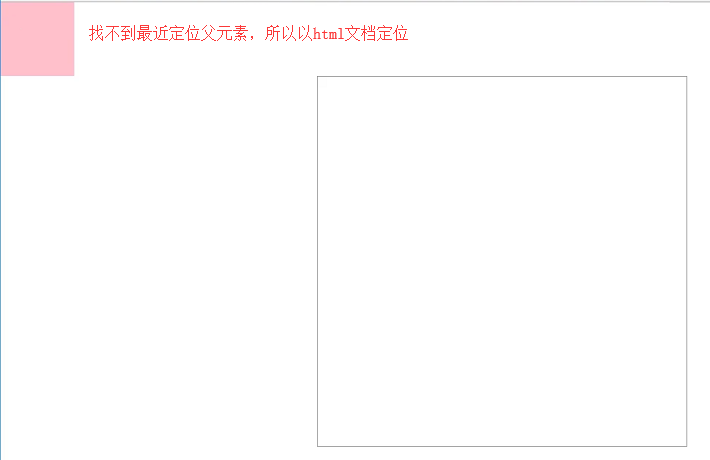
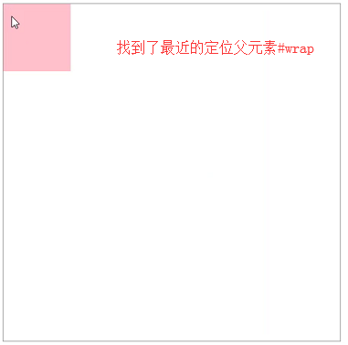
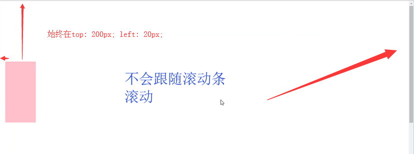
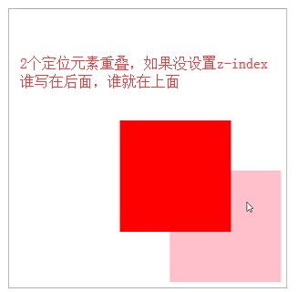
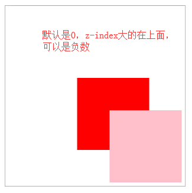
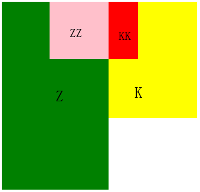
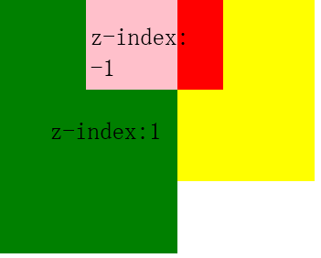
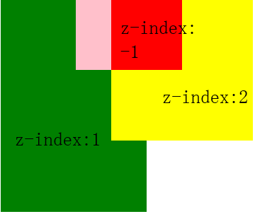
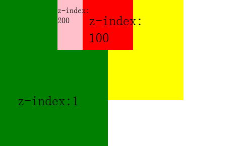

## 预备知识
类别：position: static（默认） / relative/ absolute / fixed / sticky(兼容性不好，此处略过)

取值: left、top、right、bottom

文档流：absolute、fixed会脱离文档流（层级比float还高，即定位元素会在浮动元素上面，可通过z-index调整）

特性：absolute、fixed定位后行内元素会具有**块级元素属性**的能力（如设宽高，**注：absolute和fixed才可以给行内元素设宽高，relative无效，且元素没设宽高的话由内容撑开**）

## 相对定位relative

**不影响布局**，又可以随意调整位置，参照物是**自己本身**

## 绝对定位absolute

**脱离文档流**，参照物为**最近的有定位的父级**，或者文档（一直往上找，找不到后就相对文档html）

示例一：

    #wrap {
        width: 500px;
        height: 500px;
        border: 1px solid #999;
        margin: 100px auto;
    }
    #wrap .box {
        position: absolute; // 绝对定位
        width: 100px;
        height: 100px;
        left: 0;
        top: 0;
        background-color: pink;
    }
    
    

        

    

    

实例二：

    #wrap {
        position: relative; // 相对定位
        width: 500px;
        height: 500px;
        border: 1px solid #999;
        margin: 100px auto;
    }
    #wrap .box {
        position: absolute; // 绝对定位
        width: 100px;
        height: 100px;
        left: 0;
        top: 0;
        background-color: pink;
    }
    
    

        

    

    

> &#9733; 贴士 

1、绝对定位left、top等设置百分比的问题：

设置百分比，如top: 50%，是定位**父级高度**的50%，left: 50%，是定位**父级宽度**的50%

2、定位left、top等未设置值的问题：

默认**auto**，不是0！本来在哪就在哪

3、绝对定位的父元素含有内边距padding的问题：

top：0，left：0是有**包括到padding部分**的，并不是只有width、height部分

4、绝对定位元素宽度100%的问题：

定位父级没有padding，100%等于**定位父级width长度**。定位父级有padding，100%为**定位父级width+padding的长度**

5、关于绝对定位同时设置如left、right：

绝对定位后的元素宽度默认是0，由内容撑开。如果同时设置了left和right，可以根据设置的值撑开，**可用于实现自适应**

## 固定定位fixed

滚动条滚动，**依旧固定在浏览器窗口的某个位置**

    #box {
        position: fixed;
        width: 100px;
        height: 200px;
        left: 20px;
        top: 200px;
        background-color: pink;
    }
    

## 定位元素的层级z-index：

    #wrap .p1 {
        position: absolute;
        width: 200px;
        height: 200px;
        bottom: 10px;
        right: 10px;
        background-color: pink;
    }
    #wrap .p2 {
        position: absolute;
        width: 200px;
        height: 200px;
        bottom: 100px;
        right: 100px;
        background-color: red;
    }
    
    

        

        

    

    #wrap .p1 {
        position: absolute;
        width: 200px;
        height: 200px;
        bottom: 10px;
        right: 10px;
        z-index: 1; // 加了z-index提升层级
        background-color: pink;
    }
    #wrap .p2 {
        position: absolute;
        width: 200px;
        height: 200px;
        bottom: 100px;
        right: 100px;
        background-color: red;
    }
    
    

        

        

    

    

 > &#9733; 贴士 
 
 z-index大的就一定会在上面吗？
 
 不一定。。。
 
**案例一：**
    
    // 1、父级 z、k，有各自子元素zz、kk
    

        

    

    
    

        

    

    
    div {
        position: absolute; // 2、都是绝对定位
    }
    #k {
        width: 200px;
        height: 200px;
        left: 650px; top: 0;
        background-color: yellow;
    }
    #kk {
        width: 100px;
        height: 100px;
        left: 0; top: 0;
        background-color: red;
     }
    #z {
        width: 500px;
        height: 500px;
        left: 200px; top: 0;
        background-color: green;
    }
    #zz {
        width: 100px;
        height: 100px;
        left: 0; top: 0;
        background-color: pink;
    }

由上图可知，都没有设置z-index的情况下，默认子元素会在父元素之上

**案例二：**

将大绿k设置z-index: 1，其子元素小粉kk设置z-index: -1，我们发现虽然子元素的z-index更小，但子元素依旧在上面？

**案例三：**

将大黄z设置z-index: 2，其子元素小红zz设置z-index: -1，大绿k也设置z-index: 1，我们发现虽然大绿层级大于小红，却还是在它下面？

**案例四**

将大绿k设置z-index:1，两个子元素小粉kk和小红zz分别设置z-index为200、100，我们发现小红100小于小粉200，却在它上面

**结论：**
 
1、在没有设置z-index时，元素都是同一状态，后写在上，子元素在父级上

2、不论是relative、absolute,一旦设置了z-index，多个元素之间，他们对比会从**第一个**找到有设置z-index的地方进行对比（即示例四，大绿会找小红比）

3、不论是relative、absolute,父级设置z-index会影响**间接子元素层级**（示例四中，大绿已经和小红算同一层级去比较了，它的子元素小粉不会再和小红比了，跟它父级一起老实当弟弟）

4、父级一旦设置z-index（不管父级是relative还是absolute），子元素不管z-index多少，即使是负数，都会在它上面（即示例二）

**补充：**

5、父级如果是fixed，就算没设置z-index，子级设置负数也没法在它下面

6、第一层的元素就算z-index设置负数也没法在body下面（我们平时设置z-index为负数让它在父级下面，是因为我们做到2点：父级设置relative，**且它没有设置z-index**）