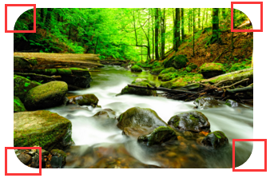
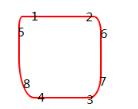
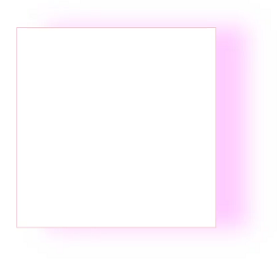
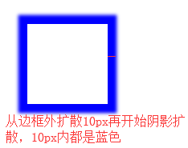
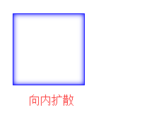
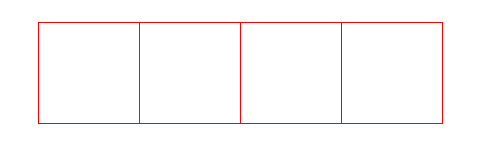
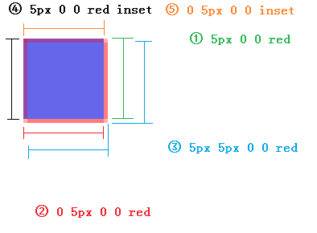
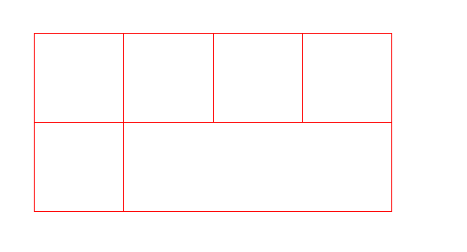
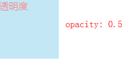
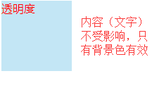

## 圆角属性border-radius

图例：

写法：
    
    // 4个值
    border-radius: 10px 10px 10px 10px; // 左上 右上 右下 左下
    
    // 2个值
    border-radius: 10px 10px // 左上右下  右上左下
     
    // 1个值
    border-radius: 10px // 4个角
    
    // 百分比
    border-radius: 50% // 4个角圆角
    
    // 8个值
    border-radius: 5p 10px 15px 20px/15px 20px 30px 50px; // x轴的上右下左 / y轴的上右下左
    

分解属性：

    border-top-left-radius
    border-top-right-radius
    border-bottom-right-radius
    border-bottom-left-radius
    
## 阴影box-shadow

图例：

写法：
    
    // 4个值：水平方向位移、垂直方向位移、阴影模糊程度、阴影颜色
    box-shadow: 0px 0px 5px blue;
    
    // 5个值：（如下图1）水平方向位移、垂直方向位移、阴影模糊程度、阴影扩散距离、阴影颜色
    box-shadow: 0px 0px 5px 10px blue;
    
    // 6个值：（如下图2）水平方向位移、垂直方向位移、阴影模糊程度、阴影扩散距离、阴影颜色 扩散方向
    box-shadow: 0px 0px 10px 0px blue inset;
    

### 多层shadow实现边框与元素并排

当我们需要在水平方向排列具有边框的元素时，我们可能会这么做:

    

        

        

        

        

    

    
    .item {
        float: left;
        width: 100px;
        height: 100px;
        border: 1px solid red;
    }
    
    .item:not(:first-child) {
        margin-left: -1px; // 通过设置左外边距为-1实现相邻元素边框合并
    }
    

其实我们可以通过**多层**的box-shadow来实现这个需求

**这里先看单个元素:**

左、上的边内联，右、下的边扩散

**项目中常用的最终效果:**

    

        

            

            

            

            

            

        

    

    
    .wrap {
        width: 400px;
        border: 1px solid red;
    }
    
    .container {
        margin: -1px 0 0 -1px;
    }
    
    .container:after {
        content: '';
        display: block;
        clear: both;
    }
    
    .item {
        float: left;
        width: 25%;
        height: 100px;
        box-shadow: 1px 0 0 0 red, 0 1px 0 0 red, 1px 1px 0 0 red, 1px 0 0 0 red inset, 0 1px 0 0 red inset;
    }
    

    
## 透明度opacity、rgba、filter

### opacity

    

        透明度
    

    
    #box {
        opacity: .5  // 取值 0 - 1
    }
    

**注意：整个元素包括文字都受影响**

兼容性：>= IE9

### rgba

    

        透明度
    

    
    #box {
        background-color: rgba(135, 206, 235, .5)  // 取值 0 - 1
    }
    

**注意：只会影响背景**
兼容性：>= IE9

### filter

解决IE下不兼容的问题

    filter: alpha(opacity = 50) // 取值0 - 100
    
