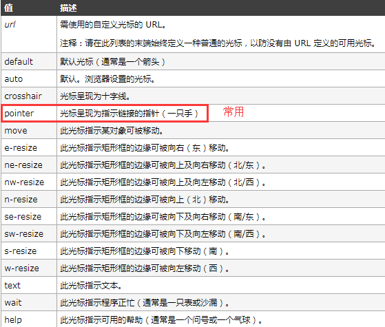

## IE特有的CSS写法

```js
// 给>= IE8读的，其他浏览器如谷歌看不懂， \0 或 \9都行
top: auto\0;
bottom: 0\0;
height: auto\0;
```
    
## 鼠标指针cursor

种类：



自定义光标：

```css
div {
    width: 500px;
    height: 500px;
    background-color: pink;
    
    cursor: url('img/3.cur') , pointer;
    
    // 需要在第二个参数加上备用指针样式才能显示（这里备用pointer指针样式）
    // 需要一个光标图形文件  .cur .ico
}
```
    


## CSS规范

同样是样式，写的顺序不同对浏览器来说是不同的，虽然渲染结果一致，但是浏览器解析过程不同。

如：
    
```css
// 这种写法浏览器发现display: none就不会往下解析了
.box {
    display: none;
    color: red;
}
// 这种写法浏览器先解析了color是red，又发现display: none，那前一步解析color等于是浪费
.box {
    color: red;
    display: none;
}
```
    
CSS书写顺序规范：
    
```js
/* 以下这些是常用的 */

// 布局定位属性
display / list-style / position(相应的top right bottom left) / float / clear / visibility / overflow

// 自身属性
width / height / margin / padding / border /background

// 文本属性

color / font / text-decoration / text-align / vertical-align / white-space / break-word

// 其他（CSS3）
content / cursor / border-radius / box-shadow / text-shadow / background: linear-gradient ...    
```