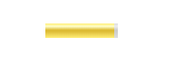

## 热点图\<map>

描述：

我们有时在如淘宝这样的网页，会发现有些图片的某些区域，是可以点击的，点击后链接到另一个网址，这就是热点图的作用
    
    // img的usemap属性，与map的name对应
    
    
    <map name="hk">
        <area shape="circle" coords="50,50,50" href="https://www.baidu.com" alt="" />
        <area shape="rect" coords="100,100,200,200" href="https://github.com/" alt="" />
    </map>
    
    // area为热点区域，shape可以设置区域为 圆circle、矩形react
    // circle： coords有3个值，分别为原点x、原点y、半径r
    // rect: coords有4个值，分别为矩形左上角x、左上角y，右下角x、右下角y
    

    // 点击后会出现蓝色边框，如果不想要它，可以CSS去除
    
    area {
        outline: none;
    }
    
## H5标签

H5的新标签，更主要是让标签更加**语义化**，如\<header>标签，其实就是个div而已，主要传达语义化思想，见名知意

### 结构型标签

其实都是div，只是更语义化

#### \<header>头部
    
页眉，头部

    <header>这是头部header</header>
    
#### \<nav>导航
    
    <nav>导航</nav>
    
#### \<section>板块、\<article>独立部分

    <article>
        <section>...</section>
    </article>
    
seciton主要用于文章的章节、标签对话框中的标签页，一般当元素内容明确地出现在文档大纲中时，section 就是适用的

article本身是**独立，完整**的，最简单的判断方法是看**这段内容脱离了所在的语境**，是否还是完整的、独立的，如果是，则应该用article标签

#### \<aside>侧边栏

    <body>
        <header>...</header>
        <nav>...</nav>
        <article>
            <section>板块</section>
            <aside>侧边栏</aside>
        </article>
    </body>
    
#### \<footer>底部

    <body>
        <header>...</header>
        <nav>...</nav>
        <article>
            <section>...</section>
            <aside>...</aside>
        </article>
        <footer>底部</footer>
    </body>
    
#### 兼容性与解决

**兼容性：**

IE8及以下不兼容

**解决方式：**

    
    
    
### 语义化标签

#### \<hgroup>标题组
    
    // 把标题包起来，block元素
    <hgroup>
        <h2>标题</h2>
        <h2>标题</h2>
    </hgroup>

#### \<figure>用作文档中插图的图像

媒体标签，对元素进行组合。图片、视频、音乐的组合可以放这里
    
    // 是个block
    <figure>
        <figcaption>标题</figcaption>
        
    </figure>
    
#### \<time>时间

用来表示时间和日期，相当于一个，更语义化
    
    // datetime不会显示出来，但是利于搜索引擎的搜索
    
今天是<time datetime='2019-5-1'>五一</time>

    
#### \<datalist>定义选项列表
    
    // input的list与datalist的id对应
    // input会变成下拉输入框
    
    <input type="text" list="data" />
    <datalist id="data">
        <option value="sy">神羊</option>
        <option value="sj">神鸡</option>
    </datalist>
    

（选择后要清空才能再次列出全部项，感觉不是很好用）

#### \
描述文档的细节
    
    // 是个block
    

        
摘要

        
这是内容

        <a href="javascript:;">链接</a>
    

    

#### \<dialog>模态框
    
    // dialog默认是absolte定位的
    // 需要open属性才能看到它
    
    <dialog open>
        <dt>请问？</dt>
        <dd>是超级神羊么？</dd>
    </dialog>
    

#### \<address>联系信息
    
    // 是个带有 font-style: italic; 是个带斜体的标签
    <address>
        QQ：XXX
        Email：XXX
    </address>
    
#### \<meta>规定范围内的数量值

    // 是个inline-block
    
    // 属性分别为：最大、最小、当前值、上限、下限
    
    // 在上限、下限之间，显示为绿色
    <meter max="100" min="0" value="20" high="90" low="10"></meter>
    
    // 小于下限，显示黄色
    <meter max="100" min="0" value="5" high="90" low="10"></meter>
    
    // 大于上限，显示黄色
    <meter max="100" min="0" value="95" high="90" low="10"></meter>
    

#### \<progress>进度条

    // 是个inline-block
    
    // 没有设置属性，会是个来回跑的进度条
    <progress></progress>
    
    <progress value="20" max="100"></progress>
    

### \<mark>文本的背景标记

    // 是个自带 color: black与background-color: yellow的标签
    
这神羊<mark>软用没有</mark>
