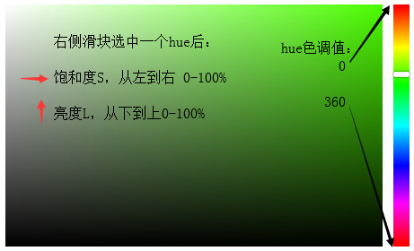
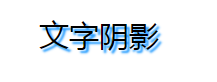
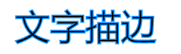

## 颜色模式hsl、hsla

兼容性：>= IE9

CSS3新增颜色模式：

1、H：hue -> 色调

0或360表示红色、120绿色、240蓝色（取值0-360）

2、S：saturation -> 饱和度

0% - 100%，值越大颜色越纯

3、L：lightness -> 亮度

0% - 100%，值越大颜色越亮

4、A：alpha -> 透明度

0 - 1，完全透明 - 不透明

```css
.wrap {
    width: 200px;
    height: 200px;
    background-color: hsl(360, 100%, 50%);
}
```
    
**如何使用HSL封装颜色选择器组件？**



（仅供思路，此处不提供具体实现）

## 文字阴影text-shadow

```js
// 水平阴影偏移量、垂直阴影偏移量、模糊半径（可省略）、阴影颜色（可省略）
text-shadow: x y blur color;

// 阴影叠加
text-shadow: x y blur color, x y blur color;

// 案例
text-shadow: 3px 3px 2px #1394ff;
```
    


## 文字描边text-stroke

```js
// 设置或检索对象文字的描边厚度
text-stroke-width

// 设置或检索对象文字的描边颜色
text-stroke-color

// 兼容前缀
-webkit- 谷歌
-moz- 火狐
-0- 欧朋
-ms- IE

// 复合写法
-webkit-text-stroke: 2px #1394ff;
```
    

    