## 渐变

渐变色是归属background-image的

### 线性渐变linear-gradient

```js
// 基本用法
background-image: linear-gradient(direction, color1 value1, color2 value2);
// 以角度0°方向，从0% - 100%（百分比也可以换px）由红渐变到绿
background-image: linear-gradient(0deg, red 0%, green 100%);

// 方向：
1、to left   = 270deg = 右 -> 左   
2、to right  = 90deg  = 左 -> 右   
3、to top    = 0deg   = 下 -> 上   
4、to bottom = 180deg = 上 -> 下
5、对角渐变：
    to top left / to top right / to bottom right / to bottom left
    
// 示例
background-image: linear-gradient(0deg, red 10%, green 20%); 
```
     
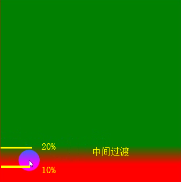

（从10%开始渐变，到20%，之前和之后还是纯色）

```js
// 如果前面的值比后面的大
background-image: linear-gradient(0deg, red 50%, green 10%); 
```


（便会没有效果）

```js
// 平铺
background-image: repeating-linear-gradient(90deg, pink 0%, skyblue 20%); 
background-image: -webkit-repeating-linear-gradient(90deg, pink 0%, skyblue 20%);
```
    
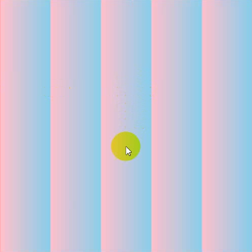
 
 ### 径向渐变radial-gradient
 
 ```js
// 基本用法
// shape（圆、椭圆）、radius半径、xy圆心坐标、color value（颜色，渐变位置）
background-image: radial-gradient(shape radius at x y, color1 value, color2 value)
// 以半径100px的圆形，在(100, 100)的位置径向渐变，从10% - 20%由红渐变为绿
background-image: radial-gradient(circle 100px at 100px 100px, red 10%, green 20%)

// shape
circle圆形、ellipse椭圆

// 半径 （注：2-4点下面有案例）
1、数值（圆有1个半径、椭圆2个半径）
2、closest-side 圆心到最近的边的距离为半径
3、closest-corner 圆心到最近的角的距离为半径
4、farthest-side 圆心到最远的边的距离为半径
5、farthest-corner 圆心到最远的角的距离为半径

// 圆心（记得前面有个at）
只写一个值，第二个就默认居中
1、数值（px %）
2、x（left center right）
3、y（top center bottom）

// 示例
background-image: radial-gradient(circle 200px at 250px 250px, pink 20%, skyblue 50%)
```
    
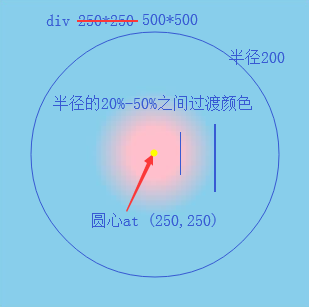 

```js
// 平铺
background-image: repeating-radial-gradient(circle 200px at 250px 250px, pink 20%, skyblue 50%)
background-image: -webkit-repeating-radial-gradient(circle 200px at 250px 250px, pink 20%, skyblue 50%)
```
    
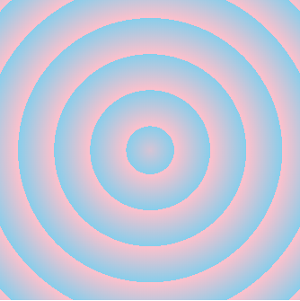 

```js
// 关于半径closest-side
// 在(100,100)的位置，找到最近的边的距离为半径
background-image: radial-gradient(circle closest-side at 100px 100px, pink 20%, skyblue 50%)
```
    
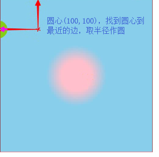 

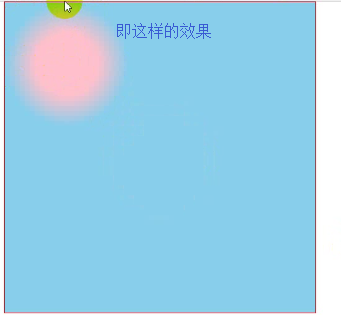 

### 背景图与渐变色共用（多背景）

```js
background: url('...') no-repeat, linear-gradient(to right, red 0%, green 100%)

注：背景图写在渐变色前面的话，背景图在上面，反之，渐变色在上面
```
    
## 倒影box-reflect

可以在元素的某个位置形成一个倒影（倒影不会占据空间）

```js
// 基本用法
-webkit-box-reflect: below 0px;

// 第一个值为倒影方向
1、below 下
2、above 上
3、left 左
4、right 右

// 第二个值为倒影距离
数值（可为负值）
```

```css
// 示例
#main {
    ...
    background: url("./2.png") no-repeat center/cover;
    -webkit-box-reflect: below 0;
}
```
    
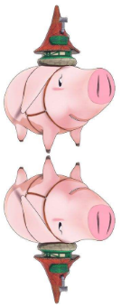 

```css
img {
    width: 180px;
    -webkit-box-reflect: below 0 url('5.png'); // 自定义倒影蒙版
}
```
    
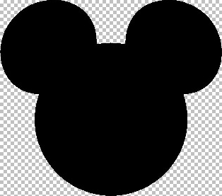 

（一张周围是透明的png图）

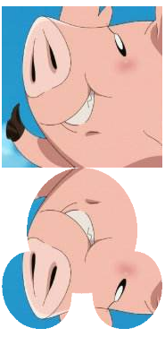 

（效果）

```css
// 倒影配合渐变色
img {
    width: 180px;
    -webkit-box-reflect: below 5px -webkit-gradient(linear, left top,left bottom,from(transparent),color-stop(50%, transparent),to(white));
}
```
    
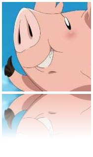 

# 背景图基点background-origin：

规定背景图位置基点相对谁参考

```js
// 值
1、content-box 背景图像相对于内容框来定位
2、padding-box 背景图像相对于内边距来定位
3、border-box 背景图像相对于边框来定位
```

```css
// content-box
div {
    ...
    background: url('...') no-repeat 0 0;
    border: 10px dashed red; // 边框10px
    padding: 50px; // 50px的padding
    background-origin: content-box; // 相对content定位基点
}
```

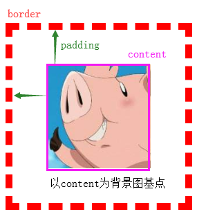 
    
```css
// padding-box
div {
    ...
    background: url('...') no-repeat 0 0;
    border: 10px dashed red;
    padding: 50px;
    background-origin: padding-box; // 相对padding定位基点
}
```

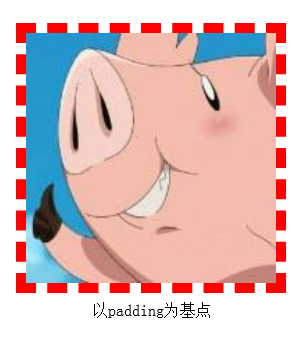 

```css
// border-box
div {
    ...
    background: url('...') no-repeat 0 0;
    border: 10px dashed red;
    padding: 50px;
    background-origin: border-box; // 相对border定位基点
}
```
    
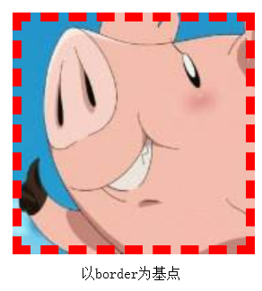 

## 背景图裁剪background-clip

背景图裁剪和背景色裁剪（与background-origin有关，但是要区分它们的作用）

```js
// 值
1、content-box 背景被裁剪到内容区域
2、padding-box 背景被裁剪到内边距
3、border-box 背景被裁剪到边框
```

```css
// 示例
div {
    ...
    background: url('...') no-repeat 0 0;
    border: 5px dashed red;
    padding: 50px;
    background-origin: border-box; // 相对border定位基点
    background-clip: content-box; // 裁剪到内容区域
}
```

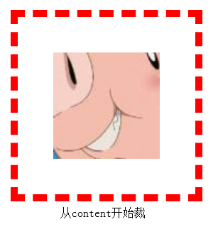 
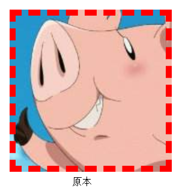 

(缺的部分就是被裁掉的)

    
    
    
    
    
    
