## transform 2D变换

兼容性：>= IE9

### rotate旋转

```css
// 取值
deg角度 / rad弧度 / turn圈 / grad梯度

img {
    display: block;
    width: 200px;
    margin: 100px auto;
    transform: rotate(45deg);
}
```
    
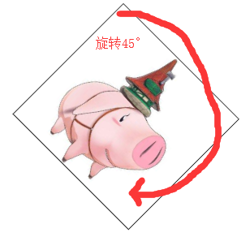 

### scale、scaleX、scaleY缩放
    
```js
// 基本用法
transform: scale(x,y)
    x轴缩放比例
    y轴缩放比例
    只写1个值则x,y比例一样
    数值0-1缩小，>1放大
    
// 单独写法
transform: scaleX();
transform: scaleY();
```

```css
// 示例
img {
    ...
}
img:hover {
    transform: scale(1.5);
}
```


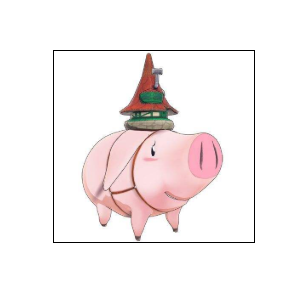 
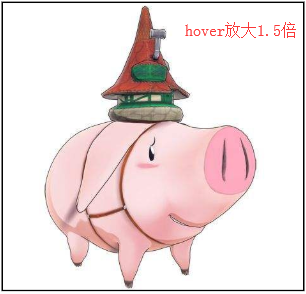 

### translate、translateX、translateY位移

```js
// 基本用法
transform: translate(x,y);
    x轴方向上移动
    y轴方向上移动
    只写一个只相当于x
    
// 单独写法
transform: translateX();
transform: translateY();
```

```css
// 示例
img {
    ...
}
img:hover {
    transform: translate(50px);
}
```
    
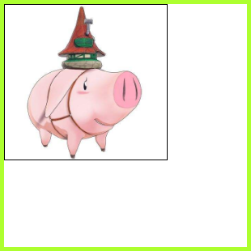 
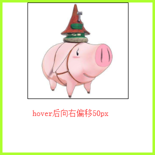 

### skew、skewX、skewY倾斜

```js
// 基本用法
transform: skew(x,y);
    x轴方向倾斜
    y轴方向倾斜
// 单独写法
transform: skewX(0deg);
transform: skewY(0deg);
```

```css
// 示例
img {
    display: block;
    width: 200px;
    transform: skew(45deg, -15deg);
}
```
    
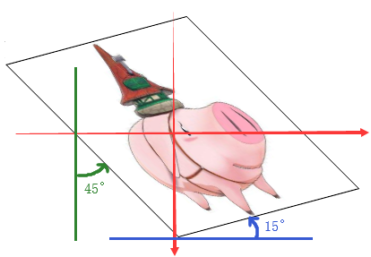 

## transform 3D变换

### transform-origin变换基点

默认基点是Z轴（Z轴方向与我们看屏幕的视线反向，即从屏幕垂直向外）
    
```js
// 兼容性
>=IE9

// 取值：
1、默认中心点
2、关键词：
    left / top / right / bottom / center
    如 left bottom（x方向left，y方向bottom）
3、数值
4、只给第一个值，第二个默认中点
```
    
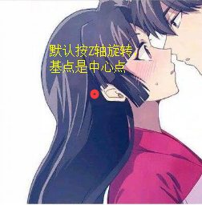 

```css
img {
    transform-origin: right bottom; // 改变基点
}
```

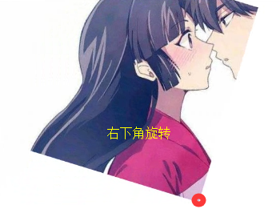 

```css
// 3个值，x、y、z 3个方向偏移100px的点为基点
img {
    transform-origin: 100px 100px 100px;
}
```
    
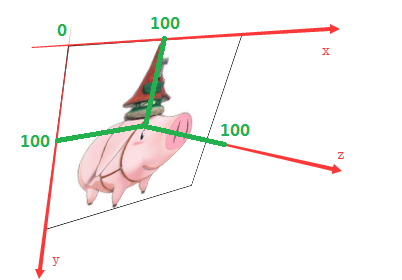 

### rotateX、rotateY、rotateZ

```css
// 兼容性
>= IE10
// 写法
img {
    ...
    transform: rotateX(10deg) rotateY(10deg) rotateZ(10deg);
}

// 3个轴线如何判断旋转方法？
以左手拇指为箭头方向，4指蜷缩方向为角度正值，方向为负值
```
    
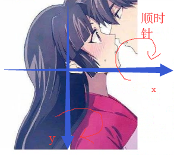 

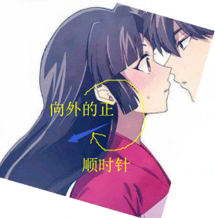 


### perspective景深

用来设置用户与元素3D空间Z平面的距离，能实现3D立体效果，**给3D元素的父级添加，不会出现梯形效果，给3D元素添加景深，会出现梯形效果**

一般设置500 - 1000

```html
// 兼容性
>= IE10

// 示例
<div id="main">
    <div class="child">
        
        
        
        
        
    </div>
</div>
```

```css
#main {
    ...
    width: 200px;
    height: 200px;
    perspective: 500px; // 父级设置景深
}
.child {
    position: relative;
    width: 100%;
    height: 100%;
    transform-style: preserve-3d; // 设置让子元素呈3D控件（下文会提到）
}
img {
    ...
    position: absolute;
    width: 100%;
    height: 100%;
}
img.k2 {
    transform-origin: center top;
    transform: rotateX(90deg);
}
img.k3 {
    transform-origin: left center;
    transform: rotateY(-90deg);
}
img.k4 {
    transform-origin: right center;
    transform: rotateY(90deg);
}
img.k5 {
    transform-origin: center bottom;
    transform: rotateX(-90deg);
}
```
    
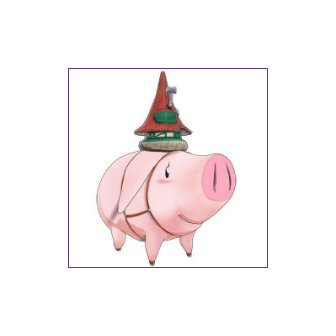 

（未设置景深，看不到3D效果）

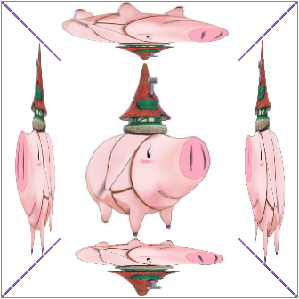 

（设置景深，可以看到3D效果）

**注：一般把景深设置在父级上。** 把景深设置给谁，可以将其假想为浩瀚的宇宙去看里面的东西。景深不能设在自己身上，这样就犹如自己在看自己一般，达不到近大远小的效果

### transform-style

transform-style: preserve-3d，相当于一个舞台，提供一个子元素可以在这此呈现3D效果的环境
    
```css
// 兼容性
IE不兼容

// 示例
#main {
    width: 150px;
    height: 150px;
    ...
    perspective: 500px;
}
.child {
    position: relative;
    ...
    transform: rotateY(45deg); // 旋转45°
    transform-style: preserve-3d; // 设置3D舞台
}
img {
    position: absolute;
    ...
}
img.k2 {
    top: -150px;
    left: 0;
}
img.k3 {
    transform-origin: right center;
    transform: rotateY(-80deg); // 旋转.k3的img看效果
    top: 0;
    left: -150px;
}
img.k4 {
    top: 0;
    right: -150px;
}
img.k5 {
    top: 150px;
    left: 0;
}
```

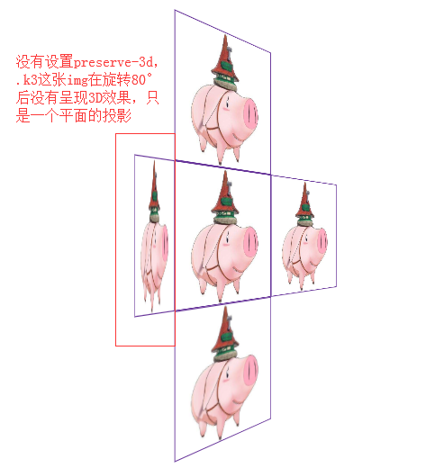 

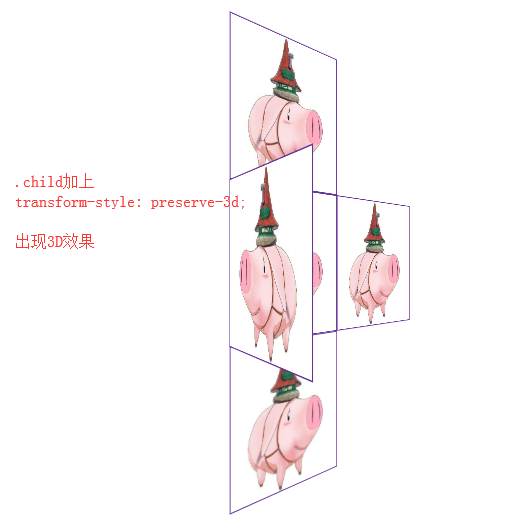 

## 怪异盒模型box-sizing

```css
// W3C标准盒子模型：content-box （默认）
    content + padding = 宽高
    
// 传统IE盒子模型：border-box
    content + padding + border = 宽高
    
// 示例
li {
    width: 200px;
    height: 200px;
    padding: 50px;
    border: 10px solid red;
    background-color: blue;
}
li:nth-child(1) {
    ...
    box-sizing: content-box;
}
li:nth-child(2) {
    ...
    box-sizing: border-box;
}
```
    
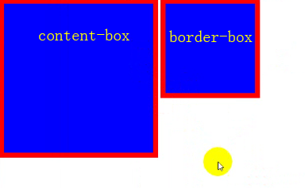 

## CSS calc运算

用来指定元素的长度，给元素border、margin、padding、font-size、width等属性设置动态值

```css
// 兼容性
>= IE9

// 注：
    1、表达式中有 + 和 - ，符号两边必须有空格
    2、表达式中有 * 和 / ，符号两边可以没有空格，建议保留
    
// 示例
.wrap {
    ...
    width: calc(20% - 10px);
    height: calc(200px + 50px);
    margin-left: calc(45px / 3);
    padding-right: calc(15px * 2);
}
```