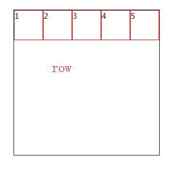
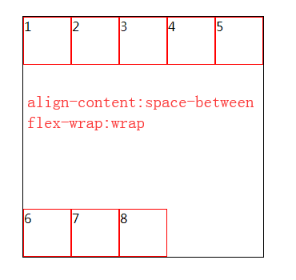

## flex弹性盒模型

    // 兼容性
    >=IE10
    注意兼容前缀display: -webkit-flex等
    
    // 优势
    flex非常适合移动端开发
    
    // 注
    弹性盒子模型最适合一个应用程序的组件，或者小规模布局;
    flex将对象作为块级弹性盒子对象;
    inline-flex将对象作为内联块级弹性盒子显示;
    flex布局后，子级的float、clear、vertical-align都失效;
    
    // 基本示例
    ul {
        display: flex; // 父级设置flex布局
        width: 500px;
        height: 500px;
        margin: auto;
        border: 1px solid #000;
    }
    li {
        width:100px;
        height: 100px;
        border: 1px solid red;
    }
    
 

## flex父级特性

设置在父容器上的属性

### flex-direction设置子元素在父容器的位置

    取值：
    1、row 横向从左往右排列（默认）
    2、row-reverse 反横向排列，从右往左（第一个元素跑到最后一个）
    3、column 纵向排列（从上往下）
    4、column-reverse 反纵向排列（从下往上，第一个跑到最下面）
    
    注：
    如果子元素没有设置宽高
    横向排列时：宽度由内容撑开，高度100%；
    纵向排列时，高度由内容撑开，宽度100%；
    
 
 

 
 

### flex-wrap设置子元素横排超出是否换行

    取值：
    1、nowrap 子元素溢出父级容器不换行，而是被挤压（默认）
    2、wrap 子元素溢出父级容器时换行
    3、wrap-reverse 子元素溢出父级容器时，反纵向排列，第一行会换到最后一行
    
    注：
    如果nowrap，即使子元素我们写了width，也被无视掉被挤压
    
 
 

 

### flex-flow（flex-direction、flex-wrap复合）
    
    // 用法
    flex-flow: flex-direction flex-wrap;
    
    // 示例
    ul {
        ...
        flex-flow: row-reverse wrap;
    }

### justify-content设置子元素的主轴（X轴）方向上的对齐方式

    // 取值
    1、flex-start 子元素左对齐（默认值）
    2、flex-end 子元素右对齐
    3、center 子元素居中对齐
    4、space-between 子元素平均分配在X轴
    5、space-around 子元素平均分配在X轴，但两端保留子元素之间间距的一半
    
 
 

 
 

 

### align-items设置子元素的侧轴（Y轴）方向上的对齐方式

    // 取值
    1、flex-start 子元素在y轴上顶端对齐
    2、flex-end 子元素在y轴上底部对齐
    3、center 子元素在y轴上居中对齐
    4、baseline 子元素在y轴上基线对齐，和文字有关
    5、stretch （默认值）子元素在y轴上没有设置高度(有设置还是按设置的)时，会拉升自身去填满父级容器高度（如果剩余空间的负值或设置了高度，相当于flex-start）
    
 
 

 
 

 
 

### align-content设置元素行与行之间的间距（行间距）

    // 取值
    1、flex-start 每一行从顶部开始，挨着向下排列
    2、flex-end 每一行从底部开始，挨着向下排列
    3、center 每一行之间无间距，在y轴居中
    4、space-between 每一行在y轴上平均分布行高，上下两行挨着边框
    5、space-around 每一行在y轴上平均分布行高，上下两行与边框之间的间距是行与行间距的一半
    6、stretch （默认值）同align-items的stretch
    
 
 

 
 

 
 

## flex子集特性

设置在子元素的属性上

### order元素位置排序

    // 定义
    用整数值来定义排列顺序，数值小的排列在前，可以为负值
    
    // 示例
    #main {
        display: flex;
        width: 300px;
        height: 300px;
        margin: 20px 0 0 20px;
        border: 1px solid #000;
    }
    .child{
        box-sizing: border-box;
        width: 60px;
        height: 60px;
        border: 1px solid red;
    }
    .child:nth-child(7) {
        order: 2
    }
    .child:nth-child(3) {
        order: 3
    }
    .child:nth-child(8) {
        order: -1
    }
    .child:nth-child(4) {
        order: 0
    }
    
 

### flex-grow让元素占据剩余空间

    // 定义
    让某一个或几个子元素去占据剩余空间，按照给定的比例值来，默认0
    
    // 注
    如果设置了换行flex-wrap:wrap，子元素宽度合超过了父元素。则设置flex-grow无效
    
    // 示例
    #main {
        display: flex;
        width: 500px;
        ...
    }
    .child{
        width: 90px;
        border: 5px solid red;
        ...
    }
    .child:nth-child(1) {
        flex-grow: 1;
    }
    .child:nth-child(2) {
        flex-grow: 3;
    }
    
 

### flex-shrink设置子元素伸缩比例

    // 定义
    当子元素宽度合超过父元素时，设置子元素伸缩比例，每一个都按照比例去分担超出的那一部分，默认1
    
    // 注
    1、flex-wrap:wrap时无效，因为会换行
    2、子元素宽度合没有超过父元素宽度也无效
    3、让出的宽度是：实例宽度比* flex-shrink的比例，假如3个子元素宽度比是1:1:2，flex-shrink是1:2:3，则需要让出的空间比是1:2:6
    
    // 示例
    #main {
        display: flex;
        width: 300px;
        height: 300px;
        margin: 20px 0 0 20px;
        border: 1px solid #000;
    }
    .child{
        box-sizing: border-box;
        width: 60px;
        height: 60px;
        border: 1px solid red;
    }
    .child:nth-child(2) {
        flex-shrink: 2; // div2的shrink为2，其他默认值1
    }
 

**利用flex-shrink实现tabs选项卡排版:**

    #main {
        display: flex;
        width: 200px;
        margin: 20px 0 0 20px;
        border: 1px solid #000;
    }
    .child{
        box-sizing: border-box;
        width: 100%;
        height: 60px;
        border: 1px solid red;
        flex-shrink: 0; // 让每个子元素都不伸缩
    }

 

### flex-basis设置元素初始长度的像素

    // 定义
    定义在分配多余空间前，该项先占据指定空间大小，再按flex-grow这个比例占据剩余空间
    默认为auto，即有width取width大小，没有则内容撑开大小
    也可以为百分比，即父容器尺寸百分比，若父容器尺寸未定义，结果与auto相同
    
    // 注
    设置了flex-basis后width无效，flex-basis优先级 > width
    设置了width没设置flex-basis，flex-basis为auto
    设置了0%，且没设width，如果元素有内容占宽，也会保持内容撑开的尺寸，而不是挤为0尺寸
    
    // 示例
    #main {
        display: flex;
        width: 300px;
        height: 300px;
        margin: 20px 0 0 20px;
        border: 1px solid #000;
    }
    .child{
        box-sizing: border-box;
        width: 60px; // 其他div 宽度60px
        height: 60px;
        border: 1px solid red;
    }
    .child:nth-child(1) {
        flex-basis: 50px; // div1 flex-basis为50px
    }
    
 

    // 设置flex-grow
    .child{
        ...
        flex-grow: 1; // 每个div设置flex-grow: 1
    }
    
 

### align-self单独控制某个子元素的align-items对齐方式

    // 取值（与父级特性align-items一致）
    1、flex-start 子元素在y轴上顶端对齐
    2、flex-end 子元素在y轴上底部对齐
    3、center 子元素在y轴上居中对齐
    4、baseline 子元素在y轴上基线对齐，和文字有关
    5、stretch （默认值）子元素在y轴上没有设置高度(有设置还是按设置的)时，会拉升自身去填满父级容器高度（如果剩余空间的负值或设置了高度，相当于flex-start）
    
    // 示例
    #main {
        display: flex;
        ...
    }
    .child{
        ...
    }
    .child:nth-child(2) {
        align-self: center;
    }
    
 

### flex属性的复合样式写法

    // flex是flex-grow、flex-shrink、flex-basis的缩写
    flex: flex-grow flex-shrink flex-basis;

    // flex的默认值即上面3项的默认值，即0 1 auto。同理，如下是等价的
    flex: 2 3 200px;
    =>
    flex-grow: 2;
    flex-shrink: 3;
    flex-basis: 200px;
    
    // flex为none时，计算值为0 0 auto
    flex: none;
    =>
    flex-grow: 0;
    flex-shrink: 0;
    flex-basis: auto;
    
    // flex为auto时，计算值为1 1 auto
    flex: auto;
    =>
    flex-grow: 1;
    flex-shrink: 1;
    flex-basis: auto;

    // flex为非负数字时，如1，计算值为1 1 0%
    flex: 1;
    =>
    flex-grow: 1;
    flex-shrink: 1;
    flex-basis: 0%;

    // flex为长度或百分比时，数值为flex-basis的值，其他取1
    flex: 0%;
    =>
    flex-grow: 1;
    flex-shrink: 1;
    flex-basis: 0%;

    flex: 24px;
    =>
    flex-grow: 1;
    flex-shrink: 1;
    flex-basis: 24px;

    // flex为2个非负数字，分别为flex-grow和flex-shrink的值，flex-basis为0%
    flex: 2 3;
    =>
    flex-grow: 2;
    flex-shrink: 3;
    flex-basis: 0%;

    // flex为一个非负数字和一个长度或百分比，视为flex-grow和flex-basis的值，flex-shrink取1
    flex: 2 200px;
    =>
    flex-grow: 2;
    flex-shrink: 1;
    flex-basis: 200px;