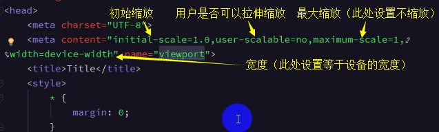
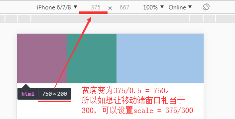
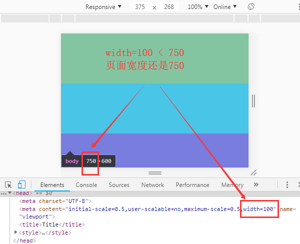
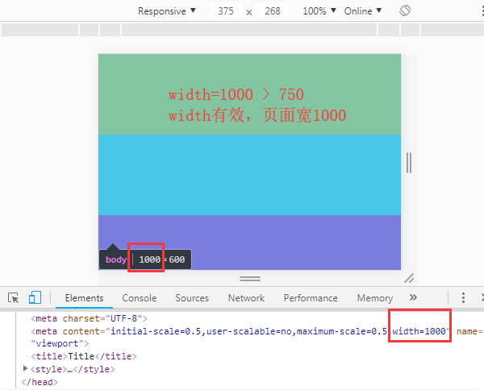
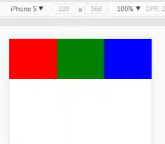

## <meta name=”viewport”>设置移动端自适应

```html
// 设置页面在移动端设备窗口的显示

<head>
    <meta content='initial-scale=1.0,user-scalable=no,maximum-scale=1,width=device-width' name='viewport'>
    ...
</head>
```
    


```html
// scale是缩放比例，如下设置为0.5
<meta content='initial-scale=0.5,user-scalable=no,maximum-scale=0.5' name='viewport'>
则页面宽度为：设备宽度（即window.screen.width） / 0.5，即原来2倍
```
    


```js
// width是页面宽度，假如设备宽度是375，缩放比例是0.5，我们从上例可知页面宽度会是375/0.5 = 750
// 那页面宽度已经得知是750，width还要设置吗？
// 如果width设置的宽度小于计算得出的页面宽（即设备宽/比例），则设置width没有效果
// 如果width设置的宽度大于计算得出的页面宽，则width有效
```
    




```html
// 注：不过一般都不需要设置，使用默认设置即可
<meta content='initial-scale=1.0,user-scalable=no,maximum-scale=1,width=device-width' name='viewport'>
```
    
## 移动端适配

**为什么要做适配？**

1、为了适应各种移动端设备，完美呈现应有的布局效果
2、各个移动端设备，分辨率大小不一致，网页想铺满整个屏幕，并在各个分辨率下等比例缩放

**相比页面响应式：**

优点：响应式既可以在PC端完好显示，也可以自适应移动端，在不同屏幕下，显示不一样的布局

缺点：网页结构及其复杂，代码臃肿，不利于维护，不允许内嵌在APP中

**移动端适配：**

优点：专门在移动端设备上完好显示，可以内嵌到APP中（配合PC端一套布局模板，分为PC和Mobile两套项目系统）

缺点：一个项目分为两个，在需求的迭代上，同一个需求要维护两套代码

**适配方案：**

百分比适配、固定宽适配、rem适配


### 固定高度，宽度百分比适配

```css
ul {
    ...
}
li {
    ...
    width: calc(100% / 3); // 宽度百分比
    height: 90px; // 高度固定
}

或

ul {
    display: flex; // flex非常适合移动端开发
    ...
}
li {
    ...
    height: 90px;
    flex: 1;
}
```
    


### 固定宽度，改变缩放比例scale

```html
// 思路
固定宽度，让每个移动端上都按你设定的固定宽来显示（改变meta的scale比例）
前面我们提到：页面宽 = 设备宽 / scale比例，即文章开头，375的设备宽，scale为0.5，则页面宽是750

// 顺着这个思路用JavaScript实现
<meta charset='UTF-8'>
<script>
    // 屏幕宽
    const deviceW = window.screen.width;
    // 我们想要的页面的固定宽度（假如期望300）
    const pageW = 300;
    const scale = deviceW / pageW;
    const meta = document.createElement('meta');
    meta.setAttribute('name', 'viewport');
    meta.setAttribute('content', `width=${pageW},initial-scale=${scale},maximum-scale=${scale},user-scalable=no`);
    document.head.appendChild(meta);
</script>

// 注
适配一定要放在头部最上面，因为body的解构及style样式都是根据适配方案进行渲染的。接下来正常设计稿的宽高布局即可
```

### em、rem（最常用）

```js
// 概念
em：根据自身的文字大小font-size计算
如一个div的font-size是16px，则1em就是16px

rem：HTML标签设置文字大小font-size计算
如html设置font-size是30px，则1rem就是30px

// 思路
假如设备宽是 X px，我们可以遐想设计稿10等分，一份(X / 10) px
将html的font-size设置为(X / 10) px,也就是说：1rem = html的font-size = (x / 10)px，10rem = X = 设备宽
假如设计人员给的设计稿总宽750px，我们想让这750px充满屏幕宽，那750px就要适配设备宽即10rem
假如设计稿上一个区块宽度是300px，那这300px应该是多少rem呢？
因为750px相当于10rem，若300px相当于Yrem，则750/10 = 300/Y
可得出Y = 300/75 = 4rem，我们只要给这个div设置width: 4rem即可
```

```html
// JavaScript代码
<script>
    const html = document.querySelector('html');
    const rem = () => {
        const width = html.getBoundingClientRect().width;
        html.style.fontSize = `${width / 10}px`;
    }
    // 窗口大小改变时调整html的font-size
    window.addEventListener('resize', rem);
    rem();
</script>
```

```css
// css
div.nav {
    width: 4rem; // 需要手动计算或使用calc计算属性
    height: 3rem;
}

// scss（推荐）
$rem: 750/10rem; // 设置变量
div.nav {
    width: 300/$rem; // 设计稿长度/$rem
    height: 225/$rem;
}
```
    
    
    