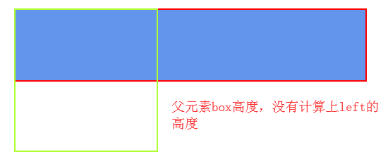
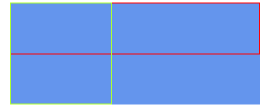
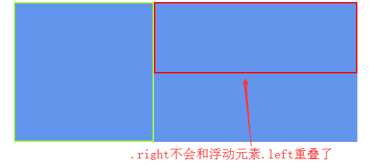
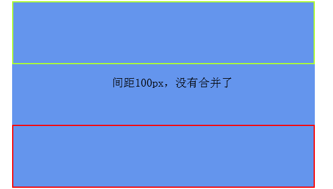
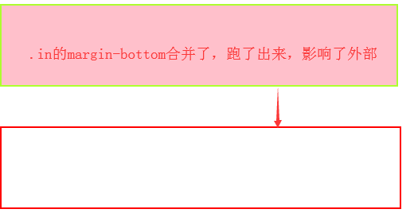
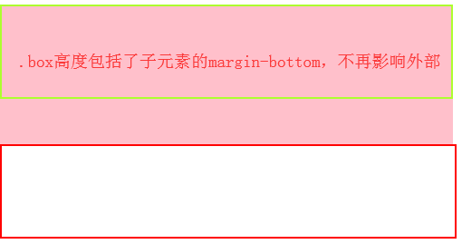
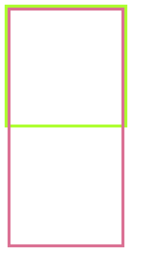
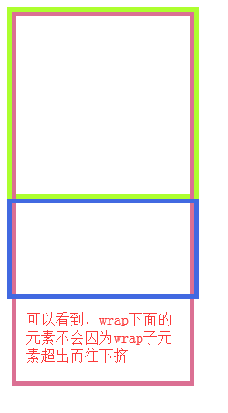
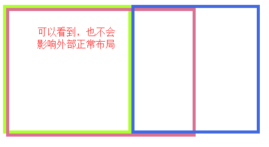

## BFC

### 定义

BFC是 (Block Formatting context)的简称，即块格式化上下文

触发了BFC的元素，其里面的元素和外部元素完全隔离，即子元素布局不会影响外部元素，反之亦然

### 特性

1、BFC的元素高度在计算时，会包括浮动元素

2、BFC块不会和浮动元素重叠

3、属于同一个BFC下的两个相邻元素，垂直margin会发生重叠

4、BFC元素是独立的容器，里面的元素和外部元素完全隔离互不影响

### 触发BFC

1、float不为none

2、overflow: auto、scroll、hidden

3、display: inline-block、table-cell、table-caption

4、position: absolute、fixed

注：\<html>本身就是BFC元素

### 案例

#### 特性一：BFC的元素高度在计算时，会包括浮动元素
    
```html
// DOM结构
<div class="box">
    <div class="left"></div>
    <div class="right"></div>
</div>
```

```css
// 样式
.box {
    width: 500px;
    ...
}
.left {
    width: 200px;
    height: 200px;
    float: left;
    border: 2px solid greenyellow;
}
.right {
    height: 100px;
    border: 2px solid red;
}
```
    
 

```css
// 解决
.box {
    width: 500px;
    ...
    overflow: hidden; // overflow hidden触发BFC，使其高度计算浮动元素
}
```
    
 

（这样便实现了清除浮动）

#### 特征二：BFC块不会和浮动元素重叠

```css
// 调整上例代码
.right {
    height: 100px;
    border: 2px solid red;
    overflow: hidden; // 给.rigth触发BFC
}
```
    
 

（这样便实现了自适应两栏布局）

#### 特征三：属于同一个BFC下的两个相邻元素，垂直margin会发生重叠
    
```html
// DOM结构
<body>
    <div class='box'>
        <div class="top"></div>
        <div class="bottom"></div>
    </div>
</body>
```

```css
// 样式
.box {
    width: 500px;
    overflow: hidden;
    ...
}
.top {
    height: 100px;
    margin-bottom: 50px; // 1、垂直方向margin-bottom: 50px
    border: 2px solid greenyellow;
}
.bottom {
    height: 100px;
    margin-top: 50px; // 2、垂直方向margin-top: 50px
    border: 2px solid red;
}
```
    
 

```js
// 2个元素，都属于同一个BFC即.box之下，所以根据特性，我们只要让它们不在同一个BFC之下即可
```

```html
// 调整代码
// DOM结构
<div class="box">
    <div class="top"></div>
    <!-- 给.bottom套一层父级，并触发它的BFC -->
    <div class="container">
        <div class="bottom"></div>
    </div>
</div>
```

```css
// 样式
.box {
    ...
}
.container {
    overflow: hidden; // 触发BFC，这样.bottom就是属于这个BFC之下，和.top分隔开了
}
.top {
    ...
}
.bottom {
    ...
}
```
    
 

#### 特性四：BFC元素是独立的容器，里面的元素和外部元素完全隔离互不影响

```js
// 上面案例也已经提现了这个特性了
```

```html
// DOM结构
<div class="box">
    <div class="in"></div>
</div>
<div class="out"></div>
```

```css
// 样式
.box {
    width: 500px;
    background-color: pink;
}
.in {
    height: 100px;
    margin-bottom: 50px; // 1、内部.in元素有下外边距50px
    border: 2px solid greenyellow;
}
.out {
    width: 500px;
    height: 100px;
    border: 2px solid red;
}
```
    
 

```css
// 调整代码
.box {
    ...
    overflow: hidden; // 1、给.box触发BFC，内部元素不再影响外部
}
```
    
 

## BFC与常规布局？

通过上述介绍，我们知道BFC让容器的子元素和外界互不影响，即容器内部不会影响容器附近的元素。

这个概念可能使我们对常规布局的理念产生模糊感：

BFC让容器内部子元素不影响容器附近的元素，是不是反过来可以说，我们常规父容器内部元素在一些情况（如超出父容器高度）一定会影响外部布局？

或者说，因为平时开发中我们都会让父容器自适应高度，或者尽量不让子元素不超出父容器，并没有考虑过这个问题？

```html
// DOM结构
<div id="wrap">
    <div class="child"></div>
</div>
```

```css
// 样式
#wrap {
    width: 200px;
    height: 200px;
    border: 5px solid greenyellow;
}
.child {
    height: 400px;
    border: 5px solid palevioletred; // 子元素高度超出父元素
}
```
    
 

**疑问：**

这时wrap下面有一个兄弟元素，它是会正常排列在下方，还是因为.child元素挤到下面？

```html
// DOM结构
<div id="wrap">
    <div class="child"></div>
</div>
<div class="next"></div> // 新增wrap兄弟元素
```

```css
// 样式
.next {
    width: 200px;
    height: 100px;
    border: 5px solid royalblue;
}
```
    
 

**疑问：**

那外边距会影响吗？

```html
    // DOM结构
    <div id="wrap">
        <div class="child"></div>
    </div>
    <div class="next"></div>
    ```
    
    ```css
    // 样式
    #wrap {
        display: inline-block; // 1、水平排列
        width: 200px;
        height: 200px;
        border: 5px solid greenyellow;
    }
    .child {
        width: 300px; // 2、子元素宽度超出
        height: 200px;
        border: 5px solid palevioletred;
        margin-right: 100px; // 3、带右margin
    }
    .next {
        display: inline-block; // 兄弟元素靠wrap右侧排列
        width: 200px;
        height: 200px;
        border: 5px solid royalblue;
    }
    ```
    
 

```js
// 注
BFC主要是解决前面提到的点，并不是指只有BFC触发了，子元素和外部才不会有影响。
本身像子元素宽高超出，存在外边距但不发生合并，就不会影响外部布局

// 用途
知道了子元素布局在一些情况下本身就不会去影响外部，除了有个概念，还有什么用途呢？
确实，在实际开发中我们布局一般不会让这种子元素超出的情况出现，但是之后涉及到封装工具JS库，
这些细节可能就会推翻很多理念

之后，我们在JavaScript的的第20节，会提及这个问题产生的一个应用
```