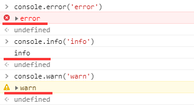
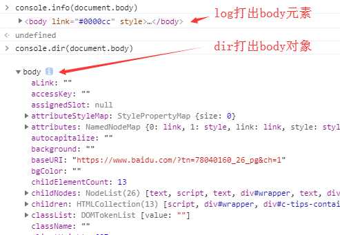

## 注释
    
```js
// 单行注释

/*
    多行注释
*/
```

## 控制台输出console

```js
// 兼容性
>IE8，所以一般打包上线的代码都需要把代码中的console删除，或者插件去除

// 常用调试方法
console.log() 会在浏览器控制台打印出信息
console.dir() 显示一个对象的所有属性和方法

// 一般用于日志组件开发的各种打印方法
console.error()
console.info()
console.warn()
```
    
    

    
```js
// log和dir输出结果差别
```
    


## 弹窗

### 基本alert
    
```js
// 一般用来调试，不过更多的还是用console.log调试
alert('karmiy');
```
    


### 确认弹窗confirm

```js
// 曾经在一些公司老项目用来作为确认框，现在一般不会这样做，太丑了
// 根据点击确定或取消返回true、false
confirm('karmiy');
```
    


### 输入弹窗prompt
    
```js
// 和confirm一样，被老项目用来做输入弹框
// 根据输入的数据作为返回值，点击取消返回null
prompt('karmiy');
```


## 定义变量var
    
```js
// 用法
var x = 2;
var y = 3;
var z = x + y;

// 可以同一个var逗号分开
var x = 2, y = 3, z = x + y; 

// 注：
JavaScript是弱定义，没有任何类型的定义，只有一个var（ES6有let、const），任何类型都可以var出来。变量其实就个内存地址

// 变量命名方式
1、数字 字母 _  $  不能以数字开头
2、严格区分大小写
3、见名知意
4、不能使用已有的 关键字（如var、function、this）/保留字（即现今版本还没有，之后ECMA可能会更新的，如class在ES6里才有）/API（如alert）

// 字符串与变量
var a = 50;

alert(a); // 这里a是变量，弹出50
alert('a'); // 这里a是字符串，弹出a，不报错''双引号，''是字符的标识
```
    

