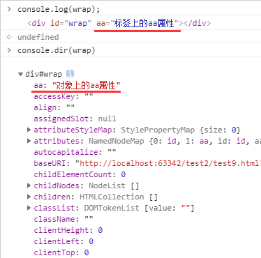

## onload事件

    // 文档全部加载完成后触发，如果把script标签放在<head>中，需要onload执行里面的代码
    window.onload = function() {
        ...
    }
    
    // 注
    不一定是window.onload，可以给任何节点对象
    
    // onload与jQuery的$(document).ready()区别
    1、onload是文档全部加载完成（包括图片加载），jQuery的ready是DOM结构绘制完成（不包括图片加载）
    2、onload只能有一个，多个window.onload只会执行一共，jQuery的ready可以有多个
    
## JS操作标签内容

### innerHTML

    // innerHTML可以解析HTML标签
    // DOM结构
    

        
1

    

    
    var wrap = document.getElementById('wrap');
    // 读取
    console.log(wrap.innerHTML); // 输出"
1
"字符串，注意是字符串
    
    // 写入
    wrap.innerHTML = '
1

2
';
    
    // 当前DOM结构
    

        
1

        
2

    

    
### innerText

    // DOM结构
    

        
123

    

    
    var wrap = document.getElementById('wrap');
    // 读取
    console.log(wrap.innerText); // 输出123字符串
    
    // 写入
    wrap.innerText = 'karmiy';
    
    // 当前DOM结构
    

        karmiy
    

    
### textContent

    // textContent与innerText用法一样
    
    // 区别
    innerText和textContent都不解析HTML标签
    innerText在低版本（2016年版本）火狐不支持，只支持textContent（都兼容）
    
## JS操作标签属性

### 操作合法标签属性（id、class、title等）

    // 合法属性指W3C规定的属性id、class、title、src等属性
    
    // 获取
    var wrap = document.getElementById('wrap');
    console.log(wrap.id);
    console.log(wrap.title);
    console.log(wrap.src);
    
    // 赋值
    wrap.id = 'wrapper';
    wrap.title = 'oTitle';
    wrap.src = 'home.png';
    
    // class比较特殊，是用className属性
    console.log(wrap.className);
    wrap.className = 'karmiy karloy';
    
### 操作自定义标签属性

    // 方法
    setAttribute 设置
    getAttribute 获取
    removeAttribute 移除
    
    // 兼容性
    兼容所有
    
    // 用法
    

    
    wrap.setAttribute('zz', '我自定义的属性'); // 显示 

    wrap.setAttribute('id', 'karmiy'); // 可以设置合法属性，不过不推荐，直接.id就好了
    wrap.setAttribute('class', ''); // 把class属性设为''，还是有这个属性，只是没内容，会显示

    
    wrap.getAttribute('zz'); //输出 '我自定义的属性'
    
    wrap.removeAttribute('class'); // remove会移除属性，即class属性都没了，显示

    
## 操作对象自定义属性

    对象属性不要和标签上的属性弄混
    
    对于：
    

 
    var wrap = document.getElementById('wrap');
    
    wrap是一个HTMLDOM对象
    对于wrap.aa，aa是wrap对象的一个属性，它获取到的并不是wrap.getAtrribute('aa')获取到的值
    要把（对象的属性）与（标签的属性attr）理清区分开
    
    // 示例
    wrap.aa = '对象上的aa属性';
    console.log(wrap);
    console.dir(wrap);
    

    
## 操作标签属性的注意点

### 路径问题

    // js获取的各种路径是绝对路径
    
    
    var oImg = document.querySelector('img');
    console.log(oImg.src); // 输出的是绝对路径，而不是'./1.png';
    
### 标签修改属性后的问题
    
    // 改变属性不会影响获取到的对象
    var wrap = document.getElementById('wrap');
    wrap.id = 'wrapper'; // id改为wrap
    wrap.title = 'myTitle'; // 虽然id被改了，但是不需要重新获取wrap
    
### 动态获取的问题

    
...

    
...

    
...

    
    var oP = document.getElementsByTagName('p'); // 动态获取p标签
    oP[0].className = 'x';
    // 这时第一个p的class被改了，因为getElementsByTagName是动态获取，所以oP变成只有2个了
    
    oP[0].className = 'y';
    // 这时的oP[0]是第二个p了，第一个已经被改了class不再oP集合里了
    
    // 结果
    
...

    
...

    
...

    
    