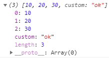
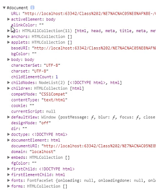
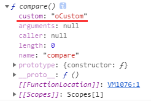
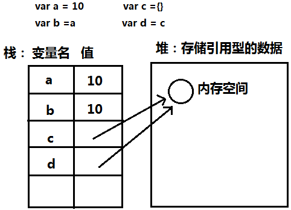

## 数组对象

```js
// 定义
var arr = [];
var arr = [10, 20, '30', true, null, undefined]; // 可以存放任何数据类型

// 使用
var arr = [1, 2, 3];
console.log(arr[1]); // 输出2，因为下标以0开始

// 二维数组
var arr = [
    30,
    'karmiy',
    [
        4,
        5
    ]
]
console.log(arr[2][0]); // 输出4

// 数组长度
var arr = [1, 2, 3, 'karmiy'];
console.log(arr.length); // 输出4

var arr = [1,,2];
console.log(arr.length); // 输出3，如果两个,之间没值，会当做undefined

// 自定义属性（可以看出：数组是以数字作为属性值的特殊对象）
var arr = [10, 20, 30];
arr.custom = 'ok';
console.log(arr);
```
    


## json格式对象

```js
var x = {};
var x = {
    name: 'karmiy' // 属性名可以不加单引号，属性值是字符串要加单引号
}

var value = 'ssss', code = 'uCode';
var x = {
    id: 321,
    name: 'karmiy',
    val: value, // 属性值可以是变量
    [code]: 999, // 属性值在ES5不能是变量，ES6可以[]使用变量
}

// 注
对象的属性名是唯一的

// 取值
var x = {
    id: 321,
    1: 20,
}
console.log(x.id); // 输出321
console.log(x[1]); // 输出20
console.log(x["1"]); // 输出20，前面说过，属性名有无引号都可以
console.log(x.1); // 错误

// 赋值
var x = {
    id: 321,
    1: 20,
}
x.id = 123;
x[1] = 30; 或 x['1'] = 30;
```
    
## 内置对象

```js
// 如window、document等，有很多
```
    


## 节点对象

```js
// 我们获取的DOM节点就是节点对象，如：
var wrap = document.getElementById('wrap');
```
    
## 函数function

```js
// 有名函数
function compare() { // 可以这样定义
    ...
}
var compare = function() { // 也可以这样定义
    ...
}

// 顺序
document.onclick = compare;
function compare() {
    ...
}
函数先使用后定义是可以的，但ES6就不行了，所以不推荐这样做

// 匿名函数
document.onclick = function() {
    ...
}

// 函数执行
compare();

// 函数中的this指向（指向事件触发的主体）
function compare() {
    console.log(this);
}
document.onclick = compare; // 这里this指向document，点击输出document，因为事件是由document触发的，它是本体

compare(); // 这里this是window（严格模式下是undefined），函数自执行触发，没有本体

// 函数添加自定义属性
和数组一样，函数也可以自己加自定义属性，因为它是对象
function compare() {
    ...
}
compare.custom = 'oCustom';
console.dir(compare);
```
    


## 数据类型的赋值问题（JavaScript堆和栈）



```js
1、基础数据类型存储在栈中，引用数据类型存储在堆中
2、var a = 10; var b = a; 会复制一份a的数据给b，a的修改不会影响b
3、var c = {}，c会在堆中开辟一个内存空间，c变量指向它，d = c后，d并不会复制一份，而是也指向它，所以c的改变会影响d

// 示例
var a = 10, b = a;
a = 11;
console.log(a, b); // 输出11, 10，a改变不影响b

var c = { id: 1 }, d = c;
c.id = 2;
console.log(c.id, d.id); // 输出2, 2，同一个引用，会互相影响
```