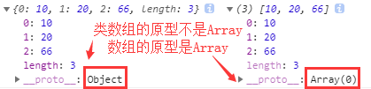
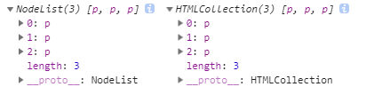

## 伪（类）数组

    // 什么是类数组
    简单来说，就是长得像数组，但不是数组
    
    // 示例
    var t = {
        0: 10,
        1: 20,
        2: 66,
        length: 3,
    }
    var tt = [10, 20, 66];
    
    console.log(t, tt);
    

    // 其他常见类数组
    我们获取的dom元素集合（NodeList、HTMLCollection）就是个类数组
    
    
...

    
...

    
...

    
    var oP = document.querySelectorAll('p');
    var uP = document.getElementsByTagName('p');
    console.log(oP, uP);
    

## typeof操作符

    // 定义
    typeof操作符返回一个字符串，表示未经计算的操作数的类型
    
    // 常规类型
    1、var a = 10; console.log(typeof a); // 输出 "number"
    2、var a; console.log(typeof a); // 输出 "undefined"
    3、var a = 'karmiy'; console.log(typeof a); // 输出 "string"
    4、var a = true; console.log(typeof a); // 输出 "boolean"
    5、var a = {}; console.log(typeof a); // 输出 "object"
    
    // 特殊类型
    6、var a = null; console.log(typeof a); // 输出 "object"（null会得到object，但不代表null是object类型，它是单独的null类型）
    7、var a = []; console.log(typeof a); // 输出 "object"（数组是对象的一种）
    8、var a = document; console.log(typeof a); // 输出 "object"（节点对象是对象的一种）
    9、var a = function(){}; console.log(typeof a); // 输出 "function"（函数会得到function，但它是object类型）
    10、var a = typeof 1; console.log(typeof a); // 输出 "string"（typeof返回结果是字符串）
    
    // 其他作用：用来实现安全判断是否存在
    if( typeof requestAnimationFrame !== 'undefined' ) {
        ...
    }
    
## 数据类型一些常用的内置转换

### Number()

强制转数字
    
    // 常规
    console.log(Number(10)); // 输出10
    console.log(Number('10')); // 输出10
    
    // 特殊
    console.log(Number(false)); // 输出0
    console.log(Number(true)); // 输出1
    console.log(Number('')); // 输出0
    console.log(Number('    ')); // 输出0
    console.log(Number('10zz')); // 输出NaN
    console.log(Number(undefined)); // 输出NaN
    console.log(Number(null)); // 输出0
    console.log(Number([])); // 输出0
    console.log(Number([20])); // 输出20
    console.log(Number([20, 30, 40])); // 输出NaN
    console.log(Number(new Date())); // 输出如1554627803517
    console.log(Number(function(){})); // 输出NaN
    console.log(Number(document)); // 输出NaN
    console.log(Number({})); // 输出NaN
    
    // 注
    参数传number，不变
    参数参string，需要内容是个数值才能转，否则NaN
    参数传Boolean，true为1，false为0
    参数传null，返回0
    参数传Date，返回从1970-01-01到现在的毫秒数
    参数传数组，只有空数组或只有一个项的数组才会返回0或1，否则NaN
    
### String()

强制转字符串

    // 常规
    console.log(String(1)); // 输出"1"
    console.log(String("1")); // 输出"1"
    
    // 特殊
    console.log(String(true)); // 输出"true"
    console.log(String(undefined)); // 输出"undefined"
    console.log(String(null)); // 输出"null"
    console.log(String([])); // 输出""
    console.log(String([20, 30])); // 输出"20,30"
    console.log(String([{id: 1}, {id: 2}])); // 输出"[object Object]"
    console.log(String(new Date())); // 输出如"Sun Apr 07 2019 17:11:09 GMT+0800 (中国标准时间)"
    console.log(String(function(){var i = 1;})); // 输出"function(){var i = 1;}"
    console.log(String(document)); // 输出"[object HTMLDocument]"
    console.log(String({})); // 输出"[object Object]"
    
### Boolean()

强制转Boolean
    
    // 注
    遵循if判断时true和false的数据，除了：
    false、null、undefined、NaN、''、0 是false、其他都是true
    
    
    
    