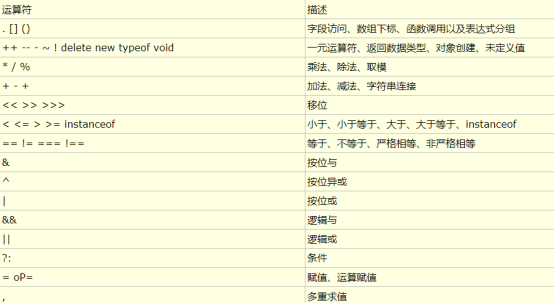

## JS哪些数据类型代表false？

```js
// 注
每一个数据类型在JS里都有他对应的真假值

// 哪些数据在做真假判断的时候是false
false  0  undefined  null  NaN  ""

// 哪些数据在做真假判断的时候是true
除了这些都是true

// 作用
在做如 if(a){...}这种操作时，a会以这些规则被转作true或false
```

## 算术运算符

### 加减乘除

```js
// 加号 +
var a = 1 + 2; // 结果3
var a = 1 + '2'; // 结果'12'（拼接运算）
var a = + '1'; // 结果1（+号前什么都没有，类似于Number()的功能，将数据转数字，转不了NaN）

// 减号 -
var a = 2 - 1; // 结果1
var a = '2' - 1; // 结果1（被当做数字运算）
var a = - 1; // 结果-1（负号）
var a = - '1'; // 结果-1（同+号前面什么都没有一样）

// 除号 /
var a = 10 / 3; // 结果3.3333333333333335

// 取模（取余） % 
var a = 10 % 3; // 结果1
var a = 10.5 % 3 // 结果1.5

// 注：取模%在开发中的作用
1、判断奇偶
2、轮播切换：
比如有5张轮播图，我们一般会设置变量 var index = 0;开启定时器每次累加1，用banners[index]来获取当前轮播图，
当累加到5时，index重置为0，我们可能会这样做：
    index++;
    if(index === 5){
        index = 0;
        ...
    }
其实不需要这样做，可以利用取模来做
    index = index++ % 5
这样当index=5时，自动重置为0，而1-4时不变
```
    
### 自增自减

```js
// 后置自增++、自减--
var a = 9; console.log(a++) ; // 输出10
var a = 9; console.log(a--) ; // 输出8
var a = 9; var b = a++; console.log(a, b); // 输出10,9（后置是先赋值再自增）

// 前置自增--、自减--
var a = 9; var b = ++a; console.log(a, b); // 输出10,10（前置是先自增再赋值）
```

### 隐式类型转换

```js
// +号两边任意一边是string，就会被当做字符串拼接，boolean计算会被当做1或0
var a = 10; var b = '10'; console.log(a + b); // 输出'1010'
var a = null; var b = '10'; console.log(a + b); // 输出'null10'
var a; var b = '10'; console.log(a + b); // 输出'undefined10'
var a = true; var b = 10; cosnole.log(a + b); // 输出11

// -号运算会尽量把两边转换为数字去运算
var a = 10; var b = '5'; console.log(a - b); // 输出5
var a = '10'; var b = '5'; console.log(a - b); // 输出5
var a = 'a'; var b = 'h'; console.log(a - b); // 输出NaN

// ++、--会强制转数字
var a = '9'; a++; console.log(a); // 输出10 
var a = '9'; a--; console.log(a); // 输出8

// 注：单个+号还有特殊操作（字符串转数字）
console.log(+'1'); // 1
```
    
## 赋值运算符

```js
// += 、 - = 、 *= 、 /=
a += 5; -----> a = a + 5
a -= 5; -----> a = a - 5
a *= 5; -----> a = a * 5
a /= 5; -----> a = a / 5
```
    
## 比较运算符

```js
// >、<、==、===
console.log( 5 > 4 ); // 输出true
console.log( 5 < 4 ); // 输出false
console.log( '5' > '30' ); // 输出true（字符串是比较第一个字符的Unicode码）
console.log( 5 == 5 ); // 输出true
console.log( 5 == '5' ); // 输出true（2个等号不是全等）
console.log( undefined == 0 ); // 输出false
console.log( undefined == null ); // 输出true（比较特殊）
console.log( undefined === null ); // 输出true（3个等号是全等判断）

// >= 、<= 、!= 、!==
console.log( 6 != '6' ) // 输出false
console.log( 6 !== '6' ) // 输出true

// 多级
console.log( 1 < 3 < 2 ); // 输出true，JS会按顺序执行，1<3是true，true相当于1，1<2是true
```
    
## 逻辑运算符

```js
// &&、||、!

// 我们理解的逻辑运算符
与&& ：真真为真，真假为假，假真为假，假假为假
或|| ：真真为真，真假为真，假真为真，假假为假
非! ：取反

console.log(true && false); // 输出false
console.log(true }} false); // 输出true
console.log(!true); // 输出false
console.log(!！true); // 输出true
```
    
> &#9733; 贴士 

```js
// JS里的逻辑运算符定理（记住这理念即可）

&&的理念：遇到假，停
||的理念：遇到真，停
! 的理念：强制转boolean

// 示例
console.log(3 && 5 && 0); // 输出0，因为遇到假停，所以走到0停了
console.log(3 && 5 && 9); // 输出9，因为遇到假停，没有假，所以走到最后停了

console.log(2 || 0 || false); // 输出2，因为遇到真停，2是真就停了

console.log(!2); // 输出false，因为除了本节开头提到是那6个，其他都被当做true

// 优先级（! > && > ||）
console.log( 10 && 0 || 3 );  // 输出3
console.log( 10 && 2 || !3 );  // 输出2
```
    
> &#9733; 贴士 

```js
// && 和 || 在项目中的常用点

// &&的使用场景

1、取代if
if( x > 1){
    x ++;
}
改写为
x > 1 && x++;

2、兼容性处理属性、方法是否存在
Array.from && Array.from(...)

// ||的使用场景

1、兼容性处理，例如事件参数兼容处理
document.onclick = function(e) {
    var event = e || window.event;
    ...
}

// && 和 || 联合取代if else
if( x < 5 ) {
    y = 2;
}else {
    y = 3;
}
改写为
y = x < 5 && 2 || 3;

// 面试问到最快将某个数据转化为boolean的方法时
var a = {}; console.log(!!a); // !!是转boolean最快的方法
```
    
## 位运算符
    
> &#9733; 贴士 

位运算是效率最高的喔，问最快的取整是什么？先想到位运算！

```js
// ~按位非（该数的负数-1）
console.log(~12); // 输出-13

// &按位与（判断数的奇偶，任意数 &1，偶数结果0，奇数1）
console.log(2 & 1); // 输出0
console.log(1 & 1); // 输出1

// <<左移（让数值翻2的n次方倍）
console.log(5<<3); // 输出40，即5 * 2的3次方 

// |0（强制取整）
console.log(12.3213123 | 0); // 输出12
```
    
## 逗号运算符

```js
// ，代表语句还没结束，或在一条语句中执行多个事件

var a = 5, b = 10, c = 20; // 多个定义
var x = (1, 2, 3, 4, 5); // x为5，取最后
var x = (console.log(1), console.log(2), 3); // 都会执行，x为3

// 配合&&取代if判断多语句
if( x > 5 ){
    y  = 1;
    console.log(x);
}
改成为
x > 5 && ( y = 1, console.log(x) );
```
    
## JS运算符优先级


    
    