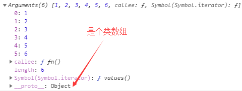

## JS函数

### 有名函数（函数声明、函数表达式）

```js
function fn() {
    ...
}

var fn = function() {
    ...
}

fn(); // 执行

// 区别
第一种是函数声明，第二种是函数表达式
函数声明可以在它代码上面就调用，函数表达式无法在上面调用

即下面这样做的可行的：
fn();
function fn() { ... }

下面这样是不可行的：
fn();
var fn = function() { ... }
```

    
### 匿名函数

```js
// 匿名函数不能单独成为一条语句
document.onclick = function() {
    ...
}

alert(function(){}); // alert时会弹出‘函数体’
```
    
### 函数表达式与自执行

```js
function fn() {

}(); // 这样是错误的，无法()执行

var fn = function(){
    ...
}(); // 这样是可以的，var fn = function这种写法，可以让它变成函数表达式，函数表达式可以自己加()执行

// 函数定义与函数表达式 
函数声明是以function关键字开头，不能()执行
函数表达式是将函数定义为表达式语句，function关键字前有其他元素，就会从函数转变为函数表达式，可以()执行

// 其他函数表达式（函数自执行），一元操作符()、!、+、-、~ 把函数变成函数表达式，就可以让函数自执行
(function() {
    ...
}());

(function() {
    ...
})();

!function() {
    ...
}();

~function() {
    ...
}();

+function() {
    ...
}();

-function() {
    ...
}();

// 作用（开辟一个作用域，立即执行，也常用于闭包）
var a = 10;
(function() {
    var a = 20; // 2个a互不影响
})();
```
    
### 函数参数

```js
// 形参
function fn(a, b) { // a、b是形参
    ...
}


// 实参
fn(1, 2) // 1、2是实参


// 形参与实参数量不对应
function fn(a, b) {
    ...
}
fn(1, 2, 3) // 多一个实参，3在形参取不到

function fn(a, b) {
    ...
}
fn(1); // 多一个形参，b是undefined


// 不定参arguments（所有实参的集合，是一个类数组）
function fn() {
    console.log(arguments);
}
fn(1, 2, 3, 4, 5, 6);
```
    


### 函数返回值
    
```js
function fn(a, b) {
    return a + b;
}
console.log(fn(1, 2)); // 输出3

function fn(a) {
    return function(b) {
        return a + b;
    }
}
console.log(fn(1)(2)); // 输出3（函数柯里化）

// 注
没有return的函数返回undefined
```
    
### 函数的终止符return

```js
function fn(a) {
    if(a > 1)
        return; // return则不会继续往下执行
    return a;
}
```