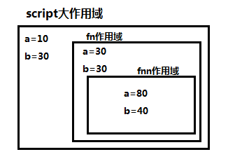

## JS作用域

### 作用域种类
    
    // 全局作用域
    script标签是最大的作用域
    
    
    
    // 函数作用域
    var a = 10;
    var b = 30;
    
    fn(a, b);
    
    // 每个函数{}里，以及它的参数，是一个作用域
    function fn(a, b) {
        var a = 30; 
        var b = 30;
        
        fnn();
        function fnn() {
            var a = 80;
            var b = 40;
        }
    }
    

    
    // 注：if else for没有作用域
    
    // 注：ES6里引入块级作用域的概念，本节省略
    
### 作用域链

    子级找父级：
    
    当我们处于某一个作用域里面使用变量时，先从自身作用域里找改变量，如果找不到，往父级作用域里查找，以此类推，直到script作用域都找不到，报错
    
    当我们处于某一个作用域里修改某个变量的值时，也一样先修改自己的值，假如自己没有，修改父级的，以此类推，直到script作用域都找不到的话，允许它当做一个全局变量（但是严格模式下不能这样，会出错）
    
    注：
    
    如果可以，尽量不要使用全局变量，因为直到页面关闭这些变量一直在，也就表示内存一直开辟着空间给这些全局变量
    
    // 示例一
    var a = 10;
    function fn() {
        a = 20; // 全局script的 a
    }
    fn();
    console.log(a); // 输出20
    
    // 示例二
    var a = 10;
    function fn() {
        var a = 20; // 自己作用域定义的a
    }
    fn();
    console.log(a); // 输出10
    
    // JS允许在某个作用域里设置全局变量（但不建议）
    function fn() {
        a = 20; // 会被当做全局变量
    }
    fn();
    console.log(20); // 输出20
    
    // 多个script作用域之间关系
    
    
    
## JS解析顺序

    // ES5解析顺序可以整体的分为两步：第一步定义，第二步执行
    
    // 定义过程
    1、查找该层作用域所有的var声明的变量，和function定义的有名函数块
    2、var声明的变量名此时仅仅只是变量名，后面=号不会在这一步执行，也就是说这一步，所有var的变量都是初始值undefined
    3、var var重名只留一个，var function重名留function，function function重名留后面
    
    // 执行过程
    1、从上往下执行代码（即我们传统理解的那种）
    2、执行过程中，遇到函数，就开辟新子作用域，此时，会进入新作用域解析里面的代码，同样遵循两项解析步骤
    3、函数解析过程中，内部作用域的变量与形参重名时，解析后定义变量为undefined，会去使用形参的值
    
    // 示例一
    console.log(a);
    f();
    var a = 10;
    function f() {
        console.log(2);
    }
    console.log(a);
    
    解析：
    1、定义
        var a;
        function f() {...}
    2、执行
        console.log(a); // undefined
        f(); // 2
        a = 10;
        console.log(a); // 10
    
    结果：
        undefined 2 10
        
        
    // 示例二
    var x = 5;
    a();
    function a() {
        console.log(x);
        var x = 10;
    }
    console.log(x);
    
    解析：
    1、定义
        var x;
        function a() {...}
    2、执行
        x = 5;
        a();
        函数产生作用域：
            1、定义
                var x;
            2、执行
                console.log(x); // undefined
                x = 10;（自己作用域里的x）
        console.log(x); // 5
    
    结果：
        undefined 5
        
        
    // 示例三
    a();
    function a() {
        console.log(x);
        var x = 10;
    }
    console.log(x);
    
    解析：
    1、定义
        function a() {...}
    2、执行
        a();
        函数产生作用域
            1、定义
                var x;
            2、执行
                console.log(x); // undefined
                x = 10;
        console.log(x); // 报错
        
    结果：
        undefined 报错
        
    
    // 示例四
    function a() {
        console.log(1);
    }
    var a;
    console.log(a);
    
    分析：
        var function重名选function
    
    结果：
        输出函数a的函数体
        ƒ a() {
            console.log(1);
        }
        
    
    // 示例五
    console.log(a);
    var a = 10;
    console.log(a);
    function a() {
        console.log(20);
    }
    console.log(a);
    var a = 30;
    console.log(a);
    function a() {
        console.log(40);
    }
    console.log(a);
    
    解析：
    1、定义
        var function重名选function，function重名选后者，function a() {console.log(40)}
    2、执行
        console.log(a); // 函数体40
        a = 10;
        console.log(a); // 10
        console.log(a); // 10
        a = 30;
        console.log(a); // 30
        console.log(a); // 30
        
    结果：
        ƒ a() {
            console.log(40);
        } 
        10 
        10 
        30 
        30
        
        
    // 示例六
    var a = 10;
    console.log(a);
    a();
    function a() {
        console.log(20);
    }
    
    解析：
    1、定义
        function a() { ... }
    2、执行
        a = 10;
        console.log(a); // 10
        a(); // 报错（这时a是10）
        
    
    // 示例七
    a();
    var a = function() { console.log(1) };
    a();
    function a() { console.log(2) };
    a();
    var a = function() { console.log(3) };
    a();
    
    解析：
    1、定义
        function a() { console.log(2) }
    2、执行
        a(); // 2
        a = function() { console.log(1) }
        a(); // 1
        a(); // 1
        a = function() { console.log(3) }
        a(); // 3
        
    结果：
        2 1 1 3
        
    
    // 示例八
    var a = 10;
    function fn() {
        console.log(a);
        var a = 1;
        console.log(a);
    }
    fn();
    console.log(a);
    
    解析：
    1、定义
        var a;
        function fn() {...}
    2、执行
        a = 10;
        fn();
        函数产生作用域
            1、定义
                var a;
            2、执行
                console.log(a); // undefined
                a = 1;
                console.log(a); // 1
        console.log(a); // 10
        
    结果：
        undefined 1 10
        
    
    // 示例九
    fn();
    console.log(a);
    var a = 10;
    console.log(a);
    function fn() {
        var a = 1;
    }
    
    解析：
    1、定义
        var a;
        function fn() {...}
    2、执行
        fn();
        console.log(a); // undefined
        a = 10;
        console.log(a); // 10
    
    结果：
        undefined 10

    // 示例十（执行过程观点3示例）
    function fn(a){
        console.log( a );
        var a = 'abc';
    }
    fn(10);

    解析：
    1、定义
        var a;
    2、执行
        a为undefined，使用形参接收到10，a = 10;
        console.log(a); // 10
        a = 'abc'

    // 示例十一
    function fn(a){
        console.log( a );
        function a() {}
        var a = 20;
    }
    fn(10);

    解析：
    1、定义
        function a() {};
        var a;
        重名取
        function
    2、执行
        console.log(a); // ƒ a() {}
        a = 20
    
## JS写法与内存问题
    
    var lst = document.querySelectorAll('li');
    for(var i=0; i< 10; i++) {
        lst[i].onclick = function() { // 我们在循环给DOM元素绑定事件时经常会这样做
            ...
        }
    }
    
    // 存在的问题：
    会产生10个不同的function，有10个内存空间去存储
    
    // 改写
    function fn() {
        ...
    }
    var lst = document.querySelectorAll('li');
    for(var i=0; i< 10; i++) {
        lst[i].onclick = fn; // 这样只会有一个内存空间
    }
    
## JS给监听事件传参
    
    function fn(a, b) {
        ...
    }
    wrap.onclick = fn;
    
    // 如果我们想给fn传参，可以这样
    wrap.onclick = function() {
        fn(1, true);
    }