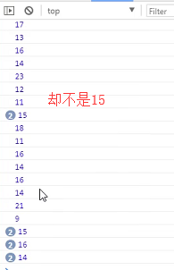
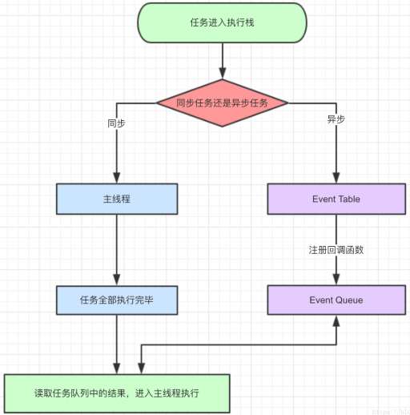

## for in遍历对象

    // 示例
    var obj = {
        id: 1,
        name: 'karmiy',
        code: 'a3982',
    }
    for(var key in obj) {
        console.log(key, obj[key]);
    }
    /*
        输出：
        'id' 1
        'name' 'karmiy'
        'code' 'a3982'
    */

## setTimeout、setInterval定时器

### 基本用法

    // 说明
    参数说明：(callback, time)，回调函数、延迟时间（单位毫秒）
    setTimeout 只执行一次
    setInterval 会重复执行
    
    // 示例
    function fn() {
        console.log(2);
    }
    setTimeout(fn, 2000); // 2s后执行函数fn
    setInterval(fn, 2000); // 每2s执行一次fn，第一次在2s后
    
    // 传递字符串
    setTimeout('fn()', 2000); // 会把字符串'fn()'当做JS代码去执行，所以2s后会执行fn
    
    (function() {
        setTimeout('a()', 2000); // 错误，字符串写法只能访问到全局下的a
        
        function a() {
            ...
        }
    })();
    
### 定时器的返回值、清除定时器

    // 定时器的返回值是个数字，代表当前定时器的序号
    function fn() {
        console.log(2);
    }
    // x、y是个数字！
    var x = setTimeout(fn, 2000);
    var y = setInterval(fn, 2000);
    
    clearTimeout(x); // 清除setTimeout定时器，一般用于阻止fn执行
    clearInterval(y); // 定出setInterval定时器，项目开发中都需要记得在离开时清除定时器
    
    // 清除定时器后，本次执行的代码会继续执行完而不会中断
    var time = setInterval(function() {
        if(...) {
            clearInterval(time);
        }
        ... // 即使上面清除了定时器，本次循环剩余的代码也会执行完不会中断
    })
    
### setTimeout(fn, 0)

    // 如果我们希望回调在代码主程序都执行完后再执行，可以使用setTimeout 0
    setTimeout(function() {
        console.log(1);
    }, 0);
    console.log(2);
    // 会先输出2，再输出1
    
    // 注
    即使设置0秒延时，最少也会是4ms
    
### 关于帧数

    帧数表示计算器每秒发送多少个画面，帧数越高动画看起来越流畅，人眼分辨的帧数一般在60帧。
    所以我们经常会发现像LOL这样的游戏，FPS小于60画面就忍不了了
    
### 定时器的准确性

    var now = Date.now();
    setInterval(function() {
        var time = Date.now();
        console.log(time - now);
        now = time;
    }, 15);
    

    准确性：
    定时器的时间不靠谱，只能做到时间在设置时间左右
    误差与浏览器刷新频率、电脑配置等因数有关
    越小误差越大，且浏览器是有最小刷新频率的
    
### setTimeout替代setInterval

    // setInterval每过指定时间，就会向队列塞入一个函数，不管上一次结束了没有，这样可能会存在前一次还没执行完，下一次已经开始的情况
    setInterval(function() {
        ... // 可能内容非常丰富，10s内执行不完，导致还没执行完下次循环已经开始
    }, 10);
    
    // setTimeout替代setInterval解决问题
    var a = setTimeout(fn ,10);
    function fn() {
        ...
        a = setTimeout(fn, 10);
    }
    
### 给定时器传参

    function fn(x, y) {
        ...
    }
    setTimeout(fn, 2000, 5, 3); // 5、3 即传递给fn的参数
    
## requestAnimationFrame

### 基本使用

    // H5新的定时器API，兼容性：IE >= 10
    
    // 说明
    把每一帧中的所有 DOM 操作集中起来，在一次重绘或回流中就完成，并且重绘或回流的时间间隔紧紧跟随浏览器的刷新频率
    和setTimeout比较像，也只执行一次，但是不能自主设置时间，不是一个定值，它是根据浏览器来定的时间
    
    setInterval比如设置15ms，每15ms走一次，假如浏览器稍微慢一点才能响应重绘页面，即刷新频率达不到15，总是会出现掉帧，不流畅的感觉。
    requestAnimationFrame是贴合浏览器来的，浏览器准备就绪，它就什么时候执行，即完全贴合浏览器的刷新频率
    
    // 示例
    var wrap = document.getElementById('wrap'),
        initW = 0;
    !function move() {
        initW += 2;
        wrap.style.width = initW + 'px';
        ...
        requestAnimationFrame(move);
    }();
    
### 清除requestAnimationFrame

    var wrap = document.getElementById('wrap'),
        initW = 0,
        time = null;
    !function move() {
        initW += 2;
        wrap.style.width = initW + 'px';
        ...
        if(initW === 100) {
            cancelAnimationFrame(time); // 清除requestAnimationFrame
        }
        time = requestAnimationFrame(move);
    }();
    
### 基本的兼容性写法

    window.requestAnimationFrame || (window.requestAnimationFrame = function(fn) {
        return setTimeout(fn, 1000/60);
    })
    window.cancelAnimationFrame || (window.cancelAnimationFrame = clearTimeout)
    
### 进阶的兼容性封装
    // 注
    以下封装requestAnimationFrame，可于项目开发中作为工具类使用
    涉及部分ES6知识

    // js模块化写法
    const availablePrefix = ['moz', 'ms', 'webkit'];
    
    const requestAnimationFramePolyfill = () => {
        let lastTime = 0;
        return function (callback) {
            const currTime = new Date().getTime();
            const timeToCall = Math.max(0, 16 - (currTime - lastTime));
            const id = window.setTimeout(() => {
                callback(currTime + timeToCall);
            }, timeToCall);
            return id;
        }
    }
    
    const getRequestAnimationFrame = () => {
        if(typeof window === 'undefined') {
            return () => null;
        }
        if(window.requestAnimationFrame) {
            return window.requestAnimationFrame.bind(window);
        }
        
        const prefix = availablePrefix.filter(key => `${key}RequestAnimationFrame` in window)[0];
        
        return prefix 
            ? window[`${prefix}RequestAnimationFrame`]
            : requestAnimationFramePolyfill();
    }
    
    const cancelRequestAnimationFrame = (id) => {
        if(typeof window === 'undefined') {
            return null;
        }
        if(window.cancelAnimationFrame) {
            return window.cancelAnimationFrame(id);
        }
        
        const prefix = availablePrefix.filter(key => 
            `${key}CancelAnimationFrame` in window || `${key}CancelRequestAnimationFrame` in window
        )[0];
        
        return prefix ?
            (
                window[`${prefix}CancelAnimationFrame`] ||
                window[`${prefix}CancelRequestAnimationFrame`]
            ).call(this, id) : clearTimeout(id);
    }
    
    const raf = getRequestAnimationFrame();
    raf.cancel = cancelRequestAnimationFrame;
    export const raf;
    
    // 使用
    var wrap = document.getElementById('wrap'),
        initW = 0,
        time = null;
    !function move() {
        initW += 2;
        wrap.style.width = initW + 'px';
        ...
        if(initW === 100) {
            raf.cancel(time); // 清除requestAnimationFrame
        }
        time = raf(move);
    }();

### npm源requestAnimationFrame的polyfill包

[https://github.com/chrisdickinson/raf](https://github.com/chrisdickinson/raf)

## 事件循环与任务队列

面试可能经常会提问：请描述什么是事件循环？什么是任务队列？

这里我们从JavaScript的运行机制来阐述：

### JavaScript是单线程

    单线程，即同一个时间只能做一件事情。JavaScript单线程与其用途有关，如果不是单线程，当我们在一个线程中正在给某个DOM元
    素新增内容，另一个线程对其进行删除，这便会造成管理混乱。虽然JavaScript是单线程，但是由于存在着同步与异步的概念，解决
    了阻碍的问题
    
### 同步任务

    如果在一个函数返回的时候，调用者就能够得到预期结果，这个函数便是同步的
    
    var a = 1;
    a++;
    console.log(a); // 2
    
### 异步任务

    如果在函数返回的时候，调用者还不能够得到预期结果，而是需要在将来通过一定的手段得到，那么这个函数就是异步的
    
    var a = 0;
    setTime(function() {
        a = 1;
    }, 200);
    console.log(a); // 0
    
### 同步与异步的差别

    同步方法调用一旦开始，调用者必须等到方法调用返回后，才能继续后续的行为
    
    异步方法一旦开始，方法调用就会立即返回，调用者就可以继续后续的操作。而异步方法通常会在另外一个线程中，“真实”地执行
    着。整个过程，不会阻碍调用者的工作
    
### 任务（事件）队列

    JavaScript的任务分为同步任务与异步任务
    
    同步任务是指在 "主线程" 上排列执行的任务，只有前一个任务执行完毕，才能执行后一个任务
    
    异步任务是指，不进入主线程，而是进入"任务队列"，只有任务队列通知主线程，某个异步任务可以执行了，该任务才会进入主线程执行
    
    // 示例
    console.log(1);
    setTime(function() {
        console.log(2);
    }, 200);
    console.log(3);
    
    // 分析
    JavaScript代码从上往下执行，执行第一行代码时输出1，执行到第二行遇到setTimeout函数，而它是异步函数，浏览器会这个事件的
    回调函数入栈到任务队列中，而此时主线程继续往下进行，到console.log(3)输出3。这时主线程空了，它会去任务队里查找是否有可
    执行的任务，有的话拿出来执行，没有的话会不断去询问，等到有可以执行的
    

    // 流程
    1、同步任务都在主线程上执行，形成执行栈，将异步任务的回调函数都放入任务队列
    2、主线程任务执行完成，执行栈为空时，检测任务队列是否为空，为空则继续检查，否则执行第3步
    3、任务队列的一个事件出列，压入执行栈，执行任务
    4、执行完毕，执行栈为空，跳回第2步
    
### 事件循环

    事件循环：指主线程重复从任务队列中取消息，执行的过程。入栈出栈的循环，其实就是我们上述的流程
    
### 宏任务与微任务

    // 任务又分为宏任务与微任务
    
    Macro Task宏任务：
    1、创建文档对象、解析 HTML、执行主线程代码script
    2、执行各种事件：页面加载、输入、点击
    3、setTimeout setInterval setImmediate I/O UI rendering
    
    Micro Task微任务：
    process.nextTick Promises Object.observe MutationObserver
    
    // 宏任务与微任务执行优先级：
    一次事件循环只会提取一个宏任务执行，微任务会全部提取
    完成一个宏任务后，执行余下的微任务
    同一次事件循环中，宏任务永远在微任务之前执行
    
    // 示例
    console.log(1);
    
    setTimeout(function() {
        console.log(2);
        new Promise(resolve => {
            console.log(3);
            resolve(4);
            console.log(5);
        }).then(data => {
            console.log(data);
        });
    }, 0);
    
    new Promise(resolve => {
        console.log(6);
        resolve(7);
        console.log(8);
    }).then(data => {
        console.log(data);
    });
    
    setTimeout(function() {
        console.log(9);
    }, 0);
    
    console.log(10);
    
    // 结果
    第一次事件循环：
    // 1
    // 6
    // 8
    // 10
    // 7
    
    第二次事件循环：
    // 2
    // 3
    // 5
    // 4
    
    
    第三次事件循环
    // 9
    
    // 分析
    1、进入第1次事件循环，执行script主线程代码（主线程我们上面说了也是一个宏任务），输出1
    2、第一个setTimeout的回调被加入宏任务队列，我们标记为 "A" ，准备在第2次事件循环时调用
    3、遇到Promise，它的初始化的代码会立即执行，输出6、8
    4、Promise的回调被加入微任务队列，我们标记为 "a"
    5、第二个setTimeout的回调被加入宏任务队列，我们标记为 "B" ，准备在第3次事件循环中调用
    6、继续调用栈，输出10
    7、第一次事件循环的宏任务执行完毕，执行余下所有微任务，即前一个Promise的回调 "a" ，输出7，第1次事件循环完毕
    
    8、进入第2次事件循环，发现有宏任务，即 "A" ，输出2
    9、遇到Promise，它的初始化的代码会立即执行，输出3、5，它的回调被加入微任务队列，我们标记 "b"
    10、第二次事件循环的宏任务执行完毕，执行余下所有微任务，即 "b"，输出4，第2次事件循环完毕
    
    11、进入第3次事件循环，只有一个宏任务 "B"，输出9