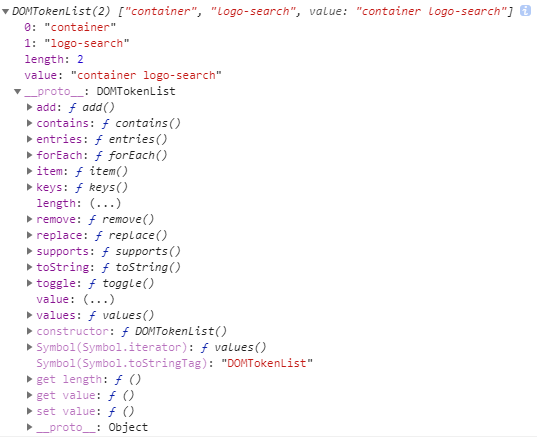
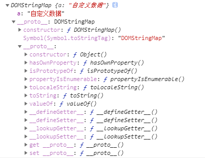

## classList

```text
// 说明
H5的新API，返回DOM元素的class集合，用于操作class，是个DOMTokenList对象，伪数组
兼容性：部分兼容  >= IE10
```
    


### add
    
```html
// 说明
添加class类名

// 示例
<div id='wrap' class='w'>...</div>
```

```js
wrap.classList.add('t'); // 添加类名't'
wrap.classList.add('w'); // 已有类名'w'，不会有变化
wrap.classList.add('tt', 'ttt'); // 添加多个类名't' 'tt'
console.log(wrap.className); // 'w t tt ttt'
```
    
### remove

```html
// 说明
移除class类名

// 示例
<div id='wrap' class='w t tt ttt'>...</div>
```

```js
wrap.classList.remove('t'); // 移除类名't'
wrap.classList.remove('tt', 'ttt'); // 移除多个类名'tt' 'ttt'
console.log(wrap.className); // 'w'
```
    
### toggle

```html
// 说明
切换class类名，有就删，没有就加

// 示例
<div id='wrap' class='w t tt ttt'>...</div>
```

```js
wrap.classList.toggle('t'); // 已有't'，删除
console.log(wrap.className); // 'w tt ttt'
wrap.classList.toggle('a'); // 没有'a'，添加
console.log(wrap.className); // 'w tt ttt a'

// 注
不支持多个参数
```
    
### contains

```js
// 说明
判断元素是否包含指定类名，返回true或false

// 示例
<div id='wrap' class='w t tt ttt'>...</div>
```

```js
wrap.classList.contains('t'); // true
wrap.classList.contains('a'); // false
```
    
### 封装classList兼容
    
```js
function containsClass(ele, cName) {
    var reg = new RegExp("(\\s|^)" + cName + "(\\s|$)");
    if(reg.test(ele.className))
        return true;
    return false;
}

function addClass(ele, cName) {
    if(ele.classList) {
        ele.classList.add(cName);
    }else {
        var preName = ele.className;
        if(preName) {
            var reg = new RegExp("(\\s|^)" + cName + "(\\s|$)");
            if(reg.test(preName))
                return;
            ele.className += "" + cMame;
        }else {
            ele.className = cName;
        }
    }
}

function removeClass(ele, cName) {
    if(ele.classList) {
        ele.classList.remove(cName);
    }else {
        var preName = ele.className;
        var reg = new RegExp("(\\s|^)" + cName + "(\\s|$)");
        ele.className = preName.replace(reg, '').trim();
    }
}

function toggleClass(ele, cName) {
    containsClass(ele, cName) ? removeClass(ele, cName) : addClass(ele, cName);
}
```
    
## dataset

```html
// 说明
H5新API，存储data-XX的自定义属性，是个DOMStringMap对象
经常我们会看到做图片懒加载时，未加载的属性会是data-src存储图片路径

// 示例
<div id='box' data-a='自定义数据'></div>
```
    
```js
console.log(box.dataset);
```
    


### 增删改查
    
```html
<div id='box' data-a-b-c='karmiy'></div>
```
    
```js
// 1、查
console.log(box.dataset['aBC']); // 'karmiy'，驼峰命名，如data-abc-de-fgh是abcDeFgh
或
console.log(box.getAttribute('data-a-b-c'));

// 2、改
box.dataset['aBC'] = 'karloy';
或
box.setAttribute('data-a-b-c', 'karloy');

// 3、删
box.dataset['aBC'] = ''; // 删除后会是<div id='box' data-a-b-c></div>
或
box.setAttribute('data-a-b-c', ''); // 同上
box.removeAttribute('data-a-b-c'); // 删除后会是<div id='box'></div>

// 4、增
box.dataset['bCD'] = 'karloy'; // <div id='box' data-a-b-c='karmiy' data-b-c-d='karloy'></div>
```