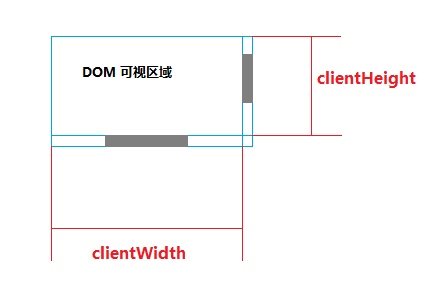
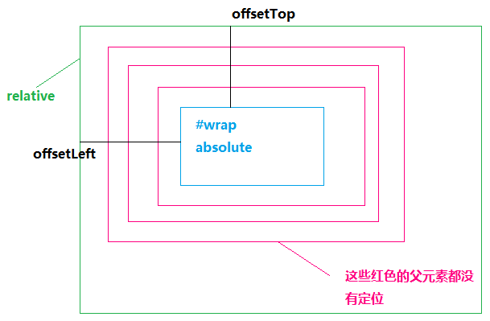

## 获取元素的宽高

兼容性: 在低版本IE可能存在误差

### clientWidth/clientHeight

    // 说明
    获取元素可视区域的宽高
    width + padding（不包括出现的滚动条占据的宽度，边框）
    只能获取，不能赋值，返回number数值
    
    console.log(wrap.clientWidth);
    

### offsetWidth/offsetHeight

    // 说明
    获取元素整体的实际宽高
    width + padding + border + 出现的滚动条占据的宽度
    只能获取，不能赋值，返回number数值
    
    console.log(wrap.offsetWidth);
    

### scrollWidth/scrollHeight

    // 说明
    获取元素内容的实际宽高
    没有滚动条时scrollWidth === clientWidth
    当元素内部过宽，出现滚动条时，scrollWidth是其实际内容的宽度
    只能获取，不能赋值，返回number数值
    
    console.log(wrap.scrollWidth);
    

### innerWidth/innerHeight

    // 说明
    获取窗口可视区域大小，是window的属性
    包括滚动条占据的宽度
    兼容性： > IE8
    只能获取，不能赋值，返回number数值
    
    console.log(window.innerWidth);

## 获取元素偏移

### scrollLeft/scrollTop
    
    // 说明
    获取元素的垂直滚动高度、水平滚动偏移
    可以获取和赋值，返回number数值
    
    console.log(wrap.scrollTop);
    

    // 获取浏览器滚动高度
    Math.max(document.documentElement.scrollTop, document.body.scrollTop);
    
    // 页面滚动到400px的位置
    document.documentElement.scrollTop = document.body.scrollTop = 400;
    或
    window.scrollTop(0, 400);

### offsetLeft/offsetTop

    // 说明
    获取元素到定位父级的距离
    只能获取，不能赋值，返回number数值
    

    // 如何获取元素到body的距离
    function getOffset(dom) {
        var offset = {
            left: 0,
            top: 0,
        };
        while( dom !== document.body) {
            offset.top += dom.offsetTop;
            offset.left += dom.offsetLeft;
            dom = dom.offsetParent;
        }
        return offset;
    }
    
