## 获取元素的宽高

兼容性: 在低版本IE可能存在误差

### clientWidth/clientHeight

    // 说明
    获取元素可视区域的宽高
    width + padding（不包括出现的滚动条占据的宽度，边框）
    只能获取，不能赋值，返回number数值
    
    console.log(wrap.clientWidth);
    
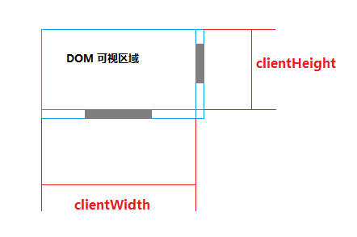

### offsetWidth/offsetHeight

    // 说明
    获取元素整体的实际宽高
    width + padding + border + 出现的滚动条占据的宽度
    只能获取，不能赋值，返回number数值
    
    console.log(wrap.offsetWidth);
    
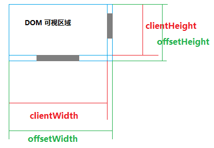

### scrollWidth/scrollHeight

    // 说明
    获取元素内容的实际宽高
    width + padding（不包括边框）
    正常情况下时scrollWidth === clientWidth
    当元素内部过宽过高时，scrollWidth是其实际内容的宽度
    只能获取，不能赋值，返回number数值
    
    console.log(wrap.scrollWidth);
    
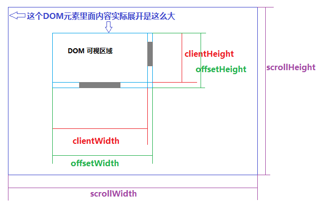

### innerWidth/innerHeight

    // 说明
    获取窗口可视区域大小，是window的属性
    包括滚动条占据的宽度
    兼容性： > IE8
    只能获取，不能赋值，返回number数值
    
    console.log(window.innerWidth);

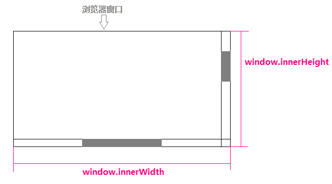

## 获取元素偏移

### scrollLeft/scrollTop
    
    // 说明
    获取元素的垂直滚动高度、水平滚动偏移
    可以获取和赋值，返回number数值
    
    console.log(wrap.scrollTop);
    
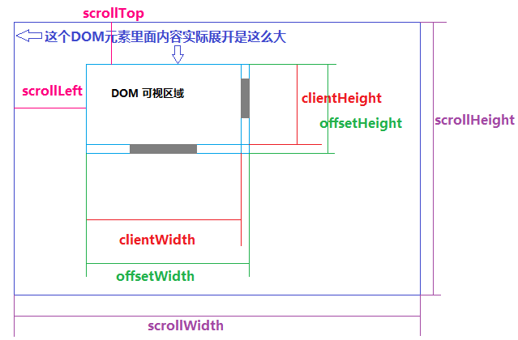

    // 获取浏览器滚动高度(有的浏览器通过body可以获取，有的通过html)
    Math.max(document.documentElement.scrollTop, document.body.scrollTop);
    
    // 页面滚动到400px的位置
    document.documentElement.scrollTop = document.body.scrollTop = 400;
    或
    window.scrollTop(0, 400);
    
### pageXOffset、pageYOffset

    // 获取window的滚动高度、水平滚动偏移
    兼容性 >= IE9，IE8及以下用上例document.body、document.documentElement的滚动距离
    
    console.log(window.pageXOffset, window.pageYOffset);
    

### offsetLeft/offsetTop

    // 说明
    获取元素到定位父级的距离
    只能获取，不能赋值，返回number数值
    
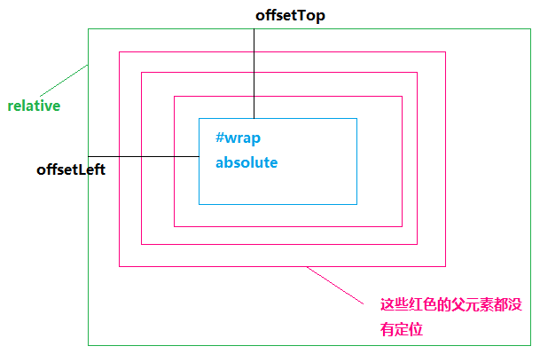

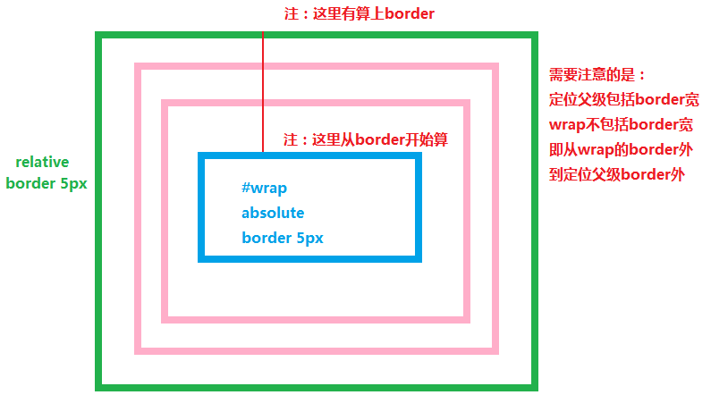

    // 如何获取元素到body的距离
    function getOffset(dom) {
        var offset = {
            left: 0,
            top: 0,
        };
        while( dom !== document.body) {
            offset.top += dom.offsetTop;
            offset.left += dom.offsetLeft;
            dom = dom.offsetParent;
        }
        return offset;
    }
    
    // 特殊情况， translate造成的偏移对offsetLeft/Top无效
    div {
        position: relative;
        width: 200px;
        height: 100px;
        border: 1px solid #1394ff;
    }
    p {
        position: relative;
        width: 50px;
        height: 50px;
        background-color: #8AC763;
        margin-left: 50px; // 元素margin-left偏移
    }
    
    

        

    

    
    const p = document.querySelector('p')
    console.log(p.offsetLeft); // 输出50
    
    修改样式如下:
    p {
        position: relative;
        width: 50px;
        height: 50px;
        background-color: #8AC763;
        transform: translate(50px); // 改为translate偏移
    }
    
    console.log(p.offsetLeft); // 输出0
    
    
## getBoundingClientRect

    // 获取元素全方位宽高、偏移信息，返回一个对象
    // 兼容性：
        IE下返回的对象没有x、y这2个属性，可以用left、top替代
        >= IE9,包含width、height、top、right、bottom、left
        IE9 > X > IE6：包含top、right、bottom、left,缺少width、height
        
    // 示例
    console.log(wrap.getBoundingClientRect());
    
    // 返回结果
    {
        x: 574.5,
        y: 100,
        left: 574.5,
        top: 100,
        bottom: 300,
        right: 774.5,
        height: 200,
        width: 200,
    }
    
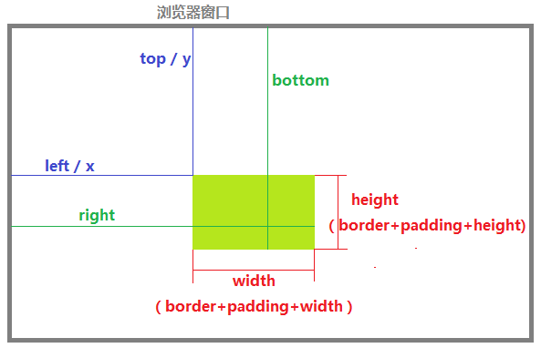

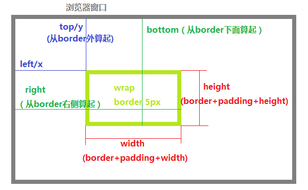

    // 应用场景
    非常多，大多与滚动有关的计算都会用到，如图片懒加载等
    
## 获取元素样式集合

### getComputedStyle

    // 说明
    获取元素样式的集合，返回一个对象
    兼容性： >= IE9
    
    // 示例
    console.log(getComputedStyle(wrap));
    console.log(getComputedStyle(wrap).borderTopWidth);
    
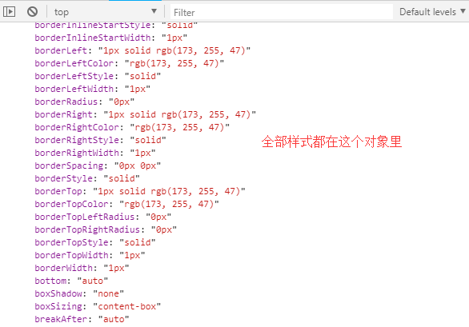

    // 注
    属性如宽度，设置百分比50%，获取也是获取到像素值，即最终都会转化为PX；
    颜色值获取的大多是rgb（根据浏览器），所以不要做对等判断
    
    // 配合
    取宽高那些会得到字符串如'500px'，可以配合parseFloat获取数值喔
    
### dom.currentStyle

    // 说明
    获取元素样式的集合，返回一个对象
    兼容性：全部IE，只有IE有效
    
    // 示例
    console.log(wrap.currentStyle)
    console.log(wrap.currentStyle.borderTopWidth)
    
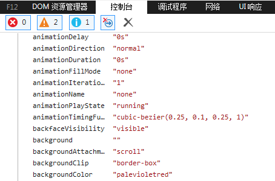

### 兼容性polyfill

    window.getComputedStyle = 
        window.getComputedStyle || function(dom) {
        return dom.currentStyle;
    }
    
## 判断一个元素是否有滚动条

**用途？**

假如你正在开发一个弹框组件，思路是创建一个div，添加到父级里**最近有滚动条**的元素上，绝对定位。该滚动条元素相对定位，找不到添加到body下，这样当滚动元素在滚动时，弹框就可以始终保持在原位

**如何去判断？**

    function hasScroll(target) {
        return target.scrollHeight > target.clientHeight;
    }

网上提供的思路，几乎全是利用clientHeight与scrollHeight去比较，当scrollHeight > clientHeight时，返回true。

这样一看确实非常合理，当没有滚动条时，好像都是height + padding，滚动高度等于可视高度，出现滚动条时滚动高度大于可视高度，然而这样的做法是错的。

**还记得BFC那节提到过的子元素高度超出父容器是否影响外部的问题吗？**

    // DOM结构
    

        

    

    
    // 样式
    #wrap {
        width: 200px;
        height: 200px;
        border: 5px solid greenyellow;
    }
    .child {
        height: 400px;
        border: 5px solid palevioletred;
    }
    
    // JS
    console.log(wrap.clientHeight, wrap.scrollHeight);

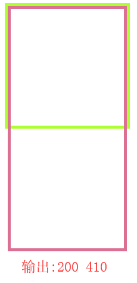

可以看到，即使元素没有滚动条，在子元素高度超出的情况下，scrollHeight也是大于clientHeight的，所以单纯这样判断并不严谨。

**其他情况**

我们可能会觉得，一般不会让这种情况出现，即我们不会定死父元素的高度并且还让子元素超出。

确实，但是如果是下面这种情况呢？

    // DOM结构
    

        

    

    
    // 样式
    #wrap {
        width: 200px;
        border: 5px solid greenyellow;
    }
    .child {
        position: relative;
        height: 400px;
        border: 5px solid palevioletred;
        top: 1px;
    }
    
    // JS
    console.log(wrap.clientHeight, wrap.scrollHeight);
    
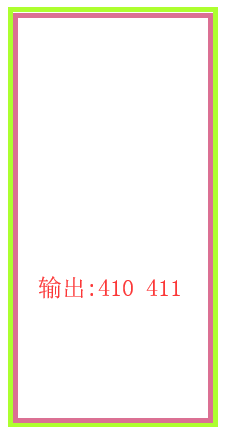

父元素没有设置高度，由子元素撑开，但是子元素relative定位后，有1px的top值，导致scrollHeight比clientHeight大了1px。

这是一些页面开发、组件开发中很容易遇到的一种BUG产生原因：我们不给所有层级的父元素设置宽高，由最内部撑开，却发现最外层的容器宽高与内部不一致。

除了这种情况，子元素超出，即使设置overflow: hidden，scrollHeight依旧也是大于clientHeight的。

**如何更严谨的判断一个元素是否有滚动条？**

排除\<body>和\<html>，这是2个非常特殊的元素，下面我们在提及它们。那么，一个元素要出现滚动条，需要什么？

常规元素滚动条的出现，并不是单纯内部超出自动产生的，而是需要我们去设置overflow为scroll或auto。反过来说，一个元素有滚动条，那它应该要有overflow是auto或scroll的样式，判断函数如下：
    
    /**
     * des：是否有滚动条（这里我们只判断垂直滚动条）
     * params: target: DOMElement 
     */
    function isScrollTarget(target) {
        if(!target)
          return false;
        
        // 只取overflowY，不管样式是设置overflow: auto/scroll，还是overflowY: auto/scroll，取overflowY都可以得到结果
        var overflowY = DOMComputedStyle(target).overflowY;
        return (overflowY === 'auto' || overflowY === 'scroll') && (target.scrollHeight > target.clientHeight);
    }
    
    function DOMComputedStyle(dom) {
        return getComputedStyle ? getComputedStyle(dom) : dom.currentStyle;
    }
    
**关于body、html的滚动条**

平时我们说的如“页面上body的滚动条”是错误的说法，严谨的来说，这是浏览器本身的滚动条，既不是body，也不是html的。

一个元素如果有滚条，我们在开发者工具Elements鼠标选中它时，是呈现这种效果：

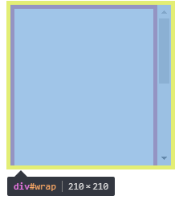

可以看到，开发者工具为了我们提供的蓝色蒙层，是包括滚动条的区域的。

再看浏览器出现滚动条时，body的情况（内部元素height: 2000px）：

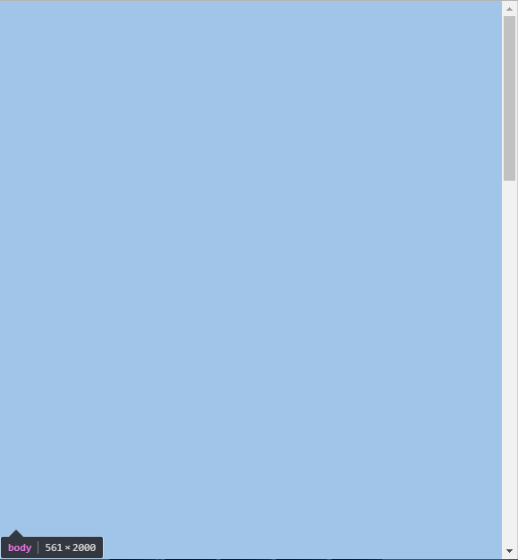

可以看到，body的蓝色蒙层不包括这个滚动条，更主要的是，body的高度也是2000px。假如这是body的滚动条，那body的高度应该是浏览器的innerHeight高度，剩余高度产生出这个滚动条才对，可见这个滚动条严格来说并不是body的，html也同理。

但是非常矛盾的是，我们给body或html标签设置overflow: hidden的时候，滚动条却消失了。

可见html与body是非常特殊的标签，可以想象为浏览器把滚动条的操作权交给了它们来代理，滚动条并不属于它们，却有权利去操作。
