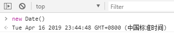

## 日期Date对象

### 基本用法
    
    // 获取当前系统时间信息
    var d = new Date();
    console.log(d);
    

### 获取年月日时分秒周

    // 注
    获取的是number数字，不是string字符串
    
    var d = new Date();
    console.log(d.getFullYear()); // 2019
    console.log(d.getMonth()); // 3（从0计起）
    console.log(d.getDate()); // 16
    console.log(d.getHours()); // 23
    console.log(d.getMinutes()); // 50
    console.log(d.getSeconds()); // 0
    console.log(d.getDay()); // 2（周二，周天是0）
    
### 获取时间戳

    // 1970年到现在的毫秒数
    console.log(new Date().getTime()); // 1555599944820
    console.log(Date.now()); // 1555599944820
    
    // 兼容处理
    if (!Date.now) {
        Date.now = function now() {
            return new Date().getTime();
        };
    } 
    
### 设置时间
    
    // 传数字时的参数
    // 最多6位：年、月、日、时、分、秒，
    // 最少2位：年、月
    // 只传1位：会认为传入的是毫秒数，会在1970年的基础上加上毫秒数
    console.log(new Date(2019, 4-1, 18, 10, 10, 10)); // Thu Apr 18 2019 10:10:10 GMT+0800 (中国标准时间)
    
    // 传字符串
    console.log(new Date('2019-04-18 10:10:10'));
    console.log(new Date('2019/04/18 10:10:10'));
    console.log(new Date('04/18/2019 10:10:10'));
    
### 时间戳转日期

    // new Date(时间戳)即可
    console.log(new Date(1555599944820)); // Thu Apr 18 2019 23:05:44 GMT+0800 (中国标准时间)
    
### 日期加减

    // 日期相加相当于字符串拼接，相减是毫秒数之差
    var a = new Date();
    setTimeout(function() {
        var b = new Date();
        console.log(b - a); // 201
    }, 200);
    
    console.log(new Date() + new Date()); // 'Thu Apr 18 2019 23:29:19 GMT+0800 (中国标准时间)Thu Apr 18 2019 23:29:19 GMT+0800 (中国标准时间)'
    
### 关于写法不同的影响
    
    // 省略时分秒时，传递的月、日，如01与1得到的结果是不同的
    console.log(new Date('2019-01-01')); // Tue Jan 01 2019 08:00:00 GMT+0800 (中国标准时间)
    console.log(new Date('2019-1-1')); // Tue Jan 01 2019 00:00:00 GMT+0800 (中国标准时间)
    
### 日期格式化

参考 [utils/date.js](./utils/date.js) 里的formatDate函数

参考 <a href='./utils/date.js' target='_blank'>utils/date.js</a> 里的formatDate函数
