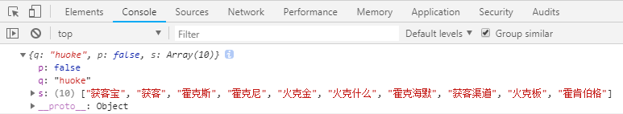

## ajax

主要用于无刷新页面的情况下，实现与后台交互数据

遵循同源策略，不能跨域

**现在基本不会这样去写原生ajax请求，更多的是用第三方库如jQuery，axios等，或新API fetch，以下内容仅作了解**

### 基本写法

```js
var ajax = new XMLHttpRequest();
// open参数：请求方式、url链接、同/异步（异步true、同步false）
ajax.open('post', '...', true);
ajax.send();
```
    
### onreadystatechange

```js
ajax.readystate 本地状态码，表示ajax对象与后台交互状态
0：ajax对象已被创建，但未调用open方法
1：open方法已调用，但是send()没有启动
2：send()启动，数据已发送给后台
3：正在接收数据，http响应头已接收，但数据没有全部接收完成
4：数据全部接收完成

ajax.state 服务器状态码
2XX
304

var ajax = new XMLHttpRequest();
ajax.open('post', '...', true);
ajax.send();
ajax.onreadystatechange = function() {
    // 判断本地状态
    if(ajax.readystate === 4) {
        // 判断服务器状态是否可行
        if(ajax.status >= 200 && ajax.status < 300 || ajax.status === 304) {
            console.log(ajax.responseText);
            ...
        }
    }
}
```
    
### 关闭请求

```js
var ajax = new XMLHttpRequest();
ajax.open('post', '...', true);
ajax.send();
ajax.onreadystatechange = function() {
    // 判断本地状态
    if(ajax.readystate === 4) {
        // 判断服务器状态是否可行
        if(ajax.status >= 200 && ajax.status < 300 || ajax.status === 304) {
            console.log(ajax.responseText);
            ...
        }
    }
}
setTimeout(function() {
    ajax.abort(); // 1、关闭请求
}, 5000);
```
    
### get、post区别

```js
请求方式：
get会将参数拼接在URL后进行传递
post会将数据放置在http请求体进行发送

缓存：
get请求能被缓存，默认也是有缓存的，缓存针对URL来缓存，一种参数组合就有一种URL缓存
post不会缓存，每次请求URL相同，但数据体HTTPBody可能不同，无法一一对应，缓存无意义

数据量：
很多说post没有大小限制，get有大小限制。其实post/get都没有限制
get所谓的限制是每个浏览器对URL长度上限的限制，get本身没有限制
post没有限制，除非服务器处理程序的处理能力较差，这样客观的看从服务器角度可能对其有限制，但是post本身是没限制的

安全性：
很多说post是安全的，get不安全。其实都不安全
get可以在URL明文显示
post可以在浏览器开发者工具network查看，只是相对安全

数据类型：
get只允许ASCII字符
post无限制

幂等：
get是幂等的，同一个请求执行多次和只执行一次效果相同
post不幂等

选择：
通常查询或获取使用get，修改新增使用post
```
    
### 请求头、响应头

```js
var ajax = new XMLHttpRequest();
ajax.open('post', '...', true);
// 1、设置请求头
ajax.setRequestHeader('Content-Type', 'application/x-www-form-urlencoded');
ajax.send();
ajax.onreadystatechange = function() {
    // 判断本地状态
    if(ajax.readystate === 4) {
        // 判断服务器状态是否可行
        if(ajax.status >= 200 && ajax.status < 300 || ajax.status === 304) {
            console.log(ajax.responseText);
            // 2、获取响应头，需要服务器端设置，否则返回null
            console.log(ajax.getResponseHeader('Content-Type'));
            ...
        }
    }
}
```
    
### 设置参数

```js
get：
var data = 'userId=' + userId + '&key=' + key; // 1、参数设置
var ajax = new XMLHttpRequest();
ajax.open('get', 'http://127.0.0.1:3000?' + data, true); // 2、请求方式get，参数拼接在url尾部
ajax.setRequestHeader('Content-Type', 'application/x-www-form-urlencoded');
ajax.send(data); // 3、数据作为send的参数
ajax.onreadystatechange = function() {
    // 判断本地状态
    if(ajax.readystate === 4) {
        // 判断服务器状态是否可行
        if(ajax.status >= 200 && ajax.status < 300 || ajax.status === 304) {
            console.log(ajax.responseText);
            ...
        }
    }
}

post：
var date = 'userId=' + userId + '&key=' + key; // 1、参数设置
var ajax = new XMLHttpRequest();
ajax.open('post', 'http://127.0.0.1:3000', true); // 2、请求方式post
ajax.setRequestHeader('Content-Type', 'application/x-www-form-urlencoded');
ajax.send(data); // 3、数据作为send的参数
ajax.onreadystatechange = function() {
    // 判断本地状态
    if(ajax.readystate === 4) {
        // 判断服务器状态是否可行
        if(ajax.status >= 200 && ajax.status < 300 || ajax.status === 304) {
            console.log(ajax.responseText);
            ...
        }
    }
}
```
    
### 模仿jQuery用法封装简易ajax

```js
function ajax(obj) {
    var method = obj.method || 'get',
        url = obj.url,
        async = obj.async !== false,
        data = obj.data,
        timeout = (typeof obj.timeout === 'number') ? obj.timeout : false;
        success = obj.success,
        error = obj.error;
        
    var str = '';
    if(data) {
        // 处理数据
        for(var key in data) {
            str += key + '=' + data[key] + '&';
        }
    }
    if(method.indexOf('get') > -1) {
        url += '?' + str + 't_=' + Date.now(); // 解决get缓存问题
    }
    var xhr = new XMLHttpRequest();
    xhr.open(method, url, async);
    xhr.setRequestHeader('Content-Type', 'application/x-www-form-urlencoded');
    if(timeout !== false) {
        setTimeout(function() {
            xhr.abort();
        }, timeout);
    }
    xhr.send(str || null);
    xhr.onreadystatechange = function() {
        if(xhr.readystate !== 4)
            return;
        if(xhr.status >= 200 && xhr.status < 300 || xhr.status === 304) {
            success && success(xhr.responseText);
        }else {
            error && error(xhr.status);
        }
    }
}

// 用法
ajax({
    method: 'post',
    url: '...',
    async: true,
    data: {
        ...
    },
    success: function(msg) {
        ...
    },
    error: function(msg) {
        ...
    },
})
```
    
## jsonp

jsonp的解决跨域的一种解决方案

网站的图片、CSS样式文件、JS文件等是没有跨域问题的

jsonp是利用页面访问JS文件没有跨域问题的特性来获取数据

### 用法

这里我们使用百度提供的关联查询链接
    
```html
// 基本用法

// 1、将url放在script标签的src上，根据接口要求提供参数，如百度接口是wd（查询的关键词）、cb（返回数据时调用我们的回调函数名，这里我们是fn）
<script src="http://suggestion.baidu.com/su?wd=huoke&cb=fn"></script>
<script>
    // 2、jsonp的函数回调
    function fn(obj) {
        console.log(obj);
    }
</script>
```
    


```html
// 项目开发用法示例

// DOM结构
<input type='text' id='txt'>
<ul id='list'>
</ul>
```
    
```js
// js
var oList = document.getElementById('list'),
    oTxt = document.getElementById('txt');

oTxt.oninput = function() {
    var val = this.value;
    if(val) {
        var script = document.createElement('script');
        script.src = 'http://suggestion.baidu.com/su?wd=' + val + '&cb=fn';
        document.body.appendChild(script);
        script.onload = function() {
            document.body.removeChild(this);
        }
    }else {
        oList.innerHTML = '';
    }
}

function fn(obj) {
    var arr = obj.s;
    var html = '';
    arr.forEach(function(item) {
        html += '<li>' + item +'<li>';
    });
    oList.innerHTML = html;
}
```
    