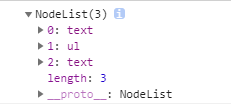
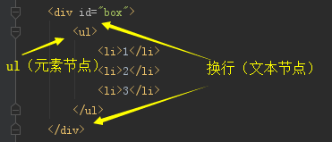
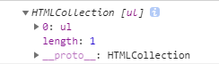

## JS节点

### JS的三大组成与节点
    
    三大组成：
        DOM         文档对象模型
        BOM         浏览器对象模型
        ECMAScript  es,js语法规范
    
    节点：
        文档节点    document
        元素节点    html等元素
        文本节点    文字、空格、换行
        属性节点    html等标签属性
        注释节点    注释
    
### childNodes

    // 说明
    获取所有子节点
    较少用

    // 示例
    

        <ul>
            <li>1</li>
            <li>2</li>
            <li>3</li>
        </ul>
    

    
    var box = document.getElementById('box');
    console.log(box.childNodes);
    

    // 注
    返回子节点，包括文本节点。在IE8及以下不会返回空格的文本节点，除非是文字
    
### children
    
    // 说明
    获取子元素节点
    相比childNodes较常用
    
    // 示例
    

        <ul>
            <li>1</li>
            <li>2</li>
            <li>3</li>
        </ul>
    

    
    var box = document.getElementById('box');
    console.log(box.children);
    

    // 注
    1、没有兼容性问题
    2、是动态获取（像getElementsByTagName一样，忘了什么是动态获取的查看第3节）
    
### nodeType
    
    // 说明
    获取节点类型，返回的是类型编号
    较少用
    
    // 示例
    

        <ul>
            <li>1</li>
            <li>2</li>
            <li>3</li>
        </ul>
    

    
    var box = document.getElementById('box');
    console.log(box.nodeType); // 1
    
    // 12种分类
    元素节点：1
    属性节点：2
    文本节点：3
    
    其他可参考：http://www.w3school.com.cn/jsref/prop_node_nodetype.asp
    
### nodeName、tagName

    // 说明
    nodeName获取节点名称，tagName获取标签名称
    相比nodeType较常用
    
    // 示例
    

        <ul>
            <li>1</li>
            <li>2</li>
            <li>3</li>
        </ul>
    

    
    var box = document.getElementById('box');
    console.log(box.nodeName); // 'DIV'
    console.log(box.tagName); // 'DIV'
    console.log(box.childNodes[0].nodeName); // '#text'
    console.log(box.childNodes[0].tagName); // undefined
    
### getAttributeNode

    // 说明
    获取属性节点
    较少用
    
    // 示例
    

        <ul>
            <li>1</li>
            <li>2</li>
            <li>3</li>
        </ul>
    

    
    var box = document.getElementById('box');
    console.log(box.getAttributeNode('id')); // 是个属性节点(id="box")，是个object，不是字符串
    console.log(box.getAttributeNode('id').nodeName); // 'id'
    
### createAttribute、setAttributeNode、removeAttributeNode

    // 说明
    createAttribute创建属性节点，setAttributeNode添加属性节点，removeAttributeNode移除属性节点
    较少用
    
    // 示例
    

        ...
    

    
    // JS（操作一：添加节点）
    var box = document.getElementById('box');
    var titleAttr = document.createAttribute('title');
    titleAttr.value = 'karmiy';
    box.setAttributeNode(titleAttr);
    
    // 结果
    

        ...
    

    
    // JS（操作二：移除节点）
    var idAttr = box.getAttributeNode('id')
    box.removeAttributeNode(idAttr);
    
    // 结果
    

        ...
    

    
### first(last)ElementChild、first(last)Child

    // 说明
    first(last)ElementChild获取第一个（最后一个）元素节点
    first(last)Child获取第一个（最后一个）节点
    
    兼容性：
        first(last)ElementChild > IE8
        first(last)Child都兼容，但是如firstChild，在主流浏览器可以返回文本节点，在IE8及以下不会返回空格换行的文本节点，除非是文字
    
    // 示例
    

        

        <ul>
            <li>1</li>
            <li>2</li>
            <li>3</li>
        </ul>
    

    
    var box = document.getElementById('box');
    console.log(box.firstElementChild); // 得到

这个DOM元素节点
    console.log(box.lastElementChild); // 得到<ul>...</ul>这个DOM元素节点
    console.log(box.firstChild); // 得到换行这个文本节点
    console.log(box.lastChild); // 得到换行这个文本节点
    
### next（previous）Sibling、next（previous）ElementSibling

    // 说明
    next（previous）Sibling获取下一个（上一个）兄弟节点
    next（previous）ElementSibling获取下一个（上一个）兄弟元素节点
    
    兼容性同上例first/last...
    
    // 示例
    

        

        <ul>
            <li>1</li>
            <li>2</li>
            <li>3</li>
        </ul>
    

    
    var box = document.getElementById('box');
    console.log(box.children[0].nextElementSibling); // 得到<ul>...</ul>这个DOM元素节点
    console.log(box.children[0].nextSibling); // 得到换行这个文本节点
    
### parentNode
    
    // 说明
    获取父节点
    没有兼容性问题
    常用
    
    // 示例
    <body>
        

            ...
        

    </body>
    
    var box = document.getElementById('box');
    console.log(box.parentNode); // body这个DOM节点
    
### offsetParent

    // 说明
    获取定位父节点
    
    // 示例
    <body>
        

            

                

                    ...
                

            

        

    </body>
    
    // 样式
    #main {
        position: relative; // 除了static都行
    }
    
    // JS
    var box = document.getElementById('box');
    console.log(box.offsetParent); // #main这个DOM节点
    
    // 注
    没有定位父级会是body

### childElementCount

    // 说明
    获取子元素节点的个数
    
    兼容性：>IE9，可以用node.children.length替代
    
    // 示例
    

        

        <ul>
            <li>1</li>
            <li>2</li>
            <li>3</li>
        </ul>
    

        
    var box = document.getElementById('box');
    console.log(box.childElementCount); // 2
    
### createElement、appendChild、insertBefore、removeChild

    // 说明
    createElement 创建节点
    appendChild 向后添加子节点
    insertBefore 在子节点前添加节点
    removeChild 删除子节点
    
    // 示例
    

        

        <ul>
            <li>1</li>
            <li>2</li>
            <li>3</li>
        </ul>
    

    
    // JS（操作一，box末尾添加子节点）
    var box = document.getElementById('box');
    var d1 = document.createElement('div'); // 1、创建节点
    d1.innerText = 'content';
    box.appendChild(d1); // 2、添加到box末尾
    
    // 结果
    

        

        <ul>
            <li>1</li>
            <li>2</li>
            <li>3</li>
        </ul>
        
content

    

    
    // JS（操作二，插在
元素之前）
    var d2 = document.createElement('div');
    d2.innerText = 'header';
    box.insertBefore(d2, box.children[0]); // 1、在
前，插入d2元素节点
    
    // 结果
    

        
header

        

        <ul>
            <li>1</li>
            <li>2</li>
            <li>3</li>
        </ul>
        
content

    

    
    // JS（操作三，移除<ul>节点）
    var ul = document.querySelector('ul');
    box.removeChild(ul); // 1、移除ul这个DOM节点
    
    // 结果
    

        
header

        

        
content

    

    
    // JS（操作四，调整
节点位置置末尾）
    box.appendChild(box.children[1]);
    
    // 结果
    

        
header

        
content

        

    

    
### createDocumentFragment 

    // 说明
    文档碎片，早期的性能优化方案之一
    
    // 性能较差的appendChild示例
    var oMain = document.getElementById('main');
    var len = data.length;
    var i,li;
    for(i = 0; i < len; i++ ){
      li = document.createElement('li');
      li.innerText = data[i];
      oMain.appendChild(li); // 循环里不段向#main添加子节点
    }
    
    // 注
    这是一个非常耗性能的操作（有些人将获取main、length放在循环里性能问题严重）
    每次循环都会进行一次元素添加操作，进而导致浏览器回流，我们知道浏览器的回流和重绘是需要耗费大量的时间进行的
    
    // createDocumentFragment优化
    var oMain = document.getElementById('main');
    var frag = document.createDocumentFragment;
    var len = data.length;
    var i,li;
    for(i = 0; i < len; i++ ){
      li = document.createElement('li');
      li.innerText = data[i];
      frag.appendChild(li); // 所有的操作在内存中完成，这个时候不会触发回流
    }
    oMain.appendChild(frag); // 最后一次性添加到页面中，只触发浏览器一次回流
    
    
### replaceChild

    // 说明
    替换节点
    
    // 示例
    

        1
        2
        3
    

    
    var box = document.getElementById('box');
    var p = document.createElement('p');
    p.innerText = '我是要替换过去的P节点';
    box.replaceChild(p, box.children[1]);
    
    // 结果（被替换元素会直接去除，所以不能像appendChild一样做换位）
    

        1
        
我是要替换过去的P节点

        3
    

### cloneNode

    // 说明
    克隆节点
    
    // 示例
    

        
1

    

    
    // JS（操作一：浅克隆）
    var box = document.getElementById('box');
    box.appendChild(box.children[0].cloneNode()); // 等同于cloneNode(false)，默认是false，只克隆标签，不克隆里面内容
    
    // 结果
    

        
1

        

    

    
    // JS（操作二：深克隆）
    box.appendChild(box.children[0].cloneNode(true)); // true是深克隆
    
    // 结果
    

        
1

        

        
1

    

    
### contains

    // 说明
    判断节点是否包含指定节点，返回true/false
    
    // 示例
    

        

    

    

    
    var box = document.getElementById('box'),
        oPs = document.querySelectorAll('p');
    console.log(box.contains(oPs[0])); // true，第一个p是box的子节点
    console.log(box.contains(oPs[1])); // false，第二个p是box的兄弟节点，不包括
    console.log(box.contains(box)); // true，自己包括自己
    
    // 应用场景
    在有弹框的组件，如日期选择器，弹出日历框后，点击空白区域关闭，就是点击时判断点击的DOM元素节点是否在日期选择器之外
    
    